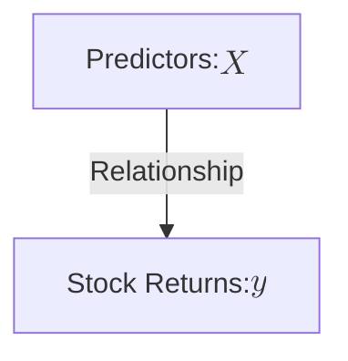
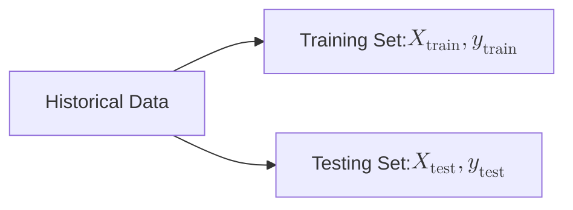
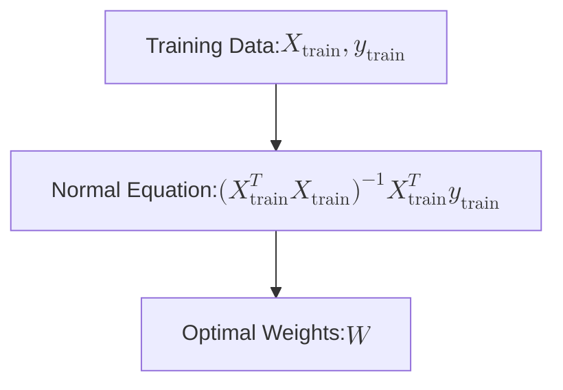

## Introduction

Linear regression is one of the foundational algorithms in machine learning, particularly useful for predicting continuous outcomes. In finance, it serves as a powerful tool for modeling and predicting stock returns based on various market indicators. This article delves into the application of linear regression for predicting daily returns of Amazon stock using a set of financial indices.

<!-- truncate -->

## The Role of Linear Regression in Finance

Linear regression is widely used in finance to model relationships between a dependent variable (such as stock returns) and one or more independent variables (such as market indices). The simplicity and interpretability of linear regression make it an ideal starting point for financial analysis.

### Task Definition

The task at hand is to predict the daily returns of Amazon stock, denoted as $y$, using a vector of predictors $X$. The predictors include the returns of various market indices such as the S&P 500, the NASDAQ composite, and the VIX.

$$
X = \begin{bmatrix} X_0 & X_1 & \dots & X_{D-1} \end{bmatrix}^T
$$

where $D$ is the number of predictors.

### Data Preparation

Given a dataset of historical returns for Amazon and the selected market indices, we split the data into training and testing sets:

$$
(X_{\text{train}}, y_{\text{train}}), \quad (X_{\text{test}}, y_{\text{test}}) \sim P_{\text{data}}
$$

This step ensures that our model is trained on one portion of the data and tested on another, helping to evaluate its generalization capability.

## Model Architecture

For this task, we choose a linear model, which assumes a linear relationship between the predictors and the target variable:

$$
\hat{y} = XW
$$

Here, $W$ represents the vector of regression coefficients (also known as weights), $X$ is the design matrix composed of the predictor variables, and $\hat{y}$ is the vector of predicted returns.

### Example Model

Let's consider a simple example where $y$ is the daily return of Amazon stock, and $X$ includes the returns of market indices like the S&P 500, NASDAQ composite, and VIX:

$$
\hat{y}_{\text{Amazon}} = W_0 + W_1 \cdot \text{S\&P 500} + W_2 \cdot \text{NASDAQ} + W_3 \cdot \text{VIX}
$$

### Performance Measure

The performance of the linear regression model is evaluated using the Mean Squared Error (MSE) on the test set:

$$
\text{MSE}_{\text{test}} = \frac{1}{N_{\text{test}}} \sum_{i=1}^{N_{\text{test}}} (\hat{y}_i - y_i)^2
$$

where $N_{\text{test}}$ is the number of test samples, $\hat{y}_i$ is the predicted value, and $y_i$ is the actual return.

### Optimization

To optimize the model, we minimize the MSE on the training set:

$$
\text{MSE}_{\text{train}} = \frac{1}{N_{\text{train}}} \sum_{i=1}^{N_{\text{train}}} (\hat{y}_i - y_i)^2
$$

The optimal weights $W$ are found by setting the gradient of the training MSE to zero:

$$
\nabla_W \text{MSE}_{\text{train}} = \nabla_W \left( \frac{1}{N_{\text{train}}} \| X_{\text{train}} W - y_{\text{train}} \|^2 \right) = 0
$$

Solving this equation yields the well-known normal equation for linear regression:

$$
W = (X_{\text{train}}^T X_{\text{train}})^{-1} X_{\text{train}}^T y_{\text{train}}
$$

## Challenges in Linear Regression

One common challenge in linear regression is multicollinearity, where predictors are highly correlated. This can cause the matrix $X_{\text{train}}^T X_{\text{train}}$ to be nearly singular, leading to numerical instability. Techniques such as regularization are often used to address this issue and improve the model's robustness.

## Conclusion

Linear regression provides a straightforward yet powerful approach for predicting stock returns based on market indices. By carefully selecting predictors and ensuring proper data handling, this method can yield valuable insights into stock market behavior. As with all models, understanding the underlying assumptions and limitations is crucial for making informed decisions in financial analysis.

Linear regression serves as a stepping stone for more complex models in finance, including those that involve machine learning algorithms like neural networks and ensemble methods. As financial data continues to grow in complexity, mastering these foundational techniques is essential for any finance professional.

For more detailed discussions on the application of machine learning in finance, including advanced topics like regularization and non-linear models, stay tuned to our upcoming articles.
