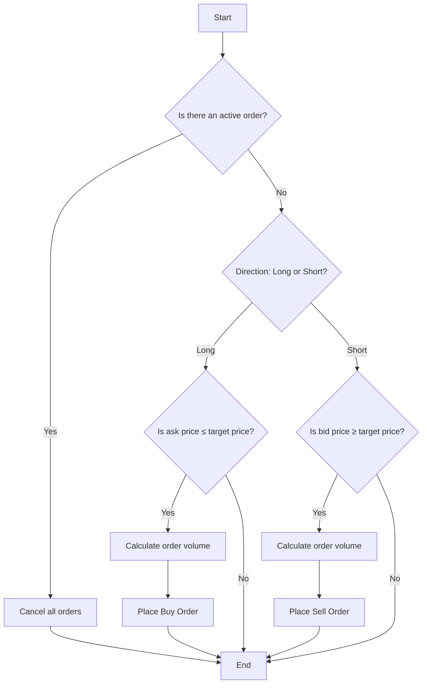
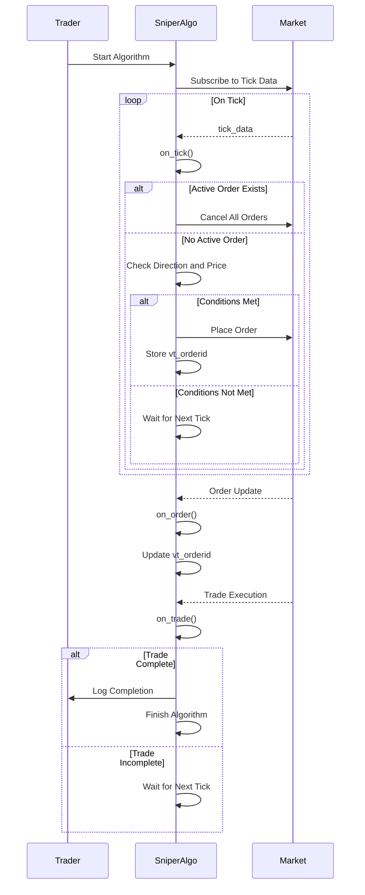

## Introduction

In the realm of **algorithmic trading**, execution algorithms play a pivotal role in optimizing trade orders to minimize market impact and slippage. One such algorithm is the **Sniper Algorithm**, which is designed to execute trades discreetly and efficiently by capitalizing on favorable market conditions.

This article aims to **review and understand** the implementation of the Sniper Algorithm as provided in the [VeighNa](https://github.com/vnpy/vnpy) trading platform's open-source repository. By dissecting the code and explaining its components, we hope to provide clarity on how the algorithm functions and how it can be utilized in practical trading scenarios.

<!-- truncate -->

## Overview of the Sniper Algorithm

### What Is the Sniper Algorithm?

The **Sniper Algorithm** is an aggressive execution strategy that seeks to execute orders at optimal prices by swiftly acting on favorable market conditions. It avoids placing visible orders in the market, thereby reducing the likelihood of other market participants detecting and reacting to the trader's intentions. This stealthy approach is particularly useful for large orders or in markets where minimizing market impact is crucial.

### Key Characteristics

- **Aggressive Execution**: Executes orders immediately when conditions are favorable.
- **Stealth Mode**: Does not post bids or offers, preventing exposure of trading intentions.
- **Hidden Liquidity Detection**: Capable of identifying and tapping into hidden liquidity pools.
- **High Participation Rate**: Achieves significant market participation without signaling intentions.

### Sniper Algorithm Flowchart

To better understand the flow of the Sniper Algorithm, consider the following flowchart:



This flowchart outlines the decision-making process of the Sniper Algorithm during each market tick.

## Understanding the Implementation in VeighNa

The Sniper Algorithm is implemented in the VeighNa trading platform, an open-source algorithmic trading framework in Python. The code for the algorithm can be found in the [vnpy_algotrading](https://github.com/vnpy/vnpy_algotrading) repository.

### Accessing the Code

The implementation is located at:

[https://github.com/vnpy/vnpy_algotrading/blob/main/vnpy_algotrading/algos/sniper_algo.py](https://github.com/vnpy/vnpy_algotrading/blob/main/vnpy_algotrading/algos/sniper_algo.py)

### Code Breakdown

Let's dissect the code to understand how the Sniper Algorithm operates within the VeighNa framework.

```python
from vnpy.trader.constant import Direction
from vnpy.trader.object import TradeData, OrderData, TickData
from vnpy.trader.engine import BaseEngine

from ..template import AlgoTemplate


class SniperAlgo(AlgoTemplate):
    """Sniper Algorithm Class"""

    display_name: str = "Sniper"

    default_setting: dict = {}

    variables: list = ["vt_orderid"]

    def __init__(
        self,
        algo_engine: BaseEngine,
        algo_name: str,
        vt_symbol: str,
        direction: str,
        offset: str,
        price: float,
        volume: float,
        setting: dict,
    ) -> None:
        """Constructor"""
        super().__init__(
            algo_engine, algo_name, vt_symbol, direction, offset, price, volume, setting
        )

        # Variables
        self.vt_orderid = ""

        self.put_event()
```

#### Class Definition and Initialization

- **Imports**: The algorithm imports necessary modules from VeighNa's trading framework, including data structures and constants.
- **`SniperAlgo` Class**: Inherits from `AlgoTemplate`, which provides the basic structure and functions for an algorithm.
- **`display_name`**: Human-readable name for the algorithm.
- **`variables`**: List of variable names used in the algorithm for tracking purposes.
- **`__init__` Method**: Initializes the algorithm with parameters such as trading symbol, direction, price, and volume.

#### Variables

- **`self.vt_orderid`**: Stores the unique identifier for the current order. Initialized as an empty string.

### Core Methods

#### `on_tick`

```python
def on_tick(self, tick: TickData) -> None:
    """Tick callback"""
    if self.vt_orderid:
        self.cancel_all()
        return

    if self.direction == Direction.LONG:
        if tick.ask_price_1 <= self.price:
            order_volume: float = self.volume - self.traded
            order_volume = min(order_volume, tick.ask_volume_1)

            self.vt_orderid = self.buy(self.price, order_volume, offset=self.offset)
    else:
        if tick.bid_price_1 >= self.price:
            order_volume: float = self.volume - self.traded
            order_volume = min(order_volume, tick.bid_volume_1)

            self.vt_orderid = self.sell(
                self.price, order_volume, offset=self.offset
            )

    self.put_event()
```

##### Explanation

- **Purpose**: This method is called whenever a new tick (market data update) is received.
- **Active Order Check**: If there's an active order (`self.vt_orderid` is not empty), it cancels all orders to avoid duplication and exits the method.
- **Trade Logic**:
  - **Long Direction**:
    - Checks if the **best ask price** (`tick.ask_price_1`) is less than or equal to the target price (`self.price`).
    - Calculates the remaining volume to trade (`self.volume - self.traded`).
    - Adjusts the order volume based on available market depth.
    - Places a buy order at the target price for the calculated volume.
  - **Short Direction**:
    - Checks if the **best bid price** (`tick.bid_price_1`) is greater than or equal to the target price.
    - Calculates the remaining volume.
    - Adjusts the order volume based on available market depth.
    - Places a sell order at the target price.
- **Order Volume Adjustment**: Ensures that the order volume does not exceed the available market volume (`tick.ask_volume_1` or `tick.bid_volume_1`).
- **Order Execution**: The `buy` or `sell` method is called with the price, volume, and offset to execute the trade.
- **Event Update**: Calls `self.put_event()` to update the algorithm's state in the UI or logs.

#### `on_order`

```python
def on_order(self, order: OrderData) -> None:
    """Order callback"""
    if not order.is_active():
        self.vt_orderid = ""
        self.put_event()
```

##### Explanation

- **Purpose**: Handles updates to order status.
- **Order Status Check**: If the order is no longer active (filled, canceled, or rejected), it resets `self.vt_orderid` to an empty string, allowing new orders to be placed on subsequent ticks.
- **Event Update**: Calls `self.put_event()` to refresh the state.

#### `on_trade`

```python
def on_trade(self, trade: TradeData) -> None:
    """Trade callback"""
    if self.traded >= self.volume:
        self.write_log(
            f"Traded quantity: {self.traded}, total quantity: {self.volume}"
        )
        self.finish()
    else:
        self.put_event()
```

##### Explanation

- **Purpose**: Called when a trade is executed.
- **Trade Completion Check**: If the total traded volume (`self.traded`) is greater than or equal to the desired volume (`self.volume`), the algorithm logs the completion and calls `self.finish()` to terminate the algorithm.
- **Event Update**: If not completed, updates the state.

### Sequence Diagram of Order Execution

To visualize the interaction between methods during order execution, consider the following sequence diagram:



This diagram illustrates the flow of events from starting the algorithm to completing the trade.

## Practical Usage

### Configuring the Algorithm

To use the Sniper Algorithm in VeighNa:

1. **Set Parameters**:

   - **Symbol**: The trading symbol of the instrument.
   - **Direction**: `LONG` for buying, `SHORT` for selling.
   - **Price**: The target price for execution.
   - **Volume**: Total quantity to trade.
   - **Offset**: Position offset, e.g., open or close.

2. **Load the Algorithm**: Ensure the `sniper_algo.py` file is placed in the appropriate directory so that VeighNa recognizes it.

3. **Connect to Broker**: Configure VeighNa to connect to your broker's API, such as Interactive Brokers, and subscribe to real-time market data.

### Running the Algorithm

1. **Start VeighNa**: Launch the VeighNa trading application.

2. **Select the Algorithm**: In the algorithm management interface, select the Sniper Algorithm.

3. **Input Parameters**: Enter the desired trading parameters into the algorithm's configuration.

4. **Monitor Execution**: Observe the algorithm's performance through the platform's interface, monitoring orders, trades, and logs.

5. **Manage Risk**: Be prepared to intervene if market conditions change or if the algorithm behaves unexpectedly.

## Benefits and Limitations

### Benefits

- **Reduced Market Impact**: Executes trades without alerting other market participants.
- **Improved Execution Prices**: Takes advantage of favorable price movements.
- **Flexibility**: Can be customized to fit specific trading strategies or market conditions.

### Limitations

- **Complex Market Conditions**: May not perform well in illiquid or highly volatile markets.
- **Missed Opportunities**: Strict conditions might lead to unexecuted orders if the market doesn't meet the criteria.
- **Requires Real-Time Data**: Dependent on accurate and timely market data for optimal performance.

## Conclusion

The Sniper Algorithm offers a strategic approach to executing trades discreetly and efficiently in algorithmic trading. By reviewing the implementation provided in the VeighNa platform, we gain insights into how such an algorithm operates and how it can be employed in practical trading scenarios.

Understanding the code helps traders and developers:

- **Customize the Algorithm**: Modify parameters or logic to better suit their trading strategies.
- **Improve Risk Management**: Anticipate how the algorithm behaves under different market conditions.
- **Enhance Execution Quality**: Leverage the algorithm's design to achieve better trade execution outcomes.

As algorithmic trading continues to evolve, familiarizing oneself with execution algorithms like the Sniper Algorithm becomes increasingly valuable. Whether you are a trader seeking to optimize your executions or a developer aiming to build sophisticated trading tools, understanding such implementations is essential.

---

This article is a review of the Sniper Algorithm's implementation in the VeighNa trading platform, inspired by the original code available at [vnpy_algotrading](https://github.com/vnpy/vnpy_algotrading/blob/main/vnpy_algotrading/algos/sniper_algo.py). It aims to provide a clear understanding of how the algorithm functions within the platform and how it can be utilized in algorithmic trading strategies.
