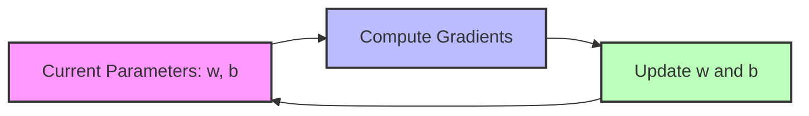
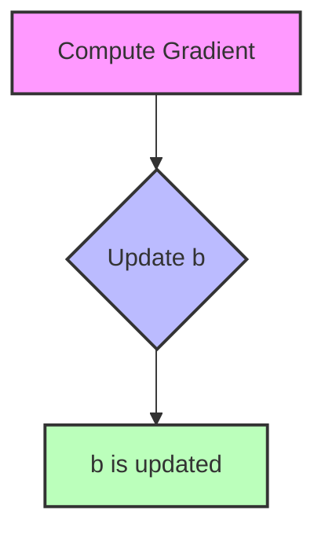
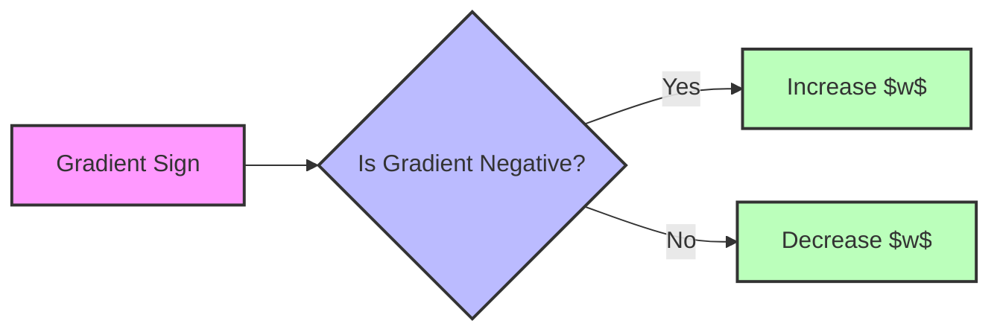
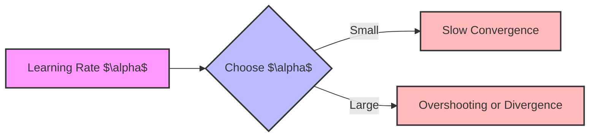

Introduction

Gradient descent is a fundamental optimization algorithm used in machine learning to minimize the cost function and find the optimal parameters of a model. In the context of linear regression, gradient descent helps in finding the best-fitting line by iteratively updating the model parameters. This article delves into the mechanics of gradient descent in linear regression, focusing on how the parameters are updated and the impact of the sign of the gradient.

<!-- truncate -->

The Linear Regression Model

Model Equation

Linear regression aims to model the relationship between an independent variable and a dependent variable by fitting a linear equation to observed data:

$$
f_{w,b}(x) = w \cdot x + b
$$

• $x$: The input feature or independent variable.
• $w$: The weight or coefficient, representing the slope of the line.
• $b$: The bias or intercept term, indicating where the line crosses the y-axis.
• $f_{w,b}(x)$: The predicted output for a given input $x$.

This equation represents a straight line in two-dimensional space, where the goal is to find the optimal values of $w$ and $b$ that minimize the difference between the predicted outputs and the actual outputs.

Cost Function

To assess the accuracy of the model, we use a cost function $J(w, b)$, commonly defined as the Mean Squared Error (MSE):

$$
J(w, b) = \frac{1}{2m} \sum_{i=1}^{m} \left( f_{w,b}\left( x^{(i)} \right) - y^{(i)} \right)^2
$$

• $m$: The number of training examples.
• $x^{(i)}$: The $i$-th input feature.
• $y^{(i)}$: The actual output corresponding to $x^{(i)}$.

The goal is to find the parameters $w$ and $b$ that minimize this cost function.

Gradient Descent Algorithm

Update Rules

Gradient descent minimizes the cost function by updating the parameters in the opposite direction of the gradient:

Update rule for $w$:

$$
w \leftarrow w - \alpha \frac{\partial J(w, b)}{\partial w}
$$

Update rule for $b$:

$$
b \leftarrow b - \alpha \frac{\partial J(w, b)}{\partial b}
$$

• $\alpha$: The learning rate, controlling the step size during each iteration.

Computing the Gradients

Partial derivative with respect to $w$:

$$
\frac{\partial J(w, b)}{\partial w} = \frac{1}{m} \sum_{i=1}^{m} \left( f_{w,b}\left( x^{(i)} \right) - y^{(i)} \right) x^{(i)}
$$

Partial derivative with respect to $b$:

$$
\frac{\partial J(w, b)}{\partial b} = \frac{1}{m} \sum_{i=1}^{m} \left( f_{w,b}\left( x^{(i)} \right) - y^{(i)} \right)
$$

Understanding Parameter Updates

Impact of Negative Gradient on $w$

When $\frac{\partial J(w, b)}{\partial w}$ is a negative number (less than zero), what happens to $w$ after one update step?

Explanation:

• The update rule for $w$ is:

$$
w \leftarrow w - \alpha \frac{\partial J(w, b)}{\partial w}
$$

• If $\frac{\partial J(w, b)}{\partial w} < 0$, then:

$$
w \leftarrow w - \alpha (\text{negative number}) = w + \alpha |\text{negative number}|
$$

• Since $\alpha > 0$ and $|\text{negative number}| > 0$, the term $\alpha |\text{negative number}|$ is positive.
• Therefore, $w$ increases after the update.

Conclusion: When the gradient of the cost function with respect to $w$ is negative, the parameter $w$ increases during the gradient descent update.

Update Step for Parameter $b$

For linear regression, what is the update step for parameter $b$?

$$
b \leftarrow b - \alpha \frac{1}{m} \sum_{i=1}^{m} \left( f_{w,b}\left( x^{(i)} \right) - y^{(i)} \right)
$$

Explanation:

• The gradient with respect to $b$ is:

$$
\frac{\partial J(w, b)}{\partial b} = \frac{1}{m} \sum_{i=1}^{m} \left( f_{w,b}\left( x^{(i)} \right) - y^{(i)} \right)
$$

• Substituting this into the update rule:

$$
b \leftarrow b - \alpha \frac{\partial J(w, b)}{\partial b}
$$

• Thus, the update step for $b$ is as given.

Note: The update for $b$ does not include the term $x^{(i)}$, unlike the update for $w$.

Practical Implications

Effect of Gradient Sign on Parameter Updates

• Negative Gradient ($\frac{\partial J}{\partial w} < 0$):
• The parameter $w$ increases.
• Moves $w$ in the direction that decreases the cost function.
• Positive Gradient ($\frac{\partial J}{\partial w} > 0$):
• The parameter $w$ decreases.
• Also aims to reduce the cost function.

Importance of the Learning Rate

• The learning rate $\alpha$ determines how big the update steps are.
• A small $\alpha$ may result in slow convergence.
• A large $\alpha$ may cause overshooting the minimum or divergence.

Conclusion

Understanding how gradient descent updates the parameters in linear regression is crucial for effectively training models. When the gradient with respect to a parameter is negative, the parameter increases, and when the gradient is positive, the parameter decreases. The specific update rules for $w$ and $b$ reflect their roles in the model and ensure that the cost function is minimized.

By mastering these concepts, you can better tune your models and achieve higher predictive accuracy in your machine learning tasks.

Feel free to explore more about gradient descent variations, such as stochastic gradient descent and mini-batch gradient descent, to enhance your understanding and application of optimization algorithms in machine learning.
