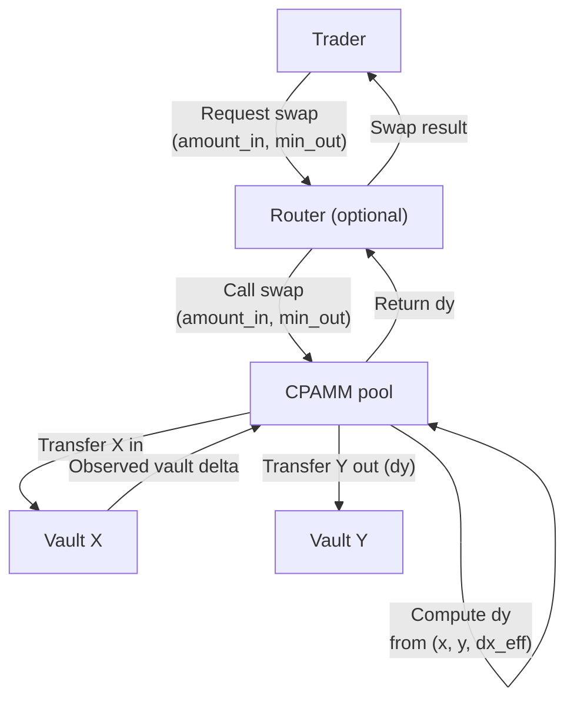
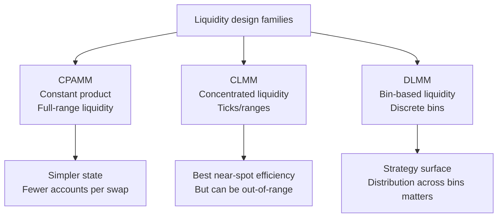
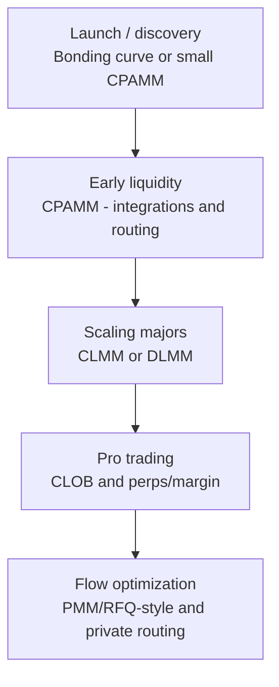

## TL;DR

- **AMM** is the *category*: any on-chain venue that computes prices algorithmically from state (reserves, parameters, or inventory).
- **CPAMM / CPMM** is one specific AMM family: **constant product** with invariant **x · y = k** (Uniswap v2-style).
- The useful comparison is **CPAMM vs other liquidity designs**:
  - **StableSwap** (stable/correlated assets),
  - **CLMM** (concentrated liquidity / ticks),
  - **DLMM** (bin-based liquidity + often dynamic fees),
  - **PMM / oracle-anchored** (proactive quoting around a “fair price”),
  - **CLOB** (order books),
  - **TWAMM** (time-sliced execution),
  - **bonding-curve launch mechanisms** (virtual reserves → migration).
- On **Solana**, the tradeoffs are heavily shaped by:
  - **account write locks / hot accounts** (parallelism vs contention),
  - **Token-2022 extensions** (transfer fees/hooks can break naive “amount_in == amount_received” math),
  - **router-first distribution** (aggregator integration matters),
  - **MEV & atomic execution tooling** (bundles / private routes / quote freshness).

---

## AMM vs CPAMM (and why the wording matters)

### AMM (the umbrella)

An **AMM** is any on-chain market maker that:

- holds on-chain state (reserves, inventory, parameters),
- updates price algorithmically,
- executes swaps against that state.

An on-chain **order book** can be fully on-chain too, but it’s not an AMM: it matches explicit bids/asks, not a curve/invariant rule.

### CPAMM / CPMM (the subtype)

A **CPAMM** is a constant-function AMM where:
$$
x \cdot y = k
$$
`x` and `y` are pool reserves.

So:

- **all CPAMMs are AMMs**
- **not all AMMs are CPAMMs**

---

## CPAMM mechanics in one screen (math + semantics)

Let reserves be `(x, y)` and you swap `dx` of X for Y.

### Fee model (input fee)

If fee is `f` (e.g. 0.003 for 30 bps):
$$
dx' = dx \cdot (1 - f)
$$

### Output

$$
dy = \frac{y \cdot dx'}{x + dx'}
$$

### Reserve update

- `x := x + dx`  
- `y := y - dy`

Observed vault delta (Token-2022-safe input amount):
$$
dx_{eff} = vault_{after} - vault_{before}
$$

### Price intuition (useful when comparing designs)

- Spot price (ignoring fees): `p ≈ y/x` (direction depends on quote convention)
- For small trades, **slippage** is roughly proportional to trade size / liquidity depth.
- Fees retained in the pool tend to increase `k` over time (LPs get paid via reserve growth).

---

## Comparison tables

### Taxonomy and “what is being compared?”

| Term / design | Category? | Core idea | Typical on-chain state | Who provides liquidity? | Quote source |
|---|---:|---|---|---|---|
| **AMM** | Yes | Algorithmic pricing vs state | varies | varies | curve/parameters/inventory |
| **CFAMM** (constant-function AMM) | Yes | Trades move along an invariant | reserves + params | LPs or protocol | invariant |
| **CPAMM / CPMM** | Yes | `x*y=k` | 2 vaults + pool state (+ LP mint) | passive LPs | reserves ratio |
| **StableSwap** | Yes | hybrid curve (sum-like near peg) | vaults + params (A, etc.) | passive LPs | curve + params |
| **CLMM** | Yes | liquidity concentrated in ranges/ticks | vaults + tick arrays + position accounts | active LPs | ticks + reserves |
| **DLMM (bins)** | Yes | discrete bins + liquidity distribution | vaults + bin arrays + position state | active/semi-active LPs | bins + params |
| **PMM / oracle-anchored** | Yes | price anchored to oracle fair value | inventory + params + oracle feeds | market maker / protocol | oracle + model |
| **CLOB (order book)** | No (not AMM) | match bids/asks | market + order state | makers | limit orders |
| **TWAMM** | No (mechanism) | execute large order over time | long-term order state | trader orders | schedule |
| **Bonding curve launch** | Yes (often) | virtual reserves / issuance curve | curve params + reserves | launch pool | curve |

---

### Trader view: execution quality & UX

| Design | Typical spread / slippage (for same TVL) | “Always liquid”? | Best for | Pain points (trader) | Router friendliness |
|---|---|---:|---|---|---|
| **CPAMM** | worst for tight markets | Yes | long-tail discovery, simple swaps | high price impact without huge TVL | high (simple routes) |
| **StableSwap** | excellent near peg | Yes (until extreme imbalance) | stable/stable, correlated assets | parameter risk; off-peg behavior | high |
| **CLMM** | best near spot | No (can be out-of-range) | majors, low slippage | depth depends on LP ranges | high (but more accounts) |
| **DLMM** | very good when bins are well-set | mostly | structured liquidity & dynamic fees | bin distribution matters | high (but more accounts) |
| **PMM** | potentially excellent | depends on MM inventory | majors & flow-driven quoting | oracle/model risk; opaque behavior | high if integrated (RFQ-like) |
| **CLOB** | best when book is thick | n/a | pro trading, limit orders | needs makers & incentives | medium/high (depends on infra) |
| **TWAMM** | optimized for large orders | n/a | size execution | not instant | routed as a strategy leg |
| **Bonding curve** | deterministic but can be harsh | curve-dependent | launches | can be gamed / MEV-heavy | usually “launch-only” |

---

### LP view: risk, complexity, and who wins when

| Design | LP position type | Capital efficiency | IL profile | Operational complexity | Who tends to outperform? |
|---|---|---:|---|---:|---|
| **CPAMM** | fungible LP token | low | classic IL (full range) | low | passive LPs in long-tail / high fees |
| **StableSwap** | often fungible LP | high near peg | smaller IL near peg | medium | LPs in correlated pairs |
| **CLMM** | tokenized/NFT-like position | very high | can be worse if misranged | high | sophisticated LPs / managed vaults |
| **DLMM** | bin/strategy position state | high (configurable) | strategy-dependent | medium/high | strategy LPs; can be “MM-like” |
| **PMM** | usually MM-managed inventory | high | model-controlled | high | market makers (not passive LPs) |
| **CLOB** | maker orders | n/a | inventory risk, not IL | high | professional makers |
| **Bonding curve** | not traditional LP | n/a | n/a | medium | launch designers + snipers (unless mitigated) |

---

### Solana runtime view: contention, accounts, compute

This is the table people skip, but it often determines what scales.

| Design | What gets written per swap? | Hot-account tendency | Parallelism shape | Tx/account footprint | Notes |
|---|---|---:|---|---|---|
| **CPAMM** | same pool state + both vaults | **high** | many swaps serialize on same pool | low/medium | simplest, but hotspot-prone |
| **StableSwap** | same as CP-ish + params | high | similar to CP contention | medium | more compute than CP |
| **CLMM** | vaults + tick arrays + position-related state | medium | can shard via tick arrays | higher | more accounts; better scaling shape |
| **DLMM** | vaults + active bin(s) + params | medium | can shard by bins | higher | depends on bin layout |
| **PMM** | inventory + oracle state + params | low/medium | depends on design | medium | quote updates may dominate |
| **CLOB** | market state + order matching state | varies | depends on matching engine design | high | crankless helps UX |
| **TWAMM** | long-term order state + execution legs | n/a | time-sliced | medium/high | often pairs with CLOB/AMM legs |

---

### Parameter surface area (“knobs you must ship and maintain”)

| Design | Parameters you can’t ignore | Tuning difficulty | Common footguns |
|---|---|---:|---|
| **CPAMM** | fee bps, min liquidity lock, rounding rules | low | overflow in `x*y`, wrong deposit proportionality |
| **StableSwap** | amplification A, fee(s), admin fees, ramping | medium/high | bad A → fragility near peg/off-peg |
| **CLMM** | tick spacing, fee tier(s), init price, range UX | high | tick array provisioning, out-of-range UX |
| **DLMM** | bin step, dynamic fee curve, rebalancing rules | medium/high | bin skew → bad execution; edge-bin depletion |
| **PMM** | oracle choice, spread model, inventory/risk limits | very high | stale oracle, model blowups, adversarial flow |
| **CLOB** | tick size, lot size, maker/taker fees, risk limits | high | dust orders, spam, maker incentives |
| **Bonding curve** | virtual reserves, slope, caps, migration rules | high | sniping, MEV extraction, mispriced curve |

---

### Token-2022 / “non-standard token semantics” compatibility

Token-2022 extensions change what “amount in” means.

| Token feature | What breaks in naive AMMs | Safe pattern | Designs most sensitive |
|---|---|---|---|
| **Transfer fee** | `amount_in` ≠ vault delta | compute `dx = vault_after - vault_before` | all curve AMMs |
| **Transfer hook** | extra logic executed on transfer | strict account lists; avoid re-entrancy assumptions | all; especially CPI-heavy |
| **Confidential transfers** | you can’t observe amounts easily | often incompatible without special support | most AMMs |
| **Interest-bearing** | balances drift over time | use observed balances; avoid cached reserves | all pool AMMs |
| **Memo/metadata ext** | usually fine | no-op | none |

Rule of thumb: if you don’t base math on **observed vault deltas**, you’re designing for 2019 SPL Token semantics.

---

### MEV & adversarial flow profile

| Design | Sandwich susceptibility | “Pick-off” risk | Mitigations that actually work | Notes |
|---|---:|---:|---|---|
| **CPAMM** | high | high | private routing, tighter fees, better routing, smaller hops | passive curve is easy to arb |
| **StableSwap** | medium | medium | similar; parameter robustness | off-peg events get brutal |
| **CLMM** | medium | high (LPs) | managed LP vaults; dynamic fees | LPs can get wrecked by volatility |
| **DLMM** | medium | medium/high | dynamic fees, bin strategy | depends on fee model |
| **PMM** | low/medium | medium | oracle + inventory + RFQ-style routing | “MM-like” behavior |
| **CLOB** | medium | medium | maker protections, anti-spam, risk controls | depends on market design |
| **Bonding curve** | very high | very high | anti-bot design + fair launch mechanics | launch is an MEV magnet |

---

### “Which one should I choose?” (builder POV)

| If your goal is… | Pick | Because | But be honest about… |
|---|---|---|---|
| ship fastest + minimal state | **CPAMM** | simplest accounts & math | contention + worse execution unless TVL is high |
| best majors execution with public LPs | **CLMM** | capital efficiency near spot | position UX + account explosion |
| stable pairs / correlated assets | **StableSwap** | low slippage near peg | parameter tuning & off-peg behavior |
| strategy-friendly liquidity | **DLMM** | bins + dynamic fees can match volatility | bin UX + more moving parts |
| tight quotes controlled by MM logic | **PMM** | can beat passive curves | oracle/model risk is the product |
| limit orders + pro features | **CLOB** | explicit bids/asks | maker bootstrapping + ops complexity |
| reduce impact of whale flow | **TWAMM** (+ a venue) | time-slicing | needs execution infra |
| token launch discovery path | **Bonding curve** → migrate | deterministic launch → deep liquidity later | launch MEV + migration design |

---

## A “migration path” table (how protocols evolve in practice)

| Phase | Typical mechanism | Why it fits | What you usually add next |
|---|---|---|---|
| launch / discovery | bonding curve / small CP pool | simple, deterministic | anti-bot + migration |
| early liquidity | CPAMM | easy integrations | multiple fee tiers / incentives |
| scaling majors | CLMM or DLMM | better execution | managed LP vaults |
| pro trading | CLOB | limit orders | cross-margin/perps |
| flow optimization | PMM / RFQ-like | best execution for routed flow | private routing + inventory mgmt |
| large order UX | TWAMM | reduces impact | bundle/atomic strategies |

---

## Anchor CPAMM: the “don’t ship this” checklist (most common bugs)

### 1) Proportional deposits are ratios, not products

If you want users to deposit proportionally, you preserve:

- `amount_a / amount_b ≈ reserve_a / reserve_b`

A clamp-style approach:
$$
\Delta b = \Delta a \cdot \frac{reserve_b}{reserve_a}
$$
and then you clamp the other side if user supplies less.

### 2) LP minting: `sqrt(Δa·Δb)` is bootstrap-only

For subsequent deposits, use proportional minting:
$$
liquidity = \min\left(
\frac{\Delta a \cdot supply}{reserve_a},
\frac{\Delta b \cdot supply}{reserve_b}
\right)
$$
Otherwise LP shares drift and you can mint unfairly.

### 3) Invariant checks must be `A·B` and must use `u128`

If you verify `k`, do:

- `new_x * new_y >= old_k` (often allowing rounding to favor LPs)
- compute with `u128` intermediates.

### 4) Token-2022: do not trust `amount_in`

For fee-on-transfer tokens:

- the only safe `dx` is `vault_after - vault_before`.

---

## Minimal “correct CPAMM math” snippet (overflow-safe, vault-delta friendly)

~~~rust
/// Compute CPAMM output (dy) from reserves (x, y) and effective input (dx_eff),
/// using u128 intermediates to avoid u64 overflow.
///
/// IMPORTANT (Token-2022):
/// - If the token can take a transfer fee, compute dx_eff from observed vault delta:
///   dx_eff = vault_x_after - vault_x_before
pub fn cpamm_out_amount(x: u64, y: u64, dx_eff: u64) -> u64 {
    let x = x as u128;
    let y = y as u128;
    let dx = dx_eff as u128;

    // dy = (y * dx) / (x + dx)
    let den = x + dx;
    if den == 0 {
        return 0;
    }

    let dy = (y * dx) / den;
    dy.min(u64::MAX as u128) as u64
}
~~~

---

## Extra comparison tables (for the “systems” view)

### Public API ergonomics: what you expose to integrators

| Design | “Simple swap” interface | Quote interface | Common integration shape | Gotcha |
|---|---|---|---|---|
| CPAMM | `swap(amount_in, min_out)` | deterministic from reserves | direct CPI | need observed deltas for Token-2022 |
| CLMM | same, but more accounts | tick-dependent | SDK computes accounts | account list errors are common |
| DLMM | similar | bin-dependent + dynamic fee | SDK required | bin selection correctness matters |
| PMM | often RFQ-like | oracle + MM params | router integration is key | “quote freshness” is the product |
| CLOB | order placement | book data | off-chain client + on-chain settle | maker ops are non-trivial |

---

### Testing strategy: what to property-test per design

| Design | Invariants to test | Edge cases | Suggested approach |
|---|---|---|---|
| CPAMM | `k` non-decrease (fee), no negative reserves | rounding, overflow, zero-liquidity | property tests with random swaps |
| StableSwap | monotonicity near peg, conservation | extreme imbalance, A ramps | fuzz + numerical bounds |
| CLMM | tick crossing correctness, fee growth | boundary ticks, out-of-range | differential tests vs reference |
| DLMM | bin transitions, dynamic fee function | bin depletion, fee spikes | fuzz + scenario sims |
| PMM | oracle staleness handling, risk limits | oracle outages, adversarial flow | simulation + kill-switch tests |
| CLOB | matching engine correctness | self-trade, partial fills | deterministic replay tests |

---

## References (URLs)

- Uniswap v2 constant product (conceptual):
  https://docs.uniswap.org/contracts/v2/concepts/protocol-overview/how-uniswap-works

- SPL Token Swap constant product curve (Solana reference implementation notes):
  https://github.com/solana-labs/solana-program-library/blob/master/docs/src/token-swap.md

- Curve StableSwap overview (hybrid curve intuition):
  https://docs.curve.finance/stableswap-exchange/overview/

- Orca Whirlpools (CLMM/CLAMM on Solana):
  https://dev.orca.so/
  https://github.com/orca-so/whirlpools

- Raydium constant product pool creation (CP/CPMM program docs):
  https://docs.raydium.io/raydium/pool-creation/creating-a-constant-product-pool
  https://docs.raydium.io/raydium/protocol/developers/addresses

- Meteora (DLMM + enhanced constant product families):
  https://docs.meteora.ag/developer-guide/home
  https://docs.meteora.ag/user-guide/guides/how-to-use-dlmm
  https://docs.meteora.ag/overview/products/damm-v2/what-is-damm-v2
  https://docs.meteora.ag/overview/products/dbc/what-is-dbc
  https://github.com/MeteoraAg/dynamic-bonding-curve

- Lifinity (PMM / oracle-anchored market making on Solana):
  https://docs.lifinity.io/

- Phoenix (crankless on-chain order book infra):
  https://github.com/Ellipsis-Labs/phoenix-v1

- OpenBook v2 (CLOB program):
  https://github.com/openbook-dex/openbook-v2

- Solana TWAMM:
  https://github.com/solana-labs/twamm

- Token-2022 extensions (transfer fees / transfer hooks):
  https://solana.com/docs/tokens/extensions
  https://solana.com/docs/tokens/extensions/transfer-fees
  https://solana.com/developers/guides/token-extensions/transfer-hook

- Jupiter routing (what venues get routed):
  https://support.jup.ag/hc/en-us/articles/22627174618780-Which-AMMs-does-Jupiter-route-through
