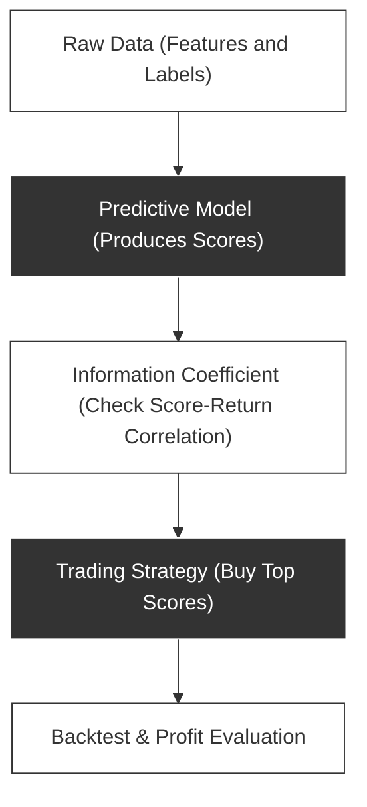
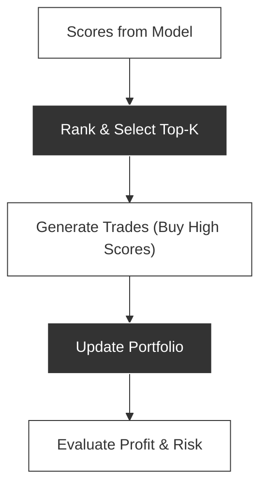
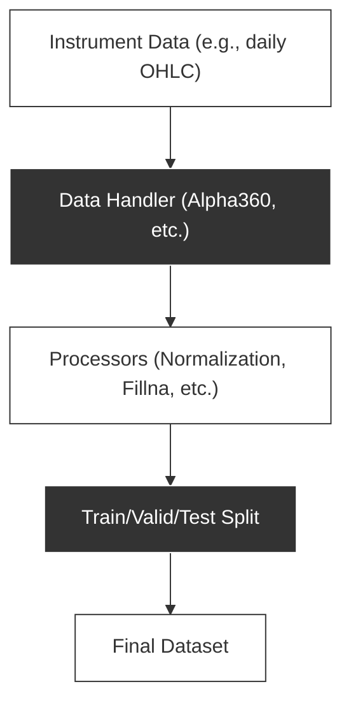
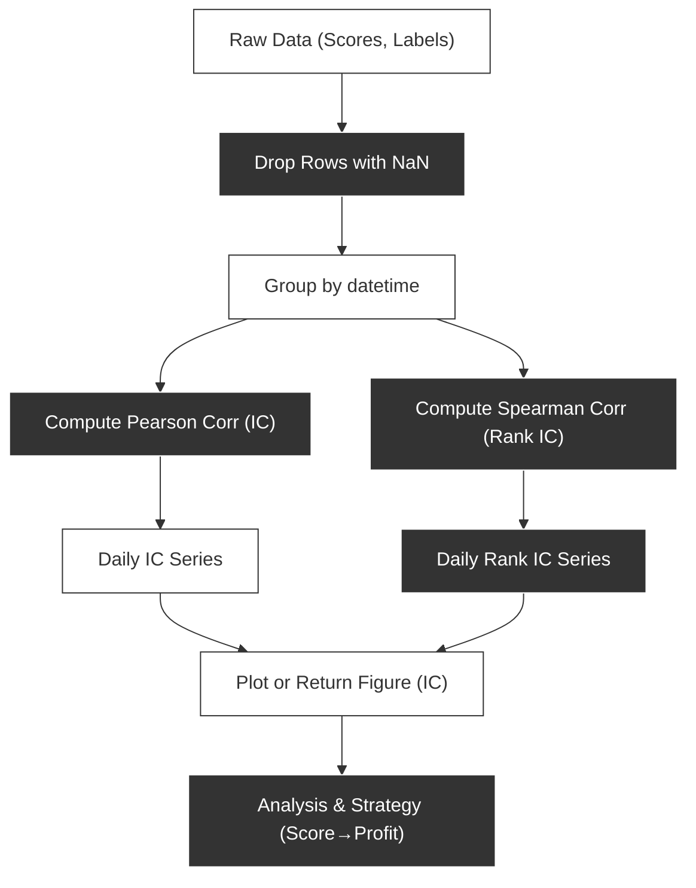

## Introduction

One of the core ideas in quantitative finance is that **model predictions**—often called “scores”—can be mapped to **expected returns** on an instrument. In **Qlib**, these scores are evaluated using metrics like the **Information Coefficient (IC)** and **Rank IC** to show how well the scores predict future returns. Essentially, **the higher the score, the more profit the instruments**—if your IC is positive and statistically significant, the highest-scored stocks should, on average, outperform the lower-scored ones.

<!-- truncate -->

This article focuses on how **score IC** links directly to profit potential, and how you can visualize IC trends in **Qlib** via a built-in function that graphs daily IC or Rank IC over time.

---

## Score, IC, and Profit

- **Score**  
  In typical Qlib workflows, each instrument receives a numeric score (e.g., `predictions`). Qlib strategies, like `TopkDropoutStrategy`, buy the instruments with **top scores** and short or underweight those with **lowest scores**.

- **Information Coefficient (IC)**  
  Measures how closely your predicted scores correlate with the instrument’s **future returns** (the “label”). A higher (positive) IC indicates that **when your model says “buy,” those instruments tend to go up**, and when it says “sell,” they tend to go down.

- **Why Profit Matters**  
  A model that exhibits a **consistently positive IC** should produce profitable trading signals. If the daily or weekly IC remains positive, you can be more confident that the **“higher score” = “more profit”** assumption holds.

---

## High-Level Flow: Scores to Profit

Below is a diagram illustrating how raw data (features and labels) are processed by a predictive model, which then outputs “scores.” Qlib’s strategies use these scores to generate trades, and finally we evaluate profits in backtests.



1. **Raw Data (Features and Labels)**: Historical features, plus the future return or label.
2. **Predictive Model**: Outputs a numeric score per instrument.
3. **Information Coefficient (IC)**: Measures correlation between predicted scores and actual returns.
4. **Trading Strategy**: Allocates capital to instruments with **highest** predicted scores.
5. **Backtest & Profit**: Evaluates performance to confirm “higher scores” lead to higher returns.

---

## Detailed Trading Flow

For more clarity, here’s a diagram showing how Qlib translates **scores** into trades. The system ranks instruments by their score, buys or overweights the top scorers, and then measures returns via backtests.



---

## Additional Data Pipeline Diagram

Qlib simplifies data ingestion and feature engineering. The diagram below shows how **instrument data** flows through Qlib’s handlers and processors before being split into train/test sets. This process is crucial for generating consistent labels and features, which in turn affect your **score IC**.



---

## Code Snippet: Score IC in Qlib

Below is a Qlib code excerpt that calculates and plots daily **IC** and **Rank IC** for your predictions. The key point is that by examining the correlation of `score` vs. actual `label`, you confirm whether your model’s top-scored instruments are indeed more profitable.

```python
import pandas as pd

from ..graph import ScatterGraph
from ..utils import guess_plotly_rangebreaks

def _get_score_ic(pred_label: pd.DataFrame):
    concat_data = pred_label.copy()
    concat_data.dropna(axis=0, how="any", inplace=True)

    # Pearson correlation (IC)
    _ic = concat_data.groupby(level="datetime").apply(lambda x: x["label"].corr(x["score"]))
    # Spearman correlation (Rank IC)
    _rank_ic = concat_data.groupby(level="datetime").apply(lambda x: x["label"].corr(x["score"], method="spearman"))

    return pd.DataFrame({"ic": _ic, "rank_ic": _rank_ic})


def score_ic_graph(pred_label: pd.DataFrame, show_notebook: bool = True, **kwargs) -> [list, tuple]:
    """
    score IC

    :param pred_label: index is **pd.MultiIndex**; columns are **[score, label]**.
    :param show_notebook: whether to display graphics in notebook, default is **True**.
    :return: if show_notebook is True, displays in notebook; else returns a **plotly** Figure list.
    """
    _ic_df = _get_score_ic(pred_label)

    _figure = ScatterGraph(
        _ic_df,
        layout=dict(
            title="Score IC",
            xaxis=dict(tickangle=45, rangebreaks=kwargs.get("rangebreaks", guess_plotly_rangebreaks(_ic_df.index))),
        ),
        graph_kwargs={"mode": "lines+markers"},
    ).figure

    if show_notebook:
        ScatterGraph.show_graph_in_notebook([_figure])
    else:
        return (_figure,)
```

### How IC is Computed

Below is another **top-down** Mermaid.js diagram illustrating the steps for computing IC and Rank IC from your predictions:



1. **Raw Data (Scores, Labels)**: Predictions for each instrument on each day, plus actual next-day returns (labels).
2. **Drop NaNs**: Ensures correlation is computed only on valid rows.
3. **Group by Date**: Each date’s correlation is calculated separately.
4. **Compute Correlation**:
   - **IC (Pearson)** for linear correlation.
   - **Rank IC (Spearman)** for ordinal correlation.
5. **Daily IC Series** / **Daily Rank IC Series**: You get a time-series of how well your scores predicted returns each day.
6. **Plot or Return Figure**: The function can either plot in a notebook or return the figure object.
7. **Analysis & Strategy**: Evaluate how effectively your scores correspond to profit opportunities.

---

## Visualizing IC for Profit Potential

Once you generate the IC or Rank IC plot, you can observe:

- **Trend**: Steadily positive IC means the model consistently **ranks profitable instruments higher**.
- **Volatility**: If IC is highly volatile, it may still work on average, but can underperform in certain market conditions.
- **Regime Changes**: If you see a sudden drop in IC, consider re-training or adjusting your strategy parameters. Markets evolve, and your model must adapt to maintain profitability.

In all cases, a robust **IC** typically signals that **“the higher the score, the more profit the instruments.”**

---

## Conclusion

**Score IC** is a vital metric that directly links **predicted scores** to **potential profit**. A **positive and stable IC** typically indicates that **the higher the score, the more profit the instruments**—validating your model’s overall predictive quality. With Qlib’s built-in code snippet, you can quickly visualize IC and Rank IC over time, then decide how to optimize or fine-tune your strategy.
