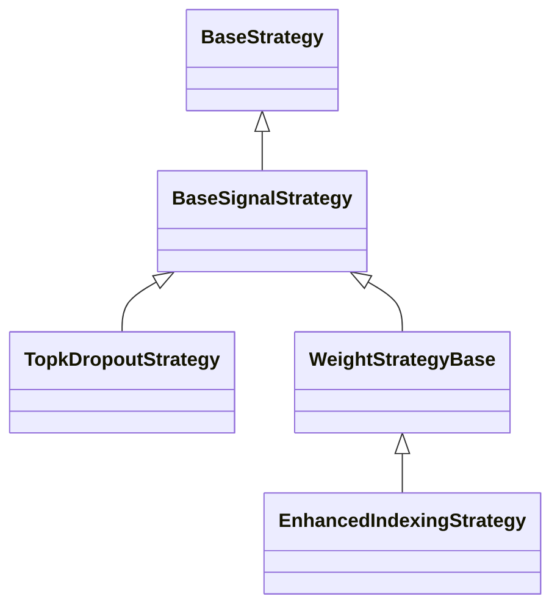
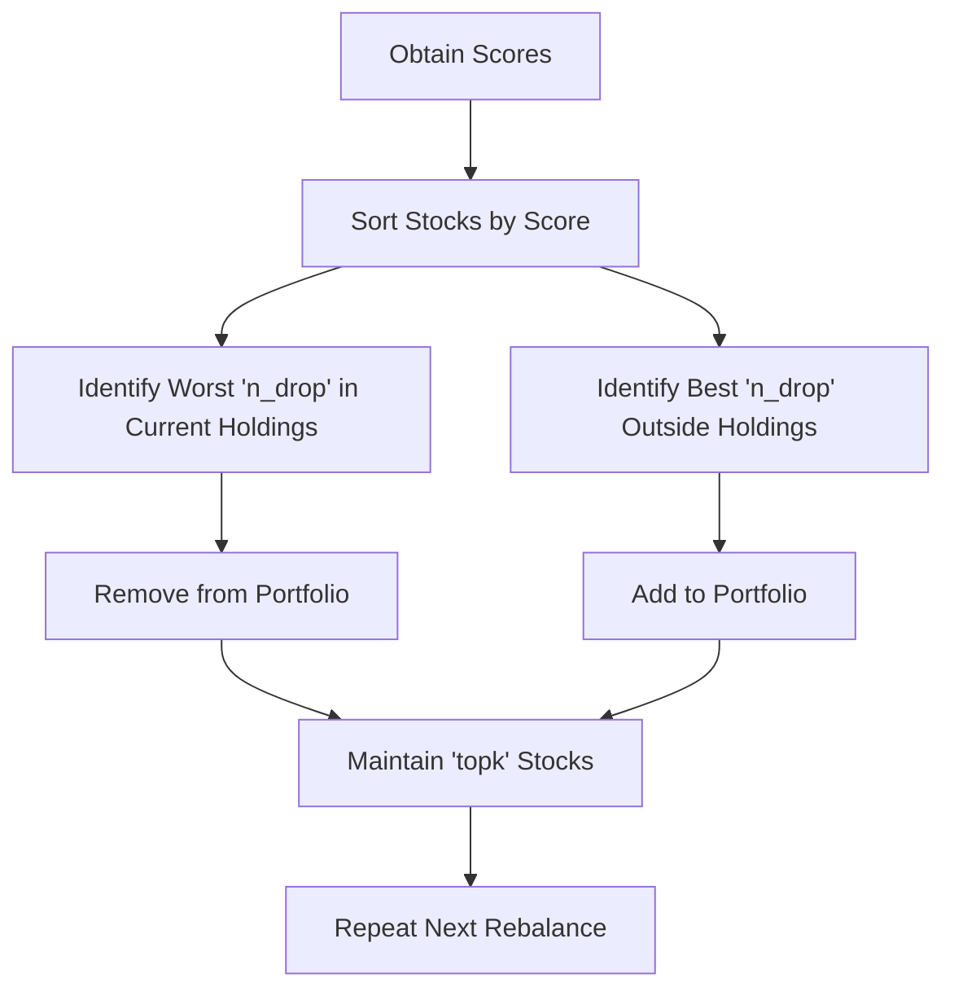
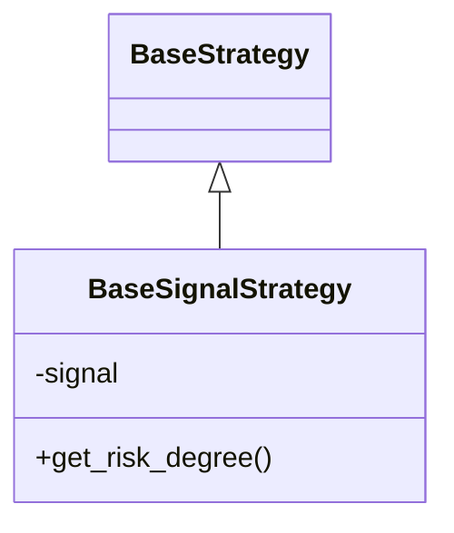
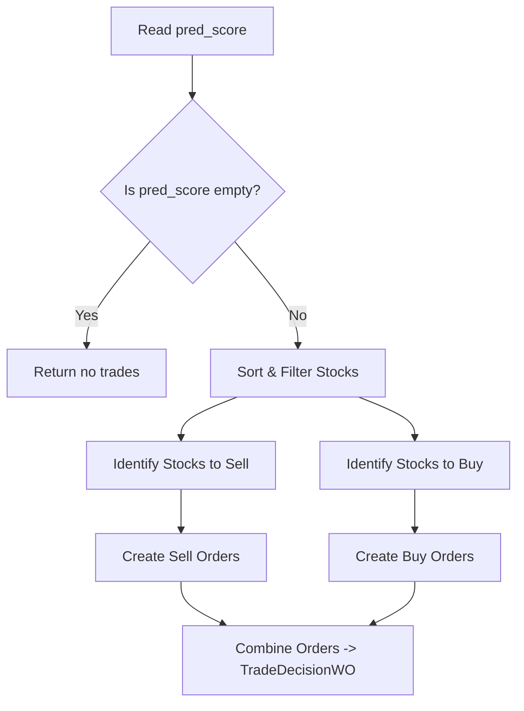
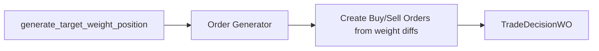
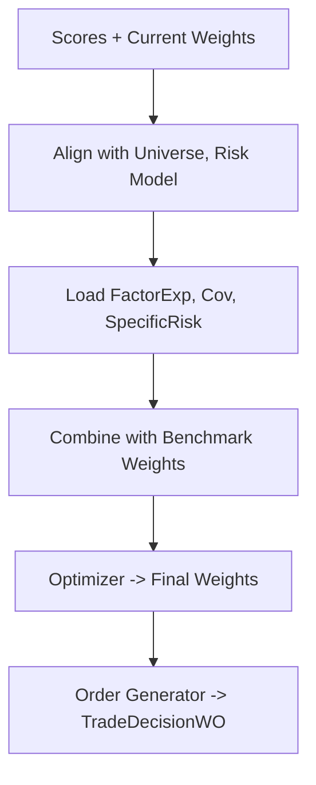

## Introduction

In **Qlib**, portfolio strategies turn **prediction scores** into actionable orders (buy/sell) for building and rebalancing a portfolio. This article will:

1. Explain the architecture of key strategy classes.
2. Demonstrate **`TopkDropoutStrategy`** and **`EnhancedIndexingStrategy`** in detail.
3. Present diagrams and code blocks illustrating the step-by-step flows.

By the end, you’ll see how to plug your own predictive model scores into these strategies and make them trade automatically.

---

## Class Hierarchy

Below is a simple diagram showing how these classes inherit from one another:



- **BaseStrategy**: Core abstraction; requires a method to generate a trade decision.
- **BaseSignalStrategy**: Extends BaseStrategy with “signals” (model scores).
- **TopkDropoutStrategy**: Buys the top-K scoring stocks and drops the worst ones.
- **WeightStrategyBase**: Uses target weights (fractions of the portfolio) rather than discrete buy/sell.
- **EnhancedIndexingStrategy**: Adds advanced risk modeling for partial index tracking.

---

## High-Level Trading Flow for Top-K

Here’s a top-down look at a generic daily (or periodic) process once your predictions are ready:



---

## Code Walkthrough

Below we break down the code for Qlib’s portfolio strategies into sections, each supplemented by additional flow diagrams relevant to that part of the code.

### 1. Imports and Setup

```python
import os
import copy
import warnings
import numpy as np
import pandas as pd

from typing import Dict, List, Text, Tuple, Union
from abc import ABC

from qlib.data import D
from qlib.data.dataset import Dataset
from qlib.model.base import BaseModel
from qlib.strategy.base import BaseStrategy
from qlib.backtest.position import Position
from qlib.backtest.signal import Signal, create_signal_from
from qlib.backtest.decision import Order, OrderDir, TradeDecisionWO
from qlib.log import get_module_logger
from qlib.utils import get_pre_trading_date, load_dataset
from qlib.contrib.strategy.order_generator import OrderGenerator, OrderGenWOInteract
from qlib.contrib.strategy.optimizer import EnhancedIndexingOptimizer
```

**Explanation**

- Core Python imports for numerical operations, data processing, and type hints.
- Qlib-specific imports:
  - **`BaseStrategy`**, **`Position`**, **`Signal`**, and **`TradeDecisionWO`** for implementing custom strategies and managing trade decisions.
  - **`OrderGenerator`** and **`EnhancedIndexingOptimizer`** for generating orders from target weights and optimizing risk exposure.

---

### 2. `BaseSignalStrategy`

Below is a class diagram illustrating `BaseSignalStrategy` inheriting from `BaseStrategy` and adding a **signal** field:



```python
class BaseSignalStrategy(BaseStrategy, ABC):
    def __init__(
        self,
        *,
        signal: Union[Signal, Tuple[BaseModel, Dataset], List, Dict, Text, pd.Series, pd.DataFrame] = None,
        model=None,
        dataset=None,
        risk_degree: float = 0.95,
        trade_exchange=None,
        level_infra=None,
        common_infra=None,
        **kwargs,
    ):
        """
        Parameters
        -----------
        signal :
            Could be a Signal object or raw predictions from a model/dataset.
        risk_degree : float
            Fraction of total capital to invest (default 0.95).
        trade_exchange : Exchange
            Market info for dealing orders, generating reports, etc.
        """
        super().__init__(level_infra=level_infra, common_infra=common_infra, trade_exchange=trade_exchange, **kwargs)

        self.risk_degree = risk_degree

        # For backward-compatibility with (model, dataset)
        if model is not None and dataset is not None:
            warnings.warn("`model` `dataset` is deprecated; use `signal`.", DeprecationWarning)
            signal = model, dataset

        self.signal: Signal = create_signal_from(signal)

    def get_risk_degree(self, trade_step=None):
        """Return the fraction of total value to allocate."""
        return self.risk_degree
```

**Key Points**

- **`BaseSignalStrategy`** extends `BaseStrategy` and integrates a concept of a **signal** (predictions).
- **`risk_degree`** indicates what fraction of the portfolio’s capital is invested (defaults to 95%).

---

### 3. `TopkDropoutStrategy`

Here’s a flow diagram specifically for the `generate_trade_decision` method in `TopkDropoutStrategy`, showing how the code sorts holdings, identifies “drop” stocks, and selects new buys:



```python
class TopkDropoutStrategy(BaseSignalStrategy):
    def __init__(
        self,
        *,
        topk,
        n_drop,
        method_sell="bottom",
        method_buy="top",
        hold_thresh=1,
        only_tradable=False,
        forbid_all_trade_at_limit=True,
        **kwargs,
    ):
        """
        Parameters
        -----------
        topk : int
            Desired number of stocks to hold.
        n_drop : int
            Number of stocks replaced each rebalance.
        method_sell : str
            Approach to dropping existing stocks (e.g. 'bottom').
        method_buy : str
            Approach to adding new stocks (e.g. 'top').
        hold_thresh : int
            Must hold a stock for at least this many days before selling.
        only_tradable : bool
            Ignore non-tradable stocks.
        forbid_all_trade_at_limit : bool
            Disallow trades if limit up/down is reached.
        """
        super().__init__(**kwargs)
        self.topk = topk
        self.n_drop = n_drop
        self.method_sell = method_sell
        self.method_buy = method_buy
        self.hold_thresh = hold_thresh
        self.only_tradable = only_tradable
        self.forbid_all_trade_at_limit = forbid_all_trade_at_limit

    def generate_trade_decision(self, execute_result=None):
        trade_step = self.trade_calendar.get_trade_step()
        trade_start_time, trade_end_time = self.trade_calendar.get_step_time(trade_step)
        pred_start_time, pred_end_time = self.trade_calendar.get_step_time(trade_step, shift=1)
        pred_score = self.signal.get_signal(start_time=pred_start_time, end_time=pred_end_time)

        # If no score, do nothing
        if pred_score is None:
            return TradeDecisionWO([], self)

        # If multiple columns, pick the first
        if isinstance(pred_score, pd.DataFrame):
            pred_score = pred_score.iloc[:, 0]

        # Helper functions for picking top/bottom stocks...
        ...

        # Copy current position
        current_temp: Position = copy.deepcopy(self.trade_position)
        sell_order_list = []
        buy_order_list = []
        cash = current_temp.get_cash()
        current_stock_list = current_temp.get_stock_list()

        # Sort current holdings by descending score
        last = pred_score.reindex(current_stock_list).sort_values(ascending=False).index

        # Identify new stocks to buy
        ...

        # Figure out which existing stocks to sell
        ...

        # Create Sell Orders
        ...

        # Create Buy Orders
        ...

        return TradeDecisionWO(sell_order_list + buy_order_list, self)
```

**Key Points**

- The “top-K, drop worst-K” concept is implemented by comparing current holdings to the broader universe of stocks sorted by score.
- Some specifics:
  - **`method_sell`** can be `"bottom"`, so you drop the lowest-scored holdings.
  - **`method_buy`** can be `"top"`, so you pick the top new stocks that aren’t in the portfolio.

---

### 4. `WeightStrategyBase`

Below is a quick diagram for how `WeightStrategyBase` converts target weights into final orders:



```python
class WeightStrategyBase(BaseSignalStrategy):
    def __init__(
        self,
        *,
        order_generator_cls_or_obj=OrderGenWOInteract,
        **kwargs,
    ):
        super().__init__(**kwargs)
        if isinstance(order_generator_cls_or_obj, type):
            self.order_generator: OrderGenerator = order_generator_cls_or_obj()
        else:
            self.order_generator: OrderGenerator = order_generator_cls_or_obj

    def generate_target_weight_position(self, score, current, trade_start_time, trade_end_time):
        """
        Subclasses must override this to return:
        {stock_id: target_weight}
        """
        raise NotImplementedError()

    def generate_trade_decision(self, execute_result=None):
        trade_step = self.trade_calendar.get_trade_step()
        trade_start_time, trade_end_time = self.trade_calendar.get_step_time(trade_step)
        pred_start_time, pred_end_time = self.trade_calendar.get_step_time(trade_step, shift=1)
        pred_score = self.signal.get_signal(start_time=pred_start_time, end_time=pred_end_time)
        if pred_score is None:
            return TradeDecisionWO([], self)

        current_temp = copy.deepcopy(self.trade_position)
        assert isinstance(current_temp, Position)

        # Let the subclass produce the weights
        target_weight_position = self.generate_target_weight_position(
            score=pred_score, current=current_temp, trade_start_time=trade_start_time, trade_end_time=trade_end_time
        )

        # Convert weights -> Orders
        order_list = self.order_generator.generate_order_list_from_target_weight_position(
            current=current_temp,
            trade_exchange=self.trade_exchange,
            risk_degree=self.get_risk_degree(trade_step),
            target_weight_position=target_weight_position,
            pred_start_time=pred_start_time,
            pred_end_time=pred_end_time,
            trade_start_time=trade_start_time,
            trade_end_time=trade_end_time,
        )
        return TradeDecisionWO(order_list, self)
```

**Key Points**

- **`WeightStrategyBase`** uses a target-weight approach: you specify a final allocation for each stock.
- The built-in **`order_generator`** calculates how many shares to buy/sell to achieve the target allocation.

---

### 5. `EnhancedIndexingStrategy`

Lastly, a diagram shows how this strategy merges **model scores** with **factor data** and a **benchmark**:



```python
class EnhancedIndexingStrategy(WeightStrategyBase):
    """
    Combines active and passive management, aiming to
    outperform a benchmark index while controlling tracking error.
    """

    FACTOR_EXP_NAME = "factor_exp.pkl"
    FACTOR_COV_NAME = "factor_cov.pkl"
    SPECIFIC_RISK_NAME = "specific_risk.pkl"
    BLACKLIST_NAME = "blacklist.pkl"

    def __init__(
        self,
        *,
        riskmodel_root,
        market="csi500",
        turn_limit=None,
        name_mapping={},
        optimizer_kwargs={},
        verbose=False,
        **kwargs,
    ):
        super().__init__(**kwargs)
        self.logger = get_module_logger("EnhancedIndexingStrategy")

        self.riskmodel_root = riskmodel_root
        self.market = market
        self.turn_limit = turn_limit

        self.factor_exp_path = name_mapping.get("factor_exp", self.FACTOR_EXP_NAME)
        self.factor_cov_path = name_mapping.get("factor_cov", self.FACTOR_COV_NAME)
        self.specific_risk_path = name_mapping.get("specific_risk", self.SPECIFIC_RISK_NAME)
        self.blacklist_path = name_mapping.get("blacklist", self.BLACKLIST_NAME)

        self.optimizer = EnhancedIndexingOptimizer(**optimizer_kwargs)
        self.verbose = verbose
        self._riskdata_cache = {}

    def get_risk_data(self, date):
        if date in self._riskdata_cache:
            return self._riskdata_cache[date]

        root = self.riskmodel_root + "/" + date.strftime("%Y%m%d")
        if not os.path.exists(root):
            return None

        factor_exp = load_dataset(root + "/" + self.factor_exp_path, index_col=[0])
        factor_cov = load_dataset(root + "/" + self.factor_cov_path, index_col=[0])
        specific_risk = load_dataset(root + "/" + self.specific_risk_path, index_col=[0])

        if not factor_exp.index.equals(specific_risk.index):
            specific_risk = specific_risk.reindex(factor_exp.index, fill_value=specific_risk.max())

        universe = factor_exp.index.tolist()
        blacklist = []
        if os.path.exists(root + "/" + self.blacklist_path):
            blacklist = load_dataset(root + "/" + self.blacklist_path).index.tolist()

        self._riskdata_cache[date] = factor_exp.values, factor_cov.values, specific_risk.values, universe, blacklist
        return self._riskdata_cache[date]

    def generate_target_weight_position(self, score, current, trade_start_time, trade_end_time):
        trade_date = trade_start_time
        pre_date = get_pre_trading_date(trade_date, future=True)

        outs = self.get_risk_data(pre_date)
        if outs is None:
            self.logger.warning(f"No risk data for {pre_date:%Y-%m-%d}, skipping optimization")
            return None

        factor_exp, factor_cov, specific_risk, universe, blacklist = outs

        # Align score with risk model universe
        score = score.reindex(universe).fillna(score.min()).values

        # Current portfolio weights
        cur_weight = current.get_stock_weight_dict(only_stock=False)
        cur_weight = np.array([cur_weight.get(stock, 0) for stock in universe])
        cur_weight = cur_weight / self.get_risk_degree(trade_date)

        # Benchmark weight
        bench_weight = D.features(
            D.instruments("all"), [f"${self.market}_weight"], start_time=pre_date, end_time=pre_date
        ).squeeze()
        bench_weight.index = bench_weight.index.droplevel(level="datetime")
        bench_weight = bench_weight.reindex(universe).fillna(0).values

        # Track which stocks are tradable and which are blacklisted
        tradable = D.features(D.instruments("all"), ["$volume"], start_time=pre_date, end_time=pre_date).squeeze()
        tradable.index = tradable.index.droplevel(level="datetime")
        tradable = tradable.reindex(universe).gt(0).values
        mask_force_hold = ~tradable
        mask_force_sell = np.array([stock in blacklist for stock in universe], dtype=bool)

        # Optimize based on scores + factor model
        weight = self.optimizer(
            r=score,
            F=factor_exp,
            cov_b=factor_cov,
            var_u=specific_risk**2,
            w0=cur_weight,
            wb=bench_weight,
            mfh=mask_force_hold,
            mfs=mask_force_sell,
        )

        target_weight_position = {stock: w for stock, w in zip(universe, weight) if w > 0}

        if self.verbose:
            self.logger.info(f"trade date: {trade_date:%Y-%m-%d}")
            self.logger.info(f"number of holding stocks: {len(target_weight_position)}")
            self.logger.info(f"total holding weight: {weight.sum():.6f}")

        return target_weight_position
```

**Key Points**

- Uses **riskmodel_root** to pull factor exposures, covariances, and specific risk estimates.
- Combines your **model scores** with a **benchmark weight** to control tracking error via an optimizer.
- Produces a final weight map, which Qlib then converts to buy/sell orders.

---

## Summary

- **BaseSignalStrategy** attaches prediction data to a strategy.
- **TopkDropoutStrategy** implements a straightforward “buy top-K, drop worst-K” approach.
- **WeightStrategyBase** generalizes weight-based rebalancing.
- **EnhancedIndexingStrategy** is a powerful extension, combining active signals and passive indexing with risk control.

By customizing just a few methods or parameters, you can adapt these strategies to your own investing style. Simply feed your daily scores (prediction of returns) into Qlib, pick a strategy class, and let Qlib do the rest.

Happy Trading!
