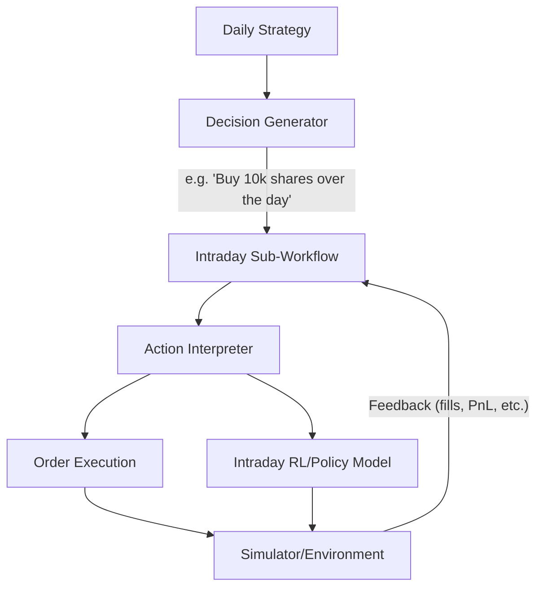
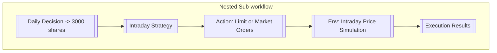
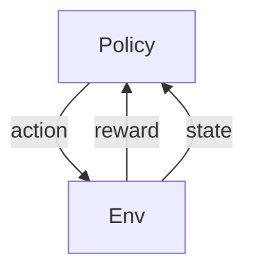

## Introduction

High-Frequency Trading (HFT) involves handling large volumes of orders at extremely high speeds—often measured in microseconds or milliseconds. AI (machine learning and reinforcement learning, in particular) has become pivotal in capturing fleeting market opportunities and managing real-time decisions in these ultra-fast trading environments.

In **Qlib**, the **Nested Decision Execution Framework** simplifies building multi-level HFT strategies, allowing a high-level (daily or weekly) strategy to **nest** an intraday (or sub-intraday) executor or sub-workflow. This design enables realistic joint backtesting: daily portfolio selection and intraday HFT execution interact seamlessly, ensuring that real slippage, partial fills, and transaction costs are accurately accounted for.

By the end of this guide, you’ll understand:

1. How Qlib structures multi-level workflows (daily vs. intraday).
2. How AI techniques (supervised and reinforcement learning) slot into Qlib’s design.
3. How to set up an **Executor** sub-workflow for high-frequency order splitting and real-time decision-making.

---

## Multi-Level Strategy Workflow

Below is an **overview diagram** (adapted from Qlib’s documentation) depicting how daily strategies can nest intraday sub-strategies or RL agents:



- **Daily Strategy**: Generates coarse decisions (e.g., “Buy X shares by day’s end”).
- **Executor**: Breaks decisions into smaller actions. Within it, a **Reinforcement Learning** policy (or any other AI model) can run at minute or sub-minute intervals.
- **Simulator/Environment**: Provides intraday data, simulates order fills/slippage, and feeds rewards back to the RL policy.

This nesting allows realistic interaction between daily allocation goals and intraday fill performance.

---

## Key Components

### 1. Information Extractor (Intraday)

For HFT, Qlib can store data at 1-minute intervals, or even tick/orderbook-level data, using specialized backends (e.g., Arctic). An example below shows how Qlib can manage non-fixed-frequency records:

```bash
# Example snippet from qlib/examples/orderbook_data
# Download sample data, then import into your local mongo or Arctic DB
python create_dataset.py initialize_library
python create_dataset.py import_data
```

Once imported, intraday/tick data can be accessed by Qlib’s normal data APIs for feature engineering or direct RL state representation.

---

### 2. Forecast Model (Intraday + Daily)

A single Qlib workflow can hold **multiple** forecast models:

- **Daily Model**: Predicts overnight returns or daily alpha (e.g., LightGBM on daily bars).
- **Intraday Model**: Predicts short-term (minutes/seconds) price movements. This might be a small neural net or an RL policy evaluating states like order-book depth, spread, volume patterns, etc.

Qlib’s reinforcement learning interface (QlibRL) can also handle advanced models:

- **Policy**: Learns from reward signals (e.g., PnL, transaction costs, slippage).
- **Action Interpreter**: Converts policy actions into actual orders.

---

### 3. Decision Generator (Daily vs. Intraday)

**Daily Decision Generator** might produce a target portfolio:

```text
Stock A: +5% allocation
Stock B: -2% allocation
```

**Intraday Decision Generator** (within the Executor) can then split these top-level instructions into multiple smaller trades. For example, an RL policy might decide to buy 2% of Stock A during the opening auction, 1% during midday, and 2% near closing, based on real-time microprice signals.

---

### 4. Executor & Sub-workflow (Nested)

**Executor** is where the nested approach truly shines. It wraps a more granular intraday or high-frequency sub-strategy.



This sub-workflow can be as simple as scheduling trades evenly or as advanced as an RL policy that:

1. Observes short-term price movement.
2. Acts to minimize slippage and transaction cost.
3. Receives reward signals from the environment (filled shares, average fill price vs. VWAP, etc.).

---

### 5. Environment & Simulator

When applying **Reinforcement Learning**, Qlib uses an **Environment** wrapper:



1. **State**: Intraday features (latest LOB data, partial fill stats).
2. **Action**: The RL agent chooses to place a limit order, market order, or skip.
3. **Reward**: Often the negative cost of trading or realized PnL improvement.

You can leverage Qlib’s built-in simulators or customize them for specific market microstructures.

---

## Example Workflow Snippets

Here’s a high-level script illustrating a **daily + intraday** nested setup. (Pseudocode for demonstration only.)

```python
# daily_intraday_workflow.py

import qlib
from qlib.config import C
from qlib.data import D
from qlib.rl.order_execution_policy import RLOrderExecPolicy
from qlib.strategy.base import BaseStrategy

class DailyAlphaStrategy(BaseStrategy):
    """Generates daily-level decisions (which stocks to buy/sell)."""

    def generate_trade_decision(self, *args, **kwargs):
        # Imagine we have daily predictions from a model...
        scores = self.signal.get_signal()  # daily alpha scores
        # Then produce a dictionary {stock: weight or shares}
        decisions = compute_target_positions(scores)
        return decisions

class NestedExecutor:
    """Executor that calls an intraday RL sub-strategy for each daily decision."""

    def __init__(self, intraday_policy):
        self.intraday_policy = intraday_policy

    def execute_daily_decision(self, daily_decision):
        # Suppose daily_decision = { 'AAPL': +100 shares, 'MSFT': +50 shares }
        # We'll break it into sub-orders via RL
        for stock, shares in daily_decision.items():
            # RL agent decides how to place those shares intraday
            self.intraday_policy.run_execution(stock, shares)

def main():
    qlib.init(provider_uri="your_data_path")  # local data or remote server

    daily_strategy = DailyAlphaStrategy(signal=your_daily_signal)
    intraday_policy = RLOrderExecPolicy()  # RL policy with QlibRL

    executor = NestedExecutor(intraday_policy=intraday_policy)

    # Hypothetical daily loop
    for date in trading_calendar:
        daily_decision = daily_strategy.generate_trade_decision()
        executor.execute_daily_decision(daily_decision)

if __name__ == "__main__":
    main()
```

**Notes**:

- `DailyAlphaStrategy` uses a daily alpha model for stock scoring.
- `NestedExecutor` calls `RLOrderExecPolicy`, which runs intraday steps.
- Real code will handle position objects, trade calendars, and backtest frameworks in more detail.

---

## Practical Tips for HFT + AI

1. **Data Freshness**: HFT signals must be updated almost in real-time. Ensure your Qlib data pipeline is either streaming or as close to real-time as possible.
2. **Latency Considerations**: Real HFT in production must address network latency and order routing. Qlib’s framework focuses on backtesting or simulation; integrating actual exchange connectivity is non-trivial.
3. **Overfitting & Market Regimes**: Intraday data is often noisy; guard against overfitting your ML or RL models to fleeting patterns.
4. **Joint Optimization**: Tweaking daily portfolio turnover and intraday execution in isolation can be suboptimal. Qlib’s nested design helps you see the whole chain’s PnL effect.
5. **Reinforcement Learning**: Start simple (e.g., Q-learning or policy gradient) before moving to complex neural networks. Use carefully designed rewards capturing cost, fill rates, and profit.

---

## Summary

By combining AI (supervised or RL models) with a **Nested Decision Execution** approach, Qlib lets you:

- **Unify Daily and Intraday** strategies in a single backtest.
- **Leverage Real-time AI** for micro-execution decisions.
- **Optimize** both large-scale allocations and fine-grained order placements simultaneously.

This framework is especially powerful for High-Frequency Trading use cases, where multiple decision layers (portfolio vs. sub-second order slicing) must interact. Whether you’re using classical ML or advanced RL, Qlib streamlines experimentation and helps close the gap between daily trading and ultra-fast intraday execution.

---

## Further Reading & References

- **Qlib Documentation** – [https://qlib.readthedocs.io/en/latest/](https://qlib.readthedocs.io/en/latest/)
- **High-Frequency Examples** – [https://github.com/microsoft/qlib/tree/main/examples/highfreq](https://github.com/microsoft/qlib/tree/main/examples/highfreq)
- **Orderbook Data Examples** – [https://github.com/microsoft/qlib/tree/main/examples/orderbook_data](https://github.com/microsoft/qlib/tree/main/examples/orderbook_data)
- **QlibRL** – Reinforcement Learning integration docs, typically in the advanced topics section of Qlib.

Happy trading!
