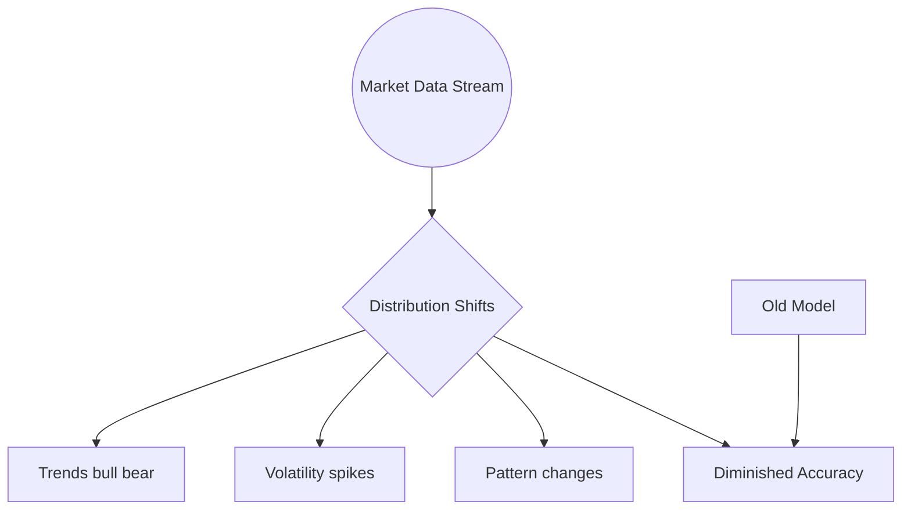
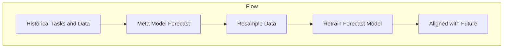
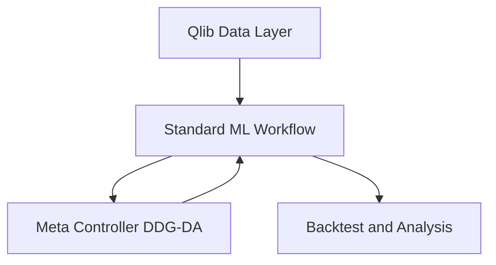
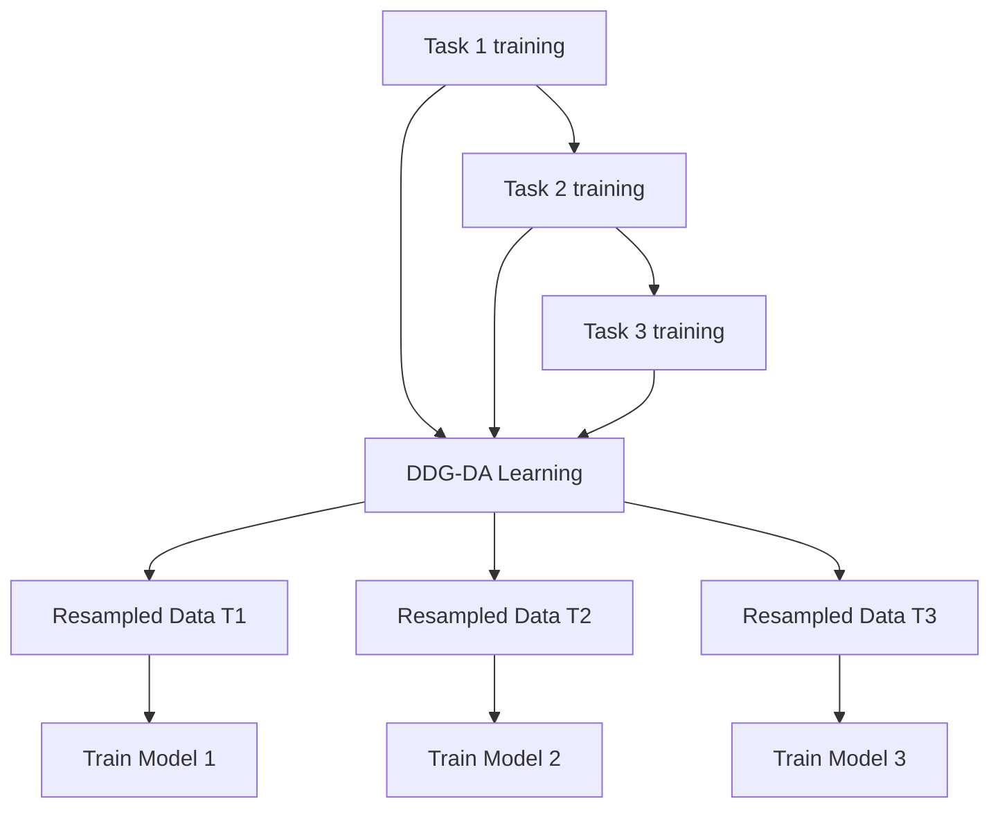
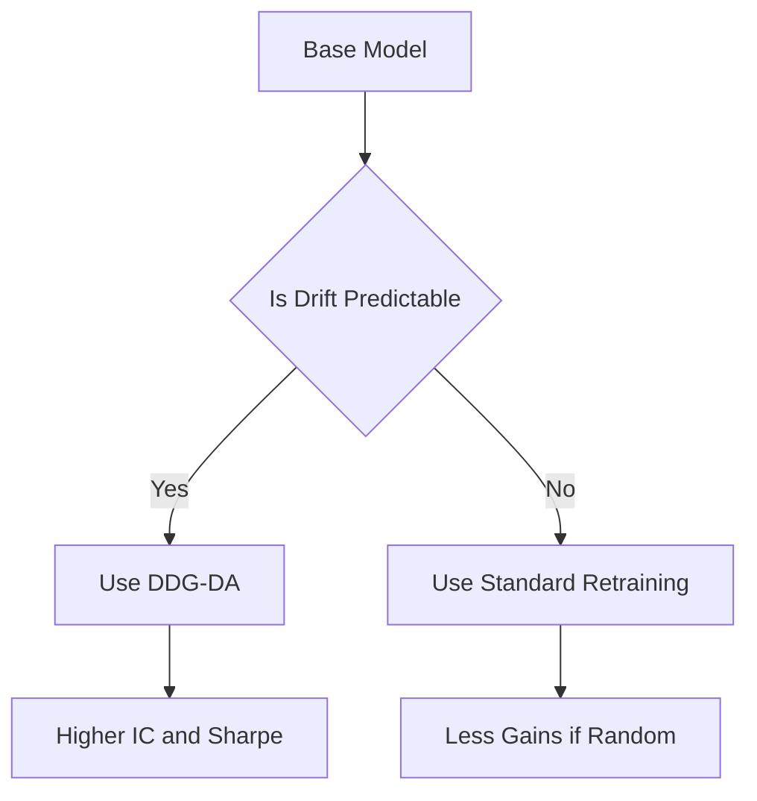
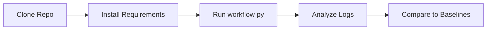

## Introduction

<!-- truncate -->

Financial markets are dynamic: price trends, volatility, and patterns constantly change. These shifts in data distribution, commonly called **concept drift**, pose a serious challenge for AI models trained on historical data. When the market regime changes—such as transitioning from a calm to a volatile environment—a “stale” model can drastically lose predictive power.

**DDG-DA** (Data Distribution Generation for Predictable Concept Drift Adaptation) addresses this by forecasting how the data distribution might evolve in the future, instead of only reacting to the most recent data. The approach is rooted in **meta-learning** (via Qlib’s Meta Controller framework) and helps trading or investment models stay ahead of new trends.

By the end of this article, you will understand:

1. Why concept drift complicates forecasting in stocks and other financial time series
2. How DDG-DA uses a future distribution predictor to resample training data
3. How to incorporate this into Qlib-based workflows to improve stock return and risk-adjusted performance

---

## Concept Drift in Stock Markets

**Concept drift** refers to changes in the underlying distribution of stock market data. These changes can manifest in multiple ways:

- **Trends**: Bull or bear markets can shift faster or slower than expected
- **Volatility**: Sudden spikes can invalidate models calibrated during calmer periods
- **Patterns**: Market microstructure changes or new correlations can emerge, causing old patterns to wane

Traditional methods often react after drift appears (by retraining on recent data). However, if the drift is somewhat predictable, we can model its trajectory—and proactively train models on future conditions before they fully materialize.

### Diagram: Concept Drift Overview



Here, a continuous market data stream (A) encounters distribution shifts (B). These can appear as new trends (C), volatility regimes (D), or changed patterns (E). As a result, a previously trained model (F) gradually loses accuracy (G) if not adapted.

---

## DDG-DA: High-Level Approach

The core principle behind DDG-DA is to **forecast the distribution shift** itself. Specifically:

1. **Predict Future Distributions**

   - A meta-model observes historical tasks (for example, monthly or daily tasks in which you train a new stock-prediction model).
   - This meta-model estimates how the data distribution might move in the next period, such as anticipating an uptick in volatility or a shift in factor exposures.

2. **Generate Synthetic Training Samples**

   - Using the distribution forecast, DDG-DA resamples historical data to emulate the expected future conditions.
   - It might assign higher weights to periods with similar volatility or market conditions so the final training set reflects what the market might soon become.

3. **Train or Retrain the Forecasting Model**
   - Your usual forecasting model (for example, LightGBM or LSTM) is then retrained on these forward-looking samples, aligning better with the next period’s actual data distribution.
   - As a result, the model remains more accurate when concept drift occurs.

### Diagram: DDG-DA Core Steps



This process repeats periodically (for example, each month) to keep your forecasting models aligned with upcoming market conditions.

---

## How It Integrates with Qlib

Qlib provides an **AI-oriented Quantitative Investment Platform** that handles:

- **Data**: Collecting and structuring historical pricing data, factors, and fundamentals
- **Modeling**: Building daily or intraday forecasts using built-in ML or custom models
- **Meta Controller**: A specialized component for tasks like **DDG-DA**, which revolve around higher-level meta-learning and distribution adaptation

### Diagram: Qlib plus DDG-DA Integration



1. **Qlib Data Layer (A)**: Feeds into a standard ML pipeline for daily or intraday forecasting (B).
2. **DDG-DA** sits in the Meta Controller (C), analyzing tasks, predicting distribution changes, and adjusting the pipeline.
3. Results circle back into Qlib for backtesting and analysis (D).

---

## Example: Monthly Stock Trend Forecasting

1. **Setting the Tasks**

   - Suppose you update your stock-ranking model every month, using the last 2 years of data.
   - Each month is a “task” in Qlib. Over multiple months, you get a series of tasks for training and validation.

2. **Train the Meta-Model**

   - DDG-DA learns a function that maps old data distribution patterns to new sample weights.
   - This ensures the next month’s training data distribution is closer to the actual conditions that month.

3. **Evaluate**
   - Compare the results to standard approaches:
     - Rolling Retrain: Only uses the most recent data, ignoring the predictable drift pattern
     - Gradual Forgetting: Weighted by how recent data is, but no direct distribution forecast
     - DDG-DA: Weighs data by predicted future distribution, leading to stronger alignment when drift is not purely random

### Diagram: Monthly Task Workflow



---

## Performance and Findings

Research in the associated [DDG-DA paper](https://arxiv.org/abs/2201.04038) and Qlib examples shows:

- **Better Signal Quality**: Higher Information Coefficient (IC) for stock selection
- **Enhanced Portfolio Returns**: Larger annual returns, improved Sharpe Ratio, and lower drawdowns in backtests
- **Versatility**: Works with a wide range of ML models (Linear, LightGBM, neural networks)
- **Limitations**: If concept drift is completely random or abrupt (no pattern), DDG-DA’s advantages diminish. Predictability is key

### Diagram: Performance Improvement



---

## Practical Steps

1. **Install Qlib** and ensure you have the dataset (for example, [Alpha158](https://qlib.readthedocs.io/)) set up
2. **Clone the DDG-DA Example** from the Qlib GitHub:
   ```bash
   git clone https://github.com/microsoft/qlib.git
   cd qlib/examples/benchmarks_dynamic/DDG-DA
   ```
3. **Install Requirements**:
   ```bash
   pip install -r requirements.txt
   ```
4. **Run the Workflow**:
   ```bash
   python workflow.py run
   ```
   - By default, it uses a simple linear forecasting model
   - To use LightGBM or another model, specify the `--conf_path` argument, for example:
     ```bash
     python workflow.py --conf_path=../workflow_config_lightgbm_Alpha158.yaml run
     ```
5. **Analyze Results**:
   - Qlib’s recorder logs signal metrics (IC, ICIR) and backtest performance (annual return, Sharpe)
   - Compare with baseline methods (Rolling Retrain, Exponential Forgetting, etc.)

### Diagram: Running DDG-DA Workflow



---

## Conclusion

**DDG-DA** shows how AI can proactively tackle **concept drift** in stock forecasting. Instead of merely reacting to new data, it anticipates potential distribution changes, producing a more robust, forward-looking training set. When integrated into Qlib’s **Meta Controller**, it seamlessly fits your existing pipelines, from data ingestion to backtesting.

For practical use:

- **Ensure** your market conditions exhibit some predictability. Random, sudden changes are harder to model
- **Combine** with conventional best practices (risk management, hyperparameter tuning) for a holistic pipeline
- **Monitor** performance: If drift patterns shift, you may need to retrain or retune the DDG-DA meta-model

By forecasting future market states and adapting ahead of time, **DDG-DA** helps your quantitative strategies remain agile and profitable in evolving financial environments.

---

## Further Reading and References

- **Official DDG-DA Repo**  
  [https://github.com/microsoft/qlib/tree/main/examples/benchmarks_dynamic/DDG-DA](https://github.com/microsoft/qlib/tree/main/examples/benchmarks_dynamic/DDG-DA)

- **DDG-DA Paper**  
  [https://arxiv.org/abs/2201.04038](https://arxiv.org/abs/2201.04038)

- **Qlib Documentation**  
  [https://qlib.readthedocs.io/](https://qlib.readthedocs.io/)

- **Concept Drift**  
  [Wikipedia: Concept Drift](https://en.wikipedia.org/wiki/Concept_drift)

Happy (adaptive) trading!
