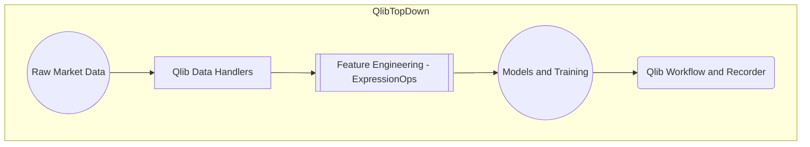
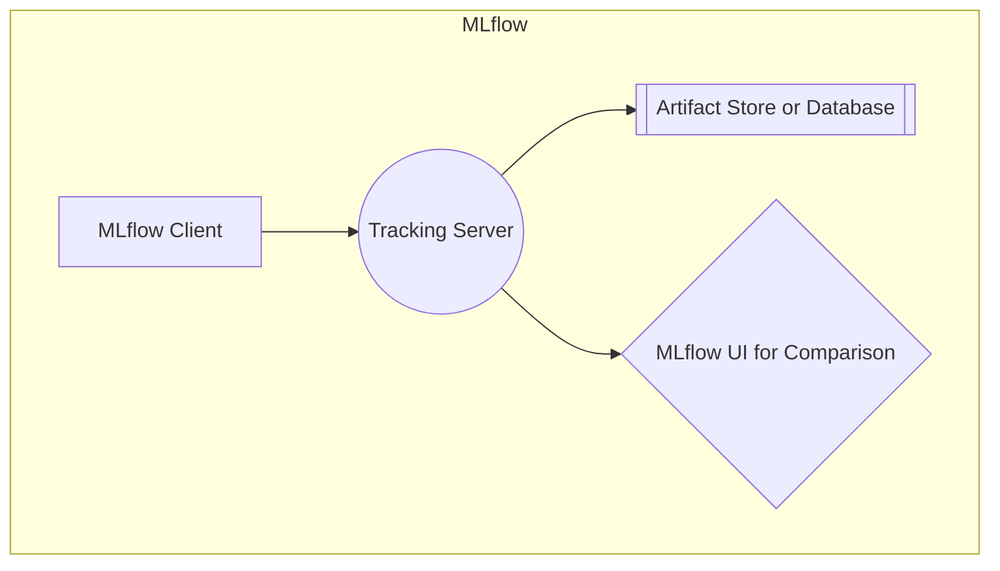
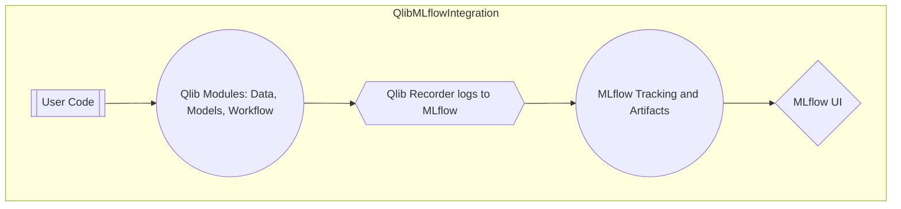

## Introduction

<!-- truncate -->

Financial markets present a dynamic environment where active research and experimentation are critical. **Qlib** offers a complete “AI-oriented” solution for quantitative investment—covering data loaders, feature engineering, model training, and evaluation. Meanwhile, **MLflow** provides robust functionality for experiment tracking, handling metrics, artifacts, and hyperparameters across multiple runs. You can further enhance your documentation using specialized syntax for highlighting important information, such as notes or warnings, to help readers navigate complex workflows.

This article shows **how to integrate Qlib and MLflow** to manage your entire workflow—from data ingestion and factor engineering to model storage and versioning—under a single, unified experiment system. It also demonstrates various ways to emphasize notes or warnings to help readers explore the complexities of this setup.

By the end of this article, you will learn:

1. How Qlib manages data and modeling in a typical quant workflow
2. How MLflow tracks experiment artifacts, logs metrics, and organizes multiple runs
3. How to integrate Qlib’s “Recorder” concept with MLflow’s tracking

---

## 1. Qlib Overview

**Qlib** is a powerful open-source toolkit designed for AI-based quantitative investment. It streamlines common challenges in this domain:

- **Data Layer**: Standardizes daily or intraday bars, fundamental factors, and alpha signals
- **Feature Engineering**: Offers an expression engine (alpha modeling) plus factor definitions
- **Modeling**: Easily pluggable ML models (LightGBM, Linear, RNN, etc.) with out-of-the-box training logic
- **Evaluation and Backtest**: Includes modules for analyzing signals, computing IC/RankIC, and running trading strategies in a backtest simulator

### Diagram: Qlib Architecture

Below is a high-level view of Qlib’s architecture—how data flows from raw sources into Qlib’s data handlers, transforms into features, and ultimately fuels model training.



:::note
Some Qlib features—like intraday data handling or advanced factor expressions—may require additional configuration. Double-check your data paths and environment setup to ensure all pieces are properly configured.
:::

---

## 2. MLflow Overview

**MLflow** is an experiment-tracking tool that organizes runs and artifacts:

- **Tracking**: Logs params, metrics, tags, and artifacts (model checkpoints, charts)
- **UI**: A local or remote interface (`mlflow ui`) for comparing runs side by side
- **Model Registry**: Version controls deployed models, enabling easy rollback or re-deployment

### Diagram: MLflow Overview



:::warning
When configuring MLflow on remote servers, remember to secure the tracking server appropriately. Unsecured endpoints may expose logs and artifacts to unintended parties.
:::

---

## 3. Combining Qlib and MLflow

In typical usage, Qlib handles data ingestion, feature transformations, and model training. MLflow complements it by capturing:

1. **Run Metadata**: Each Qlib “Recorder” maps to an MLflow run
2. **Metrics & Params**: Qlib logs metrics like Sharpe Ratio or Information Coefficient (IC); MLflow’s UI centralizes them
3. **Artifacts**: Saved model files, prediction results, or charts are stored in MLflow’s artifact repository

### Diagram: Qlib + MLflow Integration

Below is a top-down diagram showing how user code interacts with Qlib, which in turn leverages MLflow for run logging.



---

## 4. Minimal Example

Here’s a simplified script showing the synergy among the three components:

```python
import qlib
from qlib.workflow import R
from qlib.utils import init_instance_by_config

# 1) Init Qlib and MLflow
qlib.init(
    exp_manager={
        "class": "MLflowExpManager",
        "module_path": "qlib.workflow.expm",
        "kwargs": {
            "uri": "file:/path/to/mlruns",
            "default_exp_name": "QlibExperiment"
        },
    }
)

# 2) Start experiment and train
with R.start(experiment_name="QlibExperiment", recorder_name="run1"):
    # Basic config
    model_config = {"class": "LightGBMModel", "kwargs": {"learning_rate": 0.05}}
    dataset_config = {...}

    model = init_instance_by_config(model_config)
    dataset = init_instance_by_config(dataset_config)
    model.fit(dataset)

    # Evaluate
    predictions = model.predict(dataset)

    # log some metrics
    R.log_metrics(Sharpe=1.2, IC=0.03)

    # Save artifacts
    R.save_objects(**{"pred.pkl": predictions, "trained_model.pkl": model})
```

:::info
The snippet above logs metrics like Sharpe or IC, making them easily comparable across multiple runs. You can further log hyperparameters via `R.log_params(...)` for more granular comparisons.
:::

**Results**:

- A new MLflow run named “run1” under “QlibExperiment”
- MLflow logs parameters/metrics (`learning_rate`, `Sharpe`, `IC`)
- Artifacts “pred.pkl” and “trained_model.pkl” appear in MLflow’s artifact UI

---

## 5. Best Practices

1. **Organize Qlib tasks**: Use Qlib’s `SignalRecord` or `PortAnaRecord` classes to store signals/backtest results, ensuring logs are automatically tied to MLflow runs
2. **Parameter Logging**: Send hyperparameters or relevant config to `R.log_params(...)` for easy comparison in MLflow
3. **Artifact Naming**: Keep artifact names consistent (e.g., `"pred.pkl"`) across multiple runs
4. **Model Registry**: Consider pushing your best runs to MLflow’s Model Registry for versioned deployment

:::danger
A mismatch between your local Qlib environment and remote MLflow server can cause logging errors. Ensure both environments are in sync (same Python versions, same library versions).
:::

---

## 6. Conclusion

By connecting **Qlib**’s experiment pipeline to **MLflow**’s tracking features—and documenting everything thoroughly—you get the best of all worlds:

- **Qlib**: AI-centric quant platform automating data handling, factor engineering, and modeling
- **MLflow**: A robust interface for comparing runs, storing artifacts, and version-controlling the entire process

This synergy simplifies large-scale experimentation—especially when you frequently iterate over factor definitions, hyperparameters, or new trading strategies.

---

## Further Reading and References

- **Qlib Repo**  
  [https://github.com/microsoft/qlib](https://github.com/microsoft/qlib)

- **MLflow Documentation**  
  [https://mlflow.org/docs/latest/index.html](https://mlflow.org/docs/latest/index.html)

- **Qlib Documentation**  
  [https://qlib.readthedocs.io/](https://qlib.readthedocs.io/)

- **MLflow Tracking**  
  [https://mlflow.org/docs/latest/tracking.html](https://mlflow.org/docs/latest/tracking.html)

Experiment happy!
