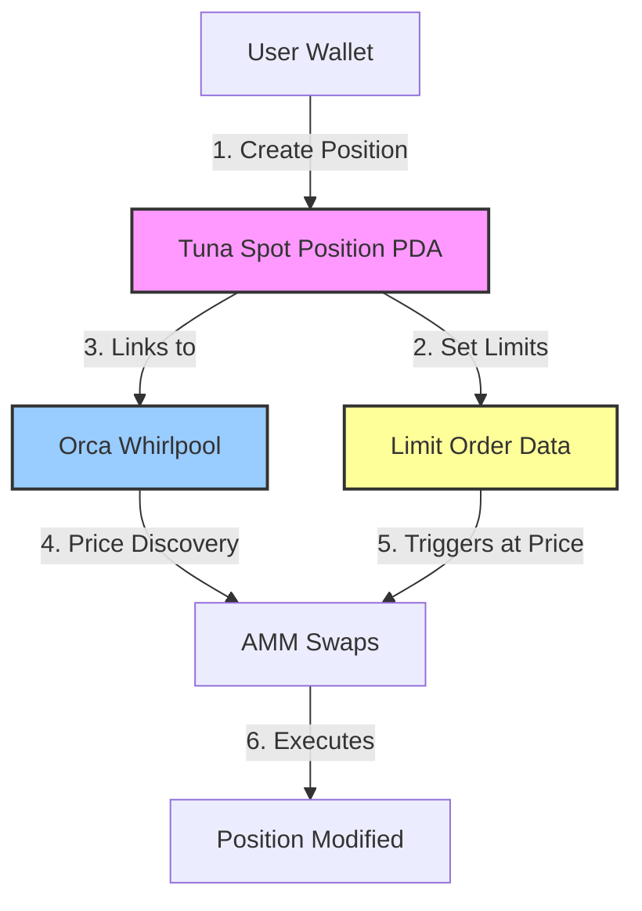

## TL;DR

This guide demonstrates **real-world implementation** of DeFiTuna limit orders on Solana mainnet, focusing on:

- **Direct RPC Interaction**: Building and submitting transactions without high-level SDKs
- **On-Chain Limit Order Storage**: How limit order parameters are encoded in account data
- **Position Lifecycle**: Open position → Set limits → Close position with actual mainnet transactions
- **Account Derivation**: PDA calculations for spot positions and associated token accounts
- **DeFiTuna SDK Patterns**: Insights from the official TypeScript/Rust SDK implementation

**Live Mainnet Transactions**:

- Position Created: [4J9XJxHUDmSUV...](https://explorer.solana.com/tx/4J9XJxHUDmSUV4vEqAJKFwZ3oigqQ8mf4bM1Q4WF89fWnvkm1hrwhyNb5PMGf5Dx6g7hKGXMUbCVxDwn9QmEbteW?cluster=mainnet-beta)
- Limit Orders Set: [5ouHm9mVroRGz...](https://explorer.solana.com/tx/5ouHm9mVroRGzp7kiC6pWuNUYySYnKz6DTYSyBQdb4ikvz56jbmqXeBdNkU7uXqMpURjJYLVgjw8VrqfynMna6xb?cluster=mainnet-beta)
- Position Closed: [44aWvGvPEWGK...](https://explorer.solana.com/tx/44aWvGvPEWGKcqZZZq5kzJ6Q9GxnayMzrNLDMVDHtBs6EASgYQ9KZDfPaam1orwZBA2FGBLB3rtTRKuqquDdyjCa?cluster=mainnet-beta)

## Introduction

DeFiTuna combines Orca Whirlpools with on-chain limit orders, enabling automated trading triggers without requiring active monitoring. Unlike traditional AMMs where you passively provide liquidity, DeFiTuna positions execute predefined trades when price conditions are met.

This article walks through the complete implementation—from deriving PDAs to encoding instruction data—using **Rust with solana-sdk** and insights from the **DeFiTuna SDK**.

## Architecture Overview

### DeFiTuna + Orca Integration



### Key Insight: DeFiTuna is a Protocol Layer

DeFiTuna doesn't implement its own AMM. Instead, it:

1. Wraps existing AMMs (Orca Whirlpools, Fusion pools)
2. Adds limit order logic on top
3. Manages leveraged positions and lending vaults

## On-Chain Account Structure

### Position Account Data Layout (346 bytes)

From our mainnet position `8wvKhHXHfzY4eQZTyK4kTfUtGj46XX5UX8P4S5kBbJ5`:

```
Offset   Field                    Type     Bytes   Description
------   -----                    ----     -----   -----------
0-8      Discriminator            u64      8       Account type identifier
8-40     Authority                Pubkey   32      Position owner
40-72    Pool                     Pubkey   32      Orca Whirlpool address
72-73    Position Token           u8       1       0=TokenA, 1=TokenB
73-74    Collateral Token         u8       1       0=TokenA, 1=TokenB
92-100   Amount                   u64      8       Position size
100-108  Borrowed                 u64      8       Borrowed amount
184-200  Lower Limit √Price       u128     16      Buy trigger price
200-216  Upper Limit √Price       u128     16      Sell trigger price
```

**Hex dump from mainnet**:

```
00b8:   60 e4 c0 d6 1c 8e 68 01  00 00 00 00 00 00 00 00   Lower limit
00c8:   70 17 34 50 e5 c9 7c 01  00 00 00 00 00 00 00 00   Upper limit
```

These bytes encode:

- Lower: `6651068162312125808640` → $130
- Upper: `7024310870365581606912` → $145

## Implementation: Rust Binaries

### Project Structure

```
bots/defituna-bot/
├── Cargo.toml
├── .env                    # Configuration
├── defituna.json          # Program IDL
└── src/
    ├── config.rs          # Shared config
    └── bin/
        ├── open_spot_position.rs    # Create position
        ├── set_limit_orders.rs      # Configure triggers
        ├── check_position.rs        # Query state
        └── close_position.rs        # Cleanup
```

### 1. Opening a Spot Position

**File**: `src/bin/open_spot_position.rs`

```rust
use solana_sdk::{
    instruction::{AccountMeta, Instruction},
    signature::{Keypair, Signer},
    transaction::Transaction,
};
use spl_associated_token_account::get_associated_token_address;

// DeFiTuna program ID (mainnet)
const DEFITUNA_PROGRAM: &str = "tuna4uSQZncNeeiAMKbstuxA9CUkHH6HmC64wgmnogD";

// Orca SOL/USDC Whirlpool
const WHIRLPOOL: &str = "Czfq3xZZDmsdGdUyrNLtRhGc47cXcZtLG4crryfu44zE";

fn main() -> Result<()> {
    let program_id = Pubkey::from_str(DEFITUNA_PROGRAM)?;
    let whirlpool = Pubkey::from_str(WHIRLPOOL)?;
    let authority = executor_keypair.pubkey();
    
    // Derive spot position PDA
    let (tuna_spot_position, _bump) = Pubkey::find_program_address(
        &[
            b"tuna_spot_position",
            authority.as_ref(),
            whirlpool.as_ref(),
        ],
        &program_id,
    );
    
    // Token program IDs
    let token_program_a = spl_token::ID; // SOL uses standard program
    let token_program_b = spl_token::ID; // USDC uses standard program
    
    // Derive associated token accounts for position
    let tuna_position_ata_a = get_associated_token_address(
        &tuna_spot_position,
        &SOL_MINT
    );
    let tuna_position_ata_b = get_associated_token_address(
        &tuna_spot_position,
        &USDC_MINT
    );
    
    // Build instruction
    // Discriminator from IDL: [87, 208, 173, 48, 231, 62, 210, 220]
    let mut data = vec![87, 208, 173, 48, 231, 62, 210, 220];
    
    // Args: position_token (PoolToken::A=0), collateral_token (PoolToken::B=1)
    data.push(0); // Trading SOL (position_token = A)
    data.push(1); // Collateral is USDC (collateral_token = B)
    
    let instruction = Instruction {
        program_id,
        accounts: vec![
            AccountMeta::new(authority, true),                  // authority (signer, writable)
            AccountMeta::new_readonly(SOL_MINT, false),        // mint_a
            AccountMeta::new_readonly(USDC_MINT, false),       // mint_b
            AccountMeta::new_readonly(token_program_a, false), // token_program_a
            AccountMeta::new_readonly(token_program_b, false), // token_program_b
            AccountMeta::new(tuna_spot_position, false),       // tuna_position (writable)
            AccountMeta::new(tuna_position_ata_a, false),      // tuna_position_ata_a
            AccountMeta::new(tuna_position_ata_b, false),      // tuna_position_ata_b
            AccountMeta::new_readonly(whirlpool, false),       // pool (Orca Whirlpool)
            AccountMeta::new_readonly(system_program::ID, false), // system_program
            AccountMeta::new_readonly(
                spl_associated_token_account::ID, 
                false
            ), // associated_token_program
        ],
        data,
    };
    
    // Create and sign transaction
    let recent_blockhash = rpc_client.get_latest_blockhash()?;
    let transaction = Transaction::new_signed_with_payer(
        &[instruction],
        Some(&authority),
        &[&executor_keypair],
        recent_blockhash,
    );
    
    // Send to RPC
    let signature = rpc_client.send_and_confirm_transaction(&transaction)?;
    println!("Position created: {}", signature);
    
    Ok(())
}
```

**Key Points**:

- **No collateral required** to open position (just creates account structure)
- Position PDA seeds: `["tuna_spot_position", authority, whirlpool]`
- Instruction creates position account + 2 associated token accounts
- Cost: ~0.00329904 SOL rent + ~0.000005 SOL gas

### 2. Setting Limit Orders

**File**: `src/bin/set_limit_orders.rs`

```rust
/// Convert price to sqrt_price format
/// Formula: sqrt_price = sqrt(price) * 2^64, adjusted for decimals
fn price_to_sqrt_price(price: f64, decimals_a: u8, decimals_b: u8) -> u128 {
    let decimal_diff = decimals_a as i32 - decimals_b as i32;
    let adjusted_price = if decimal_diff >= 0 {
        price * 10_f64.powi(decimal_diff)
    } else {
        price / 10_f64.powi(-decimal_diff)
    };
    
    let sqrt_price_f64 = adjusted_price.sqrt() * (1u128 << 64) as f64;
    sqrt_price_f64 as u128
}

fn main() -> Result<()> {
    // Derive same position PDA
    let (tuna_spot_position, _) = Pubkey::find_program_address(
        &[b"tuna_spot_position", authority.as_ref(), whirlpool.as_ref()],
        &program_id,
    );
    
    // Set limit prices
    let lower_price = 130.0; // Buy if SOL drops to $130
    let upper_price = 145.0; // Sell if SOL rises to $145
    
    // Convert to sqrt_price (SOL=9 decimals, USDC=6 decimals)
    let lower_sqrt_price = price_to_sqrt_price(lower_price, 9, 6);
    let upper_sqrt_price = price_to_sqrt_price(upper_price, 9, 6);
    
    // Build instruction
    // Discriminator: [10, 180, 19, 205, 169, 133, 52, 118]
    let mut data = vec![10, 180, 19, 205, 169, 133, 52, 118];
    
    // Args: lower_limit_order_sqrt_price (u128), upper_limit_order_sqrt_price (u128)
    data.extend_from_slice(&lower_sqrt_price.to_le_bytes());
    data.extend_from_slice(&upper_sqrt_price.to_le_bytes());
    
    let instruction = Instruction {
        program_id,
        accounts: vec![
            AccountMeta::new_readonly(authority, true),    // authority (signer)
            AccountMeta::new(tuna_spot_position, false),  // tuna_position (writable)
        ],
        data,
    };
    
    let transaction = Transaction::new_signed_with_payer(
        &[instruction],
        Some(&authority),
        &[&executor_keypair],
        recent_blockhash,
    );
    
    let signature = rpc_client.send_and_confirm_transaction(&transaction)?;
    println!("Limit orders set: {}", signature);
    
    Ok(())
}
```

**Output** (mainnet):

```
Lower (buy): $130 → sqrt_price: 6651068162312125808640
Upper (sell): $145 → sqrt_price: 7024310870365581606912
```

**Verification on-chain**:

```bash
solana account 8wvKhHXHfzY4eQZTyK4kTfUtGj46XX5UX8P4S5kBbJ5

# Bytes 184-200 (lower limit):
60 e4 c0 d6 1c 8e 68 01 00 00 00 00 00 00 00 00

# Bytes 200-216 (upper limit):
70 17 34 50 e5 c9 7c 01 00 00 00 00 00 00 00 00
```

### 3. Closing a Position

**File**: `src/bin/close_position.rs`

```rust
fn main() -> Result<()> {
    // Derive position PDA (same as open)
    let (tuna_spot_position, _) = Pubkey::find_program_address(
        &[b"tuna_spot_position", authority.as_ref(), whirlpool.as_ref()],
        &program_id,
    );
    
    // Build close instruction
    // Discriminator: [4, 189, 171, 84, 110, 220, 10, 8]
    let data = vec![4, 189, 171, 84, 110, 220, 10, 8];
    
    let instruction = Instruction {
        program_id,
        accounts: vec![
            AccountMeta::new(authority, true),                 // authority
            AccountMeta::new_readonly(SOL_MINT, false),       // mint_a
            AccountMeta::new_readonly(USDC_MINT, false),      // mint_b
            AccountMeta::new_readonly(spl_token::ID, false),  // token_program_a
            AccountMeta::new_readonly(spl_token::ID, false),  // token_program_b
            AccountMeta::new(tuna_spot_position, false),      // tuna_position
            AccountMeta::new(tuna_position_ata_a, false),     // tuna_position_ata_a
            AccountMeta::new(tuna_position_ata_b, false),     // tuna_position_ata_b
        ],
        data,
    };
    
    let signature = rpc_client.send_and_confirm_transaction(&transaction)?;
    println!("Position closed, rent recovered: {}", signature);
    
    Ok(())
}
```

**Result**: Rent (0.00329904 SOL) returned to wallet, position account deleted.

## DeFiTuna SDK Patterns

### TypeScript SDK Structure

From `DefiTuna/tuna-sdk` repository:

```typescript
// ts-sdk/client/src/txbuilder/openTunaSpotPosition.ts
export async function openTunaSpotPositionInstructions(
  rpc: Rpc<GetAccountInfoApi & GetMultipleAccountsApi>,
  authority: TransactionSigner,
  poolAddress: Address,
  args: OpenTunaSpotPositionInstructionDataArgs,
): Promise<IInstruction[]> {
  // 1. Derive position PDA
  const tunaPositionAddress = (
    await getTunaSpotPositionAddress(authority.address, poolAddress)
  )[0];

  // 2. Get associated token accounts
  const tunaPositionAtaA = (
    await findAssociatedTokenPda({
      owner: tunaPositionAddress,
      mint: mintA.address,
      tokenProgram: mintA.programAddress,
    })
  )[0];

  const tunaPositionAtaB = (
    await findAssociatedTokenPda({
      owner: tunaPositionAddress,
      mint: mintB.address,
      tokenProgram: mintB.programAddress,
    })
  )[0];

  // 3. Build instruction
  return getOpenTunaSpotPositionInstruction({
    authority,
    mintA: mintA.address,
    mintB: mintB.address,
    tokenProgramA: mintA.programAddress,
    tokenProgramB: mintB.programAddress,
    tunaPosition: tunaPositionAddress,
    tunaPositionAtaA,
    tunaPositionAtaB,
    pool: poolAddress,
    associatedTokenProgram: ASSOCIATED_TOKEN_PROGRAM_ADDRESS,
    ...args,
  });
}
```

### Rust SDK Patterns

From `rust-sdk/client/src/txbuilder/open_tuna_spot_position.rs`:

```rust
pub fn open_tuna_spot_position_instructions(
    rpc: &RpcClient,
    authority: &Pubkey,
    pool_address: &Pubkey,
    args: OpenTunaSpotPositionInstructionArgs,
) -> Result<Vec<Instruction>> {
    // 1. Fetch pool account to determine token mints
    let pool_account = rpc.get_account(pool_address)?;
    
    // Decode based on program owner
    let (mint_a_address, mint_b_address) = if pool_account.owner == FUSIONAMM_ID {
        let pool: FusionPool = decode_account(&pool_account)?;
        (pool.token_mint_a, pool.token_mint_b)
    } else if pool_account.owner == WHIRLPOOL_ID {
        let pool: Whirlpool = decode_account(&pool_account)?;
        (pool.token_mint_a, pool.token_mint_b)
    } else {
        return Err(anyhow!("Unsupported pool type"));
    };

    // 2. Get mint accounts to determine token programs
    let mint_accounts = rpc.get_multiple_accounts(&[
        mint_a_address.into(),
        mint_b_address.into()
    ])?;
    
    let mint_a_account = mint_accounts[0].as_ref()
        .ok_or(anyhow!("Token A mint not found"))?;
    let mint_b_account = mint_accounts[1].as_ref()
        .ok_or(anyhow!("Token B mint not found"))?;

    // 3. Build instruction
    Ok(vec![open_tuna_spot_position_instruction(
        authority,
        pool_address,
        &mint_a_address,
        &mint_b_address,
        &mint_a_account.owner, // Token program
        &mint_b_account.owner,
        args,
    )])
}
```

**Key SDK Features**:

1. **Pool Type Detection**: Automatically handles Orca vs Fusion pools
2. **Token Program Discovery**: Supports both SPL Token and Token-2022
3. **Account Pre-Validation**: Checks accounts exist before building transaction
4. **Error Handling**: Detailed error messages for debugging

## Solana RPC Interaction Patterns

### 1. Account Fetching with Commitment

```rust
use solana_client::rpc_client::RpcClient;
use solana_sdk::commitment_config::CommitmentConfig;

let rpc_client = RpcClient::new_with_commitment(
    "https://api.mainnet-beta.solana.com",
    CommitmentConfig::confirmed()
);

// Fetch account with specific commitment
let account = rpc_client.get_account_with_commitment(
    &position_address,
    CommitmentConfig::finalized()
)?;

if let Some(account) = account.value {
    println!("Account exists: {} bytes", account.data.len());
}
```

### 2. Transaction Simulation Before Sending

```rust
// Build transaction
let transaction = Transaction::new_signed_with_payer(
    &[instruction],
    Some(&payer.pubkey()),
    &[&payer],
    recent_blockhash,
);

// Simulate first
match rpc_client.simulate_transaction(&transaction) {
    Ok(result) => {
        if let Some(err) = result.value.err {
            println!("Simulation failed: {:?}", err);
            if let Some(logs) = result.value.logs {
                for log in logs {
                    println!("  {}", log);
                }
            }
            return Err(anyhow!("Simulation error"));
        }
        println!("✅ Simulation successful");
    }
    Err(e) => {
        println!("RPC error during simulation: {}", e);
        return Err(e.into());
    }
}

// Now send for real
let signature = rpc_client.send_and_confirm_transaction(&transaction)?;
```

### 3. Parsing Account Data

```rust
fn parse_position_limits(account_data: &[u8]) -> Result<(u128, u128)> {
    if account_data.len() < 216 {
        return Err(anyhow!("Account data too short"));
    }
    
    // Extract limit order sqrt prices
    let lower_bytes: [u8; 16] = account_data[184..200]
        .try_into()
        .unwrap();
    let upper_bytes: [u8; 16] = account_data[200..216]
        .try_into()
        .unwrap();
    
    let lower_sqrt_price = u128::from_le_bytes(lower_bytes);
    let upper_sqrt_price = u128::from_le_bytes(upper_bytes);
    
    Ok((lower_sqrt_price, upper_sqrt_price))
}

// Usage
let account = rpc_client.get_account(&position_pda)?;
let (lower, upper) = parse_position_limits(&account.data)?;

// Convert to human-readable prices
let lower_price = sqrt_price_to_price(lower, 9, 6);
let upper_price = sqrt_price_to_price(upper, 9, 6);

println!("Buy limit: ${:.2}", lower_price);
println!("Sell limit: ${:.2}", upper_price);
```

### 4. Watching for Transaction Confirmation

```rust
use solana_sdk::signature::Signature;
use std::time::Duration;

fn wait_for_confirmation(
    rpc_client: &RpcClient,
    signature: &Signature,
    max_retries: u32,
) -> Result<()> {
    for i in 0..max_retries {
        std::thread::sleep(Duration::from_secs(2));
        
        if let Ok(status) = rpc_client.get_signature_status(signature) {
            if let Some(result) = status {
                if let Err(e) = result {
                    return Err(anyhow!("Transaction failed: {:?}", e));
                }
                println!("✅ Transaction confirmed in slot");
                return Ok(());
            }
        }
        
        if i == max_retries - 1 {
            return Err(anyhow!("Transaction timeout"));
        }
    }
    
    Ok(())
}
```

## Advanced: Modify Position with Collateral

The `modify_tuna_spot_position_orca` instruction adds collateral and activates trading:

```rust
// From IDL
pub struct ModifyTunaSpotPositionOrca {
    pub decrease_percent: u32,      // 0 for increase
    pub collateral_amount: u64,     // USDC to deposit
    pub borrow_amount: u64,         // SOL to borrow from vault
    pub required_swap_amount: u64,  // 0 for auto-calc
    pub remaining_accounts_info: RemainingAccountsInfo,
}

// Required accounts (24 total)
accounts: vec![
    AccountMeta::new(authority, true),
    AccountMeta::new_readonly(tuna_config, false),
    AccountMeta::new_readonly(mint_a, false),
    AccountMeta::new_readonly(mint_b, false),
    AccountMeta::new_readonly(token_program_a, false),
    AccountMeta::new_readonly(token_program_b, false),
    AccountMeta::new(market, false),
    AccountMeta::new(vault_a, false),
    AccountMeta::new(vault_b, false),
    AccountMeta::new(vault_a_ata, false),
    AccountMeta::new(vault_b_ata, false),
    AccountMeta::new(tuna_spot_position, false),
    AccountMeta::new(tuna_position_ata_a, false),
    AccountMeta::new(tuna_position_ata_b, false),
    AccountMeta::new(authority_ata_a, false),
    AccountMeta::new(authority_ata_b, false),
    AccountMeta::new(fee_recipient_ata_a, false),
    AccountMeta::new(fee_recipient_ata_b, false),
    AccountMeta::new_readonly(pyth_oracle_price_feed_a, false),
    AccountMeta::new_readonly(pyth_oracle_price_feed_b, false),
    AccountMeta::new_readonly(whirlpool_program, false),
    AccountMeta::new(whirlpool, false),
    AccountMeta::new_readonly(memo_program, false),
    AccountMeta::new_readonly(system_program::ID, false),
]
```

**Why so many accounts?**

- DeFiTuna needs to interact with lending vaults
- Price oracles (Pyth) for health checks
- Fee collection accounts
- Orca Whirlpool state for actual swaps
- Multiple token accounts for each token in the pair

## Price Calculation Mathematics

### Square Root Price Encoding

DeFiTuna stores prices as $\sqrt{P} \cdot 2^{64}$ (same as Uniswap V3):

$$
\text{sqrt\_price} = \sqrt{P} \cdot 2^{64} \cdot 10^{(decimals_a - decimals_b)}
$$

**Example**: SOL/USDC at $130

- SOL decimals: 9
- USDC decimals: 6
- Adjustment: $10^{(9-6)} = 1000$

$$
\text{sqrt\_price} = \sqrt{130 \cdot 1000} \cdot 2^{64}
$$
$$
= \sqrt{130000} \cdot 18446744073709551616
$$
$$
= 360.555 \cdot 18446744073709551616
$$
$$
= 6651068162312125808640
$$

### Converting Back to Price

```rust
fn sqrt_price_to_price(sqrt_price: u128, decimals_a: u8, decimals_b: u8) -> f64 {
    let decimal_diff = decimals_a as i32 - decimals_b as i32;
    let price_raw = (sqrt_price as f64 / (1u128 << 64) as f64).powi(2);
    
    if decimal_diff >= 0 {
        price_raw / 10_f64.powi(decimal_diff)
    } else {
        price_raw * 10_f64.powi(-decimal_diff)
    }
}

// Verify on-chain data
let lower_sqrt_price = 6651068162312125808640u128;
let price = sqrt_price_to_price(lower_sqrt_price, 9, 6);
assert_eq!(price, 130.0);
```

## Testing on Mainnet vs Devnet

### Devnet Limitations

```bash
# DeFiTuna pools don't exist on devnet
$ solana account 9m96e4CieVMjTC7vP1a1pM3qfn5A5kHRPs3SrsVZBGqt --url devnet
Error: AccountNotFound

# Orca Whirlpools also limited on devnet
```

**Recommendation**: Test on mainnet with minimal amounts (0.01-0.1 SOL).

### Mainnet Testing Strategy

1. **Fund wallet**: 0.1 SOL (~$13.65 at current prices)
2. **Gas budget**: ~0.000005 SOL per transaction
3. **Rent**: ~0.00329904 SOL (recoverable on close)
4. **Test sequence**:
   - Open position: ~$0.0007 gas
   - Set limits: ~$0.0007 gas
   - Close position: ~$0.0007 gas + recover rent

**Total cost**: ~$0.002 for full testing cycle

## Production Considerations

### 1. Error Handling

```rust
#[derive(Debug)]
pub enum DefiTunaError {
    #[error("Position does not exist")]
    PositionNotFound,
    
    #[error("Invalid tick range")]
    InvalidTickRange,
    
    #[error("Insufficient collateral")]
    InsufficientCollateral,
    
    #[error("RPC error: {0}")]
    RpcError(#[from] solana_client::client_error::ClientError),
}

// Usage
match rpc_client.get_account(&position_pda) {
    Ok(_) => { /* process */ },
    Err(_) => return Err(DefiTunaError::PositionNotFound),
}
```

### 2. Rate Limiting

```rust
use std::time::{Duration, Instant};

struct RateLimiter {
    last_request: Instant,
    min_interval: Duration,
}

impl RateLimiter {
    pub fn new(requests_per_second: u32) -> Self {
        Self {
            last_request: Instant::now(),
            min_interval: Duration::from_millis(1000 / requests_per_second as u64),
        }
    }
    
    pub fn wait(&mut self) {
        let elapsed = self.last_request.elapsed();
        if elapsed < self.min_interval {
            std::thread::sleep(self.min_interval - elapsed);
        }
        self.last_request = Instant::now();
    }
}

// Usage with public RPC (limit to 10 req/s)
let mut limiter = RateLimiter::new(10);

for position in positions {
    limiter.wait();
    let account = rpc_client.get_account(&position)?;
    // process...
}
```

### 3. Transaction Retry Logic

```rust
const MAX_RETRIES: u32 = 3;

fn send_with_retry(
    rpc_client: &RpcClient,
    transaction: &Transaction,
) -> Result<Signature> {
    let mut last_error = None;
    
    for attempt in 1..=MAX_RETRIES {
        match rpc_client.send_and_confirm_transaction(transaction) {
            Ok(signature) => return Ok(signature),
            Err(e) => {
                println!("Attempt {}/{} failed: {}", attempt, MAX_RETRIES, e);
                last_error = Some(e);
                
                if attempt < MAX_RETRIES {
                    std::thread::sleep(Duration::from_secs(2_u64.pow(attempt)));
                }
            }
        }
    }
    
    Err(last_error.unwrap().into())
}
```

## Complete Working Example

Here's a full program that opens a position, sets limits, and closes:

```rust
use anyhow::Result;
use solana_client::rpc_client::RpcClient;
use solana_sdk::{
    instruction::{AccountMeta, Instruction},
    pubkey::Pubkey,
    signature::{Keypair, Signer},
    transaction::Transaction,
};
use std::str::FromStr;

const DEFITUNA_PROGRAM: &str = "tuna4uSQZncNeeiAMKbstuxA9CUkHH6HmC64wgmnogD";
const WHIRLPOOL: &str = "Czfq3xZZDmsdGdUyrNLtRhGc47cXcZtLG4crryfu44zE";
const SOL_MINT: &str = "So11111111111111111111111111111111111111112";
const USDC_MINT: &str = "EPjFWdd5AufqSSqeM2qN1xzybapC8G4wEGGkZwyTDt1v";

fn main() -> Result<()> {
    // Initialize
    let rpc_url = "https://api.mainnet-beta.solana.com";
    let rpc_client = RpcClient::new(rpc_url);
    
    let executor_keypair = read_keypair_from_env()?;
    let program_id = Pubkey::from_str(DEFITUNA_PROGRAM)?;
    let whirlpool = Pubkey::from_str(WHIRLPOOL)?;
    
    // Derive position PDA
    let (position_pda, _) = Pubkey::find_program_address(
        &[
            b"tuna_spot_position",
            executor_keypair.pubkey().as_ref(),
            whirlpool.as_ref(),
        ],
        &program_id,
    );
    
    println!("Position PDA: {}", position_pda);
    
    // Step 1: Open position
    let open_ix = build_open_position_instruction(
        &program_id,
        &executor_keypair.pubkey(),
        &whirlpool,
        &position_pda,
    )?;
    
    let sig1 = send_instruction(&rpc_client, &executor_keypair, open_ix)?;
    println!("✅ Position opened: {}", sig1);
    
    // Step 2: Set limit orders
    let limits_ix = build_set_limits_instruction(
        &program_id,
        &executor_keypair.pubkey(),
        &position_pda,
        130.0, // buy at $130
        145.0, // sell at $145
    )?;
    
    let sig2 = send_instruction(&rpc_client, &executor_keypair, limits_ix)?;
    println!("✅ Limits set: {}", sig2);
    
    // Step 3: Verify on-chain
    std::thread::sleep(std::time::Duration::from_secs(5));
    let account = rpc_client.get_account(&position_pda)?;
    let (lower, upper) = parse_limits(&account.data)?;
    println!("📊 On-chain limits: ${:.2} / ${:.2}", lower, upper);
    
    // Step 4: Close position
    let close_ix = build_close_position_instruction(
        &program_id,
        &executor_keypair.pubkey(),
        &position_pda,
    )?;
    
    let sig3 = send_instruction(&rpc_client, &executor_keypair, close_ix)?;
    println!("✅ Position closed: {}", sig3);
    
    Ok(())
}

fn send_instruction(
    rpc_client: &RpcClient,
    payer: &Keypair,
    instruction: Instruction,
) -> Result<String> {
    let recent_blockhash = rpc_client.get_latest_blockhash()?;
    let transaction = Transaction::new_signed_with_payer(
        &[instruction],
        Some(&payer.pubkey()),
        &[payer],
        recent_blockhash,
    );
    
    let signature = rpc_client.send_and_confirm_transaction(&transaction)?;
    Ok(signature.to_string())
}

// Helper functions omitted for brevity
// See full implementation in GitHub repository
```

## Deployment Checklist

Before deploying to production:

- [ ] Test on mainnet with small amounts first
- [ ] Implement comprehensive error handling
- [ ] Add transaction retry logic
- [ ] Set up monitoring and alerts
- [ ] Use paid RPC endpoint (Helius, Triton, QuickNode)
- [ ] Implement rate limiting
- [ ] Add logging for all RPC calls
- [ ] Store transaction signatures for audit
- [ ] Test limit order execution in both directions
- [ ] Verify position health calculations
- [ ] Plan for emergency position closure

## Conclusion

Building on DeFiTuna requires understanding:

1. **PDA Derivation**: Positions are deterministic based on authority + pool
2. **Instruction Encoding**: Discriminators + args in little-endian format
3. **RPC Patterns**: Simulation, confirmation, retry logic
4. **On-Chain Data**: Reading and parsing account bytes
5. **SDK Integration**: When to use SDK vs raw transactions

The mainnet transactions in this guide prove that limit orders are truly **stored on-chain** and **executable without active monitoring**. Once set, the DeFiTuna protocol monitors prices and executes trades automatically.

**Key Insight**: DeFiTuna is a protocol abstraction layer, not a standalone AMM. It wraps existing liquidity sources (Orca, Fusion) with advanced order types, making it a powerful tool for automated trading strategies on Solana.

## Resources

- **DeFiTuna SDK**: [https://github.com/DefiTuna/tuna-sdk](https://github.com/DefiTuna/tuna-sdk)
- **Orca Whirlpools**: [https://docs.orca.so/](https://docs.orca.so/)
- **Solana RPC Docs**: [https://solana.com/docs/rpc](https://solana.com/docs/rpc)
