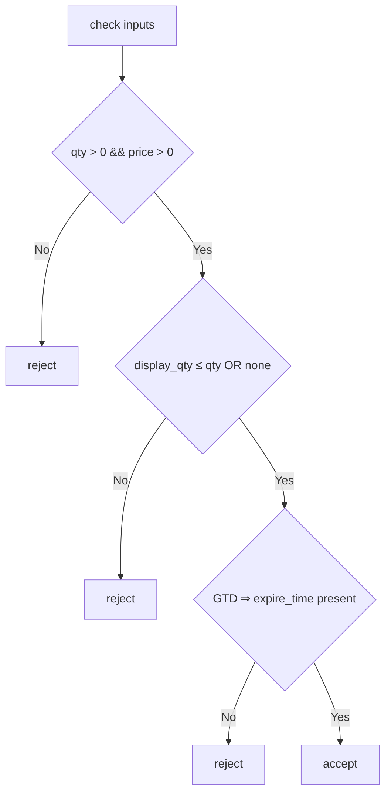

> **TL;DR** – PR [#2577](https://github.com/nautechsystems/nautilus_trader/pull/2577) introduces a _fallible_ constructor, complete domain-level checks, and four focussed tests for `MarketIfTouchedOrder`, thereby closing long-standing Issue [#2529](https://github.com/nautechsystems/nautilus_trader/issues/2529) on order-validation consistency.

---

## 1 Background

`MarketIfTouchedOrder` (MIT) is effectively the _reverse_ of a stop-market order: it lies dormant until price **touches** a trigger, then fires as an _immediate_ market order.  
Because a latent trigger feeds straight into an instant fill path, **robust validation is non-negotiable**—any silent mismatch becomes a live trade.

---

## 2 Why the Change Was Necessary

| Problem                                                                   | Impact                                                                |
| ------------------------------------------------------------------------- | --------------------------------------------------------------------- |
| _Partial_ positivity checks on `quantity`, `trigger_price`, `display_qty` | Invalid values propagated deep into matching engines before exploding |
| `TimeInForce::Gtd` accepted `expire_time = None`                          | Programmer thought they had “good-til-date”; engine treated it as GTC |
| No check that `display_qty ≤ quantity`                                    | Iceberg slice could exceed total size, leaking full inventory         |
| Legacy `new` API only **panicked**                                        | Call-site couldn’t surface errors cleanly                             |

Issue [#2529](https://github.com/nautechsystems/nautilus_trader/issues/2529) demanded uniform, fail-fast checks across _all_ order types; MIT was first in line.

---

## 3 What PR #2577 Delivers

| Area              | Before (`v0`)          | After (`v1`)                                                             |
| ----------------- | ---------------------- | ------------------------------------------------------------------------ |
| Constructor       | `new` → panic on error | `new_checked` → `anyhow::Result<Self>`; `new` now wraps it               |
| Positivity checks | Partial                | **Guaranteed** for `quantity`, `trigger_price`, (optional) `display_qty` |
| GTD orders        | `expire_time` optional | **Required** when `TIF == GTD`                                           |
| Iceberg rule      | None                   | `display_qty ≤ quantity`                                                 |
| Error channel     | Opaque panics          | Precise `anyhow::Error` variants                                         |
| Tests             | 0                      | 4 rstest cases _(happy-path + 3 failure modes)_                          |

**Diff stats:** +159 / −13 – one file `crates/model/src/orders/market_if_touched.rs`.

---

## 4 File Walkthrough Highlights

1. **`new_checked`** – all domain guards live here; returns `Result`.
2. **Guard helpers** – re-uses `check_positive_quantity`, `check_positive_price`, `check_predicate_false`.
3. **Legacy compatibility** – `new()` simply calls `Self::new_checked(...).expect(FAILED)`.
4. **`apply()` tweak** – slippage is recomputed immediately after a fill event.
5. **Tests** – `ok`, `quantity_zero`, `gtd_without_expire`, `display_qty_gt_quantity`.

---

## 6 Order-Lifecycle Diagram



---

## 7 Using the New API

```rust
let mit = MarketIfTouchedOrder::new_checked(
    trader_id,
    strategy_id,
    instrument_id,
    client_order_id,
    OrderSide::Sell,
    qty,
    trigger_price,
    TriggerType::LastPrice,
    TimeInForce::Gtc,
    None,          // expire_time
    false, false,  // reduce_only, quote_quantity
    None, None,    // display_qty, emulation_trigger
    None, None,    // trigger_instrument_id, contingency_type
    None, None,    // order_list_id, linked_order_ids
    None,          // parent_order_id
    None, None,    // exec_algorithm_id, params
    None,          // exec_spawn_id
    None,          // tags
    init_id,
    ts_init,
)?;
```

Prefer **`new_checked`** in production code; if you stick with `new`, you’ll still get clearer panic messages.

---

## 8 Impact & Next Steps

- **Fail-fast safety** – all invariants enforced _before_ the order leaves your code.
- **Granular error reporting** – propagate `Result` outward instead of catching panics.
- **Zero breaking changes** – legacy code continues to compile.

> **Action items:** migrate to `new_checked`, bubble the `Result`, and sleep better during live trading.

---

## 9 References

| Type               | Link                                                                                                                           |
| ------------------ | ------------------------------------------------------------------------------------------------------------------------------ |
| Pull Request #2577 | [https://github.com/nautechsystems/nautilus_trader/pull/2577](https://github.com/nautechsystems/nautilus_trader/pull/2577)     |
| Issue #2529        | [https://github.com/nautechsystems/nautilus_trader/issues/2529](https://github.com/nautechsystems/nautilus_trader/issues/2529) |

---

_Happy (and safer) trading!_

```

```
