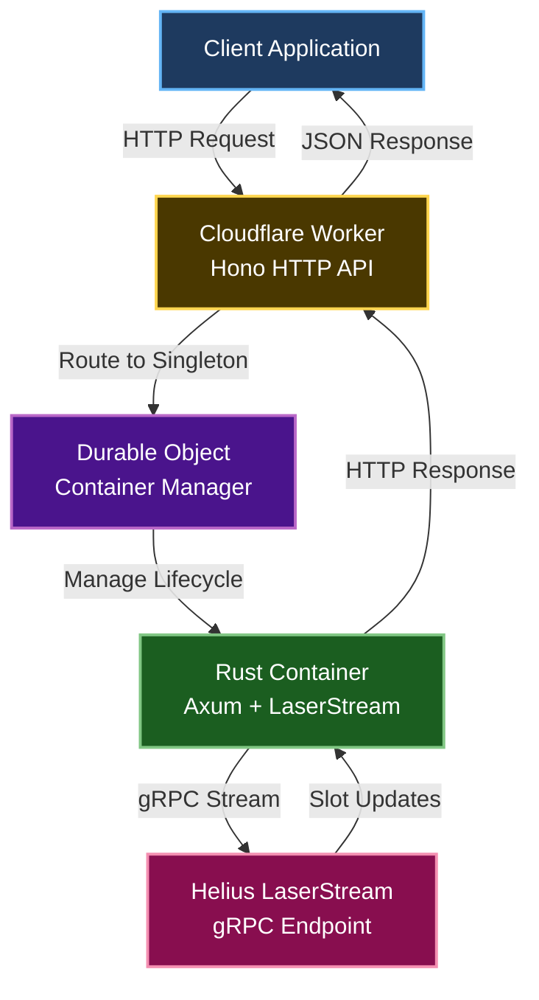

<!-- truncate -->

**TL;DR**: Deploy a production-ready real-time Solana slot streaming service using Helius LaserStream SDK on Cloudflare Containers.

- **Ultra-low latency**: Real-time slot updates via gRPC
- **Global edge deployment**: Cloudflare's global network
- **Auto-scaling**: Container lifecycle managed by Durable Objects
- **Production-ready**: Health checks, error handling, and observability

---

## Why LaserStream on Cloudflare?

Helius **LaserStream** provides ultra-low latency access to Solana data via gRPC streaming. Traditional WebSocket polling introduces delays; LaserStream eliminates this with direct gRPC connections to Helius nodes.

### Why Cloudflare Containers?

Traditional deployments require server provisioning, load balancing, and scaling. Cloudflare Containers solve this:

| Feature | Traditional VPS | Cloudflare Containers |
|---|---|---|
| **Global deployment** | Manual multi-region setup | Automatic edge deployment |
| **Scaling** | Manual or autoscaling groups | Auto-scaling via Durable Objects |
| **Cold start** | Always running (cost) | Sleep after inactivity |
| **gRPC support** | Yes | Yes (in Containers, not Workers) |
| **SSL/TLS** | Manual cert management | Automatic |
| **DDoS protection** | Additional service | Built-in |

### Architecture overview



**Key components**:

1. **Cloudflare Worker** (TypeScript/Hono): HTTP API layer, routing, health checks
2. **Durable Object**: Singleton manager for container lifecycle  
3. **Rust Container** (Axum): gRPC client for LaserStream, HTTP server for API
4. **Helius LaserStream**: Real-time Solana data via gRPC

---

## Project structure

```
laserstream-container/
├── src/
│   └── index.ts              # Worker (Hono API + Durable Object routing)
├── container_src/
│   ├── Cargo.toml            # Rust dependencies
│   └── src/
│       ├── main.rs           # Axum HTTP server
│       └── stream.rs         # LaserStream gRPC client
├── Dockerfile                # Multi-stage Rust build
├── wrangler.jsonc            # Cloudflare configuration
├── package.json              # Build and deployment scripts
└── tsconfig.json             # TypeScript configuration
```

---

## Prerequisites

Before deploying, ensure you have:

- **Cloudflare account** with Workers enabled
- **Helius API key** ([get one here](https://dev.helius.xyz/) - free tier available)
- **Docker Desktop** (for building container images)
- **Node.js 20+** and **pnpm**
- **Wrangler CLI** (`npm install -g wrangler`)

### Authenticate with Cloudflare

```bash
wrangler login
```

This opens a browser to authorize Wrangler with your Cloudflare account.

---

## Step 1: Worker implementation

The Worker provides the HTTP API layer and routes requests to the container.

### Install dependencies

```bash
pnpm install @cloudflare/containers hono
pnpm install -D typescript wrangler
```

### Worker code (`src/index.ts`)

```typescript
import { Container } from "@cloudflare/containers";
import { Hono } from "hono";

// Define the container class
export class LaserStreamContainer extends Container<Env> {
  defaultPort = 8080;
  sleepAfter = "2m"; // Sleep after 2 minutes of inactivity
  
  envVars = {
    HELIUS_API_KEY: "", // Set via wrangler secret
    LASERSTREAM_ENDPOINT: "https://laserstream-devnet-ewr.helius-rpc.com",
    RUST_LOG: "info",
  };

  override onStart() {
    console.log("LaserStream container started");
  }

  override onStop() {
    console.log("LaserStream container stopped");
  }

  override onError(error: unknown) {
    console.error("LaserStream container error:", error);
  }
}

// Create Hono app
const app = new Hono<{ Bindings: Env }>();

// Service information endpoint
app.get("/", (c) => {
  return c.text(
    "LaserStream on Cloudflare Containers\n\n" +
      "Endpoints:\n" +
      "GET  /health - Health check\n" +
      "POST /start - Start LaserStream subscription\n" +
      "GET  /latest - Get latest slot update\n"
  );
});

// Worker health check
app.get("/health", (c) => {
  return c.json({ 
    status: "ok", 
    timestamp: new Date().toISOString() 
  });
});

// Proxy all other requests to the singleton container
app.all("*", async (c) => {
  try {
    // Get singleton container by name
    const containerId = c.env.LASERSTREAM_CONTAINER.idFromName("laserstream-main");
    const container = c.env.LASERSTREAM_CONTAINER.get(containerId);
    
    // Forward request to container
    return await container.fetch(c.req.raw);
  } catch (error) {
    console.error("Container error:", error);
    return c.json(
      { error: "Container unavailable", details: String(error) },
      500
    );
  }
});

export default app;
```

### Key concepts

- **Durable Object singleton**: `idFromName("laserstream-main")` ensures only one container instance handles all requests
- **Sleep after inactivity**: Container sleeps after 2 minutes, saving costs
- **Error handling**: Graceful fallback if container is unavailable
- **Environment variables**: Container receives config via `envVars`

---

## Step 2: Rust container implementation

The Rust container runs the LaserStream gRPC client and exposes an HTTP API.

### Container dependencies (`container_src/Cargo.toml`)

```toml
[package]
name = "laserstream_container"
version = "0.1.0"
edition = "2021"

[dependencies]
anyhow = "1.0"
axum = "0.7"
chrono = { version = "0.4", features = ["serde"] }
futures-util = "0.3"
helius-laserstream = "0.1.5"
serde = { version = "1.0", features = ["derive"] }
tokio = { version = "1.49", features = ["full"] }
tracing = "0.1"
tracing-subscriber = { version = "0.3", features = ["env-filter"] }
```

### HTTP server (`container_src/src/main.rs`)

```rust
use std::{
    net::SocketAddr,
    sync::{
        atomic::{AtomicBool, Ordering},
        Arc,
    },
};

use axum::{
    extract::State,
    http::StatusCode,
    response::IntoResponse,
    routing::{get, post},
    Json, Router,
};
use serde::Serialize;
use tokio::sync::RwLock;
use tracing::{error, info};
use tracing_subscriber::EnvFilter;

mod stream;

#[derive(Clone)]
struct AppState {
    started: Arc<AtomicBool>,
    latest: Arc<RwLock<Option<LatestSlot>>>,
}

#[derive(Debug, Clone, Serialize)]
struct LatestSlot {
    slot: u64,
    parent: Option<u64>,
    status: String,
    created_at_rfc3339: Option<String>,
}

#[tokio::main]
async fn main() -> anyhow::Result<()> {
    // Initialize logging
    tracing_subscriber::fmt()
        .with_env_filter(EnvFilter::from_default_env())
        .init();

    let port: u16 = std::env::var("PORT")
        .unwrap_or_else(|_| "8080".to_string())
        .parse()?;

    let state = AppState {
        started: Arc::new(AtomicBool::new(false)),
        latest: Arc::new(RwLock::new(None)),
    };

    // Start stream on boot
    ensure_stream_started(state.clone()).await;

    // Define routes
    let app = Router::new()
        .route("/health", get(health))
        .route("/start", post(start))
        .route("/latest", get(latest))
        .with_state(state);

    let addr = SocketAddr::from(([0, 0, 0, 0], port));
    info!("listening on {}", addr);

    let listener = tokio::net::TcpListener::bind(addr).await?;
    axum::serve(listener, app).await?;

    Ok(())
}

async fn health() -> impl IntoResponse {
    (StatusCode::OK, "ok\n")
}

async fn start(State(state): State<AppState>) -> impl IntoResponse {
    ensure_stream_started(state).await;
    (StatusCode::OK, "started\n")
}

async fn latest(State(state): State<AppState>) -> impl IntoResponse {
    let guard = state.latest.read().await;
    match guard.as_ref() {
        Some(slot) => (StatusCode::OK, Json(slot.clone())),
        None => (
            StatusCode::NOT_FOUND,
            Json(LatestSlot {
                slot: 0,
                parent: None,
                status: "no data".to_string(),
                created_at_rfc3339: None,
            }),
        ),
    }
}

async fn ensure_stream_started(state: AppState) {
    if !state.started.swap(true, Ordering::SeqCst) {
        tokio::spawn(async move {
            if let Err(e) = stream::run_slot_stream(state.clone()).await {
                error!("Stream error: {}", e);
                state.started.store(false, Ordering::SeqCst);
            }
        });
    }
}
```

### LaserStream client (`container_src/src/stream.rs`)

```rust
use anyhow::{anyhow, Context};
use chrono::{DateTime, Utc};
use futures_util::StreamExt;
use tokio::pin;
use tracing::{info, warn};

use crate::{AppState, LatestSlot};
use helius_laserstream::{
    config::LaserstreamConfig,
    grpc::{subscribe_update::UpdateOneof, SubscribeRequest},
    client::subscribe,
};

pub async fn run_slot_stream(state: AppState) -> anyhow::Result<()> {
    let endpoint = std::env::var("LASERSTREAM_ENDPOINT")
        .context("LASERSTREAM_ENDPOINT is required")?;
    let api_key = std::env::var("HELIUS_API_KEY")
        .context("HELIUS_API_KEY is required")?;

    info!("connecting to LaserStream at {}", endpoint);

    let config = LaserstreamConfig {
        endpoint,
        x_token: Some(api_key),
    };

    let request = SubscribeRequest {
        slots: HashMap::new(),
        accounts: HashMap::new(),
        transactions: HashMap::new(),
        blocks: HashMap::new(),
        blocks_meta: HashMap::new(),
        entry: HashMap::new(),
        commitment: None,
        accounts_data_slice: vec![],
        ping: None,
    };

    let mut stream = subscribe(config, request).await?;
    pin!(stream);

    info!("LaserStream connected, waiting for updates...");

    while let Some(msg) = stream.next().await {
        match msg {
            Ok(update) => {
                if let Some(UpdateOneof::Slot(slot_update)) = update.update_oneof {
                    let created_at = slot_update
                        .created_at
                        .and_then(|ts| {
                            DateTime::from_timestamp(ts.seconds, ts.nanos as u32)
                        })
                        .map(|dt: DateTime<Utc>| dt.to_rfc3339());

                    let latest = LatestSlot {
                        slot: slot_update.slot,
                        parent: Some(slot_update.parent),
                        status: format!("{:?}", slot_update.status),
                        created_at_rfc3339: created_at,
                    };

                    *state.latest.write().await = Some(latest.clone());
                    info!("slot update: {:?}", latest);
                }
            }
            Err(e) => {
                warn!("stream error: {}", e);
                return Err(anyhow!("stream error: {}", e));
            }
        }
    }

    Ok(())
}
```

---

## Step 3: Dockerfile

Build the Rust container with a multi-stage Dockerfile for minimal image size.

```dockerfile
# syntax=docker/dockerfile:1

FROM rust:1.83-slim AS build

WORKDIR /app

# Install build dependencies
RUN apt-get update && apt-get install -y \
    pkg-config \
    libssl-dev \
    protobuf-compiler \
    build-essential \
    g++ \
    && rm -rf /var/lib/apt/lists/*

# Copy Rust source
COPY container_src/Cargo.toml ./
COPY container_src/src ./src

# Build release binary
RUN cargo build --release

# Runtime image
FROM debian:bookworm-slim
RUN apt-get update && \
    apt-get install -y ca-certificates libssl3 && \
    rm -rf /var/lib/apt/lists/*

COPY --from=build /app/target/release/laserstream_container /laserstream_container
EXPOSE 8080

CMD ["/laserstream_container"]
```

### Build optimizations

- **Multi-stage build**: Build stage uses full Rust toolchain, runtime uses minimal Debian
- **Dependency caching**: Cargo dependencies cached in Docker layers
- **Release build**: Optimized binary with `--release`
- **Minimal runtime**: Only ca-certificates and libssl3 in final image

---

## Step 4: Wrangler configuration

Configure the Worker and Container deployment.

### `wrangler.jsonc`

```jsonc
{
  "$schema": "node_modules/wrangler/config-schema.json",
  "name": "laserstream-container",
  "main": "src/index.ts",
  "compatibility_date": "2025-01-08",
  "compatibility_flags": ["nodejs_compat"],
  
  "observability": {
    "enabled": true
  },
  
  "containers": [
    {
      "class_name": "LaserStreamContainer",
      "image": "registry.cloudflare.com/<ACCOUNT_ID>/laserstream-container-rust:v1.0.0",
      "max_instances": 10
    }
  ],
  
  "durable_objects": {
    "bindings": [
      {
        "class_name": "LaserStreamContainer",
        "name": "LASERSTREAM_CONTAINER"
      }
    ]
  },
  
  "migrations": [
    {
      "new_sqlite_classes": ["LaserStreamContainer"],
      "tag": "v1"
    }
  ],
  
  "vars": {
    "LASERSTREAM_ENDPOINT": "https://laserstream-devnet-ewr.helius-rpc.com"
  }
}
```

**Replace** `<ACCOUNT_ID>` with your Cloudflare account ID (find it in the Cloudflare dashboard).

### Configuration explained

- **compatibility_date**: API version for Workers runtime
- **containers**: Container image registry path and scaling settings
- **durable_objects**: Singleton container manager binding
- **migrations**: Database schema for Durable Objects
- **vars**: Environment variables (non-sensitive)

---

## Step 5: Build and deploy

### Build scripts (`package.json`)

```json
{
  "name": "laserstream-container",
  "version": "1.0.0",
  "scripts": {
    "build": "tsc && cargo build --release --manifest-path=container_src/Cargo.toml",
    "build:container": "wrangler containers build . --tag laserstream-container-rust:latest",
    "push:container": "wrangler containers push laserstream-container-rust:latest",
    "deploy": "wrangler deploy",
    "dev": "wrangler dev",
    "tail": "wrangler tail",
    "secret:set": "wrangler secret put"
  },
  "dependencies": {
    "@cloudflare/containers": "^0.0.21",
    "hono": "4.11.1"
  },
  "devDependencies": {
    "@types/node": "^25.0.3",
    "typescript": "5.9.3",
    "wrangler": "4.58.0"
  }
}
```

### Build the container image

```bash
# Build Rust container locally
pnpm run build:container

# Tag with version
docker tag laserstream-container-rust:latest laserstream-container-rust:v1.0.0

# Push to Cloudflare registry
pnpm run push:container
```

**Expected output**:

```
Building container image...
Successfully tagged laserstream-container-rust:latest
Pushing to registry.cloudflare.com/...
Image pushed successfully
Digest: sha256:59c03a69b057...
```

### Set secrets

Before deploying, set the Helius API key:

```bash
echo "YOUR_HELIUS_API_KEY" | pnpm run secret:set HELIUS_API_KEY
```

Alternatively, use interactive mode:

```bash
pnpm run secret:set HELIUS_API_KEY
# Paste your API key when prompted
```

### Deploy to Cloudflare

```bash
pnpm run deploy
```

**Expected output**:

```
Uploading Worker...
Published laserstream-container (0.42 sec)
  https://laserstream-container.<your-subdomain>.workers.dev
```

---

## Step 6: Testing the deployment

### Health check

```bash
curl https://laserstream-container.<your-subdomain>.workers.dev/health
```

**Expected response**:

```json
{
  "status": "ok",
  "timestamp": "2025-01-09T12:34:56.789Z"
}
```

### Start LaserStream

```bash
curl -X POST https://laserstream-container.<your-subdomain>.workers.dev/start
```

**Expected response**:

```
started
```

### Get latest slot update

```bash
curl https://laserstream-container.<your-subdomain>.workers.dev/latest
```

**Expected response**:

```json
{
  "slot": 285432167,
  "parent": 285432166,
  "status": "Confirmed",
  "created_at_rfc3339": "2025-01-09T12:35:01.234Z"
}
```

---

## Monitoring and debugging

### View live logs

```bash
pnpm run tail
```

**Expected output**:

```
2025-01-09T12:34:56.789Z INFO laserstream_container: listening on 0.0.0.0:8080
2025-01-09T12:35:01.234Z INFO laserstream_container: connecting to LaserStream at https://laserstream-devnet-ewr.helius-rpc.com
2025-01-09T12:35:02.456Z INFO laserstream_container: LaserStream connected, waiting for updates...
2025-01-09T12:35:03.678Z INFO laserstream_container: slot update: LatestSlot { slot: 285432167, ... }
```

### Common issues

#### "Missing or invalid API key"

**Cause**: `HELIUS_API_KEY` secret not set or incorrect.

**Fix**:

```bash
# Verify secret is set
wrangler secret list

# Re-set if missing
echo "YOUR_KEY" | pnpm run secret:set HELIUS_API_KEY

# Redeploy
pnpm run deploy
```

#### Container not starting

**Cause**: Docker image not pushed or incorrect registry path.

**Fix**:

```bash
# Verify image exists
docker images | grep laserstream

# Rebuild and push
pnpm run build:container
pnpm run push:container
pnpm run deploy
```

#### "Container unavailable" errors

**Cause**: Container sleeping or crashed.

**Fix**:

```bash
# Check logs
pnpm run tail

# Restart container
curl -X POST https://<your-url>/start
```

---

## Production considerations

### Scaling and costs

- **Cold starts**: First request after sleep takes ~2-5 seconds to spin up container
- **Warm instances**: Subsequent requests are instant while container is active
- **Sleep after**: Configure `sleepAfter` based on request frequency
- **Max instances**: Set `max_instances` based on expected load

### Cost optimization

```typescript
export class LaserStreamContainer extends Container<Env> {
  sleepAfter = "5m"; // Sleep after 5 minutes for dev
  // sleepAfter = "30m"; // Sleep after 30 minutes for production
}
```

### Error handling

Add retry logic and circuit breakers:

```rust
// In stream.rs
pub async fn run_slot_stream(state: AppState) -> anyhow::Result<()> {
    let mut retry_count = 0;
    const MAX_RETRIES: u32 = 5;
    
    loop {
        match try_connect(&state).await {
            Ok(_) => {
                retry_count = 0; // Reset on success
            }
            Err(e) => {
                retry_count += 1;
                if retry_count >= MAX_RETRIES {
                    return Err(anyhow!("Max retries exceeded: {}", e));
                }
                let backoff = std::time::Duration::from_secs(2_u64.pow(retry_count));
                warn!("Retry {} after {:?}: {}", retry_count, backoff, e);
                tokio::time::sleep(backoff).await;
            }
        }
    }
}
```

### Multi-region deployment

For global low-latency access, use Cloudflare's automatic edge deployment:

```jsonc
{
  "placement": { "mode": "smart" }
}
```

This automatically routes requests to the nearest Cloudflare edge location.

### Security

1. **API key rotation**: Regularly rotate `HELIUS_API_KEY`
2. **Rate limiting**: Add rate limiting in Worker
3. **Authentication**: Add bearer tokens for production

```typescript
// In Worker
app.use("*", async (c, next) => {
  const token = c.req.header("Authorization");
  if (!token || token !== `Bearer ${c.env.API_SECRET}`) {
    return c.json({ error: "Unauthorized" }, 401);
  }
  await next();
});
```

---

## Integration examples

### Polling from a trading bot

```typescript
// jupiter-laserstream-bot/src/poller.ts
import { setInterval } from "timers/promises";

const CONTAINER_URL = "https://laserstream-container.<subdomain>.workers.dev";

async function pollLatestSlot() {
  const response = await fetch(`${CONTAINER_URL}/latest`);
  const data = await response.json();
  
  console.log(`Latest slot: ${data.slot}`);
  
  // Trigger trading logic
  await handleSlotUpdate(data);
}

// Poll every 2 seconds
for await (const _ of setInterval(2000)) {
  await pollLatestSlot();
}
```

### WebSocket broadcasting

Convert HTTP polling to WebSocket for browser clients:

```typescript
// websocket-bridge.ts
import { WebSocketServer } from "ws";

const wss = new WebSocketServer({ port: 8080 });
const CONTAINER_URL = "https://laserstream-container.<subdomain>.workers.dev";

wss.on("connection", (ws) => {
  const interval = setInterval(async () => {
    const response = await fetch(`${CONTAINER_URL}/latest`);
    const data = await response.json();
    ws.send(JSON.stringify(data));
  }, 1000);
  
  ws.on("close", () => clearInterval(interval));
});
```

---

## Comparison with alternatives

| Approach | Latency | Cost | Complexity | Scalability |
|---|---|---|---|---|
| **WebSocket polling** | ~500ms | Low | Low | Manual |
| **Traditional VPS** | ~100ms | Medium | High | Manual |
| **LaserStream + Cloudflare** | ~50ms | Low (pay-per-use) | Medium | Automatic |
| **Direct gRPC** | ~30ms | Medium | High | Manual |

### When to use this approach

✅ **Use Cloudflare Containers when**:

- You need global low-latency access
- You want automatic scaling
- You prefer pay-per-use pricing
- You need DDoS protection

❌ **Use traditional VPS when**:

- You need full control over infrastructure
- You have consistent high traffic (24/7)
- You need specialized networking configurations

---

## Conclusion

Deploying LaserStream on Cloudflare Containers provides a production-ready solution for real-time Solana data streaming with:

- **Global edge deployment**: Automatic routing to nearest edge location
- **Auto-scaling**: Container lifecycle managed by Durable Objects
- **Cost efficiency**: Pay only for active container time
- **Developer experience**: Simple deployment with Wrangler CLI

The combination of Helius LaserStream's ultra-low latency gRPC streaming and Cloudflare's global network creates a powerful platform for building real-time Solana applications.

### Next steps

- **Add caching**: Cache slot updates in Durable Object storage
- **Add metrics**: Integrate with Cloudflare Analytics
- **Add filtering**: Filter specific accounts or programs
- **Add historical replay**: Use LaserStream's historical slot replay (up to 3000 slots)

### Resources

- [Helius LaserStream Docs](https://docs.helius.dev/laserstream/laserstream-overview)
- [Cloudflare Containers Docs](https://developers.cloudflare.com/containers/)
- [Cloudflare Workers Docs](https://developers.cloudflare.com/workers/)
- [Wrangler CLI Reference](https://developers.cloudflare.com/workers/wrangler/)
- [Example repository](https://github.com/nicolad/solana-trading-apps/tree/main/laserstream-container)
