## Building LLM systems you can measure, monitor, and improve

Large language models feel like software, but they don’t behave like software.

With conventional programs, behavior is mostly deterministic: if tests pass, you ship, and nothing changes until you change the code. With LLM systems, behavior can drift without touching a line—model updates, prompt edits, temperature changes, tool availability, retrieval results, context truncation, and shifts in real-world inputs all move the output distribution.

So “it seems to work” isn’t a strategy. **Evals** are how you turn an LLM feature from a demo into an engineered system you can:

* **Measure** (quantify quality across dimensions)
* **Monitor** (detect drift and regressions early)
* **Improve** (pinpoint failure modes and iterate)

This doc builds evals from first principles and anchors everything in a concrete example: a workflow that classifies job postings as **Remote EU** (or not), outputs a structured JSON contract, and attaches multiple scorers (deterministic + LLM-as-judge) to generate reliable evaluation signals.

---

## 1) The core idea: make quality observable

An eval is a function:

> **Eval(input, output, context?, ground_truth?) → score + reason + metadata**

A single scalar score is rarely enough. You want:

* **Score**: for trendlines, comparisons, and gating
* **Reason**: for debugging and iteration
* **Metadata**: to reproduce and slice results (model version, prompt version, retrieval config, toolset, sampling rate, time)

When you do this consistently, evals become the LLM equivalent of:

* unit tests + integration tests,
* observability (logs/metrics/traces),
* QA plus post-release monitoring.

---

## 2) “Correct” is multi-dimensional

In LLM systems, quality is a **vector**.

Even if the final label is right, the output can still be unacceptable if:

* it invents support in the explanation (**hallucination**),
* it violates the rubric (**misalignment**),
* it fails formatting constraints (**schema noncompliance**),
* it’s unhelpful or vague (**low completeness**),
* it includes unsafe content (**safety**).

So you don’t build *one eval*. You build a **panel of scorers** that measure different axes.

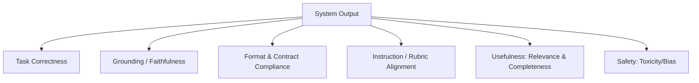

---

## 3) Deterministic vs model-judged evals

### 3.1 Deterministic evals (cheap, stable, strict)

No model involved. Examples:

* schema validation
* required fields present (e.g., `reason` non-empty)
* bounds checks (confidence ∈ \{low, medium, high\})
* regex checks (must not include disallowed fields)

**Strengths:** fast, repeatable, low variance
**Limitations:** shallow; can’t grade nuance like “is this reason actually supported?”

### 3.2 LLM-as-judge evals (powerful, fuzzy, variable)

Use a second model (the judge) to grade output against a rubric and evidence.

**Strengths:** can evaluate nuanced properties like grounding, rubric adherence, and relevance
**Limitations:** cost/latency, judge variance, judge drift, and susceptibility to prompt hacking if unconstrained

In production, the winning pattern is:
**deterministic guardrails + rubric-based judge scoring + sampling**.

---

## 4) The “Remote EU” running example

### 4.1 Task

Input:

* `title`
* `location`
* `description`

Output contract:

```json
{
  "isRemoteEU": true,
  "confidence": "high",
  "reason": "Short evidence-based justification."
}
```

### 4.2 Why this is a great eval example

Job posts are full of ambiguous and misleading phrases:

* **“EMEA”** is not EU-only
* **“CET/CEST”** is a timezone, not eligibility
* **UK** is not in the EU
* **Switzerland/Norway** are in Europe but not EU
* **“Hybrid”** is not fully remote
* Multi-location lists can mix EU and non-EU constraints

This creates exactly the kind of environment where “vibes” fail and measurement matters.

---

## 5) Workflow-first evaluation architecture

A practical production architecture separates:

* **serving** (fast path that returns a result),
* **measurement** (scoring and diagnostics, often sampled).

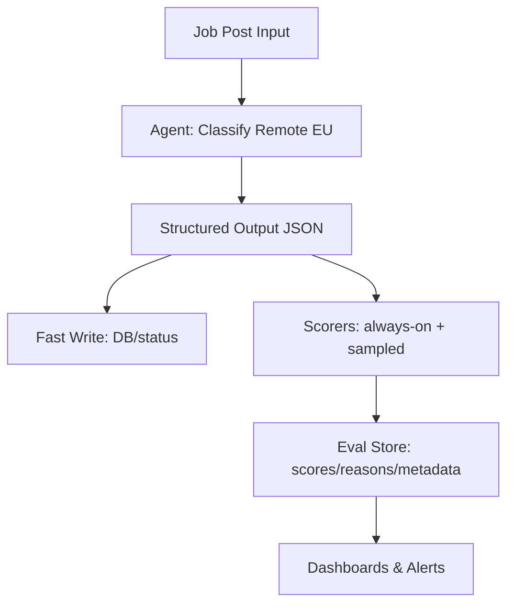

### Why this split matters

If your most expensive scorers run inline on every request, your feature inherits their cost and latency. A workflow-first approach gives you options:

* always-on “must-have” scoring,
* sampled deep diagnostics,
* offline golden-set evaluation in CI.

---

## 6) Contracts make evaluation reliable: rubric + schema

### 6.1 Rubric is the spec

If you can’t state what “correct” means, you can’t measure it consistently.

Your rubric should define:

* positive criteria (what qualifies),
* explicit negatives (what disqualifies),
* ambiguous cases and how to resolve them,
* precedence rules (what overrides what).

### 6.2 Schema is the contract

Structured output makes evaluation composable:

* score `isRemoteEU` separately from `reason`,
* validate confidence vocabulary,
* enforce required fields deterministically.

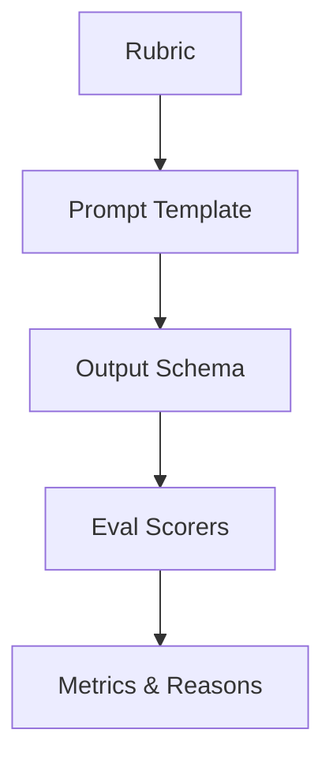

---

## 7) Design the scorer suite as a “sensor panel”

A robust suite typically includes:

### 7.1 Always-on core

* **Domain correctness judge** (rubric-based)
* **Deterministic sanity** (schema + `hasReason`)
* Optionally: lightweight grounding check (if user-facing)

### 7.2 Sampled diagnostics

* **Faithfulness / hallucination** (judge-based)
* **Prompt alignment**
* **Answer relevancy**
* **Completeness / keyword coverage** (careful: can be gamed)

### 7.3 Low-rate tail-risk

* **Toxicity**
* **Bias**
* (Domain-dependent) policy checks

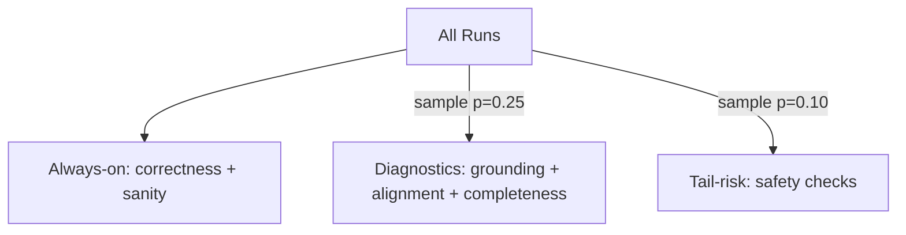

---

## 8) The anchor metric: domain correctness as a strict judge

Generic “relevance” is not enough. You need:

> “Is `isRemoteEU` correct under **this rubric** for **this job text**?”

### 8.1 What a good judge returns

A strong judge returns structured, actionable feedback:

* `score` ∈ [0, 1]
* `isCorrect` boolean
* `mainIssues[]` (typed failure modes)
* `reasoning` (short justification)
* optional `evidenceQuotes[]` (snippets that support the judgment)

### 8.2 The “use only evidence” constraint

The most important instruction to judges:

> Use ONLY the job text + rubric. Do not infer missing facts.

Without this, your judge will “helpfully” hallucinate implied constraints, and your metric becomes untrustworthy.

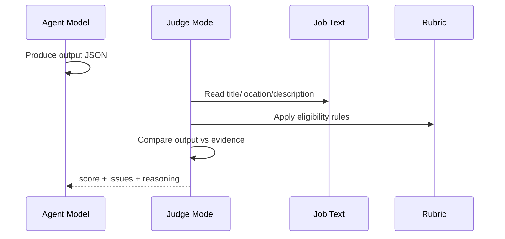

---

## 9) Deterministic sanity checks: tiny effort, huge payoff

Even with a schema, add simple checks:

* `reason.trim().length > 0`
* confidence in an allowed set
* optional length bounds for `reason` (prevents rambling)

These are cheap, stable, and catch silent regressions early.

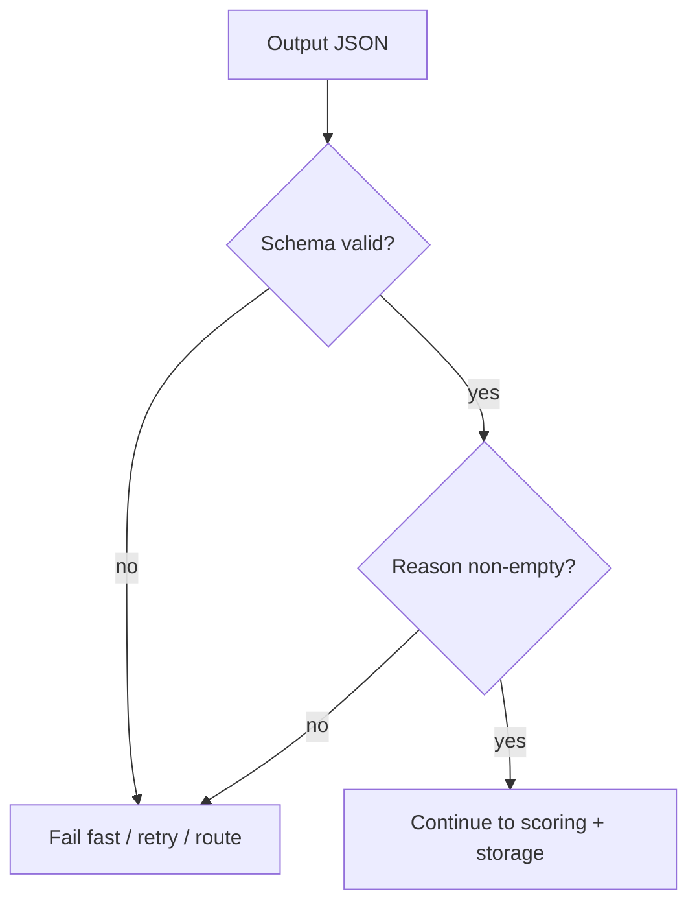

---

## 10) Grounding: the trust layer

In many real products, the worst failure is not “wrong label.”
It’s **unsupported justification**.

A model can guess the right label but invent a reason. Users trust the reason more than the label. When the reason lies, trust is gone.

Useful grounding dimensions:

* **Faithfulness**: does the reason match the job text?
* **Non-hallucination**: does it avoid adding unsupported claims?
* **Context relevance**: does it actually use provided context?

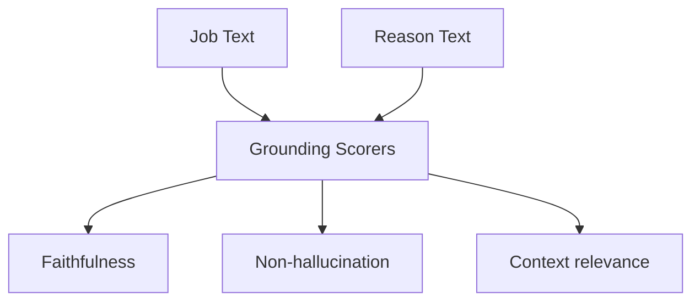

### Normalize score direction

If a scorer returns “lower is better” (hallucination/toxicity), invert it so **higher is always better**:

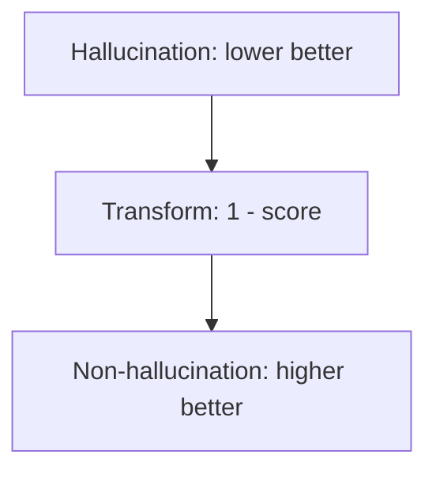

This prevents endless mistakes in dashboards and thresholds.

---

## 11) Aggregation: how many metrics become decisions

You typically want three layers:

### 11.1 Hard gates (binary invariants)

Examples:

* schema valid
* hasReason = 1
* correctness score ≥ threshold
* non-hallucination ≥ threshold (if user-facing)

### 11.2 Soft composite score (trend tracking)

A weighted score helps compare versions, but should not hide hard failures.

### 11.3 Diagnostics (why it failed)

Store `mainIssues[]` and judge reasons so you can cluster and fix.

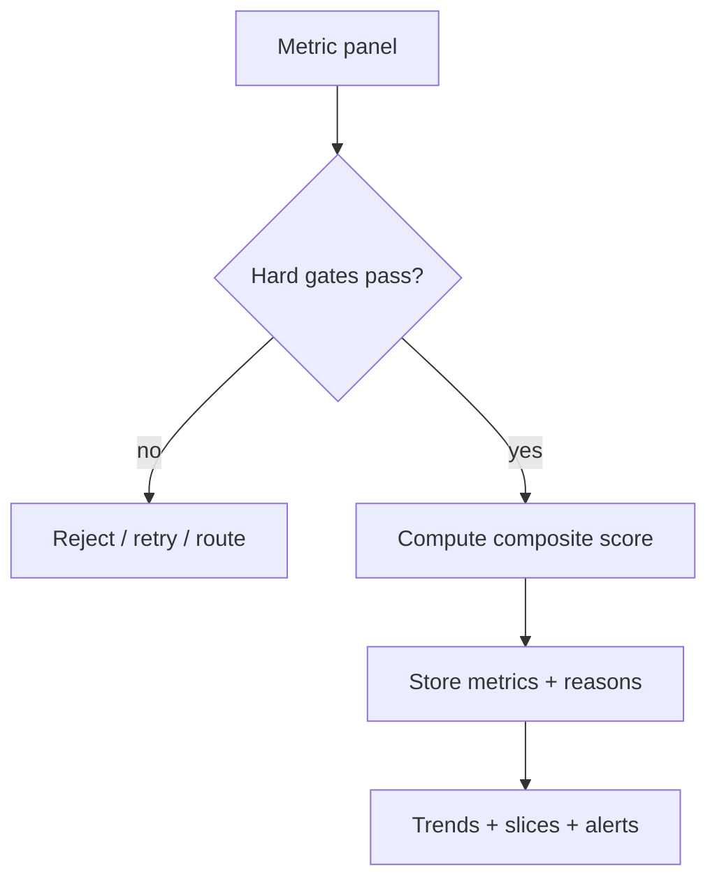

---

## 12) Slicing: where the real insight lives

A single global average is rarely useful. You want to slice by meaningful features:

For Remote EU:

* contains “EMEA”
* contains “CET/CEST”
* mentions UK
* mentions hybrid/on-site
* mentions “Europe” (ambiguous)
* multi-location list present
* mentions “EU work authorization”

This turns “accuracy dropped” into “accuracy dropped specifically on CET-only job posts.”

---

## 13) The Remote EU rubric as a decision tree

A rubric becomes much easier to debug when you can visualize precedence rules.

Here’s an example decision tree (adapt to your policy):

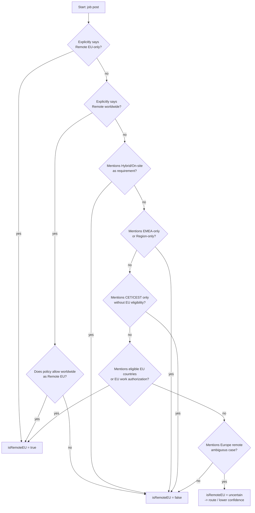

This makes edge cases explicit and makes judge behavior easier to audit.

---

## 14) Sampling strategy: cost-aware measurement

A practical scoring policy:

* **Always-on**: correctness + sanity
* **25% sampled**: grounding + alignment + completeness
* **10% sampled**: safety canaries
* **0%**: tool-call accuracy until you actually use tools

This gives you statistical visibility with bounded cost.

If you want deeper rigor:

* increase sampling on releases,
* reduce sampling during stable periods,
* bias sampling toward risky slices (e.g., posts containing “EMEA” or “CET”).

---

## 15) Calibration: make “confidence” mean something

If you output `confidence: high|medium|low`, treat it as a measurable claim.

Track:

* P(correct | high)
* P(correct | medium)
* P(correct | low)

A healthy confidence signal produces a separation like:

* high ≫ medium ≫ low

If “high” is only marginally better than “medium,” you’re emitting vibes, not confidence.

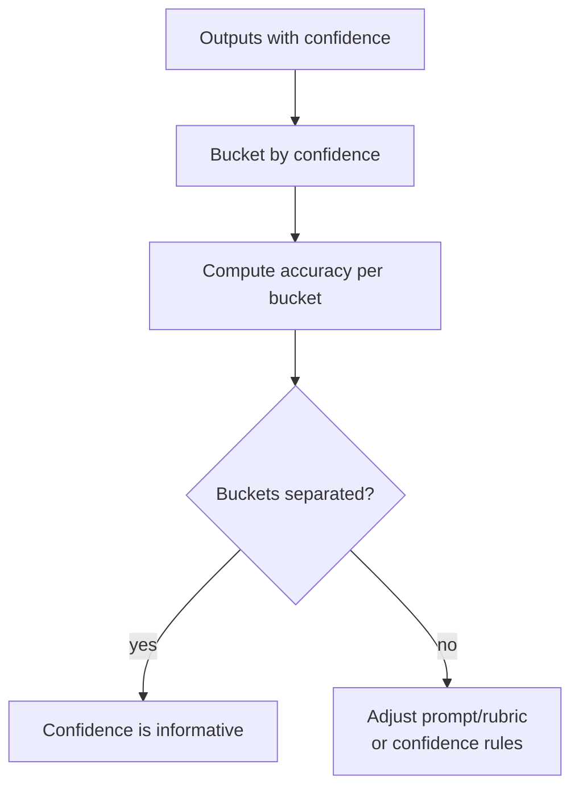

---

## 16) Turning evals into improvement: the feedback loop

Evals are not a report card. They’re a loop.

1. Collect runs + eval artifacts
2. Cluster failures by `mainIssues[]`
3. Fix prompt/rubric/routing/post-processing
4. Re-run evals (golden set + sampled prod)
5. Gate release based on regressions

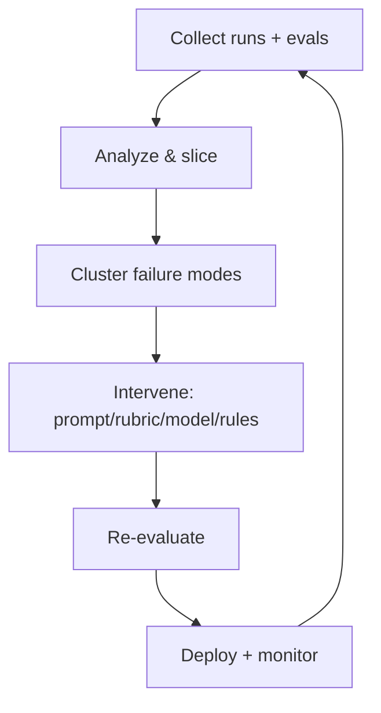

The key operational shift: you stop debating anecdotes and start shipping changes backed by measured deltas.

---

## 17) Golden sets: fast regression detection

A **golden set** is a curated collection of test cases representing:

* core behavior,
* common edge cases,
* historical failures.

Even 50–200 examples catch a shocking amount of regression.

For Remote EU, include cases mentioning:

* “Remote EU only”
* “Remote Europe” (ambiguous)
* “EMEA only”
* “CET/CEST only”
* UK-only
* Switzerland/Norway-only
* hybrid-only (single city)
* multi-location lists mixing EU and non-EU
* “EU work authorization required” without explicit countries

Run the golden set:

* on every prompt/model change (CI),
* nightly as a drift canary.

---

## 18) Judge reliability: making LLM-as-judge dependable

Judge scoring is powerful, but you must treat the judge prompt like production code.

### 18.1 Techniques that reduce variance

* force structured judge output (JSON schema)
* use a clear rubric with precedence rules
* include explicit negative examples
* constrain the judge: “use only provided evidence”
* keep judge temperature low
* store judge prompt version + rubric version

### 18.2 Disagreement as signal

If you run multiple judges or compare judge vs deterministic heuristics, disagreement highlights ambiguous cases worth:

* rubric refinement,
* targeted prompt updates,
* additional training data,
* routing policies.

---

## 19) Production gating patterns

Not every system should block on evals, but you can safely gate *high-risk* cases.

Common gates:

* schema invalid → retry
* correctness below threshold → rerun with stronger model or request clarification (if user-facing)
* low grounding score → regenerate explanation constrained to cite evidence
* confidence low → route or mark uncertain

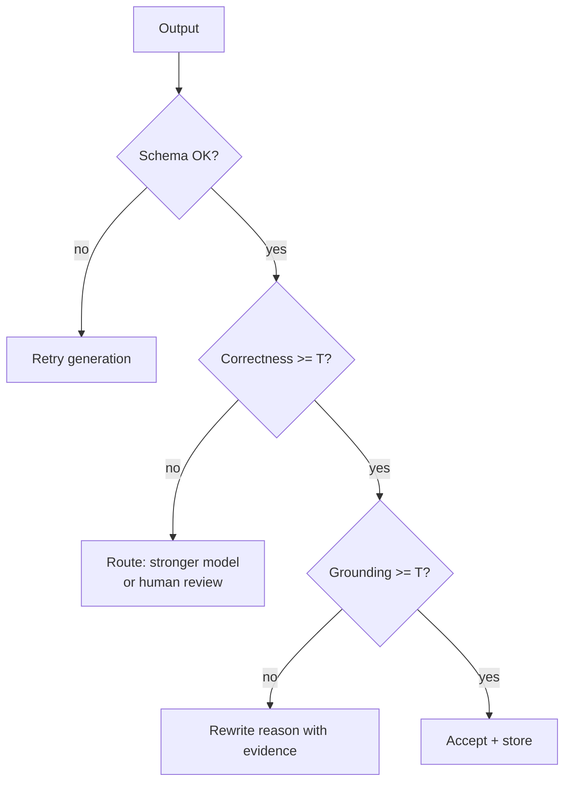

---

## 20) Beyond classifiers: evals for tool-using agents

Once your agent calls tools (search, databases, parsers, RAG), evals expand to include:

* **Tool selection correctness**: did it call tools when needed?
* **Argument correctness**: were tool parameters valid?
* **Faithful tool usage**: did the model use tool outputs correctly?
* **Over-calling**: did it waste calls?

This is where agentic systems often succeed or fail in production.

---

## 21) A practical checklist

### Spec & contracts

* [ ] Rubric defines positives, negatives, precedence, ambiguous cases
* [ ] Output schema enforced
* [ ] Prompt and rubric are versioned artifacts

### Scorers

* [ ] Always-on: correctness + sanity
* [ ] Sampled: grounding + alignment + completeness
* [ ] Low-rate: safety checks
* [ ] Scores normalized so higher is better

### Ops

* [ ] Metrics stored with reasons + metadata
* [ ] Slices defined for high-risk patterns
* [ ] Golden set exists and runs in CI/nightly
* [ ] Feedback loop ties evals directly to prompt/rubric/routing changes

---

## Closing

Without evals, you can demo. With evals, you can ship—and keep shipping.

A workflow-first pattern—**rubric + schema + domain correctness judge + grounding diagnostics + sampling + feedback loop**—turns an LLM from a “text generator” into an engineered system you can measure, monitor, and improve like any serious production service.

---

## Appendix: Reusable Mermaid snippets

### A) System architecture

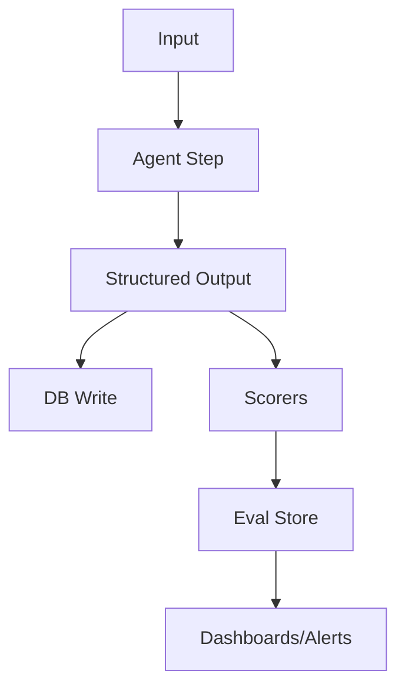

### B) Eval taxonomy

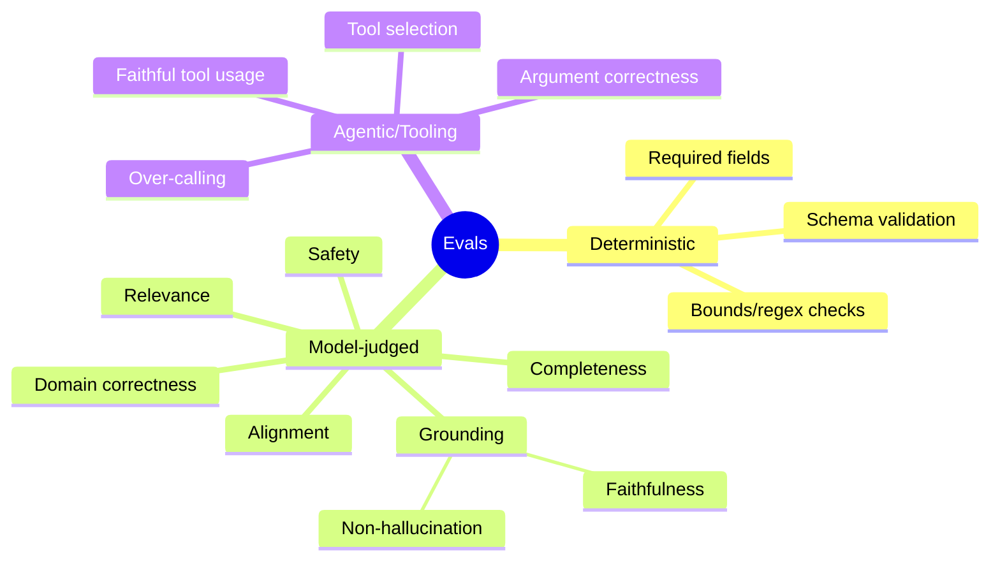

### C) Feedback loop

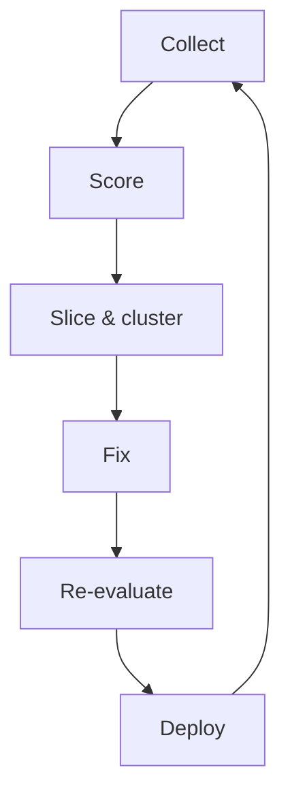
