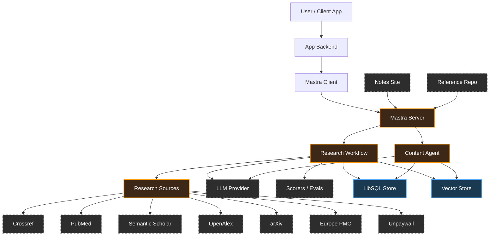
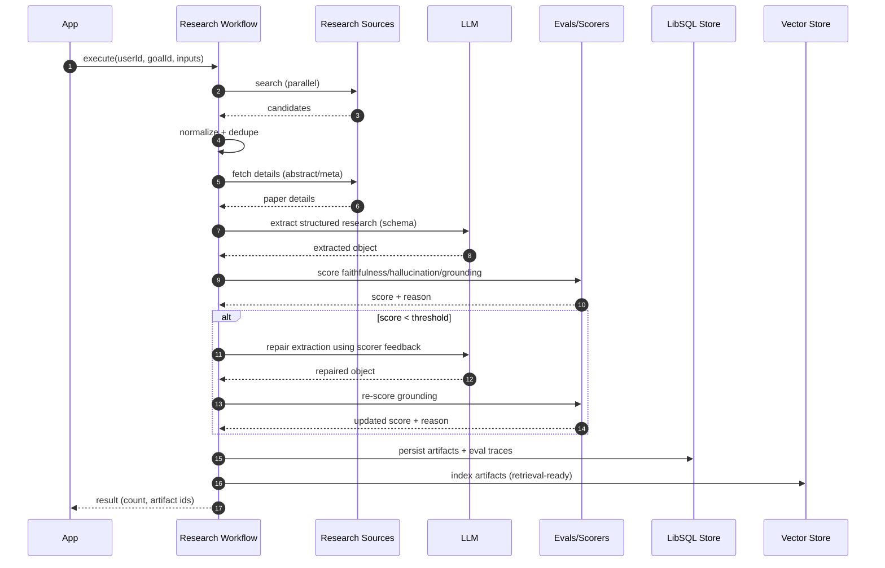
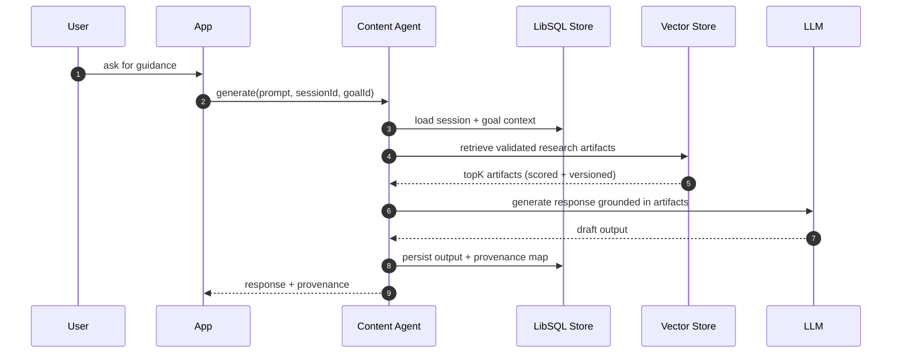
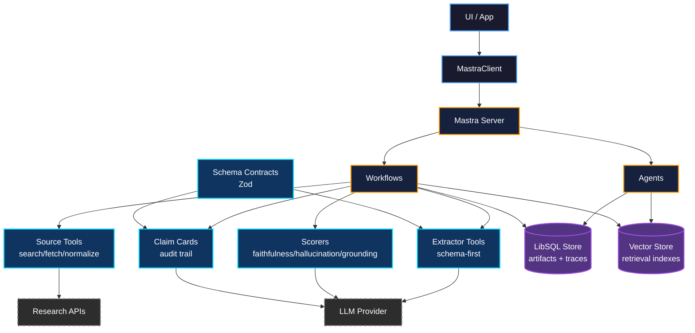
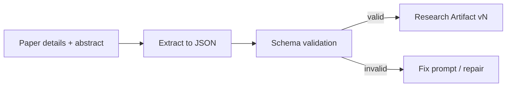
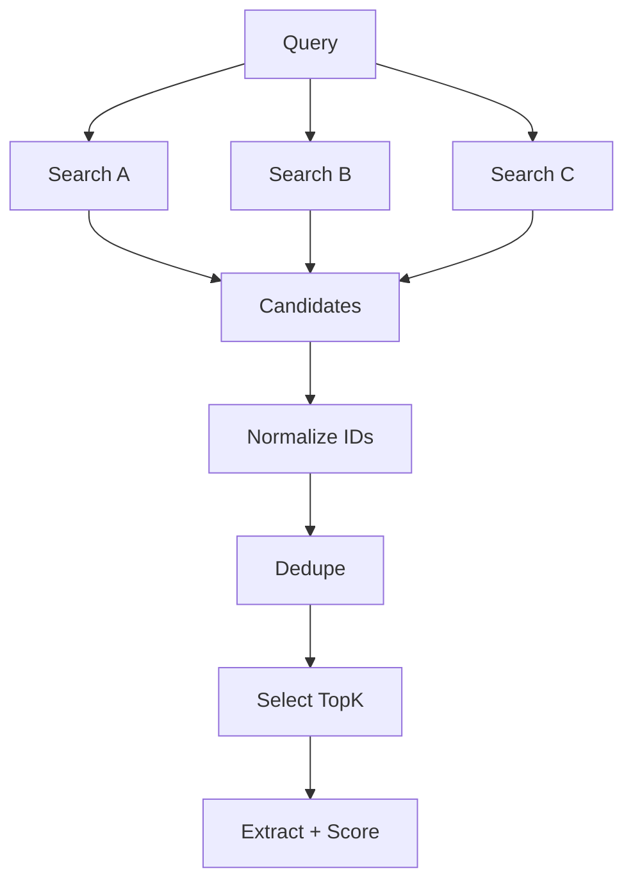
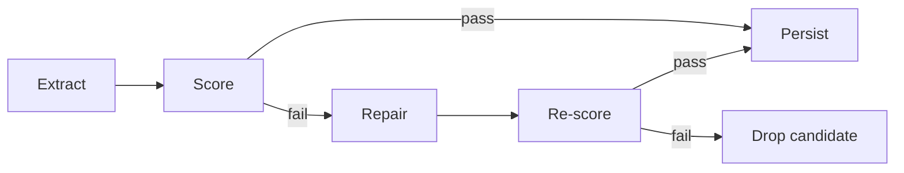
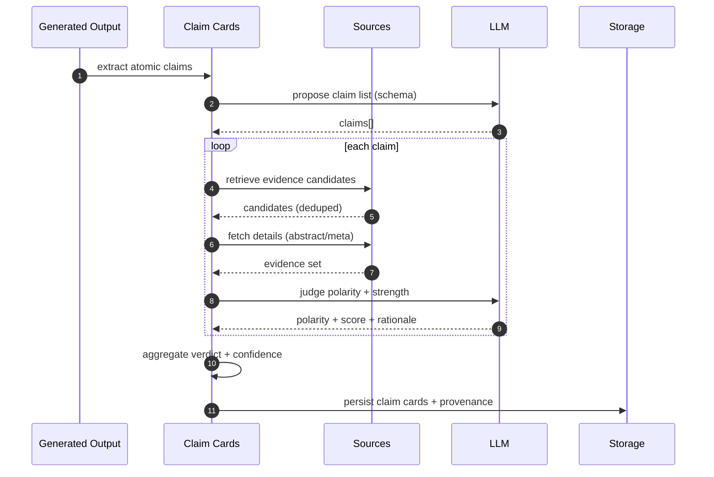
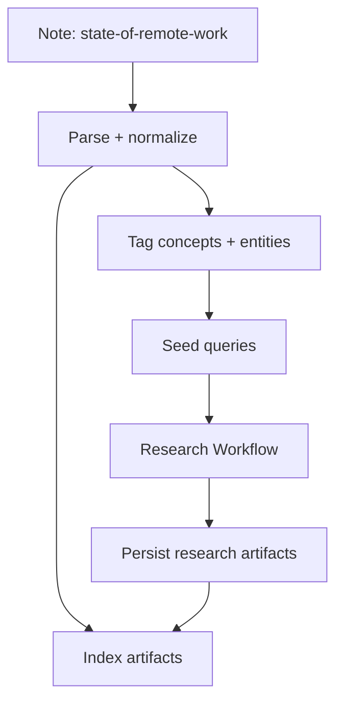

This article documents a production-grade architecture for generating **research-grounded therapeutic content**. The system prioritizes **verifiable artifacts** (papers → structured extracts → scored outputs → claim cards) over unstructured text.

You can treat this as a “trust pipeline”:
**retrieve → normalize → extract → score → repair → persist → generate**.
<!--truncate-->
---

## System map

**Core idea:** Mastra coordinates *agents* and *workflows*. The workflow produces **validated research artifacts**. The agent generates content from **those artifacts**, not from raw model guesses.

---

## Top-down runtime flows

### A) Research artifact production

**Flow:** App → Research Workflow → Sources → LLM → Eval Gates → Storage

**Steps:**

1. **Search & Retrieve** - Query multiple research sources in parallel
2. **Normalize** - Deduplicate and fetch full details
3. **Extract** - LLM generates structured data via schema
4. **Score** - Eval gates check faithfulness and grounding
5. **Repair** - If score fails, repair with feedback and re-score
6. **Persist** - Save validated artifacts with eval traces

### B) Content generation from validated artifacts

**Guarantees:**

* The agent retrieves **only accepted artifacts** (passed gates).
* Every output can attach provenance: `artifact_ids_used[]`, `scorer_versions`, `model_id`, `timestamp`.

---

## Architecture layers

---

## Why this pipeline works

### 1) Schema-first extraction creates controllable artifacts

You treat every extraction as a typed object with invariants:

* bounded arrays (`keyFindings` length constraints)
* numeric ranges (`relevanceScore`, `extractionConfidence`)
* explicit nullability for missing fields

This prevents “string soup” from leaking into persistence and makes evals deterministic.

### 2) Multi-source + dedupe optimizes coverage and spend

Retrieval stays cheap; judgment stays expensive. So you:

1. search multiple sources
2. normalize identity (DOI/title fingerprint)
3. dedupe
4. only then pay tokens for extraction + scoring

### 3) Eval gates + single repair pass keep trust high

You treat extraction as an untrusted build artifact:

* run tests (scorers)
* if failing: run a single repair step with feedback
* re-test
* persist only on pass

---

## Claim cards: auditable statement-level evidence

Claim cards attach evidence to atomic claims and preserve provenance.

**Operational outcome:** you can enforce product rules like:

* “insufficient evidence” → soften language + add uncertainty label
* “contradicted/mixed” → present tradeoffs or avoid recommendation

---

## Notes ingestion as first-class input

The system can treat a curated note (example: “state-of-remote-work”) as:

* an input context object (goal framing, assumptions, topic scope)
* a retrieval seed (keywords for paper search)
* an artifact to index for later retrieval

---

## Reference implementation

Use the “research-thera” repository as the canonical layout for:

* app runtime (client + server boundaries)
* persistence (LibSQL/Turso + migrations)
* research pipeline wiring (workflow steps + tools)
* artifact schema + eval traces + indexing strategy

The repo structure usually exposes these responsibilities clearly:

* `app/` and `src/` for runtime surfaces
* `schema/` and migrations tooling for storage contracts
* `scripts/` for ingestion/backfills
* cached HTTP responses for repeatable research runs (when enabled)

---

## URLs

* [https://researchthera.com/notes/state-of-remote-work](https://researchthera.com/notes/state-of-remote-work)
* [https://github.com/nicolad/research-thera](https://github.com/nicolad/research-thera)
