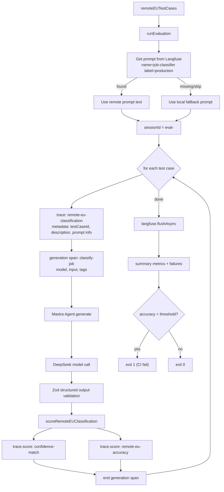
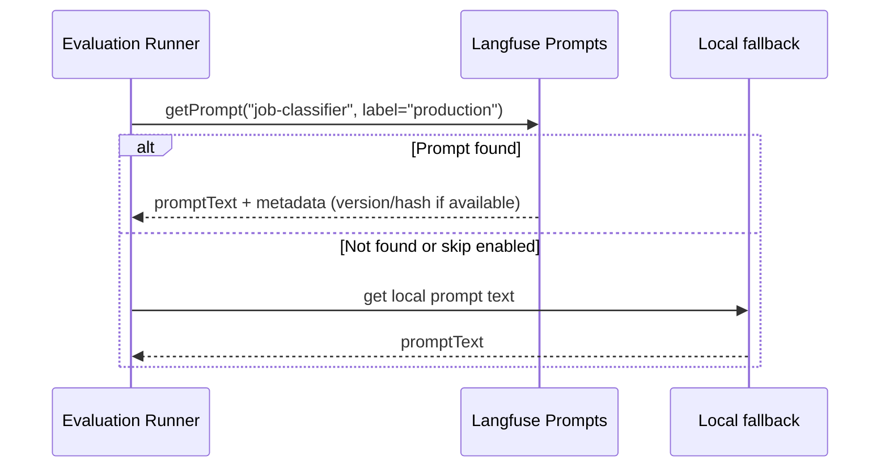
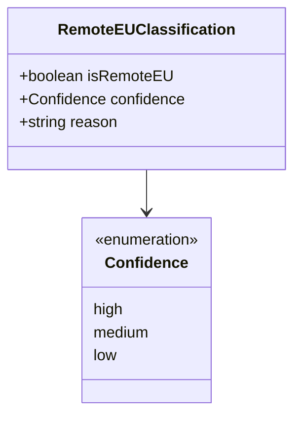
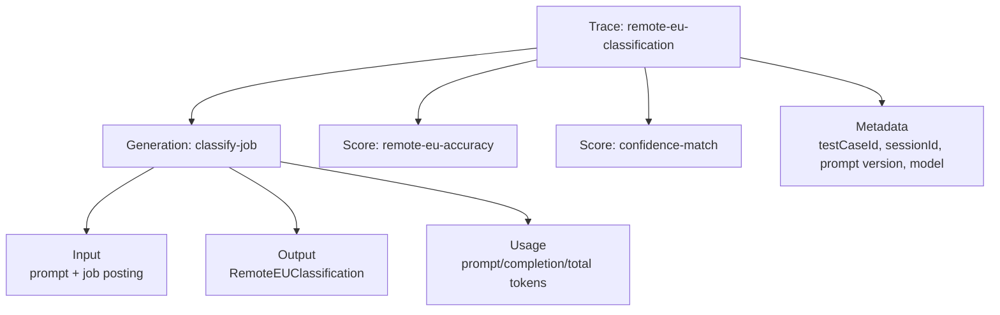
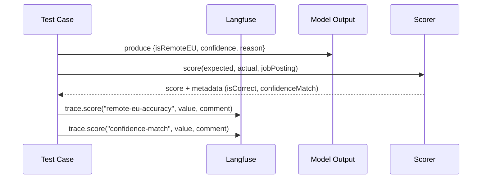
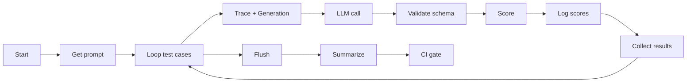
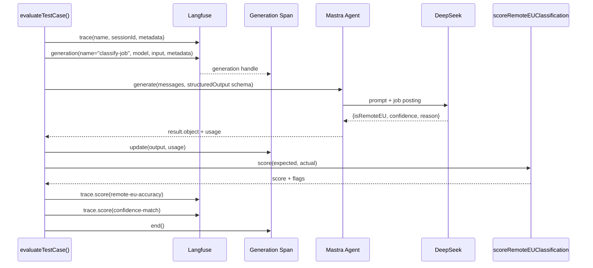
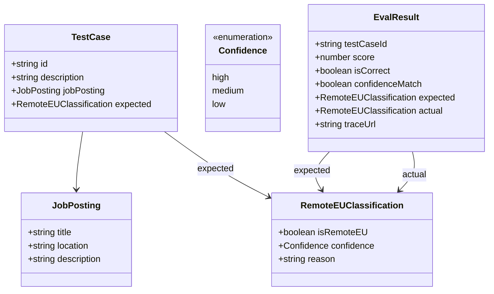
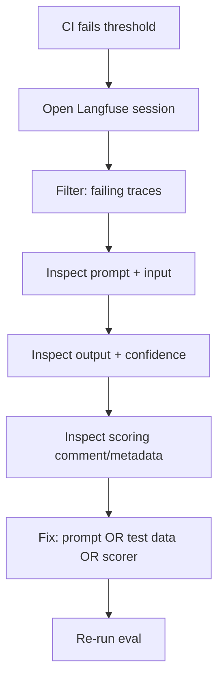

This article documents an evaluation harness for a **Remote EU job classifier**—but the real focus is **AI observability**: how to design traces, spans, metadata, scoring, and run-level grouping so you can *debug, compare, and govern* LLM behavior over time.

The script runs a batch of curated test cases, loads the latest production prompt from Langfuse (with a safe fallback), executes a structured LLM call, scores results, and publishes metrics back into Langfuse. That gives you:

- **Reproducibility** (prompt versions + test set + session IDs)
- **Debuggability** (one trace per test case; inspect inputs/outputs)
- **Comparability** (run-level aggregation; trend metrics across changes)
- **Operational safety** (flush guarantees, CI thresholds, rate-limit control)

---

## Why "observability-first" evals matter

A typical eval script prints `expected vs actual` and calls it a day. That's not enough once you:

- iterate prompts weekly,
- swap models,
- add guardrails,
- change schemas,
- tune scoring rubrics,
- and need to explain regressions to humans.

**Observability-first evals** answer questions like:

- *Which prompt version produced the regression?*
- *Is accuracy stable but confidence becoming overconfident?*
- *Are failures clustered by location phrasing ("EMEA", "EU timezone", "Worldwide")?*
- *Did we increase tokens/latency without improving correctness?*
- *Can we click from CI logs straight into the trace of the failing example?*

Langfuse becomes your "flight recorder": **the trace is the unit of truth** for what happened.

---

## End-to-end architecture



---

## Observability design: what gets traced and why

### Trace strategy: one trace per test case

**Principle:** if you can't click into an individual example, you can't debug.

Each test case produces a Langfuse **trace** (think "request-level unit"), tagged with:

- `sessionId`: groups a full run (critical for comparisons)
- `testCaseId`, `description`: anchors the trace to your dataset
- prompt metadata: name/label/version/hash (ideal)
- model metadata: provider, model name, parameters (ideal)

This makes failures navigable and filterable.

### Span strategy: one generation per model call

Inside each trace, you create a **generation span** for the model call:

- captures **input** (prompt + job posting)
- captures **output** (structured object + reason)
- captures **usage** (token counts)
- optionally captures **latency** (recommended)
- optionally captures **model params** (temperature, top_p, etc.)

Even if the script is "just evals," treat each example like production traffic. That's how you build a reliable debugging workflow.

---

## Prompt governance: Langfuse prompts + fallback behavior

Your harness fetches a prompt by name and label:

- name: `job-classifier`
- label: `production`

If prompt retrieval fails or is disabled (e.g., `SKIP_LANGFUSE_PROMPTS=true`), it uses a local fallback prompt.



### Observability tip: always record the *effective prompt identity*

To compare runs, you want "which exact prompt did this use?" in trace metadata. If your prompt fetch returns versioning info, store:

- `promptName`
- `promptLabel`
- `promptVersion` or `promptId` or `promptHash`

If it does *not* return version info, you can compute a stable hash of the prompt text and store that (lightweight, extremely useful).

---

## Structured output: Zod as an observability contract

The classifier returns:

- `isRemoteEU: boolean`
- `confidence: "high" | "medium" | "low"`
- `reason: string`



### Why structured output is observability, not just "parsing"

A strict schema:

- removes ambiguity ("was that JSON-ish text or valid data?")
- enables stable scoring and aggregation
- prevents downstream drift as prompts change
- improves triage because the *same fields* are always present

If you ever add fields like `region`, `countryHints`, `remotePolicy`, do it via schema extension and keep historical compatibility in your scorer.

---

## The full eval lifecycle as a trace model

This is what you want stored per test case:



When a case fails, you should be able to answer in one click:

- Which prompt version?
- What input text exactly?
- What output object exactly?
- What scoring decision and why?
- Was the model "confidently wrong"?

---

## Scoring and metrics: accuracy is necessary, insufficient

Your harness logs **two scores**:

1. **`remote-eu-accuracy`**
   A numeric score from your scorer. This can be binary (0/1) or continuous (0..1). Continuous is often better because it supports partial credit and more informative trend analysis.

2. **`confidence-match`**
   A binary score (1/0) tracking whether the model's confidence matches expected confidence.



### Observability tip: store scorer metadata as the comment (or trace metadata)

A score without context is hard to debug. For incorrect cases, write comments like:

- expected vs actual `isRemoteEU`
- expected vs actual `confidence`
- a short reason ("Predicted EU-only due to 'EMEA' but posting says US time zones")

Also consider storing structured metadata (if your Langfuse SDK supports it) so you can filter/group later.

---

## Run-level grouping: session IDs as your "eval run" primitive

A `sessionId = eval-${Date.now()}` groups the whole batch.
This enables:

- "show me all traces from the last run"
- comparisons across runs
- slicing by prompt version across sessions
- CI links that land you on the run dashboard

**Recommendation:** include additional stable tags:

- `gitSha`, `branch`, `ciBuildId` (if running in CI)
- `model` and `promptVersion` (for quick comparisons)

Even if you don't have them now, design the metadata schema so adding them later doesn't break anything.

---

## Mermaid: evaluation flow, sequence, and data model (together)

### 1) Flow: control plane of the batch run



### 2) Sequence: what actually happens per case



### 3) Data model: eval artifacts



---

## How to run (and make it debuggable in one click)

### Environment variables

Required:

- `LANGFUSE_SECRET_KEY`
- `LANGFUSE_PUBLIC_KEY`
- `LANGFUSE_BASE_URL`
- `DEEPSEEK_API_KEY`

Optional:

- `SKIP_LANGFUSE_PROMPTS=true` (use local prompt fallback)

Run:

```bash
pnpm tsx scripts/eval-remote-eu-langfuse.ts
```

Local prompt fallback:

```bash
SKIP_LANGFUSE_PROMPTS=true pnpm tsx scripts/eval-remote-eu-langfuse.ts
```

### Observability tip: print a stable "run header"

In console output (and CI logs), it helps to print:

- `sessionId`
- model name
- prompt version/hash
- total test cases

That turns logs into an index into Langfuse.

---

## Debugging workflow: from CI failure to root cause

When accuracy drops below threshold and CI fails, you want a deterministic workflow:

1. Open the Langfuse **session** for the run (grouped by `sessionId`)
2. Filter traces where `remote-eu-accuracy = 0` (or below some threshold)
3. For each failing trace:

   - check prompt version/hash
   - check job posting input text (location phrasing is often the culprit)
   - inspect structured output (especially confidence)
   - read the reason for the scorer's decision



---

## Practical tips & gotchas (observability edition)

### 1) Always flush telemetry

If you exit early, you can lose the most important traces. Ensure `flushAsync()` happens even on errors (e.g., in a `finally` block) and only exit after flush completes.

### 2) Don't parallelize blindly

Parallel execution improves speed but can:

- amplify rate limits
- introduce noisy latency
- create non-deterministic output ordering in logs

If you do parallelize, use bounded concurrency and capture per-case timing.

### 3) Track prompt identity, not just prompt text

Prompt text alone is hard to compare across runs. Record version/hash so you can correlate changes with performance.

### 4) Separate "correctness" from "calibration"

A model can get higher accuracy while becoming confidently wrong on edge cases. Keeping `confidence-match` (or richer calibration metrics later) prevents hidden regressions.

### 5) Add slice metrics before you add more test cases

Instead of only "overall accuracy," compute accuracy by category:

- "EU-only"
- "Worldwide remote"
- "EMEA" phrasing
- "Hybrid" / "On-site"
- "Contractor / employer-of-record constraints"

This reveals what's actually breaking when a prompt changes.

---

## Suggested next upgrades (high leverage)

### A) Add latency and cost proxies

Record:

- duration per generation span (ms)
- token totals per case

Then you can chart:

- cost/latency vs accuracy
- regressions where prompt got longer but not better

### B) Add a "reason quality" score (optional, small rubric)

Create a third score like `reason-quality` to detect when explanations degrade (too vague, irrelevant, or missing key constraints). Keep it light—don't overfit to phrasing.

### C) Prompt A/B within the same run

Evaluate `production` vs `candidate` prompts on the same test set:

- two sessions (or two labels within one session)
- compare metrics side-by-side in Langfuse

---

## Docusaurus note: Mermaid support

If Mermaid isn't rendering, enable it in Docusaurus:

```js
// docusaurus.config.js
const config = {
  markdown: { mermaid: true },
  themes: ["@docusaurus/theme-mermaid"],
};
module.exports = config;
```

---

## The takeaway: observability is the eval superpower

A well-instrumented eval harness makes improvements measurable and regressions explainable:

- traces turn examples into clickable evidence
- structured outputs stabilize scoring
- session IDs make runs comparable
- multiple metrics prevent hidden failure modes

If you treat evals like production requests—**with traces, spans, and scores**—you'll iterate faster and break less.
