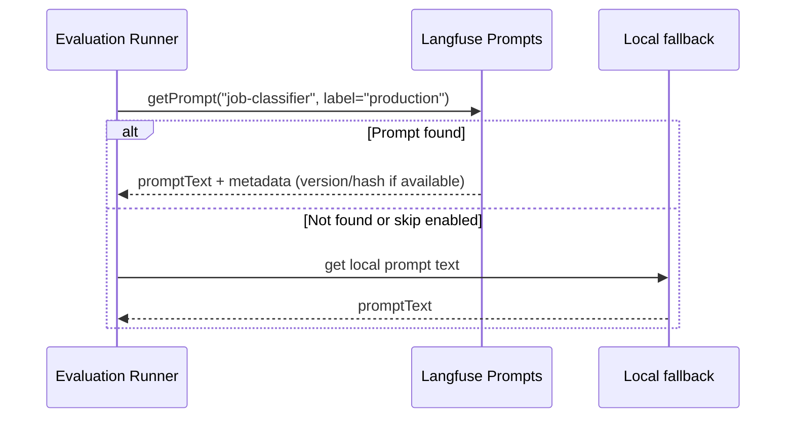
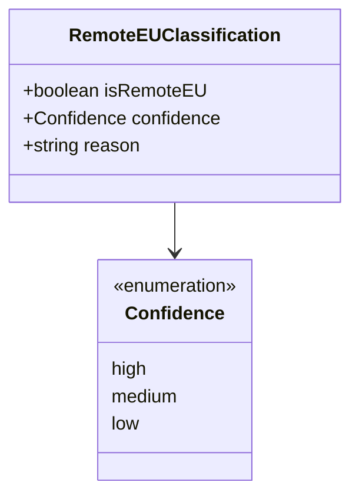
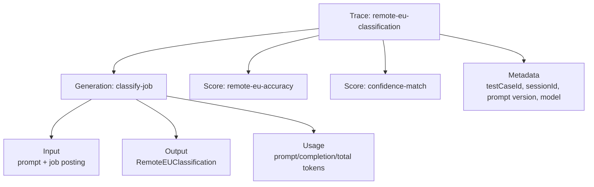
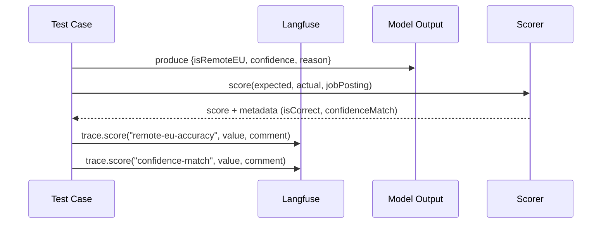
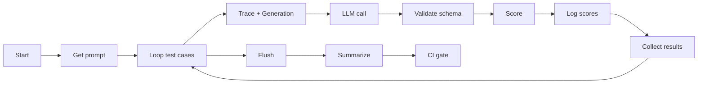
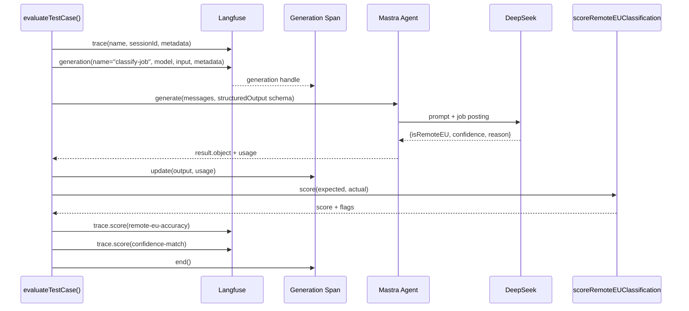
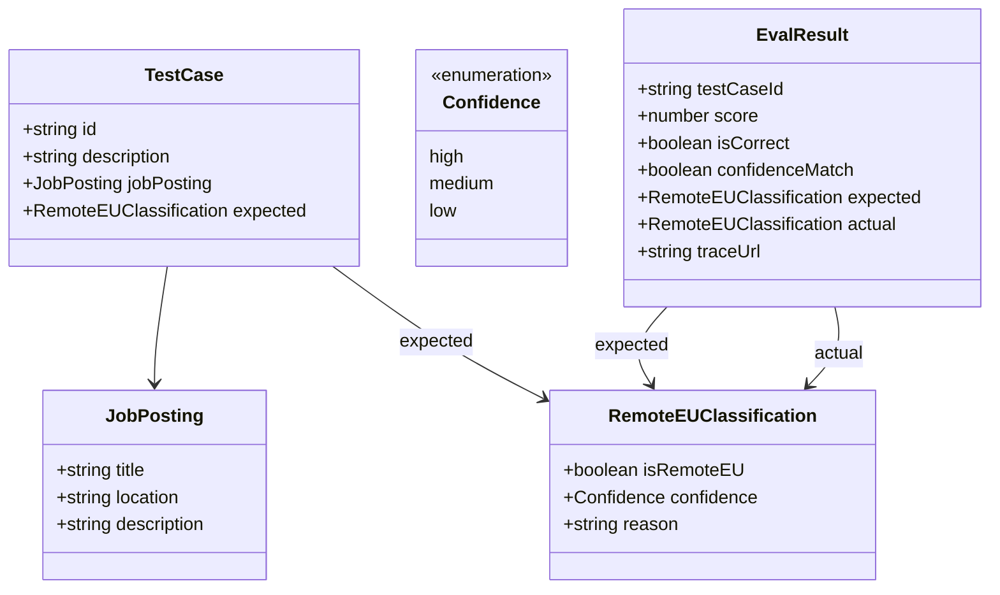
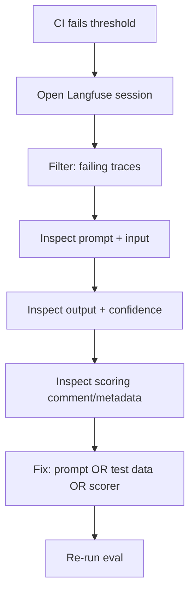

# AI Observability for LLM Evals with Langfuse

## Prompt Governance Flow

## Structured Output Schema

## Trace Model

## Scoring Flow

## Batch Evaluation Flow

## Per-Case Execution Sequence

## Data Model

## Debugging Workflow

