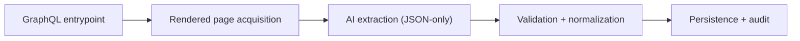
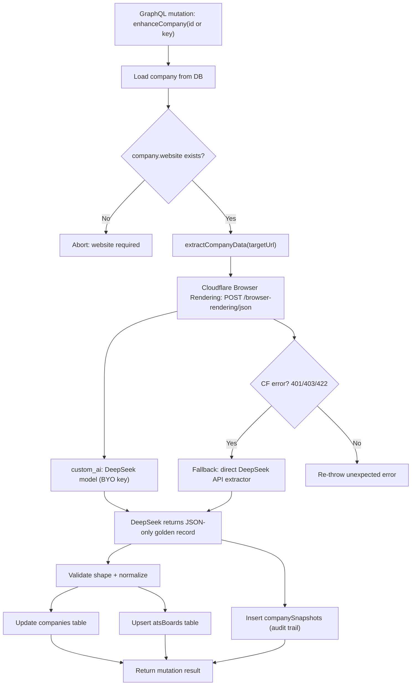

# AI-Driven Company Enrichment with DeepSeek via Cloudflare Browser Rendering

This page documents an AI-first enrichment pipeline that turns a company website into a **typed “golden record”** you can safely persist into your database and expose through GraphQL.

The core idea is simple:

- Use **Cloudflare Browser Rendering `/json`** to load a *real rendered* page (including JavaScript-heavy sites).
- Use **DeepSeek** to convert the rendered page into a strict **JSON-only** object (no markdown, no prose).
- If Browser Rendering isn’t available (permissions/feature/unsupported request), **fall back to calling DeepSeek directly**.

---

## High-level architecture

This pipeline has five clear layers, each with a single responsibility:

- **Entry**: GraphQL mutation identifies the target company.
- **Acquisition**: Browser Rendering fetches a fully rendered page.
- **Extraction**: DeepSeek converts HTML into JSON-only structure.
- **Governance**: validation, normalization, and audit snapshot.
- **Persistence**: upserts for company + ATS boards, then return.



---

### Classification

A single enum-like category so downstream logic can branch cleanly:

- `company.category` is one of:
  - `CONSULTANCY | AGENCY | STAFFING | DIRECTORY | PRODUCT | OTHER | UNKNOWN`

`UNKNOWN` is intentionally allowed to prevent “forced certainty”.

### Link intelligence (the AI “money fields”)

Two links that unlock most automation:

- `company.careers_url` — best official careers entrypoint (prefer internal)
- `company.linkedin_url` — best LinkedIn company page (`/company/...`)

### Hiring infrastructure

Detect ATS/job boards (useful for job syncing, vendor analytics, integrations):

- `ats_boards[]` entries containing:
  - `url`
  - `vendor`
  - `board_type` (`ats | careers_page | jobs_board`)
  - `confidence` (0..1)
  - `is_active`

### Provenance and uncertainty

To keep AI outputs accountable:

- `evidence` — where it came from (URL) + any known fetch metadata
- `notes[]` — uncertainty/caveats without polluting structured fields

---

## Top-down architecture



---

## Why Cloudflare Browser Rendering `/json` is the right AI boundary

Many company websites are JS-heavy (SPAs), and the key links you want (Careers, LinkedIn, ATS) often live in:

- global navigation/header
- footer “social” section
- content that only appears after JS renders

The `/json` endpoint is designed to extract **structured JSON** from the *rendered page*, using:

- `url` (or `html`)
- a `prompt` (and optionally `response_format` for JSON Schema depending on provider support)
- `custom_ai` to route extraction through your chosen model

For JS-heavy pages, waiting for rendering to finish matters. This is why the extractor uses:

- `gotoOptions.waitUntil = "networkidle0"`

---

## AI contract: JSON-only output

When you route through `custom_ai` with BYO providers, schema-enforced responses can be provider-dependent. The safest universal strategy is:

- treat the prompt as a strict contract
- demand **ONLY valid JSON**
- define the expected shape explicitly
- instruct null/[] for unknown values
- push uncertainty into `notes[]`

This turns an LLM into a bounded parser.

---

## Implementation: Cloudflare-first with a direct DeepSeek fallback

Below is the extractor you provided, structured for this pipeline:

- uses `CLOUDFLARE_BROWSER_RENDERING_KEY` for the Cloudflare SDK
- calls Browser Rendering `/json` with `custom_ai` pointing to DeepSeek
- uses a strict JSON-only prompt (no markdown)
- falls back to `extractCompanyDataFallback()` on capability/config errors (`401/403/422`)

```ts
import Cloudflare from "cloudflare";
import type { ExtractionResult } from "./types";
import { extractCompanyDataFallback } from "./extractor-fallback";

/**
 * Extract company data using DeepSeek via Cloudflare Workers AI
 * Falls back to direct DeepSeek API if Browser Rendering is not available
 *
 * Requirements:
 * - CLOUDFLARE_BROWSER_RENDERING_KEY (required)
 * - CLOUDFLARE_ACCOUNT_ID
 * - DEEPSEEK_API_KEY (required)
 *
 * Setup guide: See docs/CREATE_CLOUDFLARE_TOKEN.md
 */
export async function extractCompanyData(
  targetUrl: string
): Promise<ExtractionResult> {
  const browserRenderingKey = process.env.CLOUDFLARE_BROWSER_RENDERING_KEY;
  const accountId = process.env.CLOUDFLARE_ACCOUNT_ID;
  const deepseekKey = process.env.DEEPSEEK_API_KEY;

  if (!browserRenderingKey) {
    throw new Error("Missing CLOUDFLARE_BROWSER_RENDERING_KEY environment variable");
  }
  if (!accountId) throw new Error("Missing CLOUDFLARE_ACCOUNT_ID environment variable");
  if (!deepseekKey) throw new Error("Missing DEEPSEEK_API_KEY environment variable");

  const client = new Cloudflare({ apiToken: browserRenderingKey });

  const prompt = `
You are extracting a "Company golden record" from a webpage for downstream GraphQL storage.

CRITICAL: Return ONLY valid JSON. No markdown, no code blocks, no explanatory text. Just the raw JSON object.

Expected structure:
{
  "company": {
    "name": "...",
    "logo_url": "...",
    "website": "...",
    "careers_url": "...",
    "linkedin_url": "...",
    "description": "...",
    "industry": "...",
    "size": "...",
    "location": "...",
    "canonical_domain": "...",
    "category": "CONSULTANCY|AGENCY|STAFFING|DIRECTORY|PRODUCT|OTHER|UNKNOWN",
    "tags": [...],
    "services": [...],
    "industries": [...]
  },
  "ats_boards": [
    {
      "url": "...",
      "vendor": "...",
      "board_type": "...",
      "confidence": 0.9,
      "is_active": true
    }
  ],
  "evidence": {
    "source_type": "url",
    "source_url": "...",
    "http_status": 200,
    "mime": "text/html"
  },
  "notes": [...]
}

Hard rules:
- Output MUST be valid JSON matching the structure above.
- Do not invent values. If unknown, set null (or [] where schema allows).
- Prefer official signals on-page (header/footer, about/careers links, meta tags, JSON-LD, OpenGraph).

Field mapping guidance:
- canonical_domain: derive from the input URL host (strip "www.").
- website: canonical URL if present, otherwise the input URL.
- logo_url: choose a clear brand logo; use an absolute URL.
- category: MUST be one of: CONSULTANCY, AGENCY, STAFFING, DIRECTORY, PRODUCT, OTHER, UNKNOWN.
  - CONSULTANCY: companies providing consulting/advisory services
  - AGENCY: marketing, design, or creative agencies
  - STAFFING: recruitment/staffing agencies
  - DIRECTORY: job boards or company directories
  - PRODUCT: product companies building software/hardware
  - OTHER: doesn't fit other categories
  - UNKNOWN: insufficient information to classify
- careers_url:
  - Find the best official careers/jobs link by scanning navigation menus, headers, footers, and body content.
  - Look for links labeled "Careers", "Jobs", "Join Us", "Work With Us", "We're Hiring", or similar.
  - Prefer internal paths like "/careers", "/careers/", "/jobs", "/join-us" or dedicated careers subdomains (e.g., "careers.company.com").
  - Prefer internal company-hosted careers pages over external ATS boards when both exist.
  - Must use an absolute URL (e.g., "https://orases.com/careers/" not "/careers").
- linkedin_url:
  - Find the company LinkedIn page (prefer "https://www.linkedin.com/company/...").
  - Use an absolute URL.
  - If multiple LinkedIn links exist (company, showcase, people), pick the "company" page if available.

ATS/job boards:
- Scan links that look like careers/jobs/apply and known vendors (Greenhouse, Lever, Workday, SmartRecruiters, Ashby, BambooHR, iCIMS, Jobvite, Teamtailor, Recruitee).
- For each ATS board found:
  - url must be absolute.
  - vendor: best guess based on domain/path (e.g., "GREENHOUSE", "LEVER", "ASHBY", "WORKABLE", etc.).
  - board_type: "ats" | "careers_page" | "jobs_board" (pick one).
  - confidence: number 0..1 (high when vendor is obvious).
  - is_active: true if it appears reachable and relevant.

Evidence:
- source_type: "url"
- source_url: input URL
- http_status/mime/content_hash/etc: if unknown, null (do not guess).

Put any uncertainties/caveats in notes[].

Extract from: ${targetUrl}
  `.trim();

  try {
    const cfResp = await client.browserRendering.json.create({
      account_id: accountId,
      url: targetUrl,
      prompt,
      // Note: response_format with json_schema is not supported by Cloudflare Browser Rendering
      // with custom AI models. We rely on the prompt to instruct JSON output.
      custom_ai: [
        {
          model: "deepseek/deepseek-chat",
          authorization: `Bearer ${deepseekKey}`,
        },
      ],
      gotoOptions: { waitUntil: "networkidle0" },
    });

    // Cloudflare Browser Rendering JSON endpoint returns the extracted data directly
    // Not wrapped in a .result property like Workers AI
    const extracted = cfResp as unknown as ExtractionResult;

    if (!extracted || !extracted.company) {
      console.error("❌ Failed to extract company data - invalid response structure");
      throw new Error("Failed to extract company data from webpage - invalid response structure");
    }

    console.log(`✅ Successfully extracted company data: ${extracted.company.name}`);
    return extracted;
  } catch (error: any) {
    // Log the actual error for debugging
    console.error("❌ Cloudflare Browser Rendering error:");
    console.error("   Status:", error.status);
    console.error("   Message:", error.message);
    if (error.response) {
      console.error("   Response:", JSON.stringify(error.response, null, 2));
    }

    // Fall back to direct DeepSeek API if Browser Rendering is not available or unsupported
    if (error.status === 401 || error.status === 403 || error.status === 422) {
      console.warn(
        "⚠️  Cloudflare Browser Rendering not available (missing permissions, not enabled, or unsupported format)."
      );
      console.warn("   Falling back to direct DeepSeek API...");
      console.warn(
        "   To use Browser Rendering, see: docs/CREATE_CLOUDFLARE_TOKEN.md"
      );

      // Use fallback extractor
      return await extractCompanyDataFallback(targetUrl);
    }

    // Re-throw other errors
    throw error;
  }
}
```

---

## Failure modes and why the fallback is important

Browser Rendering can fail for reasons that should not block enrichment entirely:

- **401 Unauthorized**: token missing/invalid, wrong key used
- **403 Forbidden**: feature not enabled, insufficient scopes, account restrictions
- **422 Unprocessable Entity**: provider rejects some parameter shape, unsupported configuration

Those are “capability failures”, not “content failures”. Falling back to a direct DeepSeek extractor keeps the pipeline operational while you fix Cloudflare configuration (or handle edge sites).

---

## Persistence guardrails (keep the AI safe)

Even with JSON-only output, the DB write must remain your code’s responsibility.

### 1) Validate shape before persistence

At minimum, verify:

- `company.name` exists and is non-empty
- any present URLs are absolute (`https://...`)
- arrays are arrays
- `category` is one of the allowed values

If validation fails, either retry extraction (stricter prompt) or fall back.

### 2) Canonicalize URLs before upserts

To avoid duplicates, normalize:

- remove `#fragment`
- normalize trailing slash
- lowercase host
- optionally strip tracking params

### 3) Treat vendor and board_type as hints

LLMs can emit vendor variants (e.g., `Smart Recruiters`, `smartrecruiters`). Normalize before mapping to enums.

### 4) Always snapshot the raw extraction

Saving the full `ExtractionResult` into `companySnapshots.extracted` buys you:

- debugging (“why did this change?”)
- regression detection
- prompt iteration without losing history

---

## References

[https://github.com/nicolad/nomadically.work](https://github.com/nicolad/nomadically.work)

[https://nomadically.work/](https://nomadically.work/)
