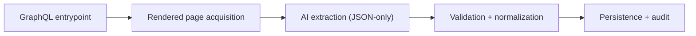
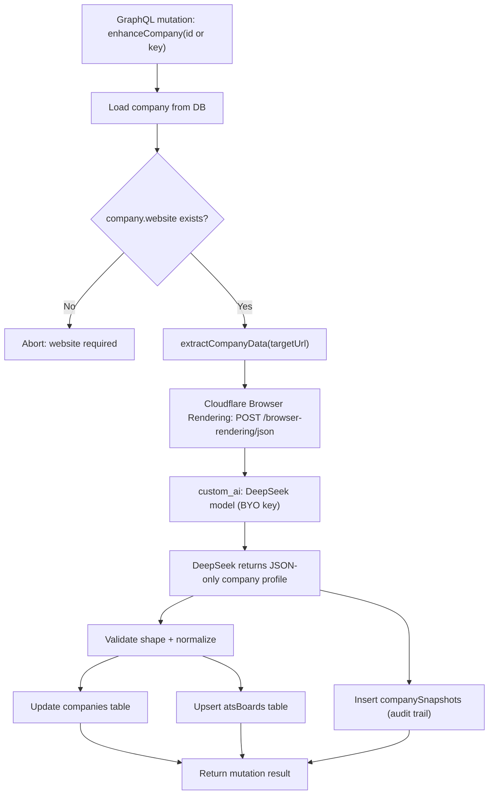
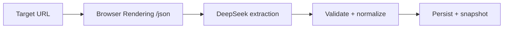
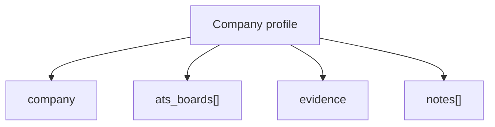

# AI-Driven Company Enrichment with DeepSeek via Cloudflare Browser Rendering

This page documents an AI-first enrichment pipeline that turns a company website into a **clean, structured company profile** you can safely persist into your database and expose through GraphQL.

The core idea is simple:

- Use **Cloudflare Browser Rendering `/json`** to load a *real rendered* page (including JavaScript-heavy sites).
- Use **DeepSeek** to convert the rendered page into a strict **JSON-only** object (no markdown, no prose).

---

## High-level architecture

This pipeline has five clear layers, each with a single responsibility:

- **Entry**: GraphQL mutation identifies the target company.
- **Acquisition**: Browser Rendering fetches a fully rendered page.
- **Extraction**: DeepSeek converts HTML into JSON-only structure.
- **Governance**: validation, normalization, and audit snapshot.
- **Persistence**: upserts for company + ATS boards, then return.

---

### Classification

A single enum-like category so downstream logic can branch cleanly:

- `company.category` is one of:
  - `CONSULTANCY | AGENCY | STAFFING | DIRECTORY | PRODUCT | OTHER | UNKNOWN`

`UNKNOWN` is intentionally allowed to prevent “forced certainty”.

### Link intelligence (the AI “money fields”)

Two links that unlock most automation:

- `company.careers_url` — best official careers entrypoint (prefer internal)
- `company.linkedin_url` — best LinkedIn company page (`/company/...`)

### Hiring infrastructure

Detect ATS/job boards (useful for job syncing, vendor analytics, integrations):

- `ats_boards[]` entries containing:
  - `url`
  - `vendor`
  - `board_type` (`ats | careers_page | jobs_board`)
  - `confidence` (0..1)
  - `is_active`

### Provenance and uncertainty

To keep AI outputs accountable:

- `evidence` — where it came from (URL) + any known fetch metadata
- `notes[]` — uncertainty/caveats without polluting structured fields

---

## Top-down architecture

---

## Why Cloudflare Browser Rendering `/json` is the right AI boundary

Many company websites are JS-heavy (SPAs), and the key links you want (Careers, LinkedIn, ATS) often live in:

- global navigation/header
- footer “social” section
- content that only appears after JS renders

The `/json` endpoint is designed to extract **structured JSON** from the *rendered page*, using:

- `url` (or `html`)
- a `prompt` (and optionally `response_format` for JSON Schema depending on provider support)
- `custom_ai` to route extraction through your chosen model

For JS-heavy pages, waiting for rendering to finish matters. This is why the extractor uses:

- `gotoOptions.waitUntil = "networkidle0"`

---

## AI contract: JSON-only output

When you route through `custom_ai` with BYO providers, schema-enforced responses can be provider-dependent. The safest universal strategy is:

- treat the prompt as a strict contract
- demand **ONLY valid JSON**
- define the expected shape explicitly
- instruct null/[] for unknown values
- push uncertainty into `notes[]`

This turns an LLM into a bounded parser.

---

## Implementation: Cloudflare-first with a direct DeepSeek fallback

Below is the same flow, expressed as architecture instead of code:

- Inputs: company id/key and target URL.
- Acquisition: Browser Rendering `/json` fetches a rendered page.
- Extraction: DeepSeek produces a JSON-only record.
- Governance: validate, normalize, and snapshot the output.
- Persistence: upsert company + ATS boards, then return result.

---

## Persistence guardrails (keep the AI safe)

Even with JSON-only output, the DB write must remain your code’s responsibility.

### 1) Validate shape before persistence

At minimum, verify:

- `company.name` exists and is non-empty
- any present URLs are absolute (`https://...`)
- arrays are arrays
- `category` is one of the allowed values

If validation fails, either retry extraction (stricter prompt) or fall back.

### 2) Canonicalize URLs before upserts

To avoid duplicates, normalize:

- remove `#fragment`
- normalize trailing slash
- lowercase host
- optionally strip tracking params

### 3) Treat vendor and board_type as hints

LLMs can emit vendor variants (e.g., `Smart Recruiters`, `smartrecruiters`). Normalize before mapping to enums.

### 4) Always snapshot the raw extraction

Saving the full `ExtractionResult` into `companySnapshots.extracted` buys you:

- debugging (“why did this change?”)
- regression detection
- prompt iteration without losing history

---

## References

[https://github.com/nicolad/nomadically.work](https://github.com/nicolad/nomadically.work)

[https://nomadically.work/](https://nomadically.work/)
