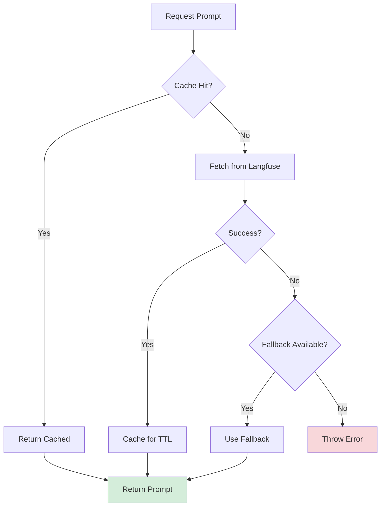
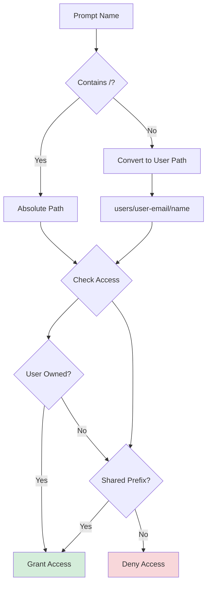
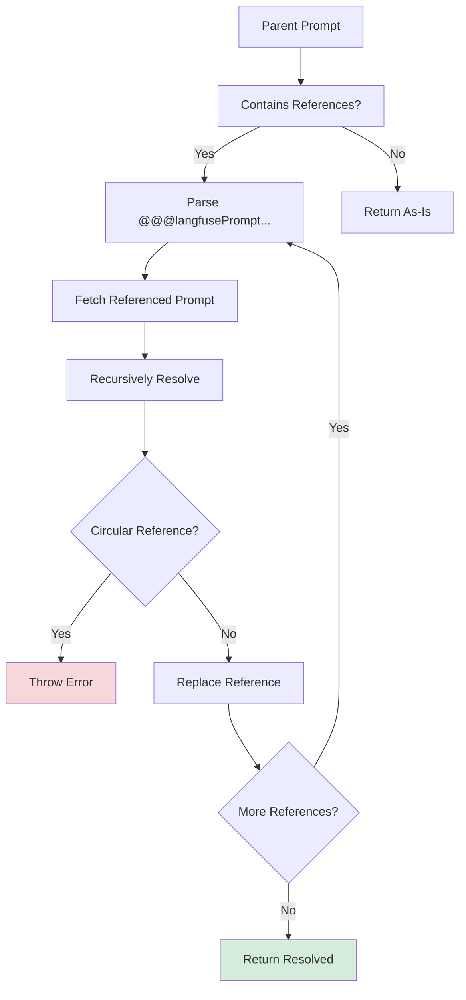
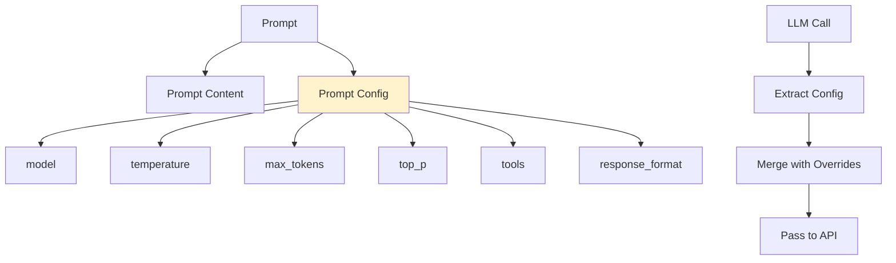
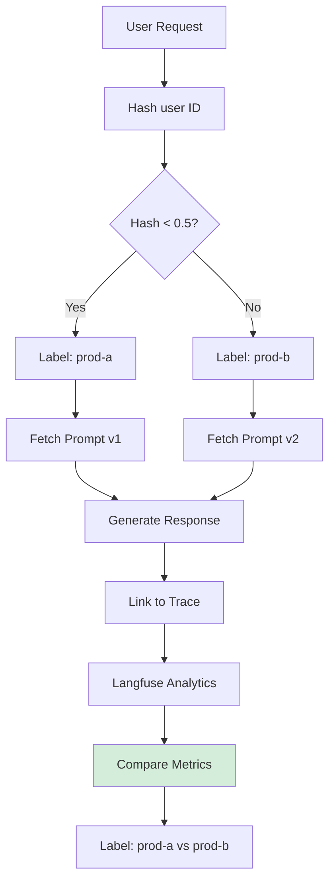
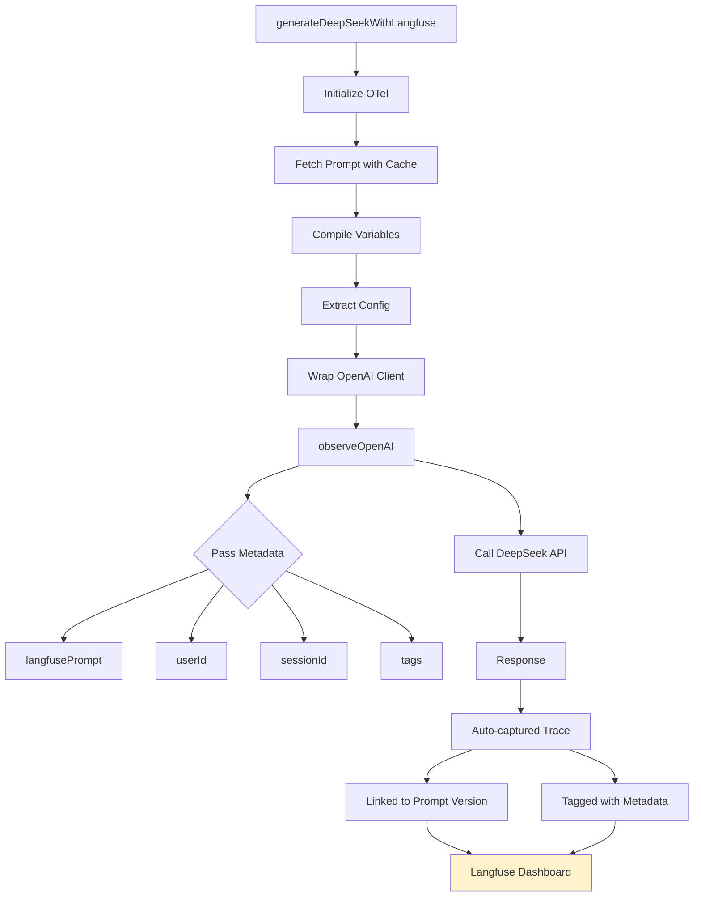
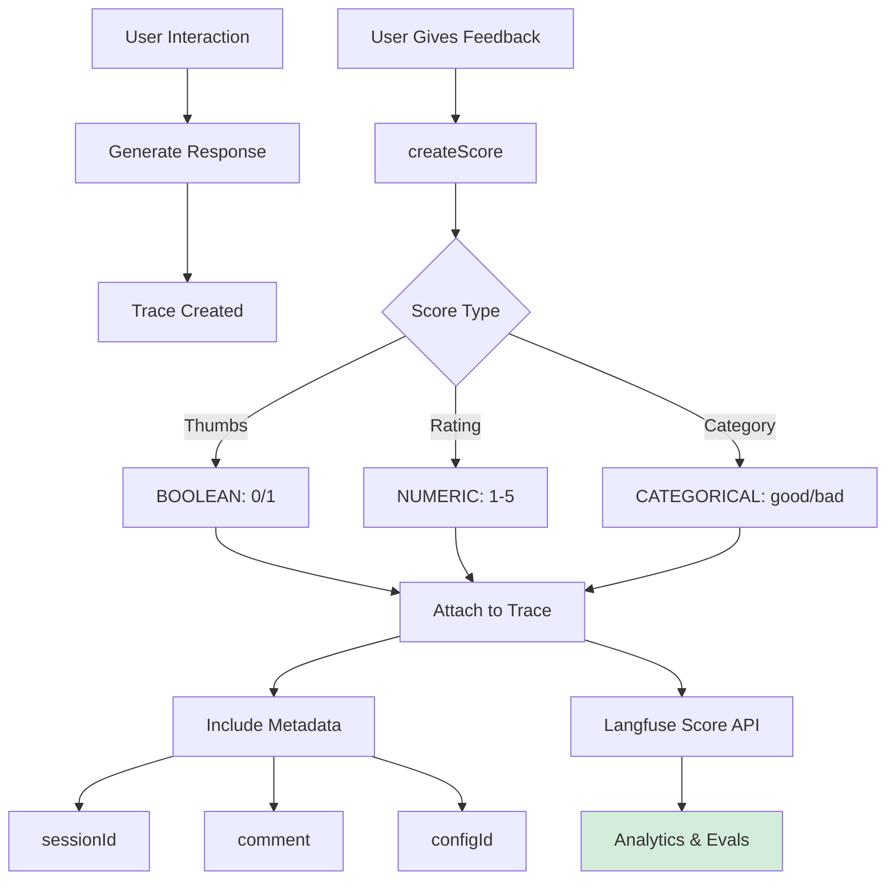
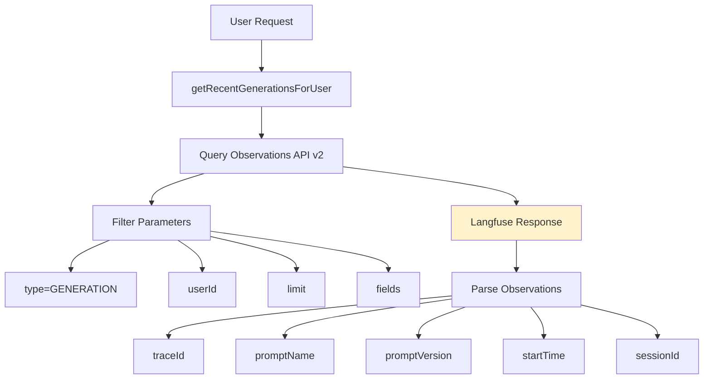
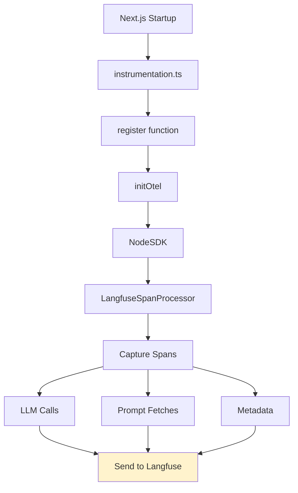

# Langfuse Integration Guide

This document covers all Langfuse features implemented in our codebase, providing a comprehensive production-ready setup for prompt management, tracing, evaluation, and observability.

## Architecture Overview

```mermaid
graph TD
    A[Next.js Application] --> B[instrumentation.ts]
    B --> C[OpenTelemetry SDK]
    C --> D[LangfuseSpanProcessor]
    
    A --> E[GraphQL Resolvers]
    E --> F[Prompt Service]
    E --> G[DeepSeek Generator]
    E --> H[Scores Service]
    E --> I[Usage Tracker]
    
    F --> J[Langfuse Client]
    G --> K[@langfuse/openai]
    H --> J
    I --> L[Observations API v2]
    
    K --> M[DeepSeek API]
    J --> N[Langfuse Cloud]
    L --> N
    
    style A fill:#e1f5ff
    style N fill:#fff3cd
    style M fill:#d4edda
```

## Environment Setup

We use only three core Langfuse environment variables:

```bash
LANGFUSE_SECRET_KEY="sk-lf-..."
LANGFUSE_PUBLIC_KEY="pk-lf-..."
LANGFUSE_BASE_URL="https://cloud.langfuse.com"
```

## Core Features

### 1. Prompt Management

#### 1.1 Singleton Client Pattern

```typescript
// src/langfuse/index.ts
let singleton: LangfuseClient | null = null;

export function getLangfuseClient(): LangfuseClient {
  if (!singleton) {
    singleton = new LangfuseClient({
      secretKey: LANGFUSE_SECRET_KEY,
      publicKey: LANGFUSE_PUBLIC_KEY,
      baseUrl: LANGFUSE_BASE_URL,
    });
  }
  return singleton;
}
```

**Benefits:**

- Single connection reuse
- Optimal connection pooling
- Consistent configuration

#### 1.2 Prompt Fetching with Caching



```typescript
export async function fetchLangfusePrompt(
  name: string,
  options: PromptFetchOptions = {},
) {
  const langfuse = getLangfuseClient();
  
  return await langfuse.prompt.get(name, {
    type: options.type,
    label: options.label,
    version: options.version,
    cacheTtlSeconds: options.cacheTtlSeconds ?? defaultCacheTtlSeconds(),
    fallback: options.fallback,
  });
}
```

**Cache TTL Strategy:**

- Production: 300 seconds (5 minutes)
- Development: 0 seconds (instant updates)

**Guaranteed Availability:**

- Fallback prompts for first-fetch failures
- Stale-while-revalidate pattern
- Optional prewarming on startup

```typescript
// Prewarm critical prompts
export async function prewarmPrompts(names: string[]) {
  await Promise.all(names.map((n) => fetchLangfusePrompt(n)));
}
```

### 2. Prompt Organization & Access Control

#### 2.1 Folder-Style Naming



```typescript
// Convert: "my-prompt" → "users/alice-example-com/my-prompt"
export function toUserPromptName(
  userIdOrEmail: string,
  shortName: string,
): string {
  const safe = userIdOrEmail
    .trim()
    .toLowerCase()
    .replace(/[^a-z0-9@._-]+/g, "-")
    .replace(/@/g, "-at-");
  return `users/${safe}/${shortName}`;
}
```

**Access Control Rules:**

1. User owns: `users/{their-email}/*`
2. Shared access: `shared/*`, `public/*`
3. Everything else: denied

```typescript
export function assertPromptAccess(
  promptName: string,
  userIdOrEmail: string,
  allowedSharedPrefixes: string[] = ["shared/", "public/"],
) {
  const userPrefix = toUserPromptName(userIdOrEmail, "").replace(/\/$/, "");
  const isUserOwned = promptName.startsWith(userPrefix + "/");
  const isShared = allowedSharedPrefixes.some((p) => promptName.startsWith(p));

  if (!isUserOwned && !isShared) {
    throw new Error(`Access denied to prompt: ${promptName}`);
  }
}
```

### 3. Prompt Composability

Reuse prompt snippets across multiple prompts to maintain DRY principles.



**Reference Format:**

```
@@@langfusePrompt:name=PromptName|version=1@@@
@@@langfusePrompt:name=PromptName|label=production@@@
```

**Helper Function:**

```typescript
export function composePromptRef(
  name: string,
  options: { version?: number; label?: string } = {},
): string {
  let ref = `@@@langfusePrompt:name=${name}`;
  if (options.version !== undefined) {
    ref += `|version=${options.version}`;
  }
  if (options.label) {
    ref += `|label=${options.label}`;
  }
  ref += "@@@";
  return ref;
}
```

**Example Usage:**

```typescript
// Base prompt: "shared/system-instructions"
const systemRef = composePromptRef("shared/system-instructions", { 
  label: "production" 
});

// Composed prompt
const prompt = `
${systemRef}

Your task: Review code for bugs and performance issues.
`;

// Automatically resolved when fetched
const resolved = await resolveComposedPrompt(prompt);
```

### 4. Variables & Placeholders

#### 4.1 Variables (Simple String Substitution)

```typescript
const prompt = "Hello {{name}}, welcome to {{app}}!";

compilePrompt(prompt, {
  variables: {
    name: "Alice",
    app: "Nomadically"
  }
});
// → "Hello Alice, welcome to Nomadically!"
```

#### 4.2 Message Placeholders (Chat Prompts)

```typescript
// Prompt with placeholder
const chatPrompt = [
  { role: "system", content: "You are a helpful assistant." },
  { type: "placeholder", name: "conversation_history" },
  { role: "user", content: "{{user_question}}" }
];

compilePrompt(chatPrompt, {
  variables: { user_question: "What is TypeScript?" },
  placeholders: {
    conversation_history: [
      { role: "user", content: "Hi!" },
      { role: "assistant", content: "Hello! How can I help?" }
    ]
  }
});
```

### 5. Prompt Config

Store model parameters, tools, and schemas directly with prompt versions.



**DeepSeek-Focused Config:**

```typescript
export type PromptConfig = {
  model?: string;
  temperature?: number;
  top_p?: number;
  max_tokens?: number;
  presence_penalty?: number;
  frequency_penalty?: number;
  response_format?: unknown;
  tools?: unknown[];
  tool_choice?: unknown;
  stop?: string[];
} & Record<string, unknown>;
```

**Config Extraction:**

```typescript
export function extractPromptConfig(config: unknown): PromptConfig {
  // Validates and normalizes config
  // Enforces DeepSeek models only
  // Preserves custom keys
}
```

### 6. A/B Testing

Deterministic hash-based routing for consistent experiment assignment.



```typescript
export function pickAbLabel(params: {
  seed: string;            // stable userId/sessionId
  labelA: string;          // "prod-a"
  labelB: string;          // "prod-b"
  splitA?: number;         // default 0.5
}): string {
  const u = hashToUnit(params.seed);
  return u < (params.splitA ?? 0.5) ? params.labelA : params.labelB;
}
```

**Usage:**

```typescript
const label = pickAbLabel({
  seed: userId,     // Same user always gets same variant
  labelA: "prod-a",
  labelB: "prod-b",
  splitA: 0.5       // 50/50 split
});

const prompt = await fetchLangfusePrompt("shared/support-agent", { label });
```

### 7. DeepSeek Integration with Tracing

Complete OpenAI-compatible integration with full observability.



**Key Features:**

- Automatic prompt-to-trace linking
- User/session attribution
- Tag-based filtering
- Model parameter extraction from prompt config

```typescript
export async function generateDeepSeekWithLangfuse(
  input: GenerateInput,
): Promise<string> {
  await initOtel();

  const langfusePrompt = await fetchLangfusePrompt(input.promptName, {
    type: input.promptType,
    label: input.label,
    cacheTtlSeconds: defaultCacheTtlSeconds(),
    fallback: /* ... */,
  });

  const compiled = compilePrompt(langfusePrompt, {
    variables: input.variables,
    placeholders: input.placeholders,
  });

  const cfg = extractPromptConfig(langfusePrompt.config);

  const traced = observeOpenAI(getDeepSeekClient(), {
    langfusePrompt,        // ← Links to prompt version
    userId: input.userId,
    sessionId: input.sessionId,
    tags: input.tags,
  });

  const res = await traced.chat.completions.create({
    model: cfg.model ?? "deepseek-chat",
    messages: compiled,
    temperature: cfg.temperature,
    // ... other params from config
  });

  return res.choices?.[0]?.message?.content ?? "";
}
```

### 8. Scores & Feedback

Capture user feedback and evaluation metrics.



```typescript
export async function createScore(input: {
  traceId: string;
  observationId?: string;
  sessionId?: string;
  name: string;              // e.g. "helpfulness"
  value: number | string;    // boolean => 0/1
  dataType?: ScoreDataType;
  comment?: string;
  id?: string;               // idempotency key
}) {
  const langfuse = getLangfuseClient();

  langfuse.score.create({ /* ... */ });
  
  await langfuse.flush(); // Important for serverless
}
```

**Use Cases:**

- 👍👎 Thumbs up/down feedback
- ⭐ Star ratings (1-5)
- ✅ Correctness evaluation
- 🛡️ Guardrail checks
- 📊 Custom metrics

### 9. Usage Tracking via Observations API

Replace in-memory logs with real production data.



```typescript
export async function getRecentGenerationsForUser(params: {
  userId: string;
  limit?: number;
  environment?: string;
}): Promise<ObservationUsageItem[]> {
  const url = new URL(`${LANGFUSE_BASE_URL}/api/public/v2/observations`);
  
  url.searchParams.set("type", "GENERATION");
  url.searchParams.set("userId", params.userId);
  url.searchParams.set("limit", String(limit));
  url.searchParams.set("fields", "core,basic,prompt,time");

  const res = await fetch(url.toString(), {
    headers: {
      Authorization: `Basic ${Buffer.from(
        `${LANGFUSE_PUBLIC_KEY}:${LANGFUSE_SECRET_KEY}`
      ).toString("base64")}`,
    },
  });

  return parseObservations(await res.json());
}
```

**Benefits:**

- Real production data (no fake logs)
- Filtered by user, environment, time
- Includes prompt name & version
- Ready for billing, quotas, analytics

### 10. OpenTelemetry Setup

Required for `@langfuse/openai` integration.



**Setup:**

```typescript
// src/otel/initOtel.ts
import { NodeSDK } from "@opentelemetry/sdk-node";
import { LangfuseSpanProcessor } from "@langfuse/otel";

let started = false;

export async function initOtel() {
  if (started) return;
  
  const sdk = new NodeSDK({
    spanProcessors: [new LangfuseSpanProcessor()],
  });
  
  await sdk.start();
  started = true;
}
```

```typescript
// instrumentation.ts (Next.js hook)
export async function register() {
  if (process.env.NEXT_RUNTIME === "nodejs") {
    await initOtel();
  }
}
```

## GraphQL Integration

All features are exposed via GraphQL for client consumption.

```graphql
# Fetch a prompt
query GetPrompt($name: String!, $label: String) {
  prompt(name: $name, label: $label, resolveComposition: true) {
    name
    version
    type
    chatMessages
    config
    labels
    tags
  }
}

# Get my usage
query MyUsage($limit: Int) {
  myPromptUsage(limit: $limit) {
    promptName
    version
    usedAt
    traceId
  }
}

# Create a prompt
mutation CreatePrompt($input: CreatePromptInput!) {
  createPrompt(input: $input) {
    name
    version
    config
  }
}
```

## Best Practices

### ✅ Do's

1. **Always use caching** in production (300s TTL)
2. **Provide fallbacks** for critical prompts
3. **Prewarm** prompts on server startup
4. **Tag all generations** with userId, sessionId
5. **Use labels** for A/B testing (prod-a/prod-b)
6. **Folder-style naming** for organization
7. **Compose prompts** to avoid duplication
8. **Extract config** from prompts (don't hardcode)
9. **Flush scores** in serverless environments
10. **Use Observations API** for real usage data

### ❌ Don'ts

1. Don't bypass caching in production
2. Don't hardcode model parameters
3. Don't create circular prompt references
4. Don't skip ACL checks
5. Don't use in-memory logs for usage
6. Don't forget to call `initOtel()` before tracing
7. Don't mix manual prompt names with namespace convention

## Performance Characteristics

| Feature | Latency | Cache Hit Rate | Notes |
|---------|---------|----------------|-------|
| Prompt Fetch (cached) | ~1ms | 95%+ | In-process cache |
| Prompt Fetch (miss) | ~50-100ms | - | Network + DB |
| Prompt Compilation | <1ms | - | Pure computation |
| Score Creation | ~20-50ms | - | Async, buffered |
| Observations API | ~100-200ms | - | Paginated queries |
| Composed Prompt (3 refs) | ~150ms | 80%+ | Parallel fetches |

## Security Considerations

1. **Credentials**: Never expose `LANGFUSE_SECRET_KEY` to client
2. **ACL Enforcement**: Always call `assertPromptAccess()`
3. **User Isolation**: Folder-style naming prevents leaks
4. **API Rate Limits**: Observations API limited to 1000/query
5. **Idempotency**: Use score IDs to prevent duplicate feedback

## Monitoring & Debugging

### In Langfuse Dashboard

1. **Traces** → Filter by userId, sessionId, tags
2. **Prompts** → View usage per version/label
3. **Scores** → Aggregate feedback by name
4. **Sessions** → Track multi-turn conversations
5. **Datasets** → Export for evals (future)

### Local Development

```bash
# Disable caching for instant updates
NODE_ENV=development

# Check OTel initialization
# Look for "LangfuseSpanProcessor initialized" in logs

# Verify prompt fetches
# Check Network tab for Langfuse API calls

# Test composability
# Use resolveComposedPrompt() directly
```

## Migration Path

If upgrading from a previous implementation:

1. ✅ Install new packages: `@langfuse/openai`, `@langfuse/otel`
2. ✅ Add `instrumentation.ts` for OTel
3. ✅ Replace `Langfuse` with `LangfuseClient`
4. ✅ Update prompt fetching to use caching API
5. ✅ Switch to folder-style naming
6. ✅ Replace in-memory usage with Observations API
7. ✅ Add `langfusePrompt` to all `observeOpenAI` calls

## Resources

- [Langfuse Prompt Management](https://langfuse.com/docs/prompt-management)
- [Langfuse OpenAI Integration](https://langfuse.com/integrations/model-providers/openai-js)
- [Observations API](https://langfuse.com/docs/api-and-data-platform/features/observations-api)
- [DeepSeek API Docs](https://api-docs.deepseek.com/)
- [A/B Testing Guide](https://langfuse.com/docs/prompt-management/features/a-b-testing)
- [Prompt Composability](https://langfuse.com/docs/prompt-management/features/prompt-composability)

## Support

For issues with this integration:

1. Check build logs for TypeScript errors
2. Verify environment variables are set
3. Confirm OTel is initialized before first LLM call
4. Review Langfuse dashboard for traces
5. Check Network tab for API errors
