This article documents the complete OpenRouter integration implemented in Nomadically.work, using DeepSeek models exclusively through a unified API.

<!-- truncate -->

## Architecture Overview

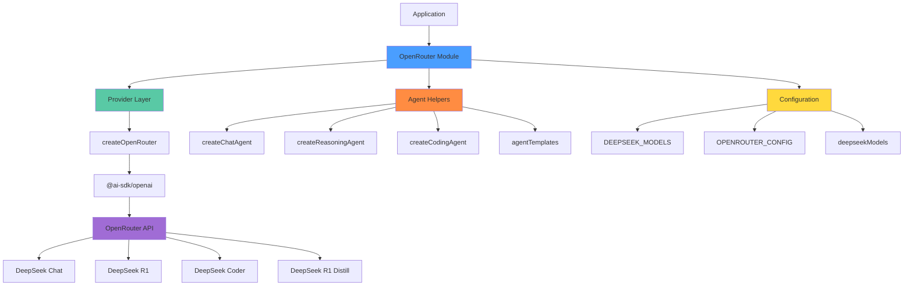

## Module Structure

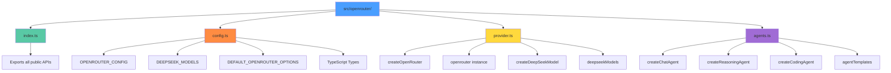

## Core Features

### 1. Provider Configuration

The provider layer handles OpenRouter API communication using the OpenAI SDK compatibility layer.

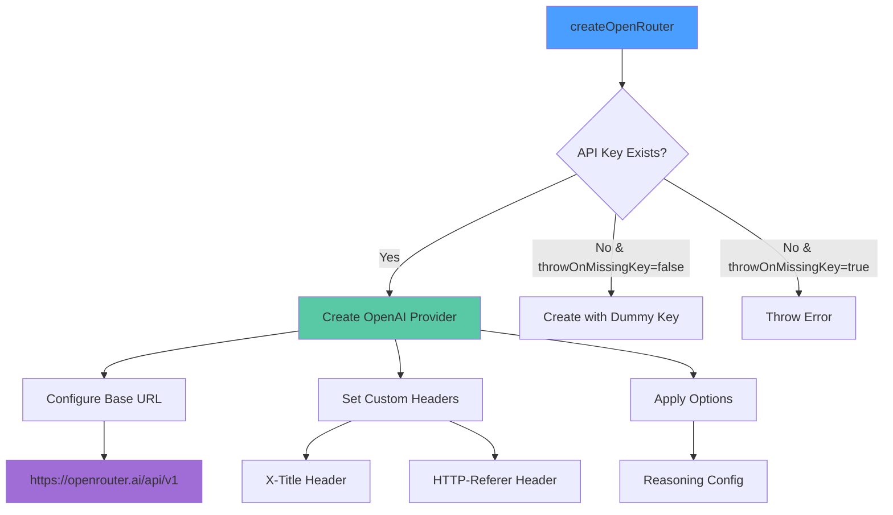

**Implementation Details:**

- Uses `@ai-sdk/openai` package for API compatibility
- Lazy-loaded provider instance to support testing without API key
- Configurable reasoning tokens (default: 10,000 max_tokens)
- Custom headers for analytics and tracking

### 2. DeepSeek Model Access

Five DeepSeek models are available through the integration:

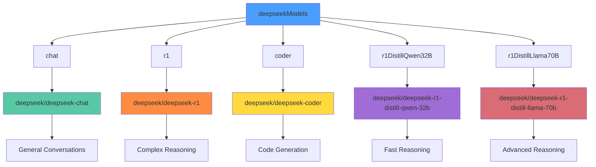

**Model Selection Guide:**

- **DeepSeek Chat**: General-purpose conversations, Q&A, text generation
- **DeepSeek R1**: Complex reasoning, multi-step analysis, decision-making
- **DeepSeek Coder**: Code generation, debugging, technical documentation
- **R1 Distill Qwen 32B**: Faster inference for reasoning tasks
- **R1 Distill Llama 70B**: High-quality reasoning with better performance

### 3. Agent Creation Patterns

Three patterns for creating agents with different levels of abstraction:

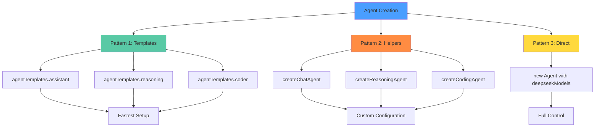

**Pattern Comparison:**

| Pattern   | Use Case                           | Flexibility | Setup Time |
| --------- | ---------------------------------- | ----------- | ---------- |
| Templates | Quick prototyping, demos           | Low         | Seconds    |
| Helpers   | Standard agents with custom config | Medium      | Minutes    |
| Direct    | Advanced use cases, full control   | High        | Minutes    |

### 4. Agent Template Flow

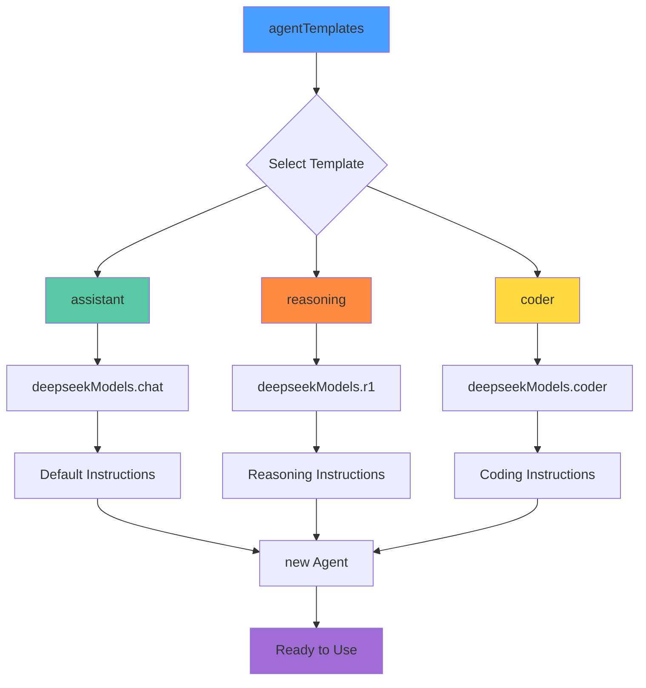

### 5. Configuration System

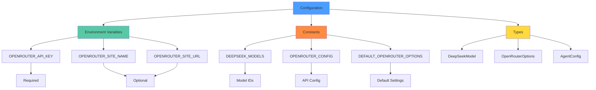

## Usage Examples

### Basic Agent Creation

```typescript
import { agentTemplates } from "@/openrouter";

// Quick start with template
const assistant = agentTemplates.assistant();

const response = await assistant.generate([
  { role: "user", content: "What are remote work benefits?" },
]);
```

### Custom Agent with Specific Model

```typescript
import { createChatAgent, deepseekModels } from "@/openrouter";

// Using helper function
const jobClassifier = createChatAgent({
  id: "job-classifier",
  name: "Job Classifier",
  instructions: "You are an expert at classifying job postings.",
  model: "chat",
});

// Or using model directly
import { Agent } from "@mastra/core/agent";

const reasoningAgent = new Agent({
  model: deepseekModels.r1(),
  name: "Reasoning Agent",
  instructions: "Think step by step about complex problems.",
});
```

### Advanced Configuration

```typescript
import { createOpenRouter, DEEPSEEK_MODELS } from "@/openrouter";

const customProvider = createOpenRouter({
  reasoning: {
    max_tokens: 15000,
  },
  headers: {
    "HTTP-Referer": "https://nomadically.work",
    "X-Title": "Job Platform AI",
  },
});

const model = customProvider(DEEPSEEK_MODELS.R1);
```

## Data Flow

### Request Flow

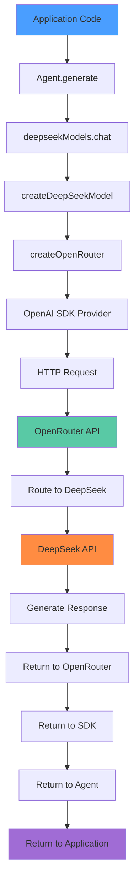

### Error Handling Flow

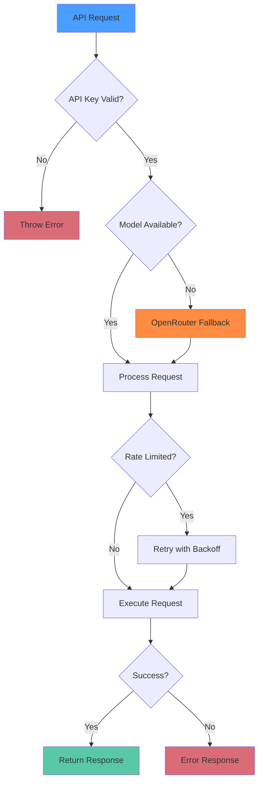

## Integration Points

### Mastra Agent Integration

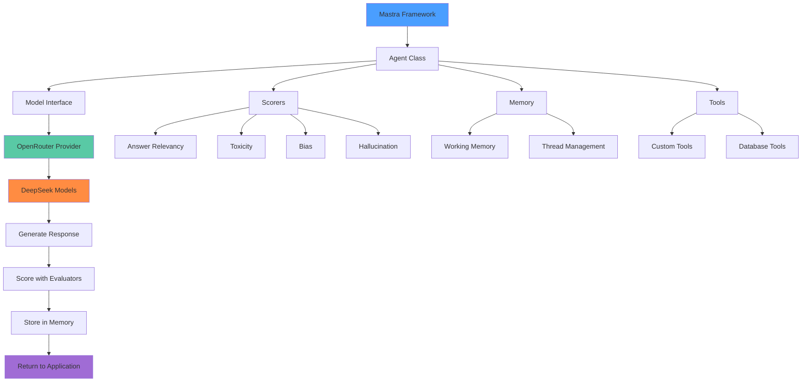

## Environment Configuration

### Required Variables

```bash
# Core configuration
OPENROUTER_API_KEY=sk-or-v1-your-api-key-here

# Optional configuration
OPENROUTER_SITE_NAME="Nomadically.work"
OPENROUTER_SITE_URL="https://nomadically.work"
```

### Deployment Flow

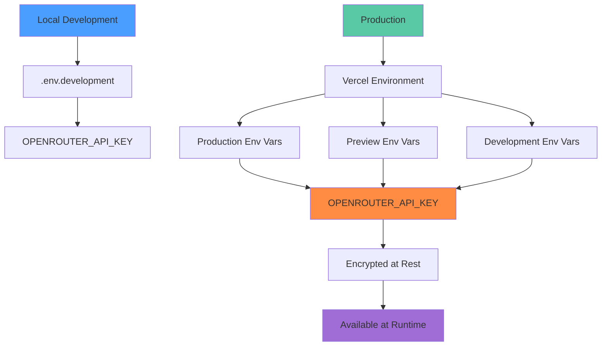

## Performance Characteristics

### Model Comparison

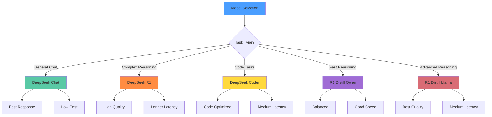

## Benefits

### OpenRouter Advantages

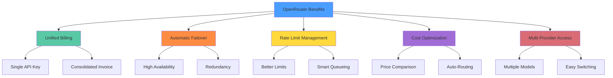

## Testing Strategy

### Test Coverage

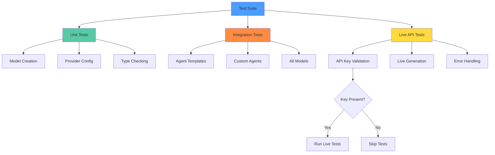

Run tests with:

```bash
pnpm test:openrouter
```

## Type Safety

### TypeScript Types

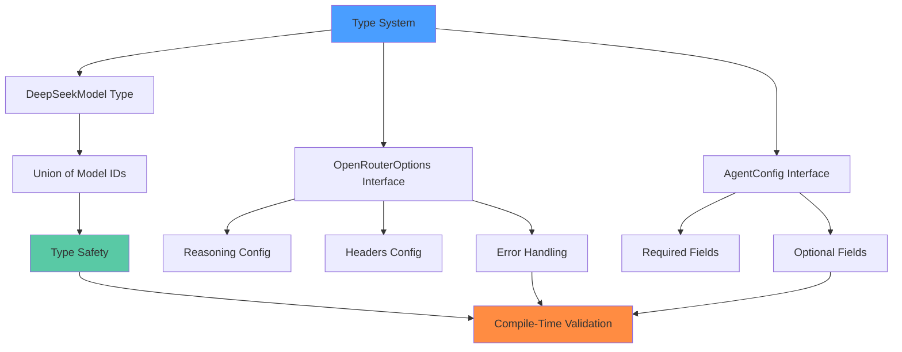

## Migration Path

### From Direct DeepSeek SDK

```mermaid
graph TD
    A[Direct DeepSeek] --> B[Migration Steps]

    B --> C[1. Update Imports]
    C --> H["Replace @ai-sdk/deepseek"]
    C --> I["Import from @/openrouter"]

    B --> D[2. Change Model Creation]
    D --> J[deepseek → deepseekModels.chat]

    B --> E[3. Update Config]
    E --> K[Add OPENROUTER_API_KEY]

    B --> F[4. Test Integration]
    F --> L[Run Test Suite]

    B --> G[5. Deploy]
    G --> M[Push to Production]

    style A fill:#d96c75
    style B fill:#4a9eff
    style M fill:#59c9a5
```

## Resources

- **OpenRouter API**: [openrouter.ai/docs](https://openrouter.ai/docs)
- **DeepSeek Models**: [openrouter.ai/models?q=deepseek](https://openrouter.ai/models?q=deepseek)
- **Mastra Framework**: [mastra.ai/docs](https://mastra.ai/docs)
- **Usage Dashboard**: [openrouter.ai/activity](https://openrouter.ai/activity)

## Summary

This OpenRouter integration provides:

- **Unified API Access** - Single interface for all DeepSeek models  
- **Type-Safe** - Full TypeScript support with compile-time validation  
- **Flexible** - Three levels of abstraction for different use cases  
- **Production-Ready** - Error handling, fallbacks, and monitoring  
- **Well-Tested** - Comprehensive test suite with live API validation  
- **Well-Documented** - Complete examples and migration guides

The module is designed for scalability, maintainability, and developer experience while providing reliable access to state-of-the-art AI models through OpenRouter's infrastructure.
