In the rapidly evolving landscape of Large Language Model (LLM) applications, prompt engineering has emerged as a critical discipline. As teams scale their AI applications, managing prompts across different versions, environments, and use cases becomes increasingly complex. This is where LangSmith's prompt management capabilities shine.

<!-- truncate -->

LangSmith, developed by LangChain, provides a comprehensive platform for managing, versioning, and collaborating on prompts—effectively bringing software engineering best practices to the world of prompt engineering.

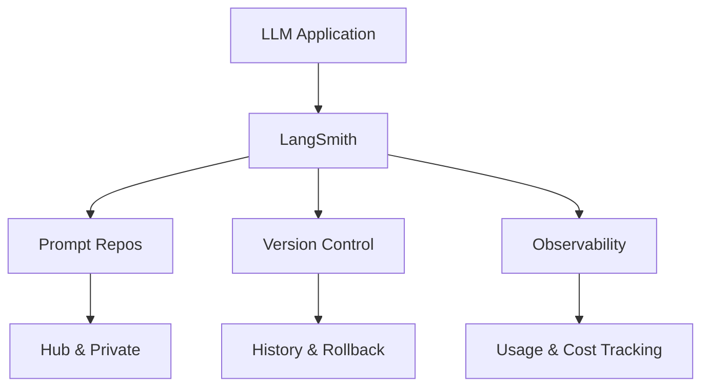

---

## The Challenge of Prompt Management

### Why Prompt Management Matters

Prompts are the primary interface between your application and LLMs. As your AI application grows, you'll face several challenges:

1. **Version Control**: Tracking changes to prompts over time and understanding what worked and what didn't
2. **Collaboration**: Multiple team members working on prompts simultaneously
3. **Environment Management**: Different prompts for development, staging, and production
4. **Performance Tracking**: Understanding which prompt variations perform best
5. **Reusability**: Sharing successful prompts across different projects and teams
6. **Rollback Safety**: Ability to quickly revert to previous versions when something breaks

Without proper prompt management, these challenges can lead to:

- Lost productivity from recreating prompts that were deleted or modified
- Difficulty debugging when prompt changes cause unexpected behavior
- Lack of visibility into what prompts are being used in production
- Inability to A/B test different prompt variations systematically

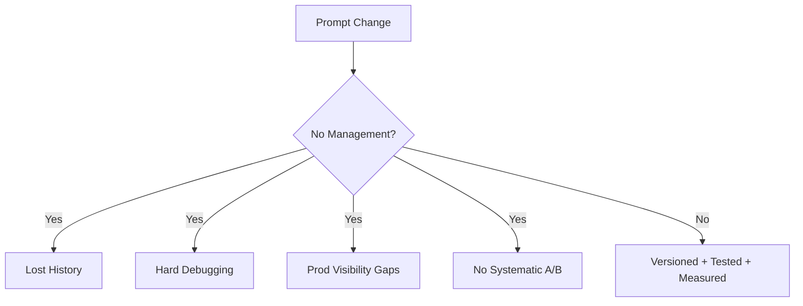

---

## LangSmith Prompt Management Features

### 1. Git-Like Version Control

LangSmith treats prompts as versioned artifacts, similar to how Git manages code. Each change to a prompt creates a new commit with a unique hash.

**Key Features:**

- **Commit History**: Every modification is tracked with metadata
- **Diff Viewing**: Compare versions to see exactly what changed
- **Rollback**: Revert to any previous version instantly
- **Branching**: Work on experimental prompts without affecting production

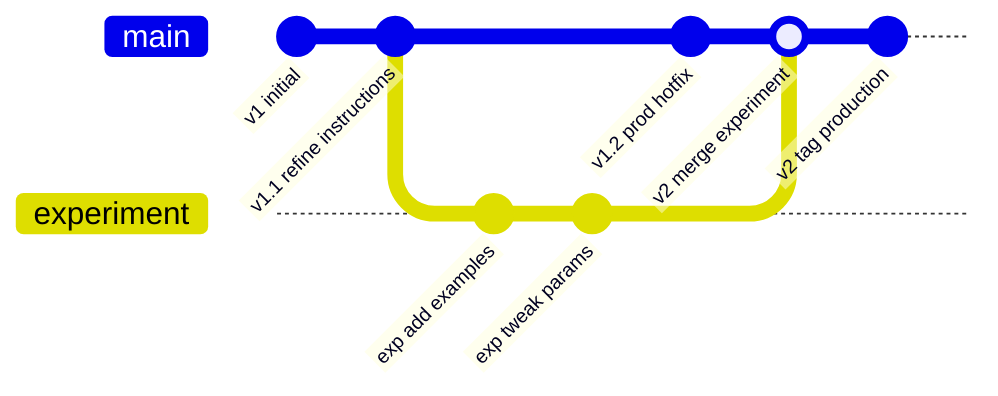

```typescript
// Example from the codebase
export async function fetchLangSmithPromptCommit(
  promptIdentifier: string,
  options?: { includeModel?: boolean },
): Promise<LangSmithPromptCommit> {
  const client = getLangSmithClient();

  const commit = await client.pullPromptCommit(promptIdentifier, options);

  return {
    owner: commit.owner,
    promptName: commit.repo,
    commitHash: commit.commit_hash,
    manifest: commit.manifest,
    examples: commit.examples,
  };
}
```

---

### 2. Collaborative Prompt Repositories

LangSmith organizes prompts into repositories, enabling team collaboration:

- **Public Prompts**: Share prompts with the broader community
- **Private Prompts**: Keep proprietary prompts within your organization
- **Social Features**: Like, download, and fork popular prompts
- **Discovery**: Search and explore prompts created by others

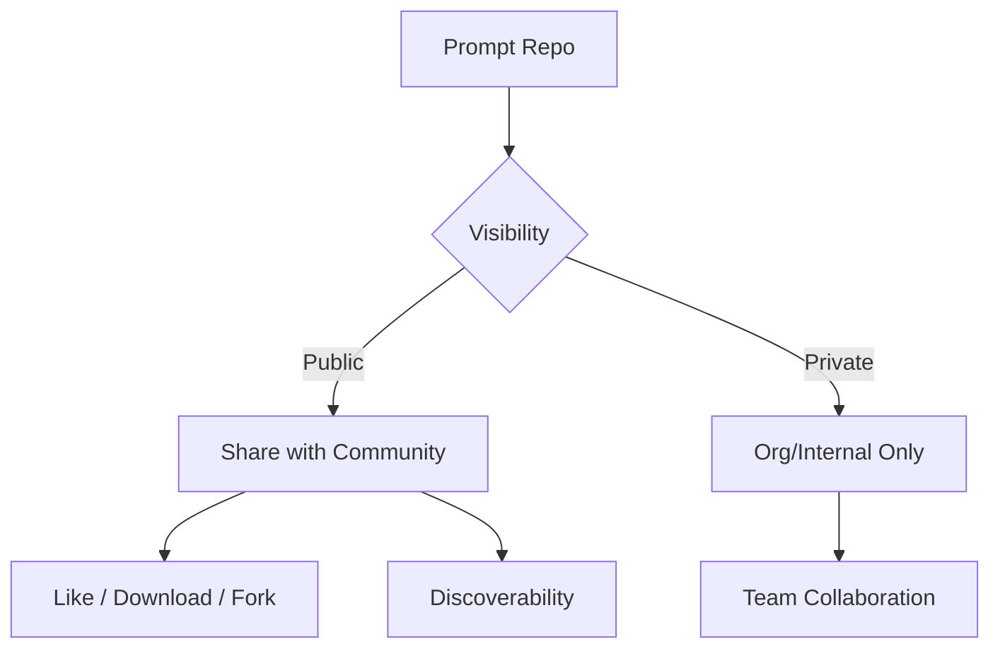

```typescript
// Listing prompts with filters
export async function listLangSmithPrompts(options?: {
  isPublic?: boolean;
  isArchived?: boolean;
  query?: string;
}): Promise<LangSmithPrompt[]> {
  const client = getLangSmithClient();
  const prompts: LangSmithPrompt[] = [];

  for await (const prompt of client.listPrompts(options)) {
    prompts.push({
      id: prompt.id,
      fullName: prompt.full_name,
      isPublic: prompt.is_public,
      tags: prompt.tags,
      numLikes: prompt.num_likes,
      numDownloads: prompt.num_downloads,
      // ... other metadata
    });
  }

  return prompts;
}
```

---

### 3. Rich Metadata and Organization

Prompts in LangSmith can be enriched with metadata:

- **Tags**: Categorize prompts by use case, domain, or team
- **Descriptions**: Document the purpose and usage
- **README**: Provide comprehensive documentation
- **Examples**: Include sample inputs and outputs

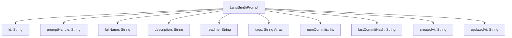

```graphql
type LangSmithPrompt {
  id: String!
  promptHandle: String!
  fullName: String!
  description: String
  readme: String
  tags: [String!]!
  numCommits: Int!
  lastCommitHash: String
  createdAt: String!
  updatedAt: String!
}
```

---

### 4. User Ownership and Access Control

LangSmith implements robust ownership and permission models:

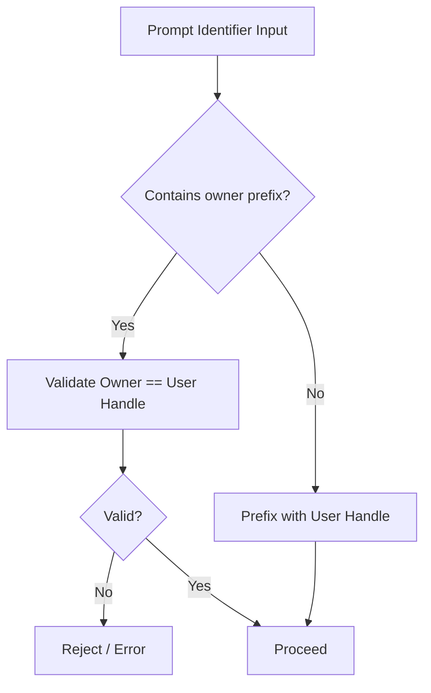

```typescript
export function ensureUserPromptIdentifier(
  promptIdentifier: string,
  userEmail: string,
): string {
  const userHandle = toUserHandle(userEmail);

  // Prompts are namespaced by owner
  if (promptIdentifier.includes("/")) {
    const [owner, ...rest] = promptIdentifier.split("/");

    // Validate owner matches user
    if (owner !== userHandle) {
      throw new Error(`Prompt identifier owner does not match your handle`);
    }
    return promptIdentifier;
  }

  // Add user's handle as prefix
  return `${userHandle}/${promptIdentifier}`;
}
```

---

### 5. Integration with LLM Workflows

LangSmith prompts integrate seamlessly into your application:

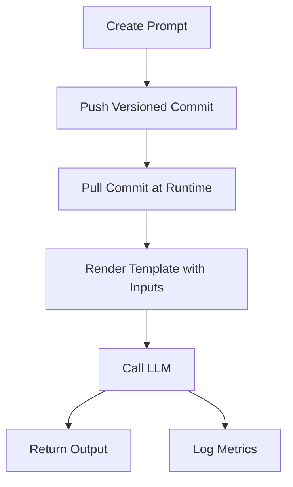

```typescript
// Create a prompt
const prompt = await createLangSmithPrompt("user/customer-support-classifier", {
  description: "Classifies customer support tickets",
  tags: ["support", "classification", "production"],
  isPublic: false,
});

// Push a new version
await pushLangSmithPrompt("user/customer-support-classifier", {
  object: {
    template: "Classify this ticket: {ticket_text}",
    model: "gpt-4",
    temperature: 0.2,
  },
  description: "Improved classification accuracy",
});
```

---

## Best Practices for Prompt Management

### 1. Version Your Prompts Deliberately

Treat prompt changes with the same rigor as code changes:

- **Semantic Versioning**: Use meaningful version identifiers
- **Commit Messages**: Write clear descriptions of what changed and why
- **Test Before Merging**: Validate prompts in development before promoting to production

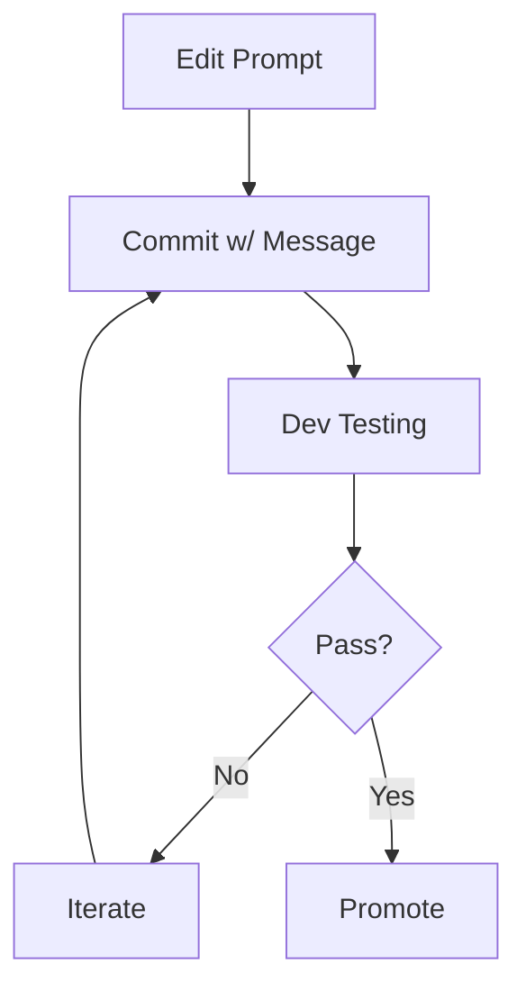

---

### 2. Use Tags Strategically

Tags are powerful for organization and filtering:

```typescript
const productionTags = [
  "env:production",
  "use-case:classification",
  "model:gpt-4",
  "team:support",
  "user:alice@example.com",
];
```

**Recommended Tag Categories:**

- Environment: `env:dev`, `env:staging`, `env:prod`
- Use Case: `use-case:summarization`, `use-case:extraction`
- Model: `model:gpt-4`, `model:claude-3`
- Owner: `owner:team-name`, `user:email@domain.com`
- Status: `status:experimental`, `status:stable`

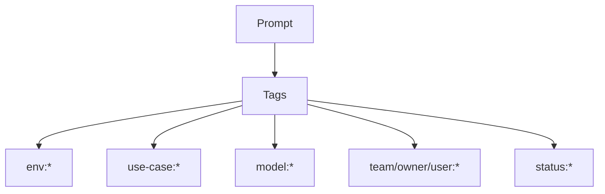

---

### 3. Document Your Prompts

Good documentation is essential for team collaboration:

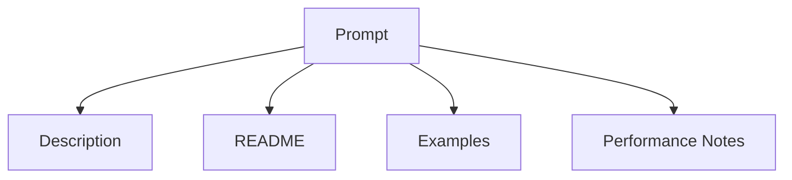

```typescript
await createLangSmithPrompt("user/email-generator", {
  description: "Generates professional email responses",
  readme: `
# Email Generator Prompt

## Purpose
Generates professional, context-aware email responses for customer inquiries.

## Input Format
- customer_name: String
- inquiry_type: "support" | "sales" | "billing"
- context: String (previous conversation)

## Output Format
Professional email in plain text

## Performance Notes
- Works best with GPT-4
- Temperature: 0.7 for natural variation
- Max tokens: 500

## Examples
See attached examples for common scenarios.
  `,
  tags: ["communication", "email", "production"],
});
```

---

### 4. Implement User-Based Filtering

When building multi-tenant applications, filter prompts by user:

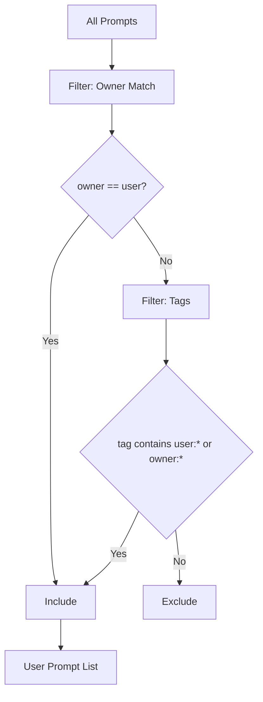

```typescript
// From the GraphQL resolver
const userPrompts = allPrompts.filter((prompt) => {
  // Check user tags
  const hasUserTag = prompt.tags.some(
    (tag) =>
      tag.includes(`user:${context.userEmail}`) ||
      tag.includes(`owner:${context.userEmail}`),
  );

  // Check if owner matches
  const isOwner = prompt.owner === context.userEmail;

  return hasUserTag || isOwner;
});
```

---

### 5. Handle Permissions Gracefully

LangSmith requires specific API permissions. Handle errors clearly:

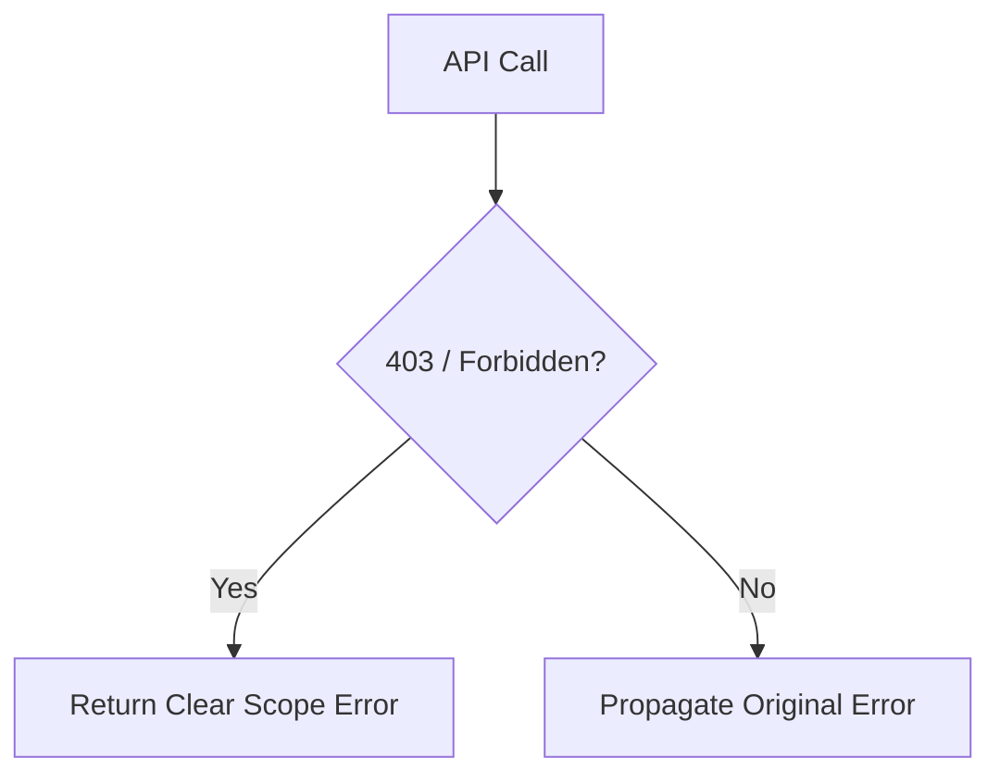

```typescript
export async function createLangSmithPrompt(
  promptIdentifier: string,
  input?: CreateLangSmithPromptInput,
): Promise<LangSmithPrompt> {
  try {
    return await client.createPrompt(promptIdentifier, input);
  } catch (error: any) {
    if (
      error?.message?.includes("403") ||
      error?.message?.includes("Forbidden")
    ) {
      throw new Error(
        "LangSmith API key lacks 'Prompt Engineering' permissions. " +
          "Please generate a new API key with Read, Write, AND " +
          "Prompt Engineering scopes.",
      );
    }
    throw error;
  }
}
```

---

### 6. Use the Hub for Reusable Prompts

LangSmith Hub allows sharing prompts across projects:

- **Fork Popular Prompts**: Start with community-tested templates
- **Share Successful Patterns**: Contribute back to the community
- **Cross-Project Reuse**: Reference the same prompt from multiple applications

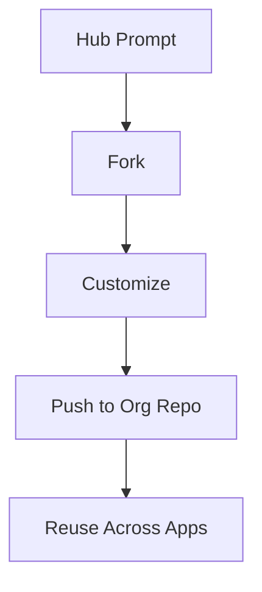

---

## Architectural Patterns

### Pattern 1: GraphQL Wrapper for Type Safety

Wrap the LangSmith SDK with a GraphQL layer for type-safe client access:

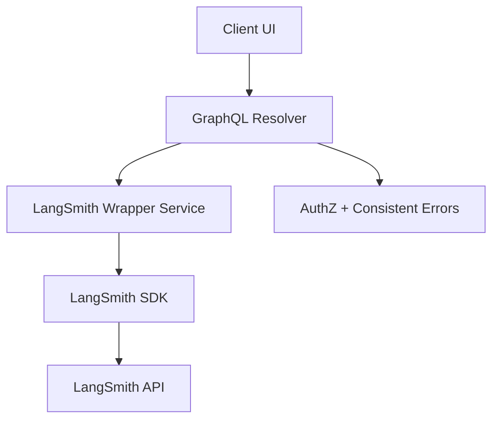

```graphql
extend type Mutation {
  pushLangSmithPrompt(
    promptIdentifier: String!
    input: PushLangSmithPromptInput
  ): String!
}

input PushLangSmithPromptInput {
  object: JSON
  parentCommitHash: String
  description: String
  tags: [String!]
  isPublic: Boolean
}
```

**Benefits:**

- Type safety across frontend and backend
- Centralized permission checking
- Consistent error handling
- Easy to mock for testing

---

### Pattern 2: Singleton Client Pattern

Use a singleton to manage the LangSmith client:

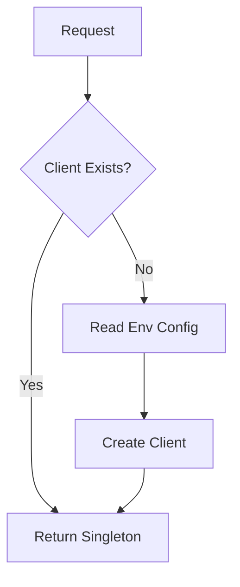

```typescript
let singleton: Client | null = null;

export function getLangSmithClient(): Client {
  if (!singleton) {
    const apiKey = process.env.LANGSMITH_API_KEY;
    if (!apiKey) {
      throw new Error("LANGSMITH_API_KEY required");
    }
    singleton = new Client({ apiKey });
  }
  return singleton;
}
```

**Benefits:**

- Single point of configuration
- Connection pooling
- Consistent client instance across requests

---

### Pattern 3: User Namespace Enforcement

Automatically namespace prompts by user to prevent conflicts:

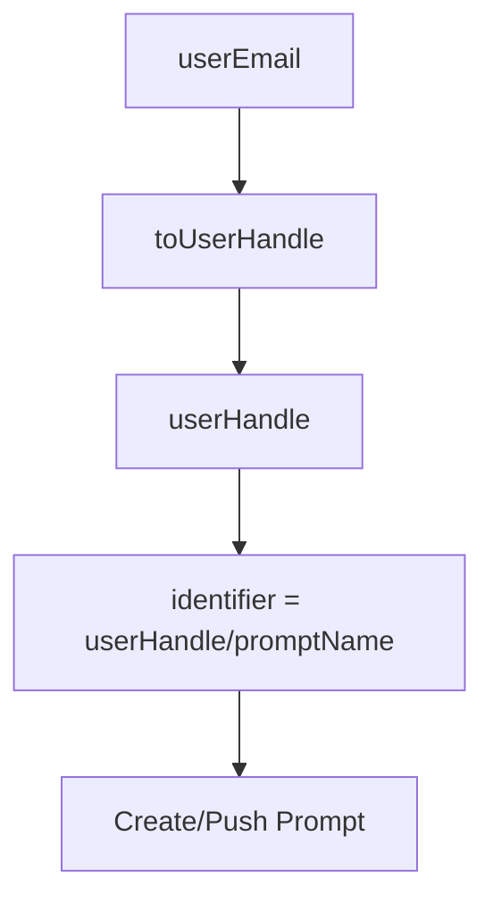

```typescript
export function toUserHandle(userEmail: string): string {
  return userEmail
    .trim()
    .toLowerCase()
    .replace(/[^a-z0-9@._-]+/g, "-")
    .replace(/@/g, "-at-")
    .replace(/\./g, "-");
}

// alice@company.com -> alice-at-company-com/my-prompt
const identifier = `${toUserHandle(userEmail)}/${promptName}`;
```

---

## Integration with Your Application

### Step 1: Environment Setup

```bash
# .env.local
LANGSMITH_API_KEY=lsv2_pt_...
LANGSMITH_API_URL=https://api.smith.langchain.com
```

### Step 2: Client Initialization

```typescript
import { Client } from "langsmith";

const client = new Client({
  apiKey: process.env.LANGSMITH_API_KEY,
  apiUrl: process.env.LANGSMITH_API_URL,
});
```

### Step 3: Create and Version Prompts

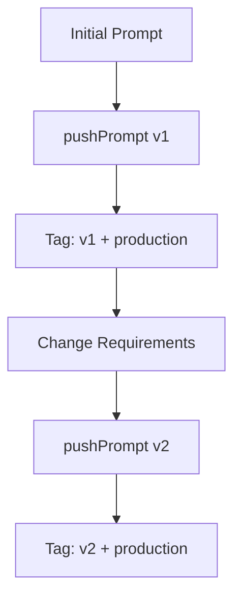

```typescript
// Initial creation
await client.pushPrompt("my-org/summarizer", {
  object: {
    _type: "prompt",
    input_variables: ["text"],
    template: "Summarize: {text}",
  },
  tags: ["v1", "production"],
  isPublic: false,
});

// Update with new version
await client.pushPrompt("my-org/summarizer", {
  object: {
    _type: "prompt",
    input_variables: ["text", "style"],
    template: "Summarize in {style} style: {text}",
  },
  tags: ["v2", "production"],
  isPublic: false,
});
```

### Step 4: Retrieve and Use Prompts

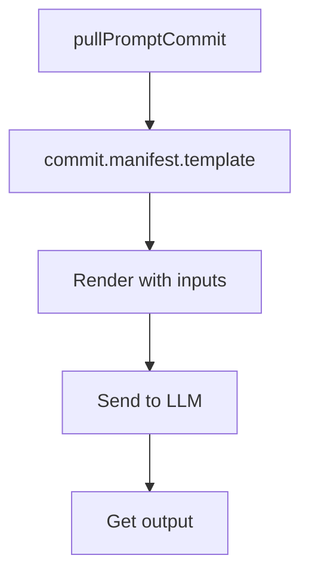

```typescript
// Get latest version
const commit = await client.pullPromptCommit("my-org/summarizer");

// Use the prompt
const template = commit.manifest.template;
const rendered = template
  .replace("{text}", article)
  .replace("{style}", "concise");
```

---

## Monitoring and Analytics

LangSmith provides built-in analytics for prompts:

- **Usage Tracking**: See how often each prompt is used
- **Performance Metrics**: Track latency and success rates
- **Version Comparison**: Compare metrics across versions
- **Cost Analysis**: Monitor token usage per prompt

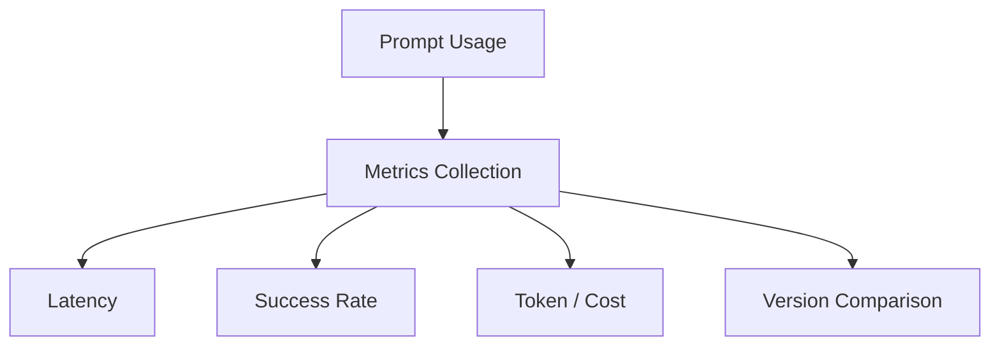

```typescript
interface LangSmithPrompt {
  numViews: number;
  numDownloads: number;
  numLikes: number;
  numCommits: number;
  lastUsedAt?: string;
}
```

---

## Common Pitfalls and Solutions

### Pitfall 1: Missing Permissions

**Problem**: API key doesn't have "Prompt Engineering" scope

**Solution**:

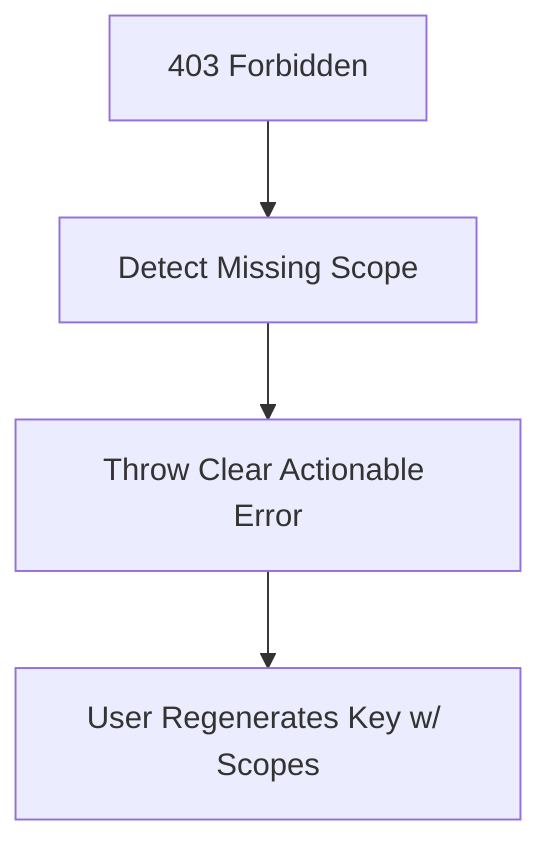

```typescript
// Always check permissions and provide clear error messages
if (error?.message?.includes("403")) {
  throw new Error(
    "Generate API key with Prompt Engineering permissions at " +
      "https://smith.langchain.com/settings",
  );
}
```

---

### Pitfall 2: Unbounded Listing

**Problem**: Listing all prompts can be slow or timeout

**Solution**:

```mermaid
flowchart TD
  A[listPrompts] --> B[Collect]
  B --> C{Reached MAX?}
  C -->|No| B
  C -->|Yes| D[Stop + Return]
```

```typescript
// Limit results and provide pagination
const MAX_PROMPTS = 100;
for await (const prompt of client.listPrompts(options)) {
  prompts.push(prompt);
  if (prompts.length >= MAX_PROMPTS) break;
}
```

---

### Pitfall 3: Naming Conflicts

**Problem**: Multiple users trying to create prompts with same name

**Solution**:

```mermaid
flowchart TD
  A[promptName] --> B[Namespace by org/user]
  B --> C[unique identifier]
  C --> D[createPrompt succeeds]
```

```typescript
// Always namespace by user/organization
const namespaced = `${organization}/${promptName}`;
await client.createPrompt(namespaced, options);
```

---

## Advanced Features

### Prompt Playground Integration

LangSmith provides a visual playground for testing prompts:

1. Edit prompt templates interactively
2. Test with sample inputs
3. Compare outputs across models
4. Iterate quickly without code changes
5. Save successful variations as new commits

```mermaid
flowchart TD
  A[Playground Edit] --> B[Test Inputs]
  B --> C[Compare Outputs]
  C --> D[Select Best Variant]
  D --> E[Save as Commit]
```

---

### Example Sets

Attach example inputs/outputs to prompts:

```mermaid
flowchart TD
  A[Prompt Commit] --> B[Attach Examples]
  B --> C[Inputs]
  B --> D[Expected Outputs]
  A --> E[Better Testing + Sharing]
```

```typescript
await client.pushPrompt("classifier", {
  object: promptTemplate,
  examples: [
    {
      inputs: { text: "I love this product!" },
      outputs: { sentiment: "positive" },
    },
    {
      inputs: { text: "Terrible experience" },
      outputs: { sentiment: "negative" },
    },
  ],
});
```

---

### Labels for Deployment Stages

Use labels to mark deployment stages:

```mermaid
flowchart TD
  A[Commit Hash] --> B[Tag env:dev]
  B --> C[Tag env:staging]
  C --> D[Tag env:production]
```

```typescript
// Tag specific commits for each environment
await client.updatePrompt("my-prompt", {
  tags: ["production", "v2.1.0"],
});
```

---

## Migration Strategy

### Migrating from Hardcoded Prompts

1. **Audit**: Identify all prompts in your codebase
2. **Extract**: Move prompts to LangSmith
3. **Refactor**: Replace hardcoded strings with LangSmith fetches
4. **Test**: Validate behavior matches
5. **Deploy**: Roll out gradually with feature flags

```mermaid
flowchart TD
  A[Audit] --> B[Extract]
  B --> C[Refactor]
  C --> D[Test]
  D --> E[Gradual Deploy]
```

Example migration:

```typescript
// Before
const prompt = "Summarize this text: {text}";

// After
const commit = await client.pullPromptCommit("my-org/summarizer");
const prompt = commit.manifest.template;
```

---

### Migrating from Custom Storage

1. **Export**: Extract prompts from your current system
2. **Bulk Create**: Use LangSmith API to create prompts
3. **Preserve History**: Import version history as commits
4. **Update References**: Point code to LangSmith
5. **Deprecate**: Phase out old system

```mermaid
flowchart TD
  A[Export] --> B[Bulk Create]
  B --> C[Import History]
  C --> D[Update References]
  D --> E[Deprecate Old System]
```

---

## Conclusion

LangSmith's prompt management capabilities bring professional software engineering practices to the world of LLM applications. By treating prompts as versioned, collaborative artifacts, teams can:

- **Move Faster**: Test and iterate on prompts without fear
- **Collaborate Better**: Work together on prompts with clear ownership
- **Deploy Safely**: Roll back problematic changes instantly
- **Scale Confidently**: Manage hundreds of prompts across projects
- **Share Knowledge**: Learn from community-tested patterns

As AI applications grow in complexity, proper prompt management becomes not just a nice-to-have but a necessity. LangSmith provides the infrastructure to manage this critical aspect of your AI stack.

```mermaid
flowchart TD
  A[Scale AI App] --> B[Need Prompt Management]
  B --> C[Versioning]
  B --> D[Collaboration]
  B --> E[Safe Deployments]
  B --> F[Analytics]
  C --> G[Move Faster]
  D --> H[Work Better Together]
  E --> I[Rollback Quickly]
  F --> J[Optimize with Evidence]
```

---

## Additional Resources

- [LangSmith Documentation](https://docs.smith.langchain.com/)
- [LangSmith Prompt Hub](https://smith.langchain.com/hub)
- [LangChain Prompt Engineering Guide](https://python.langchain.com/docs/modules/model_io/prompts/)
- [Best Practices for Prompt Engineering](https://help.openai.com/en/articles/6654000-best-practices-for-prompt-engineering)
