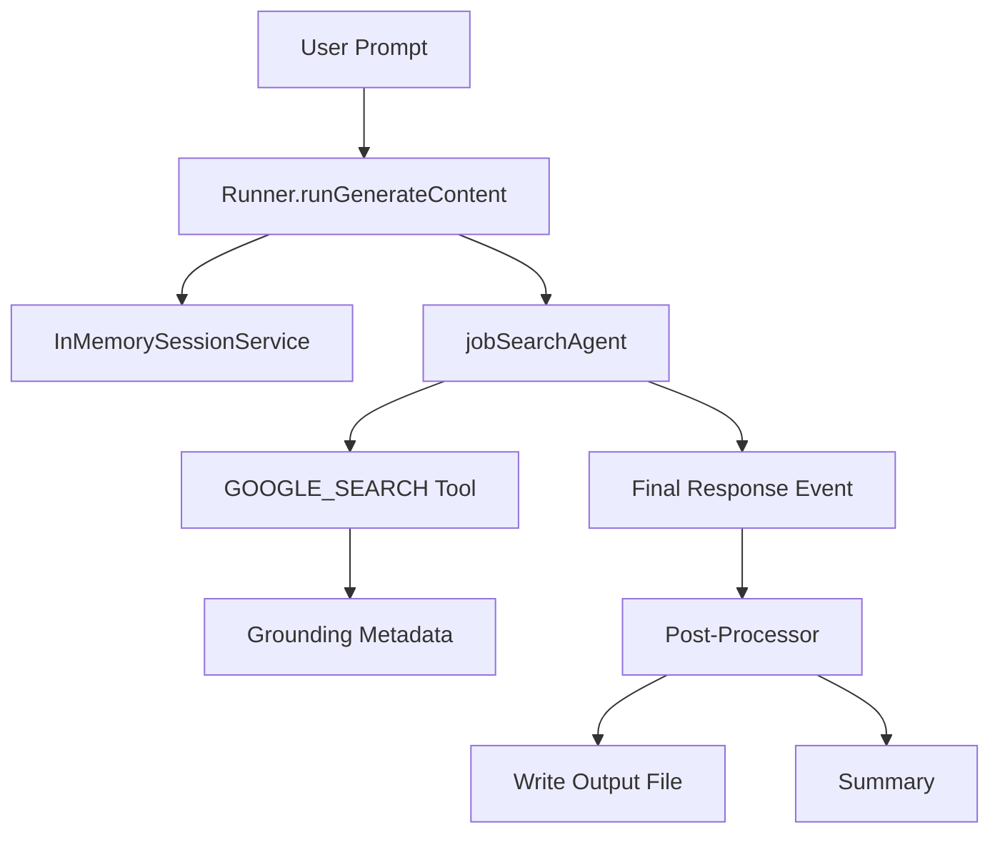
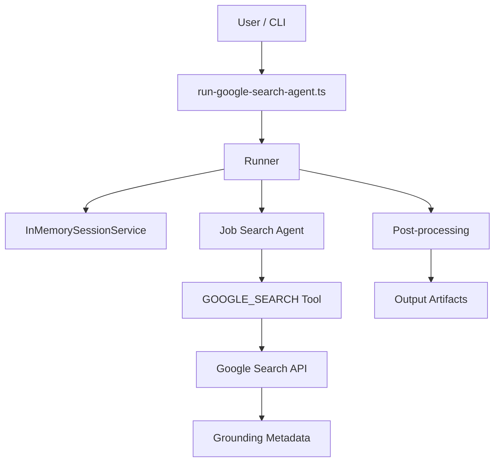
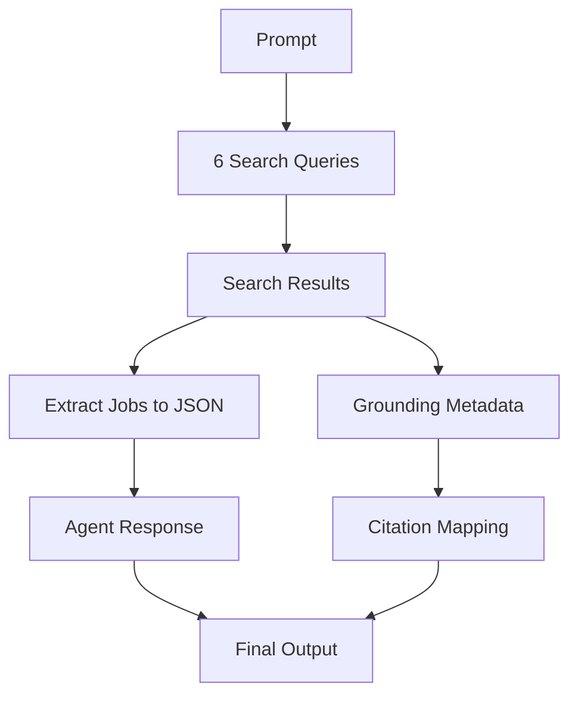

## Introduction

This article documents the implementation of an AI-powered job search agent using **Google’s Agent Development Kit (ADK)** with **Google Search grounding**. The agent demonstrates how to build intelligent search applications that combine the reasoning capabilities of large language models with real-time web search data.

## What is Google ADK?

**Google’s Agent Development Kit (ADK)** is a TypeScript framework for building AI agents powered by Gemini models. Released in late 2025, ADK provides:

- **Agent orchestration** — Define agents with specific tools and instructions
- **Tool integration** — Built-in tools like `GOOGLE_SEARCH` for grounding
- **Session management** — Persistent conversation state across interactions
- **Event streaming** — Real-time access to agent execution events
- **Grounding metadata** — Access to search sources, citations, and web queries

### Key features

```ts
import { LlmAgent, GOOGLE_SEARCH } from '@google/adk';

const agent = new LlmAgent({
  name: 'searchAgent',
  model: 'gemini-2.5-flash',
  tools: [GOOGLE_SEARCH],
  instruction: 'Your detailed instructions here...'
});
````

The ADK’s `GOOGLE_SEARCH` tool enables **grounding**—anchoring LLM responses in real web search results rather than relying solely on training data.

## The search agent architecture

### High-level flow (event stream + grounding)



### Top-down diagrams

#### Top-down architecture (layered)



#### Top-down data flow (what moves where)



### Agent design

Our job search agent is built with a clear purpose: find remote AI consulting opportunities using structured search strategies.

**File:** `/src/google/search-agent.ts`

```ts
export const searchAgent = new LlmAgent({
  name: 'jobSearchAgent',
  model: 'gemini-2.5-flash',
  tools: [GOOGLE_SEARCH],
  instruction: `You are an expert job search assistant specializing in AI/GenAI roles...

ALWAYS perform Google Search first to get real-time job listings.
Extract actual job data from search results...

Return structured JSON with job listings...`
});
```

### Agent instructions

The agent is instructed to:

1. **Execute targeted searches** — Use specific boolean search operators
2. **Extract structured data** — Parse job listings into JSON format
3. **Apply filters** — Focus on last 7 days, remote-only, consultancy roles
4. **Include metadata** — Company details, remote scope, EU eligibility

### Search strategy

The agent generates six complementary search queries:

```ts
const queries = [
  'fully remote "AI consultant" agency OR consultancy "client-facing" RAG OR LLM (last 7 days)',
  'fully remote "generative AI engineer" agency "client delivery" RAG OR agents (last 7 days)',
  'fully remote "LLM architect" consultancy "client engagement" RAG OR agents (last 7 days)',
  'fully remote "AI solutions architect" consultancy "client facing" (last 7 days)',
  'remote "AI delivery manager" consultancy LLM OR GenAI (last 7 days)',
  'fully remote "AI specialist" consulting "client projects" EU (last 7 days)'
];
```

This multi-query approach captures:

- Different role titles (consultant, engineer, architect, specialist)
- Various technical focuses (RAG, agents, LLM)
- Client-facing delivery emphasis
- Recent postings only (7-day window)

## Implementation details

### Runner architecture

**File:** `/src/google/runner.ts`

The runner manages agent execution and extracts grounding metadata:

```ts
export async function runSearchAgent(
  prompt: string,
  options: { saveToFile?: boolean; outputDir?: string } = {}
): Promise<void> {
  const sessionService = new InMemorySessionService();
  const sessionId = `session-${Date.now()}`;

  const runner = new Runner(rootAgent, sessionService);

  for await (const event of runner.runGenerateContent(sessionId, { text: prompt })) {
    if (isFinalResponse(event)) {
      const content = stringifyContent(event.content);
      const grounding = getGroundingArrays(event);

      // Process and save results
    }
  }
}
```

### Grounding metadata extraction

The critical feature is extracting **grounding metadata**—the search sources and citation mappings:

```ts
function getGroundingArrays(event: any): GroundingData {
  const metadata = event.groundingMetadata;

  return {
    groundingChunks: metadata?.groundingChunks || [],
    groundingSupports: metadata?.groundingSupports || [],
    webSearchQueries: metadata?.webSearchQueries || [],
    searchEntryPoint: metadata?.searchEntryPoint
  };
}
```

This provides:

- **`groundingChunks`** — Source URLs and titles
- **`groundingSupports`** — Citation mappings linking response segments to sources
- **`webSearchQueries`** — The actual search queries executed by Google
- **`searchEntryPoint`** — HTML content with Google Search suggestions

### Citation integration

The runner adds citation markers `[1,2,3]` to the agent’s response:

```ts
function addCitationMarkersToSegment(
  text: string,
  supports: any[]
): string {
  const indices = supports
    .flatMap(s => s.groundingChunkIndices || [])
    .filter((v, i, a) => a.indexOf(v) === i)
    .map(i => i + 1);

  return indices.length > 0
    ? `${text}[${indices.join(',')}]`
    : text;
}
```

### JSON output

Results are saved to timestamped JSON files:

```ts
const output = {
  timestamp: new Date().toISOString(),
  query: prompt,
  rawResponse: content,
  data: parsedData,
  summary: summary,
  webSearchQueries: grounding.webSearchQueries,
  sources: sources,
  renderedContent: grounding.searchEntryPoint?.renderedContent
};

fs.writeFileSync(
  path.join(outputDir, `job-search-results-${timestamp}.json`),
  JSON.stringify(output, null, 2)
);
```

## Running the agent

### Execution script

**File:** `/scripts/run-google-search-agent.ts`

```ts
import dotenv from 'dotenv';
import { runSearchAgent } from '../src/google/index';

// Load environment variables
dotenv.config({ path: '.env' });
dotenv.config({ path: '.env.local', override: true });

// Validate API key
if (!process.env.GEMINI_API_KEY) {
  console.error('❌ Error: GEMINI_API_KEY not found');
  process.exit(1);
}

// Execute search
const prompt = `Find 10 fully-remote AI / GenAI roles at agencies or consultancies.
Prefer client-facing delivery roles, especially those involving RAG, agents, or LLM implementation.
Include EU eligibility information.`;

runSearchAgent(prompt, { saveToFile: true, outputDir: './results' });
```

### Running the search

```bash
npx tsx scripts/run-google-search-agent.ts
```

## Results and grounding analysis

### Search execution

The agent successfully executed 6 web search queries and identified **10 distinct job sources**:

1. **remoterocketship.com** — Remote-first job platform
2. **pinpointhq.com** — Tech recruitment
3. **yutori.com** — Remote opportunities
4. **djinni.co** — Tech talent marketplace
5. **talent.com** — Global job aggregator
6. **shine.com** — Job search platform
7. **shiza.ai** — AI-specialized job board
8. **studysmarter.co.uk** — Career resources (3 matches)

### Grounding metadata

The response included rich grounding data:

**Web Search Queries Executed:**

```json
[
  "fully remote \"AI consultant\" agency OR consultancy OR \"professional services\" \"client-facing\" RAG OR LLM OR \"generative AI\" (last 7 days)",
  "fully remote \"generative AI engineer\" agency OR consultancy OR \"professional services\" \"client delivery\" RAG OR LLM OR agents (last 7 days)",
  "fully remote \"LLM architect\" consultancy \"client engagement\" RAG OR agents (last 7 days)",
  "fully remote \"AI solutions architect\" consultancy \"client facing\" (last 7 days)",
  "remote \"AI delivery manager\" consultancy LLM OR GenAI (last 7 days)",
  "fully remote \"AI specialist\" consulting \"client projects\" EU (last 7 days)"
]
```

**Source Citations:**

```json
[
  {
    "index": 1,
    "title": "remoterocketship.com",
    "url": "https://vertexaisearch.cloud.google.com/grounding-api-redirect/..."
  }
]
```

**Search Entry Point:**
The `renderedContent` field contains Google Search’s HTML with interactive search chips, providing users with clickable query refinements.

## Technical challenges and lessons

### Challenge 1: Empty responses

**Problem:** Initial implementation returned `content: null` despite successful execution.

**Root cause:** Using `AgentTool` to wrap another agent with `GOOGLE_SEARCH` created conflicts.

**Solution:** Use `GOOGLE_SEARCH` directly as the sole tool in the agent—ADK requires grounding tools to be the only tool configured.

### Challenge 2: Structured data extraction

**Problem:** Agent returned Google Search HTML suggestions instead of extracted job data.

**Solution:** Enhanced instructions with explicit output format requirements and processing rules:

```ts
instruction: `
Rules:
1. ALWAYS perform Google Search first
2. Extract actual job data from search results
3. Format as JSON with fields: title, company, remote_scope, url, posted_date, etc.
4. Search for jobs posted within the LAST 7 DAYS only
`
```

### Challenge 3: API key configuration

**Problem:** `GEMINI_API_KEY` not found in environment.

**Solution:** Support multiple `.env` files with precedence:

```ts
dotenv.config({ path: '.env' });
dotenv.config({ path: '.env.local', override: true });
```

## Best practices

### 1. Single tool limitation

When using `GOOGLE_SEARCH`, it must be the **only tool** in the agent:

```ts
// ✅ Correct
const agent = new LlmAgent({
  tools: [GOOGLE_SEARCH]
});

// ❌ Incorrect - will cause issues
const agent = new LlmAgent({
  tools: [GOOGLE_SEARCH, CODE_EXECUTION, someCustomTool]
});
```

### 2. Explicit instructions

Provide clear, structured instructions for the LLM:

```ts
instruction: `
Purpose: [What the agent does]

Process:
1. [Step 1]
2. [Step 2]

Output Format:
{
  "field": "description"
}

Rules:
- [Rule 1]
- [Rule 2]
`
```

### 3. Grounding metadata access

Access grounding data from the **final response event**:

```ts
for await (const event of runner.runGenerateContent(sessionId, prompt)) {
  if (isFinalResponse(event)) {
    const grounding = event.groundingMetadata;
    const chunks = grounding?.groundingChunks || [];
  }
}
```

### 4. Event stream debugging

Log event types to understand agent execution flow:

```ts
for await (const event of runner.runGenerateContent(...)) {
  console.log('Event:', {
    finishReason: event.finishReason,
    hasContent: !!event.content,
    hasGrounding: !!event.groundingMetadata
  });
}
```

## Conclusion

Google’s ADK provides a powerful framework for building grounded AI agents. Key takeaways:

- **Grounding is essential** — Real-time search data makes agents more accurate and current
- **Citations add credibility** — Extracted source URLs enable verification
- **Event streams enable debugging** — Real-time event monitoring aids development
- **Instructions matter** — Clear, structured prompts yield better results
- **Multi-query strategies work** — Complementary searches capture diverse results

The job search agent demonstrates how ADK can transform a simple search task into an intelligent, automated workflow with structured outputs and verifiable sources.

## Technical stack

- **@google/adk** v0.3.0 — Agent Development Kit
- **gemini-2.5-flash** — LLM model with grounding support
- **TypeScript** — Type-safe agent development
- **Node.js 24+** — Runtime environment
- **tsx** — TypeScript execution
- **dotenv** — Environment configuration

## Repository structure

```
/src/google/
  search-agent.ts    # Agent definition with GOOGLE_SEARCH
  runner.ts          # Execution logic and grounding extraction
  index.ts           # Public exports
  README.md          # Setup and usage documentation

/scripts/
  run-google-search-agent.ts  # Executable runner script

/results/
  job-search-results-{timestamp}.json  # Output files
```
