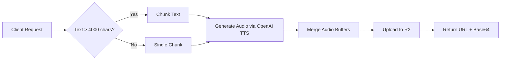
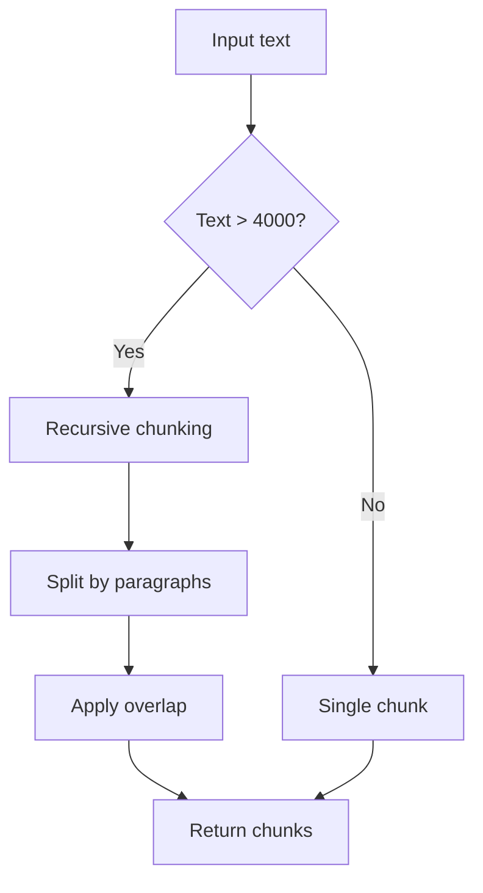
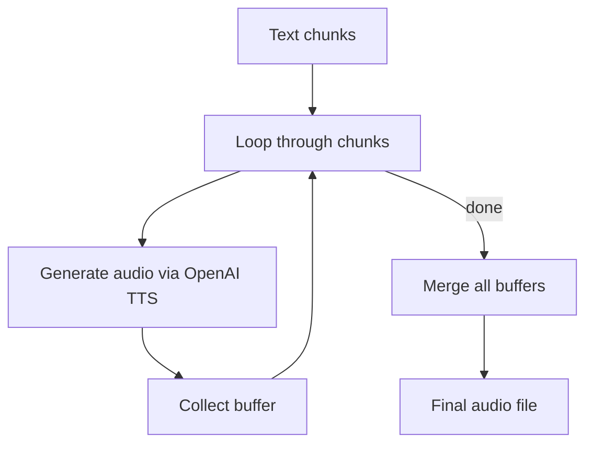
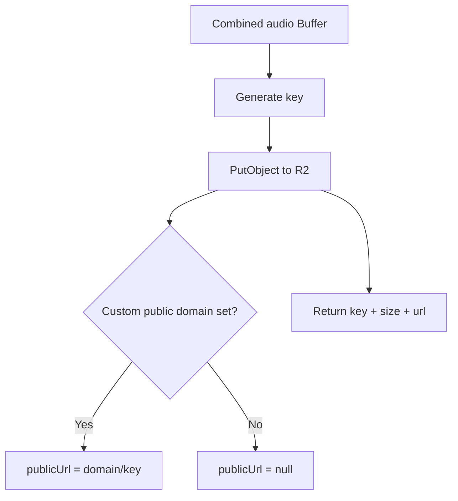
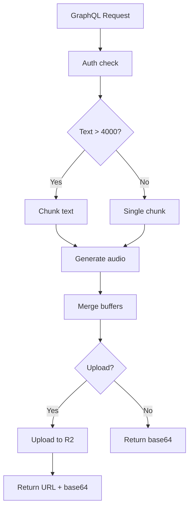
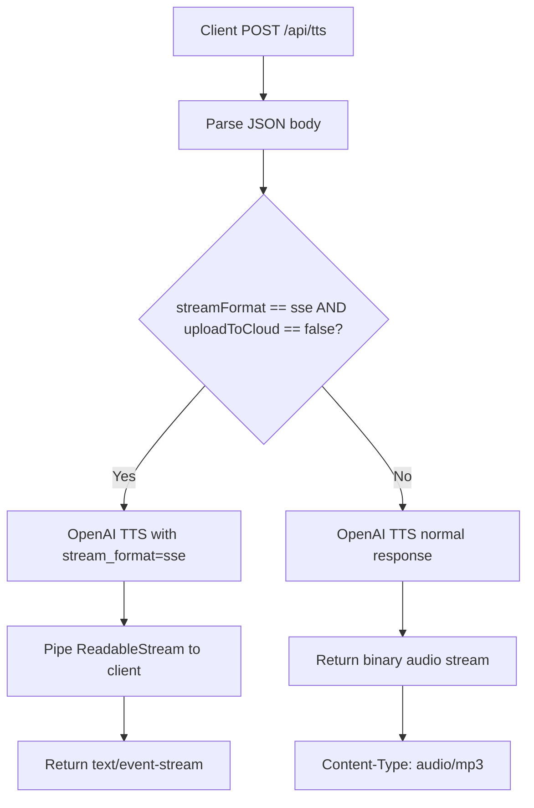
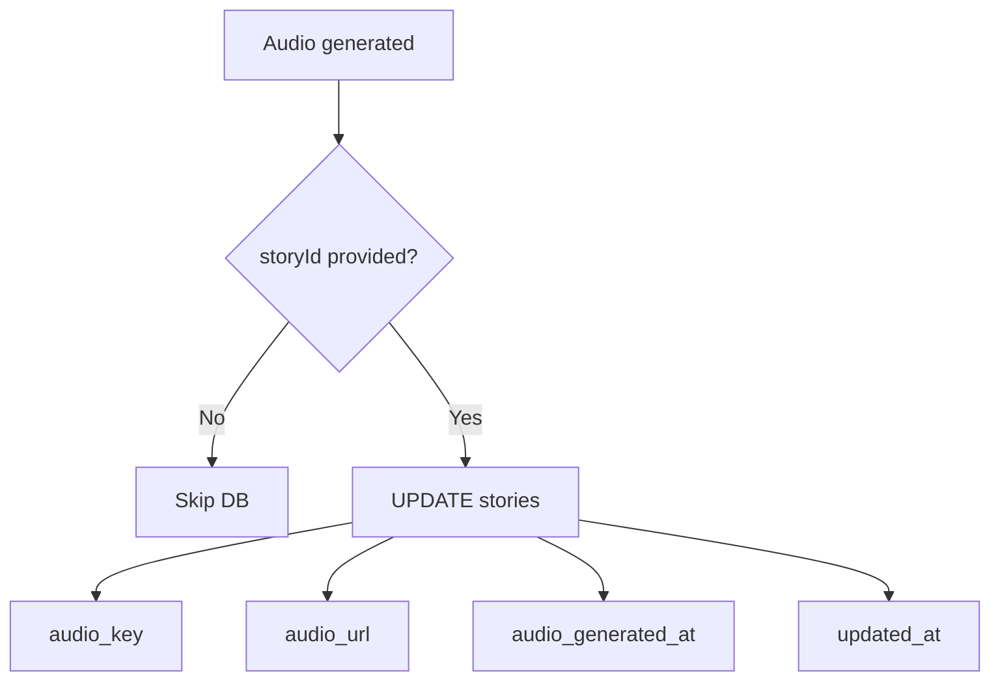

# Streaming OpenAI TTS to Cloudflare R2: A Complete Implementation

This article documents a production implementation of OpenAI's Text-to-Speech (TTS) API with automatic chunking for long-form content and seamless upload to Cloudflare R2 storage.

## Architecture Overview

The system provides two API entrypoints for audio generation:

1. **GraphQL Mutation** (`generateOpenAIAudio`) — used by the main app for story audio
2. **REST API** (`/api/tts`) — provides flexible streaming options and direct upload

Both endpoints support:

- **Automatic text chunking** for content exceeding 4000 characters
- **Audio merging** for seamless playback of long content
- **Cloudflare R2 upload** with public CDN URLs
- **Base64 fallback** for immediate playback while uploading
- **Metadata tracking** (duration, voice, model, etc.)



## OpenAI TTS Integration

### Voice Selection

Defaults to **onyx** but supports all OpenAI TTS voices:

- alloy, ash, ballad, coral, echo, fable
- **onyx** (default), nova, sage, shimmer
- verse, marin, cedar

### Model Selection

Supports three models:

- `gpt-4o-mini-tts` (default) — fast, efficient, high quality
- `tts-1` — standard quality
- `tts-1-hd` — high definition audio

### Audio Formats

Supports multiple output formats:

- **mp3** (default) — best compatibility
- opus, aac, flac, wav, pcm

## Text Chunking for Long Content

OpenAI TTS has a 4096 character limit. This implementation uses Mastra RAG’s recursive chunking strategy to intelligently split long text.

```typescript
import { MDocument } from "@mastra/rag";

const MAX_CHARS = 4000; // Buffer below OpenAI's 4096 limit

async function chunkTextForSpeech(text: string): Promise<string[]> {
  const doc = MDocument.fromText(text);

  const chunks = await doc.chunk({
    strategy: "recursive",
    maxSize: MAX_CHARS,
    overlap: 50,
    separators: ["\n\n", "\n", ". ", "! ", "? "],
  });

  return chunks.map((chunk) => chunk.text);
}
```

**Key features:**

- Respects paragraph breaks (`\n\n`)
- Falls back to sentence boundaries (`.`, `!`, `?`)
- 50-character overlap prevents awkward breaks
- Maintains narrative flow across chunks



## Audio Merging

When text is chunked, each piece is converted to audio separately, then merged into a single file:

```typescript
// Generate audio for each chunk
const audioChunks: Buffer[] = [];

for (const chunk of chunks) {
  const response = await openai.audio.speech.create({
    model: "gpt-4o-mini-tts",
    voice: "onyx",
    input: chunk,
    response_format: "mp3",
    speed: 0.9,
  });

  const buffer = Buffer.from(await response.arrayBuffer());
  audioChunks.push(buffer);
}

// Combine into single audio file
const combined = Buffer.concat(audioChunks);
```

**Why merge?**

- Single file = simpler playback
- No gaps between chunks
- Easier to upload and share
- Better browser compatibility



## Cloudflare R2 Upload

### R2 Client Setup

Uses AWS SDK v3 with Cloudflare R2 endpoints:

```typescript
import { S3Client, PutObjectCommand } from "@aws-sdk/client-s3";

const r2Client = new S3Client({
  region: "auto",
  endpoint: `https://${R2_ACCOUNT_ID}.r2.cloudflarestorage.com`,
  credentials: {
    accessKeyId: R2_ACCESS_KEY_ID,
    secretAccessKey: R2_SECRET_ACCESS_KEY,
  },
});
```

### Upload Function

```typescript
export async function uploadToR2(options: {
  key: string;
  body: Buffer;
  contentType?: string;
  metadata?: Record<string, string>;
}): Promise<{
  key: string;
  publicUrl: string | null;
  bucket: string;
  sizeBytes: number;
}> {
  const { key, body, contentType = "audio/mpeg", metadata = {} } = options;

  await r2Client.send(
    new PutObjectCommand({
      Bucket: R2_BUCKET_NAME,
      Key: key,
      Body: body,
      ContentType: contentType,
      Metadata: metadata,
    }),
  );

  const publicUrl = R2_PUBLIC_DOMAIN ? `${R2_PUBLIC_DOMAIN}/${key}` : null;

  return {
    key,
    publicUrl,
    bucket: R2_BUCKET_NAME,
    sizeBytes: body.length,
  };
}
```

### Key Generation

Unique keys with timestamps prevent collisions:

```typescript
export function generateAudioKey(prefix?: string): string {
  const timestamp = Date.now();
  const random = Math.random().toString(36).substring(2, 15);
  return `${prefix ? `${prefix}/` : ""}audio-${timestamp}-${random}.mp3`;
}
```

Example output: `graphql-tts/audio-1707839472156-9k2jd8x4.mp3`



## Metadata Extraction

The system calculates audio duration using `music-metadata`:

```typescript
import { parseBuffer } from "music-metadata";

let duration: number | null = null;
try {
  const metadata = await parseBuffer(audioBuffer, {
    mimeType: "audio/mp3",
  });
  duration = metadata.format.duration || null;
} catch (error) {
  console.warn("Failed to parse audio duration:", error);
}
```

Metadata stored with upload:

- `voice` — TTS voice used
- `model` — OpenAI model
- `textLength` — original text length
- `chunks` — number of chunks (if split)
- `generatedBy` — user email
- `instructions` — custom TTS instructions (optional)

## GraphQL Implementation

### Schema Definition

```graphql
input GenerateOpenAIAudioInput {
  text: String!
  storyId: Int
  voice: OpenAITTSVoice
  model: OpenAITTSModel
  speed: Float
  responseFormat: OpenAIAudioFormat
  uploadToCloud: Boolean
  instructions: String
}

type GenerateOpenAIAudioResult {
  success: Boolean!
  message: String
  audioBuffer: String
  audioUrl: String
  key: String
  sizeBytes: Int
  duration: Float
}

type Mutation {
  generateOpenAIAudio(input: GenerateOpenAIAudioInput!): GenerateOpenAIAudioResult!
}
```

### Resolver Implementation

```typescript
export const generateOpenAIAudio: MutationResolvers["generateOpenAIAudio"] = async (
  _parent,
  args,
  ctx,
) => {
  const userEmail = ctx.userEmail;
  if (!userEmail) {
    throw new Error("Authentication required");
  }

  const {
    text,
    storyId,
    voice = "ONYX",
    model = "GPT_4O_MINI_TTS",
    speed = 0.9,
    responseFormat = "MP3",
    uploadToCloud,
  } = args.input;

  // Map GraphQL enums to OpenAI API values
  const openAIVoice = voice.toLowerCase();
  const openAIModel = model === "GPT_4O_MINI_TTS" ? "gpt-4o-mini-tts" : "tts-1";
  const format = responseFormat.toLowerCase();

  // Handle chunking if needed
  if (text.length > MAX_CHARS) {
    const chunks = await chunkTextForSpeech(text);
    const audioChunks: Buffer[] = [];

    for (const chunk of chunks) {
      const response = await openai.audio.speech.create({
        model: openAIModel,
        voice: openAIVoice,
        input: chunk,
        response_format: format,
        speed,
      });

      audioChunks.push(Buffer.from(await response.arrayBuffer()));
    }

    const combined = Buffer.concat(audioChunks);

    // Upload to R2
    if (uploadToCloud) {
      const key = generateAudioKey("graphql-tts");
      const result = await uploadToR2({
        key,
        body: combined,
        contentType: `audio/${format}`,
        metadata: {
          voice: openAIVoice,
          model: openAIModel,
          textLength: text.length.toString(),
          chunks: chunks.length.toString(),
          generatedBy: userEmail,
        },
      });

      // Save to story if provided
      if (storyId) {
        await saveAudioToStory(storyId, result.key, result.publicUrl, userEmail);
      }

      return {
        success: true,
        message: `Audio generated from ${chunks.length} chunks and uploaded to R2`,
        audioBuffer: combined.toString("base64"),
        audioUrl: result.publicUrl,
        key: result.key,
        sizeBytes: result.sizeBytes,
        duration: audioDuration,
      };
    }

    return {
      success: true,
      message: `Audio generated from ${chunks.length} chunks`,
      audioBuffer: combined.toString("base64"),
      audioUrl: null,
      key: null,
      sizeBytes: combined.length,
      duration: audioDuration,
    };
  }

  // ... handle short text similarly
};
```



### Client Usage

```typescript
import { useGenerateOpenAiAudioMutation } from "@/app/__generated__/hooks";

const [generateAudio, { loading }] = useGenerateOpenAiAudioMutation();

async function handleTextToSpeech() {
  const result = await generateAudio({
    variables: {
      input: {
        text: storyContent,
        storyId,
        voice: OpenAittsVoice.Onyx,
        model: OpenAittsModel.Gpt_4OMiniTts,
        speed: 0.9,
        responseFormat: OpenAiAudioFormat.Mp3,
        uploadToCloud: true,
      },
    },
  });

  const payload = result.data?.generateOpenAIAudio;
  if (payload?.success && payload.audioUrl) {
    // Use public R2 URL
    setAudioSrc(payload.audioUrl);
  } else if (payload?.audioBuffer) {
    // Fallback to base64
    const blob = base64ToBlob(payload.audioBuffer);
    setAudioSrc(blob);
  }
}
```

## REST API Implementation

### Streaming Options

The `/api/tts` endpoint supports multiple streaming modes:

```typescript
export async function POST(request: NextRequest) {
  const {
    text,
    voice = "alloy",
    uploadToCloud,
    streamFormat, // "sse" for Server-Sent Events
    instructions,
  } = await request.json();

  // For short text with SSE streaming
  if (streamFormat === "sse" && !uploadToCloud) {
    const response = await openai.audio.speech.create({
      model: "gpt-4o-mini-tts",
      voice,
      input: text,
      response_format: "mp3",
      speed: 0.9,
      stream_format: "sse",
    });

    // Create SSE stream
    const stream = new ReadableStream({
      async start(controller) {
        const reader = response.body?.getReader();
        if (!reader) {
          controller.close();
          return;
        }

        while (true) {
          const { done, value } = await reader.read();
          if (done) break;
          controller.enqueue(value);
        }
        controller.close();
      },
    });

    return new NextResponse(stream, {
      headers: {
        "Content-Type": "text/event-stream",
        "Cache-Control": "no-cache",
        Connection: "keep-alive",
      },
    });
  }

  // Standard audio stream
  const response = await openai.audio.speech.create({
    model: "gpt-4o-mini-tts",
    voice,
    input: text,
    response_format: "mp3",
    speed: 0.9,
  });

  return new NextResponse(response.body, {
    headers: {
      "Content-Type": "audio/mp3",
      "Cache-Control": "no-cache",
      "Transfer-Encoding": "chunked",
    },
  });
}
```



### Client Usage (Fetch API)

```typescript
// Upload to R2
const response = await fetch("/api/tts", {
  method: "POST",
  headers: { "Content-Type": "application/json" },
  body: JSON.stringify({
    text: storyContent,
    voice: "onyx",
    uploadToCloud: true,
    storyId: 123,
    userEmail: "user@example.com",
  }),
});

const data = await response.json();
// { success: true, audioUrl: "https://tts.yourdomain.com/audio-123456.mp3", key: "...", sizeBytes: 234567 }

// Direct streaming
const response2 = await fetch("/api/tts", {
  method: "POST",
  headers: { "Content-Type": "application/json" },
  body: JSON.stringify({
    text: "Hello world",
    voice: "onyx",
  }),
});

const blob = await response2.blob();
const audioUrl = URL.createObjectURL(blob);
audioElement.src = audioUrl;
```

## Database Integration

Audio metadata is saved to the database when a `storyId` is provided:

```typescript
async function saveAudioToStory(
  storyId: number,
  audioKey: string,
  audioUrl: string | null,
  userEmail: string,
): Promise<void> {
  const now = new Date().toISOString();
  await turso.execute({
    sql: `UPDATE stories
          SET audio_key = ?, audio_url = ?, audio_generated_at = ?, updated_at = ?
          WHERE id = ? AND user_id = ?`,
    args: [audioKey, audioUrl || "", now, now, storyId, userEmail],
  });
}
```

Database schema (SQLite):

```sql
CREATE TABLE stories (
  id INTEGER PRIMARY KEY,
  goal_id INTEGER NOT NULL,
  user_id TEXT NOT NULL,
  content TEXT NOT NULL,
  audio_key TEXT,
  audio_url TEXT,
  audio_generated_at TEXT,
  created_at TEXT NOT NULL,
  updated_at TEXT NOT NULL
);
```



## Configuration

### Environment Variables

```bash
# OpenAI
OPENAI_API_KEY=sk-proj-xxxxxxxxxxxxxxxxxxxxxxxxxxxxxxxxxxxxxxxxxxxxx

# Cloudflare R2
R2_ACCOUNT_ID=your-account-id-here
R2_ACCESS_KEY_ID=your-access-key-id-here
R2_SECRET_ACCESS_KEY=your-secret-access-key-here
R2_BUCKET_NAME=longform-tts
R2_PUBLIC_DOMAIN=https://tts.yourdomain.com
```

### R2 Bucket Setup

1. **Create R2 Bucket**: In Cloudflare dashboard, create bucket named `longform-tts`
2. **Generate API Token**: Create an API token with R2 read/write permissions
3. **Configure Custom Domain** (optional):

   - Add custom domain in R2 bucket settings
   - Point DNS to R2 bucket URL
   - Enable public access for the bucket
4. **CORS Configuration** (if accessing from browser):

```json
{
  "AllowedOrigins": ["https://your-app.com"],
  "AllowedMethods": ["GET", "HEAD"],
  "AllowedHeaders": ["*"],
  "ExposeHeaders": ["Content-Length", "Content-Type"],
  "MaxAgeSeconds": 3600
}
```

## Performance Considerations

### Text Chunking

- **4000 char limit**: safe buffer below OpenAI’s 4096
- **50 char overlap**: prevents awkward sentence breaks
- **Recursive splitting**: maintains natural paragraph/sentence flow

### Audio Merging

- **In-memory concat**: fast for typical story lengths (< 50KB per chunk)
- **Buffer pooling**: efficient memory usage with `Buffer.concat()`
- **No intermediate files**: everything happens in memory

### R2 Upload

- **Direct buffer upload**: no filesystem writes
- **Parallel processing**: upload doesn’t block audio generation
- **Public CDN URLs**: instant global availability
- **Cost**: ~$0.015/GB storage, $0.00/GB egress (first 10GB/month)

### Metadata Parsing

- **Optional duration**: parse only if needed
- **Non-blocking**: failures logged but don’t break flow
- **File size tracking**: useful for analytics and storage optimization

## Error Handling

```typescript
try {
  const result = await generateOpenAIAudio({ ... });

  if (!result.success) {
    // Handle OpenAI API errors
    console.error(result.message);
    return;
  }

  if (result.audioUrl) {
    // Use R2 URL (preferred)
    setAudioSrc(result.audioUrl);
  } else if (result.audioBuffer) {
    // Fallback to base64
    const blob = base64ToBlob(result.audioBuffer);
    setAudioSrc(URL.createObjectURL(blob));
  }
} catch (error) {
  // Network or authentication errors
  console.error("TTS Error:", error);
}
```

Common errors:

- **401 Unauthorized**: invalid OpenAI API key
- **429 Rate Limited**: too many requests (use exponential backoff)
- **413 Payload Too Large**: text exceeds chunking limits
- **500 R2 Upload Failed**: check R2 credentials and bucket config

## Production Checklist

- [ ] OpenAI API key configured
- [ ] R2 credentials set up
- [ ] R2 bucket created and public domain configured
- [ ] CORS configured for R2 bucket
- [ ] Database schema includes audio columns
- [ ] Rate limiting implemented for TTS endpoints
- [ ] Error tracking (Sentry, LogRocket, etc.)
- [ ] Audio duration parsing tested
- [ ] Chunking tested with various text lengths
- [ ] Fallback to base64 tested when R2 unavailable

## Cost Estimation

**OpenAI TTS Pricing** (as of 2024):

- `gpt-4o-mini-tts`: ~$1 per 10,000 characters
- `tts-1`: ~$15 per 1M characters
- `tts-1-hd`: ~$30 per 1M characters

**Cloudflare R2 Pricing**:

- Storage: $0.015/GB/month
- Class A operations (writes): $4.50 per million
- Class B operations (reads): $0.36 per million
- Egress: Free (no bandwidth charges)

**Example**: 1000 stories × 2000 chars each

- OpenAI cost: 2M chars × $1/10K = $200
- R2 storage: ~200MB × $0.015 = $0.003/month
- R2 writes: 1000 × $4.50/1M = $0.0045

## Conclusion

This implementation provides a robust, production-ready solution for converting long-form text to audio with automatic cloud storage. Key benefits:

1. **Handles long content**: automatic chunking + merging
2. **Multiple interfaces**: GraphQL and REST for flexibility
3. **Dual fallback**: R2 URLs + base64 for reliability
4. **Rich metadata**: duration, voice, chunks tracked
5. **Cost-effective**: Cloudflare R2 eliminates egress fees
6. **Developer-friendly**: type-safe GraphQL, clean API

The pattern can be adapted for other use cases like podcast generation, audiobook creation, or voice-enabled content platforms.

## Resources

- [OpenAI TTS API Documentation](https://platform.openai.com/docs/guides/text-to-speech)
- [Cloudflare R2 Documentation](https://developers.cloudflare.com/r2/)
- [AWS SDK v3 for JavaScript](https://docs.aws.amazon.com/AWSJavaScriptSDK/v3/latest/)
- [Mastra RAG Documentation](https://mastra.ai/docs/rag)
- [music-metadata npm package](https://www.npmjs.com/package/music-metadata)

## Live Implementation

This implementation is used in production at:

- [Research Thera](https://researchthera.com/) - AI-powered therapeutic audio platform
- [GitHub Repository](https://github.com/nicolad/research-thera) - Open source implementation
