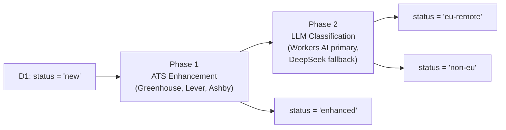

We needed a pipeline that ingests hundreds of job postings from ATS platforms (Greenhouse, Lever, Ashby), enriches each posting with structured data from their public APIs, and then classifies whether a job is a **fully remote EU position** — all running on Cloudflare's edge with zero GPU costs.

This article walks through the architecture and implementation of `process-jobs`, a **Cloudflare Python Worker** that combines [langchain-cloudflare](https://pypi.org/project/langchain-cloudflare/) with Cloudflare Workers AI, D1, and Queues to build a production classification pipeline.

<!-- truncate -->

## Architecture Overview

The worker implements a **two-phase pipeline**:



Each phase reads from and writes to **Cloudflare D1** directly — no external database required. The worker exposes HTTP endpoints, a cron trigger (every 6 hours), and a **Cloudflare Queue** consumer for async processing.

## Key Technologies

| Component                                                      | Role                                                                             |
| -------------------------------------------------------------- | -------------------------------------------------------------------------------- |
| **langchain-cloudflare** (`ChatCloudflareWorkersAI`)           | LLM binding that calls Workers AI through the `AI` binding — no API key, no cost |
| **LangChain LCEL** (`ChatPromptTemplate \| llm`)               | Composable prompt → model chain                                                  |
| **Pydantic** (`JobClassification`)                             | Validated structured output from LLM responses                                   |
| **langgraph-checkpoint-cloudflare-d1** (`CloudflareD1Saver`)   | Persist pipeline run checkpoints to D1                                           |
| **DeepSeek API**                                               | OpenAI-compatible fallback classifier for uncertain results                      |
| **Cloudflare D1**                                              | SQLite-at-the-edge database for job storage                                      |
| **Cloudflare Queues**                                          | Async job processing with retries and dead-letter queue                          |
| **Python Workers** (`compatibility_flags: ["python_workers"]`) | Full Python runtime on Workers via Pyodide                                       |

---

## LangChain Integration Deep Dive

### 1. ChatCloudflareWorkersAI — Free LLM Classification

The core of the classification pipeline is [`ChatCloudflareWorkersAI`](https://python.langchain.com/docs/integrations/chat/cloudflare_workersai/) from the `langchain-cloudflare` package. It wraps the Workers AI binding so you can call any model available on Workers AI through langchain's standard chat model interface — no API key required.

```python
from langchain_cloudflare import ChatCloudflareWorkersAI

llm = ChatCloudflareWorkersAI(
    model_name="@cf/qwen/qwen3-30b-a3b-fp8",
    binding=env.AI,        # Workers AI binding from wrangler.jsonc
    temperature=0.2,
)
```

The `binding` parameter accepts the `AI` binding that Cloudflare injects into every Worker with `"ai": {"binding": "AI"}` in the wrangler config. This means:

- **Zero cost** — Workers AI models are free on the Workers paid plan
- **Zero latency overhead** — the model runs on the same Cloudflare network
- **No API keys** — authentication is handled by the binding

We use `@cf/qwen/qwen3-30b-a3b-fp8` (Qwen 3 30B, FP8 quantised), which provides strong instruction-following at a good speed/quality tradeoff for classification tasks.

### 2. LCEL Chain — Prompt | Model Composition

LangChain Expression Language (LCEL) lets you compose prompt templates and models with the pipe operator. Our classification chain is a single expression:

```python
from langchain_core.prompts import ChatPromptTemplate

CLASSIFICATION_PROMPT = ChatPromptTemplate.from_messages([
    (
        "system",
        "You are a job classification expert. "
        "Determine whether the given job posting is a fully Remote EU position. "
        "Return structured JSON output.",
    ),
    (
        "human",
        """Analyze this job posting and determine if it is a Remote EU position.

Title: {title}
Location: {location}
Description: {description}

Consider:
- EMEA includes non-EU countries (UK post-Brexit, Switzerland, Middle East)
- CET timezone is not exclusive to EU
- UK is not part of EU since Brexit
- EU work authorization suggests EU remote
- Must be fully remote, not hybrid or onsite

Respond ONLY with a JSON object using exactly these keys:
{{
  "isRemoteEU": true/false,
  "confidence": "high" | "medium" | "low",
  "reason": "brief explanation"
}}""",
    ),
])

# The complete chain — prompt formatting + LLM invocation in one expression
chain = CLASSIFICATION_PROMPT | llm
```

Invoking the chain is a single async call:

```python
response = await chain.ainvoke({
    "title": "Senior Backend Engineer",
    "location": "Remote, EU",
    "description": "We're looking for...",
})
```

LCEL handles template variable substitution, message formatting, and model invocation. The prompt includes domain-specific instructions (EMEA ≠ EU, UK is post-Brexit, CET ≠ EU-only) to improve classification accuracy.

### 3. Pydantic Structured Output

We define a `JobClassification` Pydantic model to validate and type LLM responses:

```python
from pydantic import BaseModel, Field
from typing import Literal

class JobClassification(BaseModel):
    """Classification result for a job posting."""

    model_config = {"populate_by_name": True}

    isRemoteEU: bool = Field(
        alias="is_remote_eu",
        description="Whether this job is a fully remote EU position",
    )
    confidence: Literal["high", "medium", "low"] = Field(
        description="Confidence level of the classification",
    )
    reason: str = Field(
        description="Brief explanation for the classification decision",
    )
```

**Why not `with_structured_output()`?** In the Pyodide/Workers environment, Workers AI can return `JsNull` as the `AIMessage.content` field, which breaks langchain's AIMessage pydantic validator. Instead, we parse the raw text response ourselves through a normalisation step:

```python
def _normalise_classification_keys(raw: dict) -> dict:
    """Normalise arbitrary key names into JobClassification schema.

    Handles both camelCase (isRemoteEU) and snake_case (is_remote_eu_position)
    variants that different models may emit.
    """
    normalised = {}
    for k, v in raw.items():
        lk = k.lower().replace("_", "").replace("-", "")
        if lk in ("isremoteeu", "isremoteeuposition", "remoteeu"):
            normalised["isRemoteEU"] = v
        elif lk == "confidence":
            normalised["confidence"] = v
        elif lk in ("reason", "explanation"):
            normalised["reason"] = v
        else:
            normalised[k] = v
    return normalised
```

This normalisation layer handles the reality that different LLMs (Workers AI vs DeepSeek) may return slightly different key formats. The Pydantic model's `populate_by_name=True` combined with `alias` fields adds further flexibility.

### 4. LangGraph Checkpoint — Pipeline Run Persistence

After each pipeline run, we save a lightweight checkpoint using `CloudflareD1Saver` from the `langgraph-checkpoint-cloudflare-d1` package:

```python
from langgraph_checkpoint_cloudflare_d1 import CloudflareD1Saver
from langgraph.checkpoint.base import create_checkpoint, empty_checkpoint

saver = CloudflareD1Saver(
    account_id=env.CF_ACCOUNT_ID,
    database_id=env.CF_D1_DATABASE_ID,
    api_token=env.CF_D1_API_TOKEN,
)
saver.setup()

checkpoint = create_checkpoint(empty_checkpoint(), None, 1)
config = {
    "configurable": {
        "thread_id": f"process-jobs-{run_date}",
        "checkpoint_ns": "",
    }
}

metadata = {
    "source": "process-jobs-worker",
    "step": 1,
    "run_ts": run_timestamp,
    "enhanced": 42,
    "processed": 38,
    "euRemote": 12,
    "workersAI": 30,
    "deepseek": 8,
}

saver.put(config, checkpoint, metadata, {})
```

This gives us a persistent audit trail of every pipeline run, stored in the same D1 database. Checkpointing is best-effort — if it fails, the pipeline still completes.

---

## Classification Strategy — Workers AI Primary, DeepSeek Fallback

The classification uses an **inverted cost-optimisation** strategy:

```
                    ┌─────────────────────┐
                    │  Workers AI (free)   │
                    │  via langchain LCEL  │
                    └─────────┬───────────┘
                              │
                     High confidence?
                    ┌─────────┴───────────┐
                    │ YES                  │ NO / FAILED
                    ▼                      ▼
              Use result             ┌─────────────────┐
              directly               │ DeepSeek API     │
                                     │ (paid fallback)  │
                                     └─────────────────┘
```

1. **Workers AI first** — Every job is classified using the free Workers AI model. If the result has `"confidence": "high"`, we accept it immediately.
2. **DeepSeek fallback** — Only when Workers AI fails or returns medium/low confidence do we call the DeepSeek API (OpenAI-compatible). This typically handles 15–20% of jobs.
3. **Graceful degradation** — If no DeepSeek API key is configured, we accept the Workers AI result regardless of confidence.

This approach saves significant API costs by using the free tier for the majority of classifications while maintaining high accuracy through the paid fallback.

```python
# Step 1 — Workers AI (primary, free)
if ai_binding:
    result = await classify_with_workers_ai(job, ai_binding)
    if result and result.confidence == "high":
        classification = result

# Step 2 — DeepSeek fallback (only if needed)
if classification is None and api_key:
    classification = await classify_with_deepseek(job, api_key, base_url, model)

# Step 3 — Accept Workers AI if no fallback available
if classification is None and result is not None:
    classification = result
```

---

## Cloudflare D1 as the Processing Engine

The entire pipeline state machine runs on D1 with a simple `status` column (`new` → `enhanced` → `eu-remote` | `non-eu` | `error`).

All database operations use a thin async wrapper over D1's native API:

```python
async def d1_all(db, sql: str, params: list | None = None) -> list[dict]:
    """Execute a D1 SELECT and return rows as Python dicts."""
    stmt = db.prepare(sql)
    if params:
        js_params = JSON.parse(json.dumps(params))
        stmt = stmt.bind(*js_params)
    result = await stmt.all()
    return json.loads(JSON.stringify(result.results))
```

The `JSON.parse(json.dumps(...))` round-trip is the standard pattern from langchain-cloudflare's own bindings for converting between Python objects and JavaScript values in the Pyodide runtime.

---

## Phase 1 — ATS Enhancement

Before classification, each job is enriched with structured data from its ATS platform. The worker handles three ATS providers:

### Greenhouse

```python
def parse_greenhouse_url(external_id: str) -> dict | None:
    match = re.search(r"greenhouse\.io/([^/]+)/jobs/([^/?#]+)", external_id)
    if match:
        return {"board_token": match.group(1), "job_post_id": match.group(2)}
```

Fetches from `boards-api.greenhouse.io/v1/boards/{token}/jobs/{id}?questions=true` and extracts departments, offices, metadata, compliance info, and demographic questions.

### Lever

Tries both global (`api.lever.co`) and EU (`api.eu.lever.co`) endpoints. Extracts workplace type, country, categories, and rich text descriptions (opening, body, additional sections).

### Ashby

Uses a two-step strategy: direct job endpoint first, then falls back to the full board listing (which includes compensation data). Extracts Ashby-specific fields like department, team, employment type, remote flag, and compensation.

Each ATS fetcher builds a set of `(column, value)` pairs that are written to D1 in a single `UPDATE`:

```python
cols, vals = build_greenhouse_update(data)

set_parts = [f"{c} = ?" for c in cols]
set_parts.append("status = ?")
vals.append(JobStatus.ENHANCED.value)
set_parts.append("updated_at = datetime('now')")

sql = f"UPDATE jobs SET {', '.join(set_parts)} WHERE id = ?"
vals.append(job["id"])

await d1_run(db, sql, vals)
```

---

## Worker Entry Points

The worker supports multiple invocation patterns through a single `WorkerEntrypoint` class:

### HTTP Endpoints

| Path            | Method | Description                                             |
| --------------- | ------ | ------------------------------------------------------- |
| `/health`       | GET    | D1 connectivity check, reports binding availability     |
| `/`             | POST   | Enqueues a job to Cloudflare Queue for async processing |
| `/enhance`      | POST   | Runs Phase 1 only (ATS enhancement)                     |
| `/classify`     | POST   | Runs Phase 2 only (LLM classification)                  |
| `/process-sync` | POST   | Runs full pipeline synchronously (debugging)            |

### Cron Trigger

```jsonc
// wrangler.jsonc
{
  "triggers": {
    "crons": ["0 */6 * * *"], // Every 6 hours
  },
}
```

The `scheduled()` handler runs both phases with a limit of 20 jobs per invocation.

### Queue Consumer

```jsonc
{
  "queues": {
    "consumers": [
      {
        "queue": "process-jobs-queue",
        "max_batch_size": 1,
        "max_retries": 3,
        "dead_letter_queue": "process-jobs-dlq",
      },
    ],
  },
}
```

Messages support `{"action": "process"|"enhance"|"classify", "limit": N}` to control which phase runs.

---

## Python on Workers — Pyodide Considerations

Running Python on Cloudflare Workers means running inside [Pyodide](https://pyodide.org/) (CPython compiled to WebAssembly). A few practical implications:

### JS ↔ Python Interop

All data crossing the JS/Python boundary goes through a JSON round-trip:

```python
from js import JSON, fetch
import json

def to_js_obj(d: dict):
    return JSON.parse(json.dumps(d))

def to_py(js_val):
    return json.loads(JSON.stringify(js_val))
```

This is the [same pattern used by langchain-cloudflare itself](https://github.com/nichochar/langchain-cloudflare) in its bindings layer.

### JsNull Handling

Workers AI can return `JsNull` (a Pyodide-specific JavaScript null proxy) as message content. We guard against this explicitly:

```python
content = response.content
if content is None or str(type(content)) == "<class 'pyodide.ffi.JsProxy'>":
    raw_str = str(content) if content else ""
    if not raw_str or raw_str == "jsnull" or raw_str == "undefined":
        return None
```

### Package Stubs

Some langchain transitive dependencies (`xxhash`, `ormsgpack`, `tenacity`) require native C/Rust extensions unavailable in WebAssembly. We provide lightweight Python stubs:

```
stubs/
  xxhash-stub/src/xxhash/__init__.py
  ormsgpack-stub/src/ormsgpack/__init__.py
  tenacity-stub/src/tenacity/__init__.py
```

### No `pydantic_core`

Pydantic's compiled Rust core is not available for WASM. We rely on Pyodide's built-in Pydantic, which uses the pure-Python fallback.

---

## Wrangler Configuration

```jsonc
{
  "name": "nomadically-work-process-jobs",
  "main": "src/entry.py",
  "compatibility_date": "2025-11-02",
  "compatibility_flags": ["python_workers"],

  "ai": { "binding": "AI", "remote": true },

  "d1_databases": [
    {
      "binding": "DB",
      "database_name": "nomadically-work-db",
      "database_id": "632b9c57-8262-40bd-86c2-bc08beab713b",
      "remote": true,
    },
  ],

  "queues": {
    "producers": [
      { "queue": "process-jobs-queue", "binding": "PROCESS_JOBS_QUEUE" },
    ],
    "consumers": [
      {
        "queue": "process-jobs-queue",
        "max_batch_size": 1,
        "max_retries": 3,
        "dead_letter_queue": "process-jobs-dlq",
      },
    ],
  },

  "triggers": { "crons": ["0 */6 * * *"] },

  "observability": { "enabled": true, "logs": { "enabled": true } },
}
```

Key points:

- `"python_workers"` compatibility flag enables the Pyodide runtime
- `"remote": true` on AI and D1 bindings enables local dev with `wrangler dev`
- Queue consumer processes one message at a time with 3 retries before dead-lettering

---

## Dependencies

```toml
# pyproject.toml
[project]
requires-python = ">=3.12"
dependencies = [
    "webtypy>=0.1.7",
    "langchain-cloudflare",
    "langchain-core>=0.3.81,<2.0.0",
    "langgraph-checkpoint-cloudflare-d1",
]
```

Notably, **pydantic is not listed** — we use Pyodide's built-in version to avoid the `pydantic_core` Rust dependency.

---

## Summary

This implementation demonstrates that you can build a complete, production-grade LLM classification pipeline on Cloudflare Workers using Python and langchain:

- **langchain-cloudflare** provides a zero-cost LLM through the Workers AI binding
- **LCEL chains** (`prompt | model`) keep the classification logic composable and testable
- **Pydantic models** validate LLM output into typed Python objects
- **langgraph-checkpoint-cloudflare-d1** gives persistent run history for free
- **Cloudflare Queues + Cron** handle scheduling and async processing with built-in retries
- **D1** serves as both the application database and the state machine driver

The result is a serverless pipeline that processes hundreds of jobs daily, classifying remote EU positions with high accuracy, at near-zero marginal cost.
