We built an **Architect agent** — a fully autonomous code reviewer powered by Claude Opus 4.6 — that explores a repository, runs audits, and produces a comprehensive architecture report. One command, zero human intervention, a professional-grade review in under 10 minutes.

This article covers how the agent is structured, how it leverages Anthropic's agentic tool-use loop, and what we learned shipping it.

<!-- truncate -->

---

## Why an Architect Agent?

Architecture reviews are expensive. They require a senior engineer to read thousands of lines of code, trace data flows, audit dependencies, and synthesise findings into actionable recommendations. For a solo-contributor project like ours, that means reviewing your own work — the worst kind of audit.

We wanted something that could do a cold-start review of any repo and produce a structured report covering security, performance, reliability, code quality, and a prioritised roadmap. Claude Opus 4.6's extended thinking and tool-use capabilities made this possible.

---

## Agent Architecture

The Architect agent is a **single-turn agentic loop** — one user prompt triggers a multi-step autonomous workflow where the model decides which tools to call and in what order.

```mermaid
graph TD
    Entry["npx tsx scripts/run-architect-agent.ts"] --> Config["Load Config\n• Model: Opus 4.6\n• Effort: HIGH\n• Max turns: 40\n• Timeout: 10 min"]
    Config --> Prompt["Inject User Prompt\n'Analyse {repo} and write\nthe Architecture Review\nReport to {outputFile}'"]
    Prompt --> System["Build System Prompt\n(buildArchitectSystemPrompt)"]
    System --> Loop

    subgraph Loop["Agentic Tool-Use Loop (streamAgent)"]
        Think["Claude reasons\nabout next step"] --> ToolCall["Tool Call\n(read, bash, grep, glob, write)"]
        ToolCall --> ToolResult["Tool Result\nreturned to Claude"]
        ToolResult --> Think
    end

    Loop -->|"Turn limit or\nstop_reason: end_turn"| Output["ARCHITECTURE_REPORT.md\n+ summary .json"]
```



### The Runner Script

The entry point is a TypeScript script that configures the agent and streams its execution:

```mermaid
graph TD
    subgraph Runner["run-architect-agent.ts"]
        EnvCheck["Validate\nANTHROPIC_API_KEY"] --> Configure["Configure\n• tools list\n• repo path\n• output file\n• max turns / timeout"]
        Configure --> Abort["Set up\nAbortController\n+ SIGINT handler"]
        Abort --> Stream["Stream agent via\nstreamAgent()"]
        Stream --> Monitor["Monitor turns\n• Log tool calls\n• Log text blocks\n• Track tool usage counts"]
        Monitor --> Finalise["Read report\n• Compute duration\n• Write summary JSON\n• Print stats"]
    end
```



Key design decisions in the runner:

- **Timeout + SIGINT** — a 10-minute hard timeout and graceful SIGINT handling prevent runaway costs. The `AbortController` propagates cancellation into the streaming loop.
- **Tool usage tracking** — every tool call is counted in a `Map<string, number>` and logged with a JSON preview, giving visibility into what the agent is actually doing.
- **Summary JSON** — alongside the markdown report, a JSON file captures metadata (timestamp, byte count, turn count, duration, tool usage breakdown) for programmatic consumption.

---

## The Anthropic Agent SDK Pattern

The core of the system is `streamAgent` — a generator function that implements Anthropic's **agentic loop** pattern. Here's how it works:

```mermaid
graph TD
    subgraph SDK["streamAgent — Agentic Loop"]
        Start["Send initial message\nto Claude API"] --> Response["Receive response\n(text + tool_use blocks)"]
        Response --> Check{"stop_reason?"}
        Check -->|"end_turn"| Done["Yield final result"]
        Check -->|"tool_use"| Execute["Execute tool calls\n(read, bash, grep, glob, write)"]
        Execute --> Append["Append tool_results\nto conversation"]
        Append --> Send["Send updated conversation\nback to Claude API"]
        Send --> Response
    end

    Done --> Report["Agent has written\nARCHITECTURE_REPORT.md"]
```



This is the standard Anthropic tool-use loop: the model generates a response, the SDK executes any tool calls, appends results, and sends the extended conversation back. The loop continues until the model emits `end_turn` or the turn limit is reached.

### Tool Configuration

The agent has access to six tools — chosen to give it full read access to the codebase plus the ability to run shell commands and write the final report:

```mermaid
graph LR
    subgraph Tools["Agent Tool Belt"]
        Read["📄 Read\nView file contents"]
        Write["✏️ Write\nCreate/overwrite files"]
        Bash["💻 Bash\nRun shell commands"]
        Glob["🔍 Glob\nFind files by pattern"]
        Grep["🔎 Grep\nSearch file contents"]
        Web["🌐 Web Search\nLook up CVEs, best practices"]
    end

    subgraph Usage["Typical Usage Pattern"]
        U1["glob **/*.ts\n→ discover structure"]
        U2["read package.json\n→ audit dependencies"]
        U3["bash pnpm audit\n→ find CVEs"]
        U4["grep 'any' src/\n→ count type issues"]
        U5["read src/apollo/resolvers/\n→ analyse patterns"]
        U6["write ARCHITECTURE_REPORT.md\n→ produce output"]
    end

    Read --- U1
    Read --- U2
    Read --- U5
    Bash --- U3
    Grep --- U4
    Write --- U6
```



The tool selection is intentionally minimal. The agent doesn't need code execution or test running — it's doing **static analysis** augmented by shell commands like `pnpm audit`, `wc -l`, and `grep -c`.

---

## System Prompt Design

The system prompt is the most critical piece. `buildArchitectSystemPrompt(outputFile)` generates a structured prompt that tells the agent:

```mermaid
graph TD
    subgraph SystemPrompt["System Prompt Structure"]
        Role["🎭 Role\n'You are a principal-level\nsoftware architect'"]
        Scope["📋 Scope\n• Executive summary\n• Code quality\n• Security (OWASP)\n• Performance\n• Reliability\n• DX & maintainability"]
        Method["🔬 Method\n• Explore repo structure first\n• Read key config files\n• Run audits (pnpm audit)\n• Analyse critical paths\n• Count anti-patterns"]
        Output["📄 Output\n• Write to {outputFile}\n• Use specific markdown structure\n• Include health score /10\n• Prioritised roadmap"]
        Constraints["⚠️ Constraints\n• Be specific, cite files + lines\n• Don't hallucinate code\n• Distinguish fact from opinion"]
    end

    Role --> Scope --> Method --> Output --> Constraints
```



The prompt doesn't micromanage the agent's exploration order — it describes the **desired output** and lets the model decide how to get there. This is key to the agentic pattern: you define the goal, not the steps.

---

## Agent Execution Flow

When run against our codebase (277 commits, ~40K LOC), the agent typically completes in **25–35 turns** over **5–8 minutes**. Here's the typical exploration pattern:

```mermaid
graph TD
    subgraph Phase1["Phase 1 — Discovery (Turns 1–5)"]
        style Phase1 fill:#d4edda,stroke:#28a745
        T1["glob **/* \n→ map repo structure"]
        T2["read package.json\n→ stack + dependencies"]
        T3["read tsconfig.json\n→ TS configuration"]
        T4["read next.config.ts\n→ build settings"]
        T5["bash find src/ -name '*.ts' | wc -l\n→ codebase size"]
    end

    subgraph Phase2["Phase 2 — Deep Analysis (Turns 6–20)"]
        style Phase2 fill:#fff3cd,stroke:#ffc107
        T6["read src/apollo/resolvers/\n→ API patterns"]
        T7["grep -rn 'any' src/apollo/\n→ type safety audit"]
        T8["read src/db/\n→ database layer"]
        T9["bash pnpm audit\n→ CVE scan"]
        T10["read workers/\n→ background jobs"]
        T11["grep -rn 'TODO\\|FIXME' src/\n→ tech debt"]
        T12["read .env.example\n→ secrets inventory"]
        T13["bash ls -la .env*\n→ secrets on disk check"]
        T14["read src/agents/\n→ AI/ML integration"]
        T15["grep -rn 'console.log' src/apollo/\n→ logging audit"]
    end

    subgraph Phase3["Phase 3 — Synthesis (Turns 21–30)"]
        style Phase3 fill:#cce5ff,stroke:#007bff
        T16["Reason about findings\n→ prioritise by severity"]
        T17["write ARCHITECTURE_REPORT.md\n→ produce report"]
        T18["read ARCHITECTURE_REPORT.md\n→ self-review"]
        T19["write ARCHITECTURE_REPORT.md\n→ revise + refine"]
    end

    Phase1 --> Phase2 --> Phase3
```



The agent self-reviews — it reads its own output and revises it. This happens naturally within the agentic loop without any special prompting.

---

## Configuration & Constants

The agent relies on shared constants that define models, tools, and effort levels:

```mermaid
graph TD
    subgraph Constants["src/anthropic/constants.ts"]
        Models["CLAUDE_MODELS\n• OPUS_4_6\n• SONNET_4_5\n• HAIKU_4_5"]
        Tools["AGENT_TOOLS\n• READ\n• WRITE\n• BASH\n• GLOB\n• GREP\n• WEB_SEARCH"]
        Effort["EFFORT_LEVELS\n• LOW\n• MEDIUM\n• HIGH"]
    end

    subgraph AgentConfig["Architect Agent Config"]
        Model["model: OPUS_4_6"]
        ToolSet["tools: READ, WRITE, BASH,\nGLOB, GREP, WEB_SEARCH"]
        EffortLevel["effort: HIGH"]
        Turns["maxTurns: 40"]
        Timeout["timeout: 10 min"]
        CWD["cwd: process.cwd()"]
    end

    Constants --> AgentConfig
    AgentConfig --> Runner["run-architect-agent.ts"]
```



Using `EFFORT_LEVELS.HIGH` with Opus 4.6 enables extended thinking — the model takes more time to reason before each tool call, producing more thorough analysis.

---

## Output: What the Agent Produces

The agent writes two files:

```mermaid
graph LR
    Agent["Architect Agent"] --> MD["ARCHITECTURE_REPORT.md\n• Executive summary\n• Health score /10\n• Code quality audit\n• Security (OWASP + CVEs)\n• Performance bottlenecks\n• Reliability assessment\n• DX & maintainability\n• 18 recommendations\n• Prioritised roadmap"]

    Agent --> JSON["ARCHITECTURE_REPORT.json\n• timestamp\n• reportBytes\n• turnCount\n• durationMs\n• toolsUsed breakdown"]
```



The markdown report from our latest run was **~12 KB** covering 11 sections with specific file references, line numbers, and severity ratings. The agent identified issues we'd missed — like the fetch-all-then-filter anti-pattern in our resolvers and a missing auth check on a mutation.

---

## Lessons Learned

### What works well

**Tool-use as exploration.** Giving the agent `glob`, `grep`, and `bash` lets it explore a codebase the way a human would — starting broad, then drilling into areas of concern. It naturally runs `pnpm audit` without being told to.

**Structured output via system prompt.** Defining the report structure in the system prompt produces remarkably consistent output across runs. The agent fills in every section even when some are "nothing to report."

**Self-review.** The agent reads its own report and catches mistakes. On several runs, it rewrote entire sections after re-reading a file more carefully.

### What to watch for

**Turn budget matters.** With `maxTurns: 40`, the agent has room to be thorough. At 20 turns, it rushes and skips sections. At 60, it over-explores and the timeout kicks in.

**Cost awareness.** A full run with Opus 4.6 HIGH effort costs roughly **$2–5** depending on repo size. For CI integration, Sonnet 4.5 at MEDIUM effort produces 80% of the quality at 20% of the cost.

**Hallucination risk on line numbers.** The agent sometimes cites approximate line numbers. We mitigate this by having it quote the actual code in the report.

---

## Running It Yourself

```bash
# Set your API key
echo 'ANTHROPIC_API_KEY="sk-ant-..."' >> .env

# Run the architect agent
npx tsx scripts/run-architect-agent.ts
```

The agent will explore your repo, run audits, and produce `ARCHITECTURE_REPORT.md` and `ARCHITECTURE_REPORT.json` in your repo root.
