import Tabs from '@theme/Tabs';
import TabItem from '@theme/TabItem';

Building AI systems is not one problem—it is a set of problems layered on top of each other. To navigate them, you need two different levels of thinking:

- **Meta approaches** — the umbrella mindset that determines *what you optimize for* (grounding, observability, correctness, human oversight, routing). These exist because AI systems are probabilistic, data-dependent, and can hallucinate, drift, and fail silently.
- **X-driven methods** — the concrete artifact you iterate against in a given phase (prompt, schema, eval suite, traces). These are the hands-on loops inside the meta strategy.

Most teams get the X-driven methods right and the meta approach wrong. They write evals but don't adopt an **eval-first** posture. They instrument traces but don't build **observability-first**. They add RAG but don't commit to a **grounding-first** policy. The result is a system that works in demos and fails in production.

This article gives you both layers, how they map to each other, and real-world adoption data on where the industry has landed.

:::note Industry Context (2025)
McKinsey reports **78% of organizations** now use AI in at least one business function—up from 55% twelve months prior. Databricks found organizations put **11× more models into production** year-over-year. Yet MIT research finds only **5% of GenAI pilots** achieve rapid revenue acceleration. The gap is almost always strategic, not technical.
:::

---

## The Two-Layer Model

Every AI system decision lives on one of two levels. **Layer 1** decides *what you optimize for*—the strategic guarantee your system makes. **Layer 2** decides *how you iterate*—the concrete artifact you build and loop against day-to-day.

### Layer 1 — Meta Approaches (what you optimize for)

| Meta Approach | Core Guarantee |
|---|---|
| 🟢 **Grounding-First** | Answers are backed by evidence or the system abstains |
| 🟣 **Eval-First** | Every change is tested against a defined correctness bar |
| 🔵 **Observability-First** | Every production failure is reproducible from traces |
| 🟡 **Multi-Model / Routing-First** | Tasks route to the right model by difficulty, cost, and capability |
| 🩷 **Human-Validation-First** | High-stakes outputs require human sign-off before reaching users |
| ⚪ **Spec-Driven** *(cross-cutting)* | Target behavior is explicit, checkable, and enforceable at every phase |

### Layer 2 — X-Driven Methods (how you iterate)

| Method | Primary Artifact | SDLC Phase |
|---|---|---|
| Prompt-Driven / Example-Driven | System prompt · golden set | Discover |
| Schema / Contract-Driven · Tool / API-Driven · Workflow / Graph-Driven | Typed schemas · tool contracts · step graphs | Build |
| Retrieval-Driven (RAG) · Data & Training-Driven | Retriever config · dataset versions | Build |
| Evaluation-Driven (EDD) · Metric-Driven | Eval suite · KPI dashboards | Verify |
| Trace / Observability-Driven | Trace schema · replay harness | Operate |

### How the layers connect

```mermaid
graph TD
    subgraph LAYER1 ["Layer 1 — Meta Approaches"]
        M1["🟢 Grounding-First"]
        M2["🟣 Eval-First"]
        M3["🔵 Observability-First"]
        M4["🟡 Routing-First"]
        M5["🩷 HITL-First"]
        M6["⚪ Spec-Driven"]
    end

    subgraph LAYER2 ["Layer 2 — X-Driven Methods"]
        X1["Prompt &\nExample-Driven"]
        X2["Schema · Tool ·\nWorkflow-Driven"]
        X3["RAG &\nData-Driven"]
        X4["Eval &\nMetric-Driven"]
        X5["Trace &\nObservability-Driven"]
    end

    M1 --> X3
    M2 --> X4
    M3 --> X5
    M4 --> X2
    M5 --> X4
    M5 --> X5
    M6 --> X1
    M6 --> X2
    M6 --> X4

    style LAYER1 fill:#1e1e2e,stroke:#cdd6f4,color:#cdd6f4
    style LAYER2 fill:#1e1e2e,stroke:#cdd6f4,color:#cdd6f4
    style M1 fill:#00c2a8,stroke:#00c2a8,color:#fff
    style M2 fill:#7c3aed,stroke:#7c3aed,color:#fff
    style M3 fill:#1d9bf0,stroke:#1d9bf0,color:#fff
    style M4 fill:#f59e0b,stroke:#f59e0b,color:#fff
    style M5 fill:#ec4899,stroke:#ec4899,color:#fff
    style M6 fill:#6b7280,stroke:#6b7280,color:#fff
```

**Read the diagram top-down:** pick your meta approach (Layer 1) based on your biggest risk, then follow the arrow to the methods (Layer 2) it activates.

---

## Part I — The Meta Approaches

These six meta approaches are the ones with the highest industry evidence for adoption in 2024–2025. They answer the question: *before you pick a method, what is your system fundamentally trying to guarantee?*

---

### 1. Grounding-First

> **"Answers must be grounded in evidence—or the system must abstain."**

This is the most widely adopted AI-native meta approach. It is a posture that says: the model's parametric knowledge is not trustworthy enough on its own—every answer must be tied to a verifiable source, or the system should say nothing.

Grounding-first shapes your architecture from day one: retrieval is not a feature you add later, it is a foundational constraint. Your grounding policy (what sources are allowed, when to cite, when to abstain) is written before you write prompts.

**Why it is AI-native:** Traditional software either has data or it doesn't. LLMs will confidently produce an answer whether or not they have the data—grounding-first is the only way to control this.

#### Adoption evidence

Menlo Ventures' 2024 State of Enterprise AI found **RAG at 51% enterprise adoption**, up from 31% the prior year. A survey of 300 enterprises found **86% augmenting their LLMs** via RAG or similar retrieval. Databricks reported vector databases supporting RAG grew **377% year-over-year**. The RAG market is projected to grow from $1.2B (2024) to $11B by 2030 at a **49.1% CAGR** (Grand View Research).

```mermaid
graph TD
    A["🎯 Define Grounding Policy\nWhat sources are trusted?\nCite or abstain threshold?"] --> B["📚 Build Retrieval System\nCorpus + index + chunking\nEmbedding + reranker"]
    B --> C["🔍 Measure Retrieval Quality\nas a first-class metric\nRecall@K, hit rate, freshness"]
    C --> D{Retrieval\nsufficient?}
    D -- No --> E["Tune retrieval layer\nChunking / hybrid search\nSource expansion"]
    E --> B
    D -- Yes --> F["🤖 Generate with\ngrounded context only"]
    F --> G{"Grounded\nor abstain?"}
    G -- Hallucinated --> H["🚨 Log + add\nto eval set"]
    H --> B
    G -- Grounded --> I["✅ Cite sources\nShip response"]

    style A fill:#00c2a8,stroke:#00c2a8,color:#fff
    style I fill:#22c55e,stroke:#22c55e,color:#fff
    style D fill:#1e1e2e,stroke:#00c2a8,color:#cdd6f4
    style G fill:#1e1e2e,stroke:#00c2a8,color:#cdd6f4
```

**X-driven methods it activates:** Retrieval-Driven (RAG) · Schema-Driven (grounding schema) · Eval-Driven (groundedness eval suite)

**Key tools:** Pinecone · Weaviate · Chroma · Qdrant · LlamaIndex · LangChain RAG · Vectara · Cohere Rerank

| | |
|---|---|
| ✅ **Adopt when** | Accuracy and citations matter; proprietary data; regulated domains; hallucination has real cost |
| ❌ **Traps** | Treating retrieval as an add-on after prompts fail; not measuring retrieval quality independently |

---

### 2. Eval-First

> **"Define what 'correct' means as a test before you build the system that must pass it."**

Eval-first is the AI equivalent of test-driven development. The distinction from simply "having evals" is that the eval suite exists *before* the implementation and acts as the acceptance criterion. You don't write code to pass a linter—you write code to pass the eval. The CI gate is your quality contract.

This is the most structurally important meta approach for teams that want to iterate safely. Without it, every prompt change is a gamble.

**Why it is AI-native:** Traditional software tests are deterministic. AI evals are probabilistic, multi-dimensional, and context-dependent. They require rubrics, human calibration, slice analysis, and LLM-as-judge scaffolding that has no equivalent in traditional QA.

#### Adoption evidence

A 2025 arXiv paper (Xia et al., 2411.13768) formalized **EDDOps** (Evaluation-Driven Development and Operations) from a multivocal literature review of industrial practices. **DeepEval** reports nearly **500,000 monthly downloads**. Andrej Karpathy flagged an "evaluation crisis" in March 2025, noting standard benchmarks have saturated—the field is shifting to task-specific, production-grounded eval suites. Leading platforms: **Braintrust**, **Langfuse**, **Arize Phoenix**, **LangSmith**, **Confident AI**, **MLflow 3.0**.

```mermaid
graph TD
    A["🔴 Write eval suite FIRST\nGolden set + rubric\nSlice taxonomy + thresholds\nBefore writing the system"] --> B["🔧 Build system\nto pass the evals"]
    B --> C["🧪 Run offline eval suite\nin CI on every change"]
    C --> D{All thresholds\npassed?}
    D -- No --> E["Error analysis by slice\nWhich categories fail?"]
    E --> F["Fix: prompt / RAG /\ntool / architecture"]
    F --> B
    D -- Yes --> G["🚦 CI gate green\nShip with confidence"]
    G --> H["📡 Online evals\non production sample"]
    H --> I{New failure\npattern?}
    I -- Yes --> J["Convert to\nnew eval case"]
    J --> A
    I -- No --> K["✅ Stable\nContinue monitoring"]

    style A fill:#7c3aed,stroke:#7c3aed,color:#fff
    style G fill:#22c55e,stroke:#22c55e,color:#fff
    style D fill:#1e1e2e,stroke:#7c3aed,color:#cdd6f4
    style I fill:#1e1e2e,stroke:#7c3aed,color:#cdd6f4
```

**X-driven methods it activates:** Evaluation-Driven (EDD) · Example-Driven (golden set) · Metric-Driven (production signal)

**Key tools:** DeepEval · Braintrust · Arize Phoenix · LangSmith · Confident AI · Galileo · MLflow 3.0

| | |
|---|---|
| ✅ **Adopt when** | You're making changes that could silently regress behavior; swapping models or providers; multiple engineers on the same system |
| ❌ **Traps** | Using off-the-shelf benchmarks instead of production-grounded evals; "teaching to the test" without refreshing the eval set |

:::warning The Saturation Problem
Standard benchmarks (MMLU, etc.) now show >90% saturation on leading models—they no longer discriminate. The only evals that matter are the ones you write yourself, from your real production failures.
:::

---

### 3. Observability-First

> **"Instrument before you scale. Every production failure must be reproducible."**

Observability-first means you cannot ship a system to production without the ability to capture, replay, and diff what happened. Traces are not a debugging convenience—they are the mechanism by which production failures convert into future eval cases and system improvements.

The "first" is the important part: teams that add observability after scaling discover that the most important failures happened before they started logging.

**Why it is AI-native:** Deterministic software can be unit-tested into confidence. AI systems are probabilistic—the same input can produce different outputs on different runs. You cannot reason about production correctness without capturing the actual inputs, model versions, retrieved documents, and tool calls that produced each output.

#### Adoption evidence

In agent-building organizations, approximately **89% report implementing observability** as a baseline practice. **Langfuse** (open-source, MIT) has reached over **19,000 GitHub stars** and **6 million SDK installs per month** as of late 2025. **LangSmith** serves over **100,000 members**. Enterprise APM vendors **Datadog** and **New Relic** both launched dedicated LLM observability modules in 2024–2025, signaling market maturity.

```mermaid
graph TD
    A["🔭 Define trace schema\nBEFORE first deploy\nInputs + outputs + versions\nTools + retrieved docs + cost"] --> B["⚙️ Instrument system\nversioned prompts\nversioned models\nversioned tools"]
    B --> C["🚀 Deploy to production\nwith sampling policy\n+ PII redaction"]
    C --> D["📦 Capture traces\nat scale"]
    D --> E["🔍 Surface failures:\nflaky behavior\ncost spikes\nlatency outliers\nuser complaints"]
    E --> F["🎬 Replay failing trace\nin dev with same\nprompt version + model"]
    F --> G["⚖️ Diff:\nExpected vs Actual\nVersion A vs Version B"]
    G --> H{"Root cause\nidentified?"}
    H -- No --> I["Add instrumentation\nLog intermediate steps"]
    I --> A
    H -- Yes --> J["🧪 Convert to\nregression eval case"]
    J --> K["Fix + verify\nDeploy with canary"]
    K --> D

    style A fill:#1d9bf0,stroke:#1d9bf0,color:#fff
    style K fill:#22c55e,stroke:#22c55e,color:#fff
    style H fill:#1e1e2e,stroke:#1d9bf0,color:#cdd6f4
```

**X-driven methods it activates:** Trace/Observability-Driven (LLMOps) · Metric-Driven (cost/latency) · Eval-Driven (replay → eval)

**Key tools:** Langfuse · LangSmith · Arize Phoenix · Braintrust · Helicone · W&B Weave · MLflow 3.0 · Datadog LLM Obs

| | |
|---|---|
| ✅ **Adopt when** | You have agents taking actions; multi-step workflows; "why did it do that?" questions you can't answer; cost visibility needed |
| ❌ **Traps** | Logging too little (no insight); too much (privacy/overhead); tracing without replay = data without utility |

:::tip Privacy Rule #1
Define a PII redaction policy before enabling production traces. User inputs regularly contain sensitive data. Redact or hash at the application boundary—never log raw user input to a third-party platform without a data processing agreement.
:::

---

### 4. Multi-Model / Routing-First

> **"No single model is optimal for all tasks. Route dynamically based on difficulty, cost, and capability."**

Multi-model / routing-first is the recognition that the LLM layer is a fleet, not a single engine. Different tasks warrant different models: simple classification → small cheap model; complex reasoning → frontier model; code generation → code-specialized model. Routing policy is a first-class product decision, not an implementation detail.

**Why it is AI-native:** Traditional software modules do not have variable "capability levels" that you trade off against cost and latency. LLMs do—and that trade-off space is large enough to be a competitive moat.

#### Adoption evidence

Menlo Ventures found enterprises "typically deploy **3+ foundation models**" and route per use case—described as "the pragmatic norm" for 2024. **37% of enterprises** use 5+ models in production environments. The Anthropic/OpenAI/Google competition has driven model quality differentiation, making routing economically significant. Model API spending more than doubled to **$8.4B in 2025**.

```mermaid
graph TD
    A["📋 Define routing policy\nTask taxonomy\nDifficulty heuristics\nCost budgets per task type"] --> B["🔀 Router component\nClassify incoming task\nSelect model + config"]
    B --> C{Task\ncomplexity?}
    C -- Simple / high volume --> D["⚡ Small model\nLow cost + latency\nCached if possible"]
    C -- Complex / high stakes --> E["🧠 Frontier model\nFull capability\nHigher cost"]
    C -- Domain-specific --> F["🎯 Specialized model\nor fine-tuned variant"]
    D & E & F --> G["📊 Measure:\nQuality per route\nCost per route\nLatency per route"]
    G --> H{Routes\noptimal?}
    H -- No --> I["Retune router policy\nAdjust thresholds\nAdd fallback chain"]
    I --> A
    H -- Yes --> J["✅ Serve + monitor\nfor distribution shift"]

    style A fill:#f59e0b,stroke:#f59e0b,color:#fff
    style J fill:#22c55e,stroke:#22c55e,color:#fff
    style C fill:#1e1e2e,stroke:#f59e0b,color:#cdd6f4
    style H fill:#1e1e2e,stroke:#f59e0b,color:#cdd6f4
```

**X-driven methods it activates:** Schema/Contract-Driven (router contract) · Metric-Driven (cost/quality per route) · Observability-Driven (route distribution monitoring)

**Key tools:** OpenRouter · Portkey · LiteLLM · AWS Bedrock multi-model · Azure AI Foundry routing

| | |
|---|---|
| ✅ **Adopt when** | Cost is a constraint; tasks vary significantly in complexity; you want model-swap resilience |
| ❌ **Traps** | Router mis-classification sends complex tasks to weak models; routing adds latency without quality-gating |

---

### 5. Human-Validation-First (HITL)

> **"Define explicitly which outputs require human validation before they reach users—before you build."**

Human-in-the-loop first is not about slowing AI down. It is about deciding, architecturally, where the human is in the loop—before you design the feedback pipeline, the review queue, the annotation tooling, or the escalation SLA. Teams that add HITL after deployment discover they've built pipelines with no natural review points.

**Why it is AI-native:** Traditional software is deterministic—outputs are either correct or they have a bug. AI outputs are probabilistic and can be *plausibly wrong*—meaning incorrect outputs pass automated checks and only surface via human review or user complaints.

#### Adoption evidence

**~89% of organizations** with LLMs in production agree that having a human in the loop is important to some degree (Unisphere Research, 2024). Top-performing AI teams are significantly more likely to have **explicit processes** defining when model outputs require human validation before reaching end users (common in healthcare, legal, finance).

```mermaid
graph TD
    A["🗺️ Map output types\nAUTOMATED: low stakes, reversible\nREVIEW: medium stakes, policy\nBLOCKED: high stakes, legal"] --> B["👷 Design review queue\nAnnotation UI + guidelines\nEscalation SLA\nAgreement scoring"]
    B --> C["🤖 System generates\noutput with\nconfidence signal"]
    C --> D{Review\nrequired?}
    D -- No, auto-approved --> E["✅ Serve to user"]
    D -- Yes, human review --> F["👁️ Human reviewer\nApprove / Edit / Reject"]
    F --> G["📋 Log decision\n+ rationale\nas training signal"]
    G --> H["📊 Measure:\nReview rate\nAgreement rate\nEscalation SLA"]
    H --> I{Review policy\ncorrect?}
    I -- No --> J["Recalibrate\nauto-approve threshold\nUpdate policy"]
    J --> A
    I -- Yes --> K["Reduce review rate\nvia better models\nor evals over time"]

    style A fill:#ec4899,stroke:#ec4899,color:#fff
    style E fill:#22c55e,stroke:#22c55e,color:#fff
    style D fill:#1e1e2e,stroke:#ec4899,color:#cdd6f4
    style I fill:#1e1e2e,stroke:#ec4899,color:#cdd6f4
```

**X-driven methods it activates:** Metric-Driven (review rate, agreement rate) · Observability-Driven (escalation traces) · Data-Driven (human decisions as training signal)

**Key tools:** Scale AI · Humanloop · Labelbox · Argilla · Prodigy · Custom annotation queues

| | |
|---|---|
| ✅ **Adopt when** | High-stakes outputs (medical, legal, financial); irreversible actions; compliance or audit requirements |
| ❌ **Traps** | Review queue becomes a bottleneck with no SLA; reviewers' decisions aren't logged as training signal; HITL added as afterthought with no natural integration point |

---

## Part II — The Cross-Cutting Meta Approach: Spec-Driven

Spec-driven development is not one phase—it is a progression that runs through all four phases of the AI SDLC. It is the answer to the question: *how do we make our target behavior explicit, checkable, and enforceable?*

The key move is: **make specs executable**. A spec that cannot be checked is just a hope.

### The Spec Ladder

```mermaid
graph LR
    S1["📝 Narrative Spec\nDiscover\n──────────\nProblem statement\nScope + non-goals\nUser journeys\nFailure modes"] --> S2["📋 Behavioral Spec\nDiscover → Build\n──────────\nGolden examples\nRubric + scoring\nRefusal taxonomy\nQuality policy"]
    S2 --> S3["📐 Formal Spec\nBuild\n──────────\nOutput schemas\nTool contracts\nWorkflow invariants\nGrounding policy\nPrivacy constraints"]
    S3 --> S4["🧪 Executable Spec\nVerify\n──────────\nEval suites + gates\nConformance tests\nSlice thresholds\nCI integration"]
    S4 --> S5["📡 Operational Spec\nOperate\n──────────\nSLOs / SLIs\nMonitoring rules\nRollback triggers\nReplay + provenance"]

    style S1 fill:#ff6b35,stroke:#ff6b35,color:#fff
    style S2 fill:#ff8c5a,stroke:#ff8c5a,color:#fff
    style S3 fill:#00c2a8,stroke:#00c2a8,color:#fff
    style S4 fill:#7c3aed,stroke:#7c3aed,color:#fff
    style S5 fill:#1d9bf0,stroke:#1d9bf0,color:#fff
```

### How Spec Maps to the X-Driven Methods

**One-sentence summary:** Spec starts as intent in Discover, hardens into contracts in Build, becomes enforceable tests in Verify, and becomes "what must remain true" in Operate.

---

## Part III — The 10 X-Driven Methods: Implementation Layer

The meta approaches define *what* you're optimizing for. The X-driven methods are *how* you iterate within each phase. Each method names the primary artifact you build and loop against.

```mermaid
graph TD
    SDLC["🧠 AI SDLC"] --> D["🔍 Discover"]
    SDLC --> B["🔨 Build"]
    SDLC --> V["✅ Verify"]
    SDLC --> O["📡 Operate"]

    D --> D1["1. Prompt-Driven\nX = system prompt"]
    D --> D2["2. Example-Driven\nX = golden set"]

    B --> B1["3. Contract/Schema-Driven\nX = typed output contract"]
    B --> B2["4. Tool/API-Driven\nX = tool schemas + contracts"]
    B --> B3["5. Workflow/Graph-Driven\nX = step graph + invariants"]
    B --> B4["6. Retrieval-Driven RAG\nX = retrieval quality + grounding policy"]
    B --> B5["7. Data & Training-Driven\nX = data recipe + training results"]

    V --> V1["8. Evaluation-Driven EDD\nX = eval suite + CI thresholds"]
    V --> V2["9. Metric-Driven\nX = KPIs + A/B results"]

    O --> O1["10. Trace/Observability-Driven\nX = traces + replay harness"]

    style SDLC fill:#1e1e2e,stroke:#cdd6f4,color:#cdd6f4
    style D fill:#ff6b35,stroke:#ff6b35,color:#fff
    style B fill:#00c2a8,stroke:#00c2a8,color:#fff
    style V fill:#7c3aed,stroke:#7c3aed,color:#fff
    style O fill:#1d9bf0,stroke:#1d9bf0,color:#fff
```

| # | Method | Phase | Primary Artifact | Meta Approach it Serves |
|---|---|---|---|---|
| 1 | Prompt-Driven | Discover | System prompt + registry | Spec-Driven (narrative) |
| 2 | Example-Driven | Discover | Golden input/output set | Spec-Driven (behavioral) · Eval-First |
| 3 | Contract/Schema-Driven | Build | JSON Schema / typed model | Spec-Driven (formal) · Multi-Model |
| 4 | Tool/API-Driven | Build | Function schemas + contracts | Spec-Driven (formal) · HITL |
| 5 | Workflow/Graph-Driven | Build | Step graph + state schema | Spec-Driven (formal) · HITL |
| 6 | Retrieval-Driven (RAG) | Build | Retriever config + corpus | **Grounding-First** |
| 7 | Data & Training-Driven | Build | Dataset versions + training spec | Spec-Driven (behavioral) |
| 8 | Evaluation-Driven EDD | Verify | Eval suite + CI gate | **Eval-First** · Spec-Driven (executable) |
| 9 | Metric-Driven | Verify | KPI dashboards + A/B tests | Eval-First · Multi-Model routing |
| 10 | Trace/Observability-Driven | Operate | Trace schema + replay harness | **Observability-First** · HITL |

---

## Choosing Your Stack

Start with the meta approach that matches your biggest failure mode, then activate the X-driven methods it requires.

```mermaid
graph TD
    START["🚦 What is your\nbiggest failure mode?"] --> Q1{"Factual accuracy /\nhallucination"}
    START --> Q2{"Regressions when\nyou change things"}
    START --> Q3{"Can't debug what\nhappened in prod"}
    START --> Q4{"Cost too high /\nlatency too slow"}
    START --> Q5{"High-stakes outputs\nneed human sign-off"}
    START --> Q6{"Behavior undefined /\nno source of truth"}

    Q1 --> A1["Adopt:\n🟢 Grounding-First\n→ Methods 6 RAG, 3 Schema, 8 Evals"]
    Q2 --> A2["Adopt:\n🟣 Eval-First\n→ Methods 2 Examples, 8 EDD, 9 Metrics"]
    Q3 --> A3["Adopt:\n🔵 Observability-First\n→ Methods 10 Traces, 8 Evals from traces"]
    Q4 --> A4["Adopt:\n🟡 Multi-Model / Routing-First\n→ Methods 3 Schema, 9 Metrics, 10 Traces"]
    Q5 --> A5["Adopt:\n🩷 Human-Validation-First\n→ Methods 9 Metrics, 10 Traces, 4 Tools"]
    Q6 --> A6["Adopt:\n⚪ Spec-Driven\n→ Start with Methods 1 Prompt, 2 Examples\n→ Harden to 3, 4, 5, 8"]

    style A1 fill:#00c2a8,stroke:#00c2a8,color:#fff
    style A2 fill:#7c3aed,stroke:#7c3aed,color:#fff
    style A3 fill:#1d9bf0,stroke:#1d9bf0,color:#fff
    style A4 fill:#f59e0b,stroke:#f59e0b,color:#fff
    style A5 fill:#ec4899,stroke:#ec4899,color:#fff
    style A6 fill:#6b7280,stroke:#6b7280,color:#fff
```

---

## Popularity & Maturity at a Glance

Based on 2024–2025 industry surveys, arXiv literature, and tool adoption data:

```mermaid
graph TD
    subgraph META_POP ["📊 Meta Approach Adoption (2025)"]
        M1["🟢 Grounding-First\n████████████████ 51–86% enterprise\nFastest-growing: 377% YoY vector DB growth"]
        M2["🔵 Observability-First\n███████████████░ ~89% agent builders\nLangfuse 6M SDK installs/month"]
        M3["🟣 Eval-First\n████████████░░░░ Rapidly maturing\nDeepEval 500k downloads/month"]
        M4["🟡 Multi-Model/Routing\n███████████░░░░░ 3+ models: enterprise norm\n37% use 5+ models in prod"]
        M5["🩷 Human-Validation-First\n██████████░░░░░░ ~89% agree it's important\nHighest in regulated sectors"]
        M6["⚪ Spec-Driven\n████████░░░░░░░░ Implicit everywhere\nFew teams make it explicit"]
    end
```

---

## Ecosystem Map

```mermaid
graph LR
    subgraph G1 ["🟢 Grounding-First"]
        T1["Pinecone · Weaviate · Chroma · Qdrant\nLlamaIndex RAG · LangChain RAG\nVectara · Cohere Rerank · Glean"]
    end
    subgraph G2 ["🟣 Eval-First"]
        T2["DeepEval · Braintrust · Arize Phoenix\nLangSmith · Confident AI\nGalileo · MLflow 3.0"]
    end
    subgraph G3 ["🔵 Observability-First"]
        T3["Langfuse ⭐19k · LangSmith 100k+\nArize Phoenix · Helicone\nW&B Weave · Datadog LLM · New Relic"]
    end
    subgraph G4 ["🟡 Multi-Model/Routing"]
        T4["OpenRouter · Portkey · LiteLLM\nAWS Bedrock · Azure AI Foundry\nAnthropic + OpenAI APIs"]
    end
    subgraph G5 ["🩷 Human-Validation-First"]
        T5["Scale AI · Humanloop · Labelbox\nArgilla · Prodigy · Custom queues"]
    end
    subgraph G6 ["⚪ Spec-Driven (all phases)"]
        T6["Prompt: PromptLayer · Langfuse Prompts\nSchema: Pydantic · Zod · Instructor\nGraph: LangGraph · LlamaIndex Workflows\nEvals: any eval platform above"]
    end
```

---

## Summary

The most important insight from the 2024–2025 data is that **meta approaches and X-driven methods are not the same thing**—and conflating them is the most common source of strategic confusion in AI teams.

An AI team that adopts **Grounding-First** knows *why* they're building a retrieval pipeline (accuracy guarantees) and can reason about trade-offs (cost vs. latency vs. freshness). A team that just "adds RAG" does not.

An AI team that adopts **Eval-First** treats evals as a product requirement, not a debugging tool. A team that just "has some evals" does not.

The path to production-grade AI is:

1. Choose your meta approach based on your biggest failure mode
2. Activate the X-driven methods it requires
3. Harden your specs from narrative → formal → executable as you move through the lifecycle
4. Let production traces feed back into your eval suite—closing the loop

---

## Further Reading

- **EDDOps (Eval-First):** Xia et al., *Evaluation-Driven Development and Operations of LLM Agents*, arXiv:2411.13768, Nov 2024 / Nov 2025
- **Enterprise RAG (Grounding-First):** Menlo Ventures, *2024 State of Generative AI in the Enterprise*
- **Vector DB Growth:** Databricks, *State of AI: Enterprise Adoption & Growth Trends*
- **RAG Market Forecast:** Grand View Research, *Retrieval Augmented Generation Market Report*, 2024
- **Multi-Model Routing:** Kong Enterprise Survey, *LLM Adoption Statistics*, 2025
- **HITL + Governance:** Unisphere Research / Graphwise, *State of Play on LLM and RAG*, Dec 2024
- **Security:** OWASP, [Top 10 for Large Language Model Applications](https://owasp.org/www-project-top-10-for-large-language-model-applications/)
- **Prompting:** Anthropic, [Prompt Engineering Overview](https://docs.claude.com/en/docs/build-with-claude/prompt-engineering/overview)
