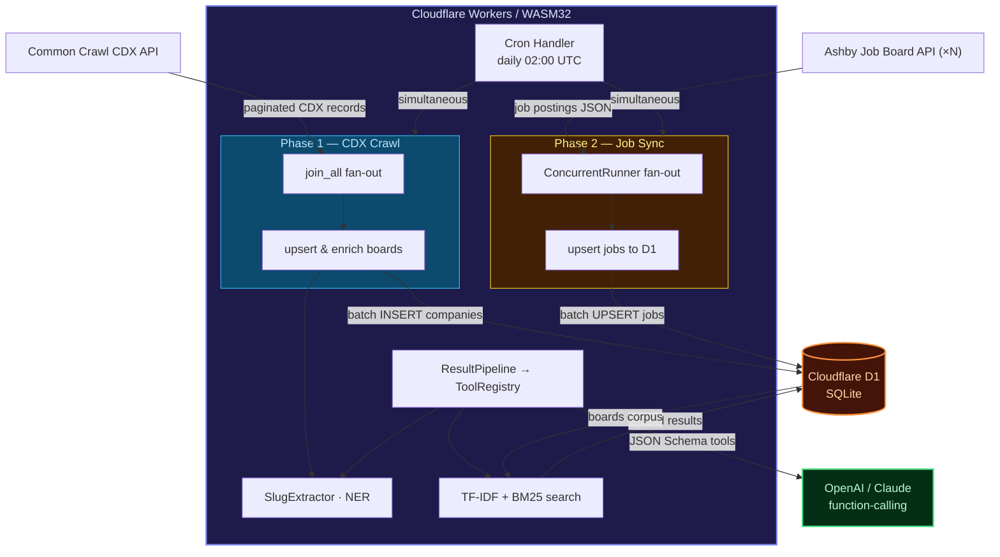
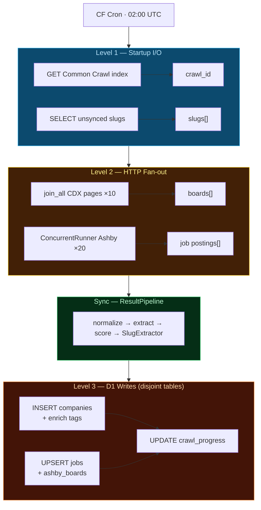

## Why Rig Doesn't Compile to WASM

[Rig](https://github.com/0xPlaygrounds/rig) is the premier Rust AI-agent framework. Its ergonomic `Agent`, `Pipeline`, `VectorStoreIndex`, and `Tool` traits let you build production LLM workflows in safe, typed Rust. The catch: `rig-core` pulls in **tokio** (multi-threaded async runtime) and **reqwest** (HTTP client built on native TLS). Neither compiles to `wasm32-unknown-unknown` — the only target Cloudflare Workers supports.

| Dependency | Reason it fails on WASM |
| --- | --- |
| `tokio` | Spawns OS threads, uses `epoll`/`kqueue` — no OS in WASM |
| `reqwest` | Links against native-TLS (`openssl`/`rustls` with C FFI) |
| `ring` / `aws-lc-rs` | x86/ARM assembly intrinsics, no WASM target |

The result: `cargo build --target wasm32-unknown-unknown` errors out the moment you add `rig-core` to `Cargo.toml`.

## The rig_compat Strategy

Rather than forking Rig or waiting for an official WASM target, the `ashby-crawler` worker implements a **`rig_compat` module** — a thin re-implementation of the seven Rig patterns that matter most for an AI crawling pipeline:

```text
rig::vector_store::InMemoryVectorStore  →  rig_compat::InMemoryVectorStore  (TF-IDF)
rig::vector_store::VectorStoreIndex     →  rig_compat::Bm25Index             (Okapi BM25)
rig::pipeline::Pipeline                 →  rig_compat::Pipeline / ResultPipeline
rig::tool::Tool                         →  rig_compat::ToolDefinition
rig::agent (dispatch)                   →  rig_compat::ToolRegistry
rig::extractor::Extractor               →  rig_compat::SlugExtractor
rig_concurrent_demo (Arc + spawn)       →  rig_compat::ConcurrentRunner      (join_all)
```

The migration path is intentional: when `rig-core` ships a `wasm32` feature flag, every `rig_compat::*` import becomes `rig::*`.

## Concurrency Without Threads

The centerpiece of the concurrent demo in standard Rig looks like this:

```rust
// Standard Rig (tokio, multi-threaded)
let model = Arc::new(client.agent("gpt-4o").build());
let handles: Vec<_> = (0..N)
    .map(|i| {
        let m = Arc::clone(&model);
        tokio::task::spawn(async move { m.prompt(format!("task {i}")).await })
    })
    .collect();
let results = futures::future::join_all(handles).await;
```

On WASM you can't `Arc` across threads (there are no threads) and you can't `spawn` tasks. But here's the key insight: **WASM is single-threaded but still cooperative**. The event loop drives async I/O just like a browser. `futures::future::join_all` achieves identical concurrent I/O throughput without any threading at all:

```rust
// rig_compat::ConcurrentRunner — CF Workers/WASM translation
pub struct ConcurrentRunner;

impl ConcurrentRunner {
    pub async fn run_all<I, T, E, Fut>(
        &self,
        items: Vec<I>,
        f: impl Fn(I) -> Fut,
    ) -> (Vec<T>, Vec<E>)
    where
        Fut: std::future::Future<Output = Result<T, E>>,
    {
        futures::future::join_all(items.into_iter().map(f))
            .await
            .into_iter()
            .fold((Vec::new(), Vec::new()), |(mut ok, mut err), r| {
                match r { Ok(v) => ok.push(v), Err(e) => err.push(e) }
                (ok, err)
            })
    }
}
```

### Mapping: tokio → futures::join_all

| Standard Rig pattern | CF Workers / WASM equivalent |
| --- | --- |
| `Arc<Model>` shared across threads | Plain `&model` reference (single-threaded) |
| `tokio::task::spawn(async move {...})` | `futures::future::join_all(items.map(f))` |
| `JoinHandle<T>` | `impl Future<Output = T>` directly |
| `handle.await?` | Result collected in `fold` |
| Thread pool saturation | Event-loop cooperative scheduling |

The **concurrency** is real — all HTTP fetches are in-flight simultaneously. Only CPU-bound work is serialised (but TF-IDF scoring and BM25 ranking are fast enough that this never matters).

## The Seven rig_compat Patterns

### 1. InMemoryVectorStore (TF-IDF)

Mirrors `rig::vector_store::InMemoryVectorStore`. Stores documents as TF-IDF vectors and ranks by cosine similarity. No embedding model, no LLM call, no network.

```rust
let mut store = rig_compat::InMemoryVectorStore::new();
store.add_document("id-1".into(), "remote rust engineer".into(), metadata);
store.rebuild_index();          // recomputes IDF corpus-wide
let hits = store.top_n("rust backend", 5);
```

**When to use:** semantic search over a small-to-medium corpus (≤50k docs) where you can rebuild the index on each Worker startup or cache it in D1.

> **Production note:** In this worker, `InMemoryVectorStore` exists in `rig_compat` as the canonical WASM-safe implementation but the live HTTP search endpoints (`/search`) use `Bm25Index` instead — BM25 handles the job-board keyword queries better. `InMemoryVectorStore` is available for cosine-similarity use cases.

### 2. Bm25Index (Okapi BM25)

Superior to TF-IDF for sparse keyword queries. Implements the full Okapi BM25 formula (k₁=1.5, b=0.75) without any external dependency.

```rust
let mut bm = rig_compat::Bm25Index::new();
bm.add_document("id-1".into(), text, meta);
bm.rebuild_index();
let results = bm.rank("remote EU full-stack", 10);
```

**When to use:** job-board keyword search, ATS title matching, any scenario where exact-term recall matters more than semantic distance.

The `/search` endpoint builds the index from `ashby_boards` at request time — slug text, enriched `company_name`, and `industry_tags` are concatenated into each document's search corpus:

```rust
async fn build_bm25_index(db: &D1Database) -> Result<rig_compat::Bm25Index> {
    let rows = db
        .prepare("SELECT slug, url, last_seen, crawl_id, company_name, industry_tags
                  FROM ashby_boards")
        .bind(&[])?.all().await?.results::<serde_json::Value>()?;

    let mut index = rig_compat::Bm25Index::new();
    for row in &rows {
        let slug       = row["slug"].as_str().unwrap_or("");
        let company    = row["company_name"].as_str().unwrap_or("");
        let industries = row["industry_tags"].as_str().unwrap_or("");
        let search_text = format!(
            "{} {} {}",
            slug.replace('-', " "), company, industries
        );
        index.add_document(slug.to_string(), search_text, meta);
    }
    index.rebuild_index();
    Ok(index)
}
```

### 3. Pipeline

A composable, synchronous transform chain. Mirrors `rig::pipeline::Pipeline`:

```rust
let pipeline = rig_compat::Pipeline::<serde_json::Value, serde_json::Value>::new()
    .then(|v| normalise(v))
    .then(|v| extract_skills(v))
    .then(|v| score_remote_eu(v));

let output = pipeline.run(raw_job_json);
```

### 4. ResultPipeline

Named steps with `Result` propagation — the `ResultPipeline` tells you exactly which step failed:

```rust
let pipeline = rig_compat::ResultPipeline::new()
    .then("validate",      |v| validate_schema(v))
    .then("enrich",        |v| enrich_from_d1(v))
    .then("classify",      |v| classify_remote_eu(v));

match pipeline.run(input) {
    Ok(result)        => persist(result),
    Err(("enrich", e)) => log::warn!("enrich step failed: {e}"),
    Err((step, e))    => log::error!("{step}: {e}"),
}
```

The actual enrichment pipeline used at crawl time has four named steps:

```rust
fn build_enrichment_pipeline() -> rig_compat::ResultPipeline {
    rig_compat::ResultPipeline::new()
        .then("normalize_slug",   |mut val| { /* strip trailing digits/hyphens */ Ok(val) })
        .then("extract_segments", |mut val| { /* URL path → has_job_postings flag */ Ok(val) })
        .then("score_recency",    |mut val| { /* CC timestamp → 0.0–1.0 recency score */ Ok(val) })
        .then("extract_metadata", |mut val| {
            if let Some(slug) = val.get("slug").and_then(|s| s.as_str()).map(String::from) {
                val["extracted"] = rig_compat::SlugExtractor::extract(&slug);
            }
            Ok(val)
        })
}
```

### 5. ToolDefinition

Generates OpenAI-compatible JSON Schema for function-calling. Your Worker can serve tool schemas to an LLM orchestrator via `/tools`:

```rust
let tool = rig_compat::ToolDefinition {
    name: "search_boards".into(),
    description: "Search Ashby job boards by keyword".into(),
    parameters: vec![
        rig_compat::ToolParam {
            name: "query".into(),
            description: "Search query".into(),
            r#type: "string".into(),
            required: true,
        },
    ],
};
let schema = tool.to_function_schema(); // OpenAI-compatible JSON
```

### 6. SlugExtractor

A deterministic `Extractor` — no LLM required. Pulls industry signals, tech signals, and company names from Ashby board slugs:

```rust
let meta = rig_compat::SlugExtractor::extract("acme-ai-platform");
// → { company_name: "Acme Ai Platform", industries: ["ai-ml", "devtools"],
//     tech_signals: [], size_signal: "startup", keywords: [...] }
```

This runs automatically at the end of every CDX crawl batch via `auto_enrich_boards` — persisting `industry_tags`, `tech_signals`, and `size_signal` columns back to D1 without any extra HTTP request.

### 7. ToolRegistry

Explicit tool dispatch (the agent pattern without LLM routing):

```rust
let mut registry = rig_compat::ToolRegistry::new();
registry.register("search",  "Search boards by keyword",  |args| { ... });
registry.register("enrich",  "Enrich a board slug",       |args| { ... });
registry.register("crawl_index", "Trigger CC crawl",      |args| { ... });

// Dispatch by name (could come from LLM tool_calls JSON)
let result = registry.call("search", serde_json::json!({ "query": "rust remote" }))?;
```

`GET /tools?call=<name>&args={...}` executes any registered tool inline, so an LLM orchestrator can call this Worker as a function server without a separate adapter layer.

## Real Usage: Three-Level Concurrency in the Cron Handler

The real home of `ConcurrentRunner` is the **daily cron handler**, not the HTTP endpoints. The cron implements three nested levels of concurrency to max out Cloudflare's event loop within the Worker's CPU time budget.

### Level 1 — Independent I/O at startup (`futures::future::join`)

```rust
// CC index list (HTTP) and Phase 2 slug queue (D1) are fully independent.
// Mirrors rig_concurrent_demo: shared context used across concurrent tasks.
let (cc_result, slugs_result) = join(
    list_cc_indexes(),                                   // HTTP → commoncrawl.org
    get_company_slugs(&db, BOARDS_PER_JOB_SYNC_RUN),    // D1 SELECT
).await;
```

`join` gives us 2-way fan-out without allocating a `Vec`. The DB borrow is safe because WASM is single-threaded — no `Arc<Mutex<>>` needed.

### Level 2 — Maximum HTTP fan-out (`join_all` ∥ `ConcurrentRunner`)

```rust
// Phase 1: CDX page fetches (join_all — homogeneous, variable N)
let cdx_futures: Vec<_> = (start_page..end_page)
    .map(|page| {
        let cid = crawl_id.clone();
        async move { (page, fetch_cdx_page(&cid, page).await) }
    })
    .collect();

// Phase 2: Ashby job board fetches (ConcurrentRunner — rig agent pattern)
let runner = rig_compat::ConcurrentRunner::new();

// Both phases fly concurrently — CDX reads ∥ Ashby API reads
let (mut cdx_results, (ashby_ok, ashby_err)) = join(
    join_all(cdx_futures),
    runner.run_all(slugs.clone(), |slug| async move {
        fetch_ashby_board_jobs(&slug)
            .await
            .map(|board| (slug, board))
    }),
).await;
```

All HTTP requests — 10 CDX pages and up to 20 Ashby API calls — are in-flight simultaneously. Cloudflare's event loop drives I/O; `join` and `join_all` collect results as each future resolves.

### Level 3 — Concurrent D1 writes to disjoint tables

```rust
// Phase 1 writes to `companies`.
// Phase 2 writes to `jobs` + `ashby_boards`.
// Disjoint tables → safe to run concurrently under D1's WAL mode.
let ((upserted, enriched), phase2_synced) = join(
    async {
        let u = upsert_boards(&db, &all_new_boards).await.unwrap_or(0);
        let e = auto_enrich_boards(&db, &all_new_boards).await.unwrap_or(0);
        (u, e)
    },
    async {
        let mut total = 0usize;
        for (slug, board) in ashby_ok {
            let title = board.title.clone().unwrap_or_default();
            total += upsert_jobs_to_d1(&db, &board.jobs, &slug, &title)
                .await.unwrap_or(0);
        }
        total
    },
).await;
```

The three levels nest cleanly:

```text
join(startup I/O)
  └─ join(
       join_all(CDX pages),          // Level 2a — Phase 1 HTTP
       runner.run_all(Ashby jobs)    // Level 2b — Phase 2 HTTP
     )
       └─ join(
            upsert_companies,        // Level 3a — Phase 1 D1 writes
            upsert_jobs              // Level 3b — Phase 2 D1 writes
          )
```

### HTTP Endpoints — Local Pipeline, Not HTTP Fan-out

The `/enrich` and `/enrich-all` HTTP endpoints run the `ResultPipeline` **locally** over rows already in D1 — they do not fan out to the Ashby API. This is the intended separation of concerns:

- **Cron**: fetch → process → write (concurrent HTTP, batch D1 writes)
- **`/enrich`**: on-demand pipeline inspection for a single board (debug/dev)
- **`/enrich-all`**: batch pipeline re-run over cached D1 rows (offline analysis)

```rust
// /enrich-all: sequential pipeline over D1 rows (no outbound HTTP)
let rows = db
    .prepare("SELECT key as slug, website as url, ... FROM companies LIMIT ?1")
    .bind(&[(limit as f64).into()])?.all().await?.results::<serde_json::Value>()?;

let pipeline = build_enrichment_pipeline();
for r in rows {
    match pipeline.run(r) {
        Ok(v)          => enriched.push(v),
        Err((step, e)) => errors.push(json!({ "step": step, "error": e })),
    }
}
```

## Cargo.toml — Minimal Dependencies

```toml
[package]
name = "ashby-crawler"
version = "0.2.0"
edition = "2021"

[lib]
crate-type = ["cdylib"]           # WASM target

[dependencies]
worker     = { version = "0.7", features = ["d1"] }  # CF Workers SDK
serde      = { version = "1",   features = ["derive"] }
serde_json = "1"
futures    = "0.3"                # join / join_all — no tokio required

# rig-core intentionally omitted: doesn't compile to wasm32-unknown-unknown
```

`futures = "0.3"` is the only async dependency. No `tokio`, no `reqwest`, no `ring`. Both `join` (2-way) and `join_all` (N-way) come from `futures::future`.

## Migration Path to Native Rig

The module boundary is the migration point. When `rig-core` ships `wasm32` support:

```rust
// Before (rig_compat)
use crate::rig_compat::{InMemoryVectorStore, Pipeline, ToolDefinition, ConcurrentRunner};

// After (native Rig)
use rig::vector_store::InMemoryVectorStore;
use rig::pipeline::Pipeline;
use rig::tool::ToolDefinition;
// ConcurrentRunner stays: rig doesn't provide a WASM concurrent runner
```

The public API surface of each type is intentionally kept identical to Rig's. No business logic needs to change — only the `use` statements.

## Architecture Summary



## Key Takeaways

- **WASM concurrency is real.** `futures::future::join` and `join_all` give identical I/O throughput to `tokio::task::spawn` for network-bound workloads. The single-threaded model is a CPU constraint, not an I/O constraint.
- **Three levels, not one.** Production usage isn't a flat `join_all` — it's `join(startup_io)` → `join(join_all(CDX), runner.run_all(Ashby))` → `join(D1_writes_A, D1_writes_B)`. Nesting `join` and `join_all` extracts maximum event-loop utilisation within a single WASM execution.
- **Rig patterns are portable.** `VectorStore`, `Pipeline`, `Tool`, `Extractor`, and `Agent` dispatch are architectural patterns, not library-specific APIs. They translate directly to WASM with zero external dependencies beyond `futures`.
- **BM25 beats TF-IDF for job search.** Okapi BM25 handles document-length variance and query-term saturation that TF-IDF ignores. Both are in `rig_compat`; BM25 is used for all HTTP search endpoints.
- **Auto-enrich on every crawl batch.** `auto_enrich_boards` runs `SlugExtractor` and the `ResultPipeline` synchronously after each CDX batch write, persisting `industry_tags`, `tech_signals`, and `size_signal` to D1. The BM25 index picks these up immediately on the next `/search` call.
- **D1 WAL enables concurrent writes.** Phase 1 (`companies`) and Phase 2 (`jobs` + `ashby_boards`) write to disjoint tables. D1's WAL mode allows both `join`-ed futures to proceed without blocking.
- **The migration path is clean.** Keeping `rig_compat` as a single internal module means switching to native Rig is a search-and-replace operation across `use` statements.
