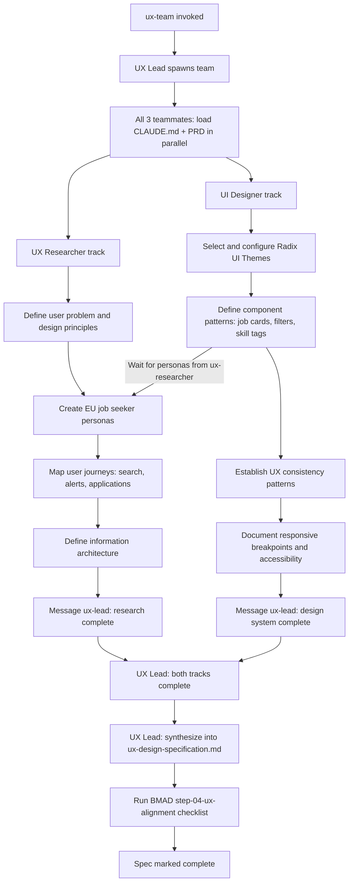

:::tip TL;DR
Set `CLAUDE_CODE_EXPERIMENTAL_AGENT_TEAMS=1` in `.claude/settings.json`. Write a command file in `.claude/commands/` and spawn prompts in `.claude/team-roles/`. Type `/ux-team` and three agents — UX Lead, UX Researcher, UI Designer — run in parallel: researcher defines personas and journeys, designer builds the component system, lead synthesizes into a spec. File ownership is enforced by persona, not by filesystem. BMAD Method v6 provides the Sally persona and a quality-gate checklist that runs before the spec is marked complete.
:::

<!--truncate-->

## The Problem: UX Design Is Multi-Disciplinary, and One Session Isn't

When I started designing the UI for [nomadically.work](https://nomadically.work) — a remote EU job board aggregator — I hit a familiar wall. Good UX work splits naturally across disciplines: someone has to understand the users, someone has to translate that into an information architecture, and someone has to map it against the actual component library and tech constraints. Doing all of it in a single Claude session means the model wears too many hats simultaneously. Research context crowds out system design thinking. Component decisions happen before personas are solid.

I wanted a coordinated team — three agents, each with a specialist lens, working in parallel — rather than one agent doing sequential context switches in a single window.

This article is a walkthrough of how I built that team. It covers the file structure, the command that spawns it, the role definitions that constrain each agent, the parallel execution model, and the BMAD integration that adds a quality gate before the spec ships.

---

## Enabling Agent Teams

Claude Code Agent Teams is an experimental feature. Enabling it takes one line in `.claude/settings.json`:

```json
{
  "env": {
    "CLAUDE_CODE_EXPERIMENTAL_AGENT_TEAMS": "1"
  }
}
```

With this flag set, Claude Code can spawn multiple sessions — called teammates — from a lead session. Each teammate runs in its own context window, claims tasks from a shared task list, and can message other teammates directly. The lead coordinates, synthesizes, and shuts the team down when work is complete.

Key constraints worth knowing up front:

- **No session resumption**: `/resume` and `/rewind` do not restore in-process teammates. If you resume a session, the lead may try to message teammates that no longer exist — spawn new ones.
- **One team per session**: a lead can only manage one team at a time. Clean up before starting another.
- **No nested teams**: teammates cannot spawn their own teammates.
- **File ownership is self-enforced**: the runtime doesn't lock files between agents. Ownership is maintained through persona instructions — each role file tells the agent which files it must not touch.

---

## File Structure

The whole system lives in three places:

```
.claude/
├── settings.json                  ← CLAUDE_CODE_EXPERIMENTAL_AGENT_TEAMS=1
├── commands/
│   └── ux-team.md                 ← the slash command that spawns the team
└── team-roles/
    ├── ux-lead.md                 ← UX Lead spawn prompt
    ├── ux-researcher.md           ← UX Researcher spawn prompt
    └── ui-designer.md             ← UI Designer spawn prompt

_bmad/
└── bmm/
    ├── agents/
    │   └── ux-designer.md         ← Sally persona (BMAD)
    └── workflows/
        └── 3-solutioning/
            └── check-implementation-readiness/
                └── steps/
                    └── step-04-ux-alignment.md   ← quality gate checklist

_bmad-output/
└── planning-artifacts/
    ├── ux-research-notes.md       ← UX Researcher working file
    ├── ui-design-notes.md         ← UI Designer working file
    └── ux-design-specification.md ← final output (UX Lead owns this)
```

---

## The Command File

The entry point is `.claude/commands/ux-team.md`. When I type `/ux-team` in Claude Code, this file is loaded as a skill and executed. The frontmatter tells Claude Code when to auto-trigger it:

```markdown
---
name: 'ux-team'
description: 'Spawn a 3-teammate UX agent team (UX Lead + UX Researcher + UI Designer)
  to produce a UX design specification in parallel. Use when the user says
  "create UX team", "spawn UX team", "run UX team", or "ux team design".'
---

Create an agent team to produce the UX design specification for nomadically.work.

Spawn 3 teammates using the spawn prompts in `.claude/team-roles/`:

1. **ux-lead** — reads `.claude/team-roles/ux-lead.md`. Coordinates the team,
   synthesizes findings, owns `_bmad-output/planning-artifacts/ux-design-specification.md`.
   Require plan approval before it writes any final synthesis section.

2. **ux-researcher** — reads `.claude/team-roles/ux-researcher.md`. Handles user
   problem definition, personas, user journeys, content strategy, information
   architecture, and design principles (UX workflow steps 1-6). Works independently;
   messages ux-lead when sections are ready.

3. **ui-designer** — reads `.claude/team-roles/ui-designer.md`. Handles design system,
   component patterns, UX consistency patterns, responsive design, and accessibility
   (UX workflow steps 7-12). Must wait for ux-researcher's personas before finalizing
   navigation patterns.
```

The command also seeds the shared task list — the mechanism teammates use to claim and track work:

```markdown
Team task structure (create these tasks for the shared task list):
- [ ] Load project context: read CLAUDE.md, PRD, and existing planning artifacts (all teammates in parallel)
- [ ] UX Researcher: define user problem, goals, and design principles
- [ ] UX Researcher: create user personas (EU remote job seekers + hiring managers)
- [ ] UX Researcher: map user journeys (search, alert setup, application, company research)
- [ ] UX Researcher: define information architecture and content strategy
- [ ] UI Designer: select and configure design system (Radix UI)
- [ ] UI Designer: define component patterns (job cards, filters, skill tags, company profiles)
- [ ] UI Designer: establish UX consistency patterns (feedback, forms, states)
- [ ] UI Designer: document responsive breakpoints and accessibility requirements
- [ ] UX Lead: synthesize all findings into ux-design-specification.md
- [ ] UX Lead: run UX alignment check against PRD and architecture
```

---

## The Role Files

Each teammate's behavior is defined in a spawn prompt — a Markdown file in `.claude/team-roles/`. When the lead spawns a teammate, it loads the relevant file as the agent's system context. These files are the critical design surface: they define what each agent owns, what it must not touch, and how it coordinates with the others.

### UX Lead

```markdown
# .claude/team-roles/ux-lead.md

You are the UX Lead teammate for the nomadically.work project — a remote EU job
board aggregator targeting EU-based remote job seekers and employers.

You coordinate the UX team (UX Researcher + UI Designer teammates), synthesize
their findings, and own the final UX design specification. You embody the Sally
persona from `_bmad/bmm/agents/ux-designer.md`.

Your job:
- Coordinate work between ux-researcher and ui-designer teammates via the shared task list
- Break the UX design workflow into parallel research tracks (see below)
- Synthesize findings from both teammates into
  `_bmad-output/planning-artifacts/ux-design-specification.md`
- Arbitrate design conflicts and make final decisions
- Message teammates directly when you need clarification or to unblock them
- Validate the final spec against the PRD in `_bmad-output/planning-artifacts/`
- Use plan approval (require-plan-approval) for any teammate work that will define
  final spec sections

Coordination rules:
- ux-researcher must complete personas and journeys BEFORE ui-designer finalizes
  information architecture
- Both tracks complete BEFORE you write the synthesis sections of the spec
- Broadcast to both teammates when you receive a new brief or input document
- Do NOT edit `docs/prd.md` or `docs/architecture.md` — read them, don't touch them

Quality gate: before marking the spec complete, run the alignment check from
`_bmad/bmm/workflows/3-solutioning/check-implementation-readiness/steps/step-04-ux-alignment.md`.
```

The UX Lead is the only agent that writes to `ux-design-specification.md`. It doesn't do original research — it synthesizes. And it cannot mark the spec complete without running the BMAD alignment checklist.

### UX Researcher

```markdown
# .claude/team-roles/ux-researcher.md

You are the UX Researcher teammate for the nomadically.work project.

Your job:
- Define the core user problem and experience goals
- Create user personas representing EU-based remote job seekers and hiring managers
- Map user journeys: job search flow, job alert setup, application tracking,
  company research
- Establish information architecture and content hierarchy
- Define design principles grounded in user needs
- Develop content strategy (labels, microcopy tone, empty states, error messages)

Domain context you must understand:
- Primary users: EU-based remote job seekers filtering by remote + EU eligibility
- Secondary users: recruiters/companies posting on Ashby/Greenhouse/Lever
- Key user pain points: filtering noise (fake remote jobs), skill mismatch,
  non-EU companies
- The AI classification pipeline (`is_remote_eu`) is what makes results trustworthy
- GraphQL API feeds the frontend — your IA decisions directly affect query shape

Constraints:
- Do NOT define visual design or component patterns — that belongs to ui-designer
- Do NOT edit `docs/prd.md` or `docs/architecture.md`
- Message ux-lead when personas are complete so ui-designer can begin information
  architecture
- Challenge assumptions — if the PRD's user story doesn't match actual user
  behavior, flag it
```

The domain context section is load-bearing. Without it, a generic researcher agent doesn't know that `is_remote_eu` is the trust signal that makes the product worth using, or that IA decisions flow directly into GraphQL query shape. That knowledge has to be in the spawn prompt.

### UI Designer

```markdown
# .claude/team-roles/ui-designer.md

You are the UI Designer teammate for the nomadically.work project.

Your job:
- Select and configure the design system (the project uses Radix UI Themes + Icons)
- Define component patterns: job cards, filters, search bar, skill tags, company
  profiles, application forms
- Establish UX consistency patterns: button hierarchy, form validation, feedback
  states, loading states, empty states, modals
- Design for responsive breakpoints (mobile-first — many EU job seekers browse
  on mobile)
- Define accessibility requirements (WCAG 2.1 AA minimum): color contrast,
  keyboard navigation, ARIA labels, focus management

Tech stack constraints you must design within:
- UI library: Radix UI Themes + Radix Icons (already installed)
- Frontend: Next.js 16 App Router, React 19 — components live in `src/components/`
- No custom CSS framework — use Radix Themes tokens and utility classes
- GraphQL drives data — design components around the existing schema types in `schema/`

Constraints:
- Do NOT define user personas, journeys, or content strategy — that belongs to
  ux-researcher
- Do NOT edit `docs/prd.md`, `docs/architecture.md`, or any `src/` files
- Wait for ux-researcher's personas before finalizing navigation patterns
```

The tech stack section matters here. Radix UI Themes is already installed. Telling the UI Designer agent it can't introduce a custom CSS framework or reach outside the existing component library keeps the output actionable rather than aspirational.

---

## How Coordination Actually Works

When I type `/ux-team`, the lead session does three things in sequence: loads the command file, seeds the shared task list, and spawns the three teammates. From that point the coordination model looks like this:



The two parallel tracks — researcher and designer — run concurrently from the start. There is one explicit dependency: the UI Designer must wait for the UX Researcher's personas before finalizing navigation patterns. Both tracks message the UX Lead when their sections are ready. The lead synthesizes only after both confirm.

This dependency is stated in the UI Designer's spawn prompt (`Wait for ux-researcher's personas before finalizing navigation patterns`), reinforced in the command file (`ui-designer waits for personas before finalizing navigation`), and enforced by the UX Lead's coordination rules. Three layers of instruction for one constraint — that redundancy is intentional.

---

## The BMAD Integration

[BMAD Method v6](https://github.com/bmad-code-org/BMAD-METHOD) provides two things to this team: a persona and a quality gate.

### The Sally Persona

The UX Lead's spawn prompt includes: `You embody the Sally persona from _bmad/bmm/agents/ux-designer.md`. Sally is BMAD's built-in UX Designer agent — one of the twelve domain-expert personas in the framework. The persona definition includes activation steps, a menu of UX workflows, and constraints around user advocacy.

Rather than write a UX Lead persona from scratch, I reference BMAD's existing one. The UX Lead loads `_bmad/bmm/agents/ux-designer.md` at activation and inherits Sally's UX methodology. This means the persona is maintained upstream in the BMAD framework rather than in project files.

### The Quality Gate

Before the UX Lead can mark the spec complete, it must run:

```
_bmad/bmm/workflows/3-solutioning/check-implementation-readiness/steps/step-04-ux-alignment.md
```

This is a BMAD checklist step that validates the UX design specification against the PRD — checking that user stories have corresponding design coverage, that all primary user journeys are mapped, and that the design system choices are consistent with the tech stack. The UX Lead's spawn prompt makes this explicit: running the alignment check is a precondition for marking the spec done.

This pattern — quality gate as a checklist referenced from the role definition — is the core BMAD integration. The agent doesn't decide when it's done. A structured checklist decides.

---

## Invoking the Team

The command triggers in two ways:

```bash
# Slash command in Claude Code
/ux-team

# Natural language triggers (from the command description)
"create UX team"
"spawn UX team"
"run UX team"
"ux team design"
```

The natural language triggers are declared in the command file's `description` field. Claude Code reads them and auto-triggers the skill when it recognizes the pattern. This means I don't have to remember the exact slash command — saying "create UX team" in the chat is enough.

---

## Limitations Worth Naming

**File ownership is self-enforced by persona, not by the filesystem.** When I write `Do NOT edit docs/prd.md` in a role file, that's an instruction to the model — not a filesystem lock. Under high context pressure or if the spawn prompt is unclear, an agent can violate its ownership constraints. The mitigation is redundancy: the same constraint appears in the command file, the role file, and sometimes the lead's coordination rules. But it's not a hard guarantee.

**Each agent has its own context window.** The three teammates don't share memory. If the UX Researcher discovers something unexpected in the PRD, it has to explicitly message the UX Lead, who then has to relay to the UI Designer if relevant. Information doesn't flow automatically — it flows through messages on the shared task list.

**Session resumption breaks the team.** If I close and resume the lead session, the teammates are gone. The lead may try to message them and get no response. I have to tell it to spawn new teammates. For long-running specs this is a real friction point.

**Context window per agent is finite.** A UX Researcher working through a complex product area can hit context limits before it's done. The mitigation I use is having research agents write intermediate findings to a working file (`_bmad-output/planning-artifacts/ux-research-notes.md`) so work isn't lost if a session ends.

**The experimental flag signals real instability.** `CLAUDE_CODE_EXPERIMENTAL_AGENT_TEAMS=1` is not a stable API. Behavior can change between Claude Code versions. I treat this as a planning and design tool, not a production pipeline. For codegen I still prefer single-agent sessions with tight scope.

---

## Why Three Agents Instead of One or Two

I briefly considered a two-agent model: one researcher, one designer-and-lead. The problem is that synthesis is a full-time job on a complex spec. The UX Lead needs to arbitrate between researcher findings and designer constraints, resolve conflicts, run the quality gate, and validate against the PRD. Folding that into the designer role means the designer makes synthesis decisions that the researcher should be able to push back on.

Three agents also maps to how design teams actually work. UX research and UI design are genuinely separate disciplines with different mental models. Keeping them as separate agents means the research track can challenge design assumptions and vice versa — through the lead, which is the right escalation path.

The diminishing return shows up at four agents. A fourth agent (say, a content strategist) would require more coordination overhead than it adds in a typical spec cycle. The UX Researcher already owns content strategy in this setup.

---

## Adapting This Pattern

The same structure applies to any planning or design task that benefits from parallel specialist work:

1. **Write a command file** in `.claude/commands/` with a `description` field that defines when it triggers. Seed the shared task list in the command body.
2. **Write a spawn prompt per role** in `.claude/team-roles/`. Be explicit about ownership (which files the agent writes), constraints (which files it must not touch), and dependencies (what it must wait for before proceeding).
3. **Name the coordinator role** explicitly. One agent synthesizes, arbitrates conflicts, and owns the final output. The others feed it.
4. **Add a quality gate** referenced from the coordinator's spawn prompt. A BMAD checklist step works. A custom checklist file works too.
5. **Run intermediary outputs to files** so teammates don't lose work if sessions end.

For a different domain: substitute `ux-researcher` with `domain-researcher`, `ui-designer` with `backend-architect`, and the quality gate with a tech spec review checklist. The coordination pattern is domain-agnostic.

---

## What It Produced

Running `/ux-team` on nomadically.work produced `_bmad-output/planning-artifacts/ux-design-specification.md` — a structured doc covering EU job seeker personas, four mapped user journeys (search, alert setup, application tracking, company research), a Radix UI component pattern library (job cards, skill tag filters, application forms), WCAG 2.1 AA accessibility requirements, and mobile-first responsive breakpoints. The UX Lead ran the BMAD alignment checklist and flagged two gaps against the PRD before marking it complete.

The total elapsed time was roughly 25 minutes of agent work with two human checkpoints: one plan-approval gate before the lead began synthesis, and one manual review of the final spec. That's the practical trade-off — the team does the parallel research, the human stays in the decision loop at synthesis time.

The spec feeds directly into component implementation. The UI Designer's component pattern section maps to `src/components/` file structure. The researcher's IA section informed GraphQL query shape. That's the point: good UX work done in the right structure produces artifacts that the implementation team can actually use.
