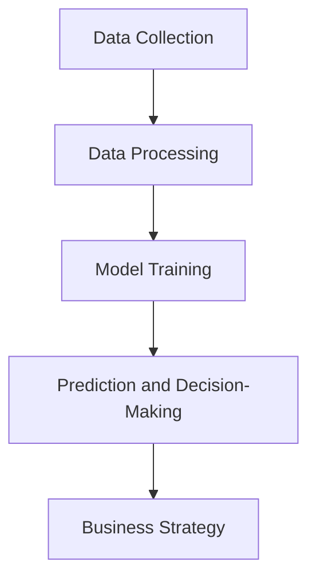

## Introduction

In the rapidly evolving financial landscape, artificial intelligence (AI) and machine learning (ML) have become essential tools for enhancing efficiency, accuracy, and decision-making. These technologies are not just about automating routine tasks but are also about transforming the finance function into a strategic partner in business. This article explores how AI and ML are shaping the future of finance, providing both challenges and opportunities for financial professionals.

<!-- truncate -->

## The Role of AI in Finance

AI involves the development of systems capable of performing tasks that typically require human intelligence, such as decision-making, visual perception, and speech recognition. In finance, AI is leveraged to enhance processes like credit approval, fraud detection, and market prediction. Its ability to handle large volumes of data and perform complex analyses makes AI a vital component in modern financial operations.

### Machine Learning: The Backbone of AI in Finance

Machine Learning, a subset of AI, focuses on creating algorithms that enable computers to learn from and make decisions based on data. In finance, ML is used for predictive analytics, portfolio optimization, and algorithmic trading. The key goal of ML is to generalize from historical data to make accurate predictions about future events.

## Understanding the Strategic Impact

The strategic impact of AI and ML in finance extends beyond simple automation. These technologies enable financial institutions to process data more efficiently, reduce human error, and make more informed decisions. By automating routine tasks, AI frees up professionals to focus on higher-value activities, such as strategic planning and risk management.

### Benefits of AI and ML in Finance

- **Increased Efficiency**: Automating routine tasks like transaction processing and compliance reduces the time and resources needed for these activities, allowing for faster and more accurate results.
- **Enhanced Decision-Making**: AI and ML provide deep insights from vast amounts of data, helping financial professionals make more informed and strategic decisions.
- **Risk Management**: AI can identify patterns and anomalies that might indicate fraud or other risks, providing an additional layer of security and compliance.

## Challenges and Considerations

While AI and ML offer significant advantages, they also come with challenges. For instance, the integration of AI systems into existing workflows can be complex, and there are concerns about the accuracy and transparency of AI-driven decisions. Additionally, the finance industry’s traditionally risk-averse nature may resist the adoption of AI and ML technologies, especially when it comes to trusting machine-generated insights.

### Key Considerations for Implementation

- **Data Integrity**: Ensuring the quality and accuracy of data is crucial for the success of AI and ML applications in finance.
- **Scalability**: AI and ML models must be scalable to handle the growing volumes of financial data effectively.
- **Human Oversight**: Despite the capabilities of AI, human oversight is essential to ensure that the insights and decisions generated by these systems align with the organization's strategic goals.

## Visual Representation with Diagrams

### How AI Enhances Financial Processes

In this diagram:

- **Transaction Processing** is the initial routine task.
- **AI Integration** enhances the process, leading to **Reduced Manual Effort** and **Increased Accuracy**.
- The ultimate outcome is a shift towards **Strategic Focus**, enabling professionals to engage in higher-value activities.

### Workflow of Machine Learning in Finance

In this workflow:

1. **Data Collection**: Gathering relevant financial data.
2. **Data Processing**: Cleaning and preparing the data for analysis.
3. **Model Training**: Using historical data to train ML models.
4. **Prediction and Decision-Making**: Applying the trained model to make predictions and inform decisions.
5. **Business Strategy**: Leveraging insights to refine and execute the organization's strategy.

## Conclusion

AI and ML are revolutionizing the finance industry, driving efficiency, enhancing decision-making, and enabling financial professionals to focus on strategic activities. While there are challenges in adopting these technologies, the benefits far outweigh the risks. As AI continues to evolve, its role in finance will expand, offering even greater opportunities for innovation and growth.
