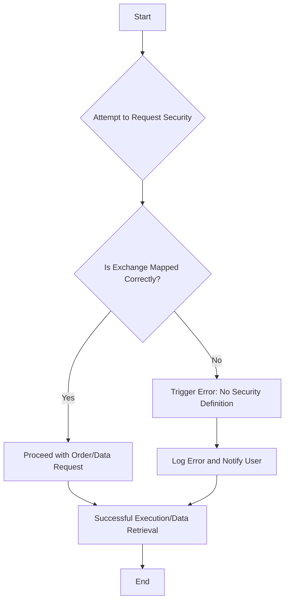
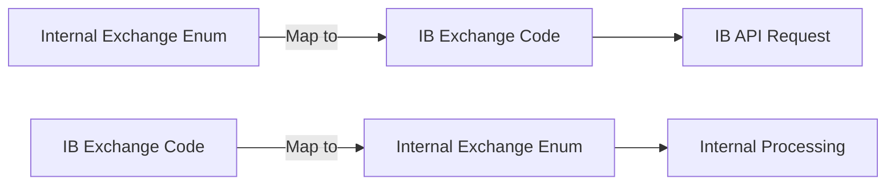
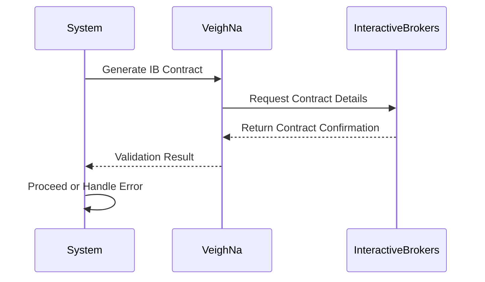
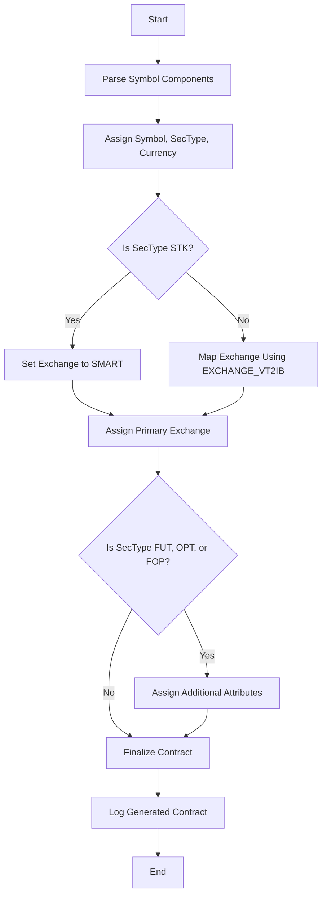
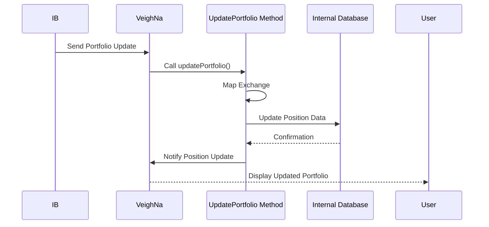
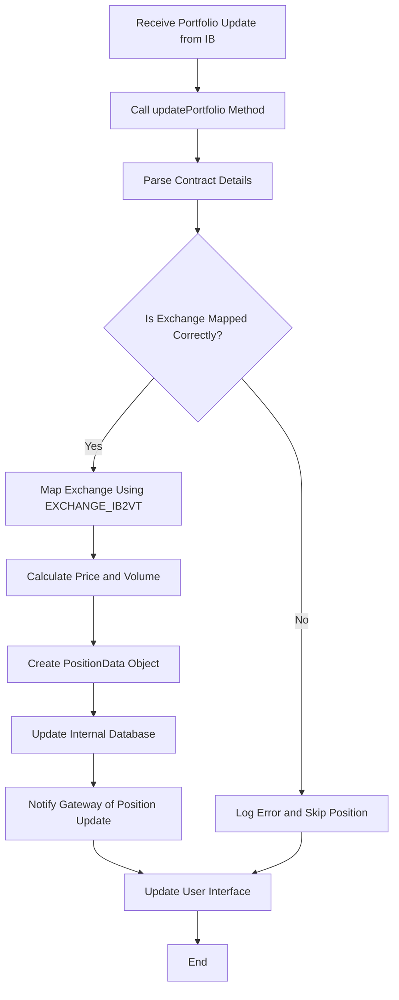

## Introduction

In the intricate world of **algorithmic trading**, seamless integration between trading platforms and broker APIs is paramount. One common hurdle traders encounter is the error:

```
ERROR:root:Error - ReqId: 1, Code: 200, Message: No security definition has been found for the request
```

This error typically arises due to **incorrect exchange mapping**, preventing Interactive Brokers (IB) from recognizing the requested security. This article delves into the importance of accurate exchange mapping within the **VeighNa** trading platform, provides a detailed overview of IB's symbol rules, explains the `updatePortfolio` method, and offers guidance on implementing correct mappings to avoid such errors.

<!-- truncate -->

## Overview of the Error

### What Is the "No Security Definition" Error?

When interfacing with Interactive Brokers (IB) through platforms like VeighNa, each security must be precisely defined with the correct attributes. The error:

```
ERROR:root:Error - ReqId: 1, Code: 200, Message: No security definition has been found for the request
```

indicates that IB could not recognize the security based on the provided contract details. This typically stems from:

- **Incorrect Exchange Code**: Using an exchange code that IB does not recognize for the given security.
- **Unsupported Security Type**: Specifying a product type that doesn't align with the security.
- **Malformed Symbol Format**: Not adhering to IB's symbol formatting rules.

### Importance of Correct Exchange Mapping

Accurate exchange mapping ensures that:

- **Orders and Data Requests**: Are directed to the correct exchange, facilitating proper execution and data retrieval.
- **Error Prevention**: Minimizes the likelihood of encountering errors related to unrecognized securities.
- **Efficient Trading**: Enhances the reliability and performance of your trading algorithms.

### Error Flow Diagram

To visualize how incorrect exchange mapping leads to the "No security definition" error, consider the following flowchart:



This diagram illustrates the decision-making process when a security request is made and how incorrect exchange mapping leads to an error.

---

## Interactive Brokers Symbol Rules

IB requires a precise format to uniquely identify each security. Below are the **IB Symbol Rules** that must be adhered to for successful contract definition:

```
IB Symbol Rules

SPY-USD-STK   SMART
EUR-USD-CASH  IDEALPRO
XAUUSD-USD-CMDTY  SMART
ES-202002-USD-FUT  GLOBEX
SI-202006-1000-USD-FUT  NYMEX
ES-2020006-C-2430-50-USD-FOP  GLOBEX
```

### Breakdown of Components

1. **SYMBOL**: The ticker symbol of the security (e.g., SPY, EUR, XAUUSD).
2. **CURRENCY**: The currency in which the security is denominated (e.g., USD).
3. **PRODUCT_TYPE**: The type of product (e.g., STK for stocks, CASH for forex, CMDTY for commodities, FUT for futures, FOP for options on futures).
4. **EXCHANGE**: The specific exchange code where the security is traded (e.g., SMART, IDEALPRO, GLOBEX, NYMEX).

### Examples

- **SPY-USD-STK.SMART**

  - **SPY**: SPDR S&P 500 ETF Trust
  - **USD**: Denominated in U.S. Dollars
  - **STK**: Stock
  - **SMART**: IB's smart routing exchange

- **ES-202002-USD-FUT.GLOBEX**
  - **ES**: E-mini S&P 500 Futures
  - **202002**: February 2020 contract
  - **USD**: Denominated in U.S. Dollars
  - **FUT**: Futures
  - **GLOBEX**: CME's electronic trading platform

---

## Exchange Mapping in Code

Accurate exchange mapping is crucial for the correct identification of securities. The provided Python code includes dictionaries to map internal exchange enums to IB's exchange codes and vice versa.

### Exchange Mapping Dictionaries

```python
# Exchange mapping from internal to IB
EXCHANGE_VT2IB: Dict[Exchange, str] = {
    Exchange.SMART: "SMART",
    Exchange.NYMEX: "NYMEX",
    Exchange.GLOBEX: "GLOBEX",
    Exchange.IDEALPRO: "IDEALPRO",
    Exchange.CME: "CME",
    Exchange.ICE: "ICE",
    Exchange.SEHK: "SEHK",
    Exchange.SSE: "SEHKNTL",
    Exchange.SZSE: "SEHKSZSE",
    Exchange.HKFE: "HKFE",
    Exchange.CFE: "CFE",
    Exchange.TSE: "TSE",
    Exchange.NYSE: "NYSE",
    Exchange.NASDAQ: "NASDAQ",
    Exchange.AMEX: "AMEX",
    Exchange.ARCA: "ARCA",
    Exchange.EDGEA: "EDGEA",
    Exchange.ISLAND: "ISLAND",
    Exchange.BATS: "BATS",
    Exchange.IEX: "IEX",
    Exchange.IBKRATS: "IBKRATS",
    Exchange.OTC: "PINK",
    Exchange.SGX: "SGX"
}

# Exchange mapping from IB to internal
EXCHANGE_IB2VT: Dict[str, Exchange] = {
    "SMART": Exchange.SMART,
    "NYMEX": Exchange.NYMEX,
    "GLOBEX": Exchange.GLOBEX,
    "IDEALPRO": Exchange.IDEALPRO,
    "CME": Exchange.CME,
    "ICE": Exchange.ICE,
    "SEHK": Exchange.SEHK,
    "SEHKNTL": Exchange.SSE,
    "SEHKSZSE": Exchange.SZSE,
    "HKFE": Exchange.HKFE,
    "CFE": Exchange.CFE,
    "TSE": Exchange.TSE,
    "NYSE": Exchange.NYSE,
    "NASDAQ": Exchange.NASDAQ,
    "NMS": Exchange.NASDAQ,  # Added mapping for 'NMS'
    "AMEX": Exchange.AMEX,
    "ARCA": Exchange.ARCA,
    "EDGEA": Exchange.EDGEA,
    "ISLAND": Exchange.ISLAND,
    "BATS": Exchange.BATS,
    "IEX": Exchange.IEX,
    "IBKRATS": Exchange.IBKRATS,
    "PINK": Exchange.OTC,
    "SGX": Exchange.SGX
}
```

### Issues Leading to the Error

The error `No security definition has been found for the request` often stems from:

1. **Incorrect Exchange Code**: Using an exchange code that IB doesn't recognize for the given security.
2. **Unsupported Security Type**: Specifying a product type that isn't valid for the security.
3. **Malformed Symbol Format**: Not adhering to IB's symbol formatting rules.

Ensuring the correct mapping between your internal exchange enums and IB's exchange codes is essential to prevent such errors.

### Exchange Mapping Process Diagram

Understanding the exchange mapping process is crucial. The following diagram illustrates how internal exchange enums are mapped to IB's exchange codes and vice versa:



This diagram showcases the bidirectional mapping between internal exchange enums and IB's exchange codes, ensuring accurate communication between the trading platform and IB.

---

## Implementing Correct Exchange Mapping

To resolve the exchange mapping issue, follow these steps:

### 1. Verify IB Symbol Rules

Ensure that the symbol format aligns with IB's requirements. For example:

- **Stocks**: `SYMBOL-CURRENCY-STK.EXCHANGE`
- **Forex**: `SYMBOL-CURRENCY-CASH.EXCHANGE`
- **Commodities**: `SYMBOL-CURRENCY-CMDTY.EXCHANGE`
- **Futures**: `SYMBOL-CONTRACT_MONTH-CURRENCY-FUT.EXCHANGE`
- **Options on Futures**: `SYMBOL-CONTRACT_MONTH-OPTION_TYPE-STRIKE-CURRENCY-FOP.EXCHANGE`

### 2. Update Exchange Mapping Dictionaries

Ensure that your exchange mappings cover all necessary exchanges used in your symbol definitions.

**Example:**

```python
# Add missing exchanges if necessary
EXCHANGE_VT2IB[Exchange.ISLAND] = "ISLAND"
EXCHANGE_IB2VT["ISLAND"] = Exchange.ISLAND
```

### 3. Generate IB Contracts Correctly

The `generate_ib_contract` function is responsible for creating IB contract objects based on your symbol definitions. Ensure this function correctly interprets the symbol components and maps them to the appropriate IB exchange codes.

**Key Steps in `generate_ib_contract`:**

1. **Split Symbol Components**:

   - Use the delimiter (e.g., `-`) to parse symbol components.

2. **Assign Contract Attributes**:

   - **Symbol**: Assign the base symbol.
   - **SecType**: Assign the security type (`STK`, `FUT`, etc.).
   - **Currency**: Assign the currency code.

3. **Map Exchange Codes**:

   - Use `EXCHANGE_VT2IB` to map internal exchange enums to IB's exchange codes.

4. **Handle Specific Security Types**:

   - **Futures and Options**: Assign additional attributes like `lastTradeDateOrContractMonth`, `right`, and `strike`.

5. **Error Handling**:
   - Implement error handling to catch and log issues during contract generation.

### Example Implementation

```python
def generate_ib_contract(symbol: str, exchange: Exchange) -> Optional[Contract]:
    """Produce IB contract"""
    try:
        fields: list = symbol.split(JOIN_SYMBOL)

        ib_contract: Contract = Contract()
        ib_contract.symbol = fields[0]
        ib_contract.secType = fields[-1]
        ib_contract.currency = fields[-2]

        logging.info(f"Generating IB contract for symbol: {symbol}, exchange: {exchange}")

        if ib_contract.secType == "STK":
            ib_contract.exchange = "SMART"  # Use SMART exchange for routing
            ib_contract.primaryExchange = EXCHANGE_VT2IB[exchange]  # Set primary exchange
        else:
            ib_contract.exchange = EXCHANGE_VT2IB[exchange]

        if ib_contract.secType in ["FUT", "OPT", "FOP"]:
            ib_contract.lastTradeDateOrContractMonth = fields[1]

        if ib_contract.secType == "FUT":
            if len(fields) == 5:
                ib_contract.multiplier = int(fields[2])

        if ib_contract.secType in ["OPT", "FOP"]:
            ib_contract.right = fields[2]
            ib_contract.strike = float(fields[3])
            ib_contract.multiplier = int(fields[4])

        logging.debug(f"Generated IB contract: {ib_contract}")
    except IndexError as e:
        logging.error(f"Error generating IB contract from symbol: {symbol}, Error: {e}")
        ib_contract = None

    return ib_contract
```

### 4. Ensure Comprehensive Exchange Coverage

Make sure that all exchanges used in your symbol definitions are included in the mapping dictionaries. Missing mappings can lead to unrecognized exchanges, causing the error.

**Example:**

```python
# If you encounter an exchange not mapped, add it accordingly
if "NEW_EXCHANGE" not in EXCHANGE_IB2VT:
    EXCHANGE_VT2IB[Exchange.NEW_EXCHANGE] = "NEW_EXCHANGE_CODE"
    EXCHANGE_IB2VT["NEW_EXCHANGE_CODE"] = Exchange.NEW_EXCHANGE
```

### 5. Validate Contracts Before Use

Before sending orders or subscribing to market data, validate that the generated IB contracts are correct and recognized by IB.

**Example Validation:**

```python
def validate_contract(ib_contract: Contract) -> bool:
    """Validate the IB contract by requesting contract details."""
    if ib_contract is None:
        return False
    # Implement contract validation logic, possibly querying IB for confirmation
    return True
```

### Contract Validation Sequence Diagram

Validating contracts before use ensures that only recognized securities are processed. The following sequence diagram outlines this validation process:



This diagram demonstrates the steps involved in validating a contract with IB before proceeding with trading operations.

---

## Generating IB Contracts

The `generate_ib_contract` function plays a pivotal role in creating accurate IB contract objects based on your symbol definitions. Here's a breakdown of its functionality:

### Function Overview

```python
def generate_ib_contract(symbol: str, exchange: Exchange) -> Optional[Contract]:
    """Produce IB contract"""
    # Implementation as shown above
```

### Parameters:

- **symbol (str)**: The contract symbol in the format `SYMBOL-CURRENCY-PRODUCT_TYPE.EXCHANGE`.
- **exchange (Exchange)**: The internal enum representing the exchange.

### Process:

1. **Parsing Symbol**:

   - Splits the symbol string into components based on the delimiter (e.g., `-`).

2. **Creating IB Contract Object**:

   - Assigns `symbol`, `secType`, and `currency` from the parsed components.

3. **Mapping Exchange**:

   - For stocks (`STK`), sets the exchange to `SMART` for optimal routing and assigns the `primaryExchange` based on mapping.
   - For other security types, directly maps and assigns the appropriate exchange code.

4. **Handling Specific Security Types**:

   - **Futures (`FUT`)**: Assigns `lastTradeDateOrContractMonth` and `multiplier` if applicable.
   - **Options (`OPT`, `FOP`)**: Assigns `right`, `strike`, and `multiplier`.

5. **Error Handling**:
   - Catches `IndexError` if the symbol format is incorrect and logs the error.

### Example Usage:

```python
symbol = "ES-202002-USD-FUT"
exchange = Exchange.GLOBEX
ib_contract = generate_ib_contract(symbol, exchange)
if ib_contract:
    # Proceed with using the contract
    pass
else:
    # Handle the error
    pass
```

### Contract Generation Flowchart

To visualize the steps involved in generating an IB contract, consider the following flowchart:



This flowchart outlines the decision-making process in the `generate_ib_contract` function, ensuring each contract is accurately defined.

---

## Update Portfolio Method

An essential component of the exchange mapping process is the `updatePortfolio` method. This method ensures that your trading platform accurately reflects your current positions by correctly mapping exchanges and updating portfolio data based on IB's information.

### Understanding the `updatePortfolio` Method

The `updatePortfolio` method is part of the `IbApi` class and is responsible for handling position updates received from IB. Proper implementation of this method ensures that your platform maintains an accurate and up-to-date view of your portfolio.

### Code Snippet

```python
def updatePortfolio(
    self,
    contract: Contract,
    position: float,
    marketPrice: float,
    marketValue: float,
    averageCost: float,
    unrealizedPNL: float,
    realizedPNL: float,
    accountName: str,
) -> None:
    """Position update return"""
    super().updatePortfolio(
        contract,
        position,
        marketPrice,
        marketValue,
        averageCost,
        unrealizedPNL,
        realizedPNL,
        accountName,
    )

    # Map exchange correctly
    exchange_str = contract.exchange or contract.primaryExchange or "SMART"
    exchange: Exchange = EXCHANGE_IB2VT.get(exchange_str, Exchange.SMART)

    if exchange is None:
        msg: str = f"Existence of unsupported exchange positions {generate_symbol(contract)} {contract.exchange} {contract.primaryExchange}"
        logging.error(msg)
        self.gateway.write_log(msg)
        return

    try:
        ib_size: int = int(contract.multiplier)
    except (ValueError, TypeError):
        ib_size = 1
    price = averageCost / ib_size

    pos: PositionData = PositionData(
        symbol=generate_symbol(contract),
        exchange=exchange,
        direction=Direction.NET,
        volume=position,
        price=price,
        pnl=unrealizedPNL,
        gateway_name=self.gateway_name,
    )
    self.gateway.on_position(pos)
```

### Detailed Explanation

1. **Method Purpose**:

   - Handles updates to your portfolio positions as reported by IB.
   - Ensures that each position is accurately mapped to the correct exchange.

2. **Exchange Mapping**:

   - **Determine Exchange String**: Retrieves the exchange from the contract. If not available, falls back to `primaryExchange` or defaults to `"SMART"`.
   - **Map to Internal Exchange Enum**: Uses `EXCHANGE_IB2VT` to convert IB's exchange string to the internal `Exchange` enum.
   - **Error Handling**: Logs an error if the exchange is unsupported and halts further processing for that position.

3. **Position Data Calculation**:

   - **Multiplier Handling**: Attempts to convert the contract's multiplier to an integer. Defaults to `1` if conversion fails.
   - **Price Calculation**: Divides the `averageCost` by the multiplier to get the correct price per unit.

4. **Position Object Creation**:

   - **Symbol Generation**: Uses `generate_symbol(contract)` to create a consistent symbol identifier.
   - **Exchange Assignment**: Assigns the correctly mapped exchange.
   - **Direction**: Sets to `Direction.NET` indicating a net position.
   - **Volume and Price**: Assigns the position volume and calculated price.
   - **PnL**: Assigns the unrealized profit and loss (`unrealizedPNL`).
   - **Gateway Name**: Associates the position with the correct gateway.

5. **Updating the Gateway**:
   - Calls `self.gateway.on_position(pos)` to update the platform's internal state with the new position data.

### Importance in Exchange Mapping

The `updatePortfolio` method relies on accurate exchange mapping to:

- **Reflect Correct Positions**: Ensures that your portfolio accurately represents the securities held and their associated exchanges.
- **Facilitate Order Execution**: Correct exchange information is crucial for executing orders related to existing positions.
- **Maintain Data Integrity**: Prevents discrepancies between IB's data and your platform's internal records.

### Sequence Diagram for `updatePortfolio` Method

To better understand the interaction between components during a portfolio update, consider the following sequence diagram:



This diagram illustrates the flow of information from receiving a portfolio update from IB to reflecting it in the VeighNa platform.

---

## Best Practices

To avoid the `No security definition has been found for the request` error and ensure smooth integration with IB, adhere to the following best practices:

### 1. Maintain Accurate Exchange Mappings

Ensure that all exchanges used in your trading strategy are accurately mapped between your internal system and IB's exchange codes.

### 2. Adhere to IB Symbol Formatting

Always format your symbols according to IB's requirements, including symbol, currency, product type, and exchange.

### 3. Implement Comprehensive Error Handling

Incorporate robust error handling to catch and log issues during contract generation and mapping. This facilitates quicker troubleshooting and resolution.

### 4. Validate Contracts Proactively

Before using contracts for trading or data subscription, validate their correctness by requesting contract details from IB.

### 5. Keep Mappings Updated

IB may update or introduce new exchange codes. Regularly review and update your exchange mappings to accommodate any changes.

### 6. Use Logging for Debugging

Implement detailed logging to monitor the contract generation and mapping process. Logs are invaluable for diagnosing issues related to unrecognized securities.

### 7. Test with Known Symbols

Start by testing your system with well-known and frequently traded symbols (e.g., `AAPL-USD-STK.SMART`) to ensure that your mapping and contract generation work as expected.

### 8. Leverage the `updatePortfolio` Method Correctly

Ensure that the `updatePortfolio` method accurately maps exchanges and updates portfolio data. Proper implementation prevents discrepancies and maintains data integrity.

### Portfolio Update Flowchart

To encapsulate the portfolio update process, the following flowchart outlines the steps taken when a portfolio update is received:



This flowchart provides a visual representation of how portfolio updates are processed and reflected within the VeighNa platform.

---

## Conclusion

Accurate exchange mapping is fundamental when interfacing with Interactive Brokers to ensure that your trading platform correctly identifies and interacts with the desired securities. By adhering to IB's symbol rules, maintaining comprehensive exchange mappings, and implementing thorough validation and error handling in your code—including the critical `updatePortfolio` method—you can mitigate errors like `No security definition has been found for the request` and streamline your trading operations.

Implementing these practices not only resolves immediate issues but also lays a robust foundation for scaling your trading strategies and integrating additional securities seamlessly.

---

## Additional Resources

- **Interactive Brokers API Documentation:** [IB API Docs](https://interactivebrokers.github.io/)
- **VeighNa Documentation:** [VeighNa Docs](https://veighna.io/docs)
- **Python IB API Wrapper (ibapi):** [GitHub Repository](https://github.com/InteractiveBrokers/tws-api)
- **IB Contract Search Tool:** [IB Contract Search](https://contract.ibkr.info/v3.10/index.php?action=Top%20Search)

---

This article provides a comprehensive guide to correct exchange mapping within the VeighNa trading platform to prevent and resolve IB security definition errors. By understanding and implementing the outlined strategies, including the proper handling of the `updatePortfolio` method, traders can ensure more reliable and efficient interactions with Interactive Brokers' API.
