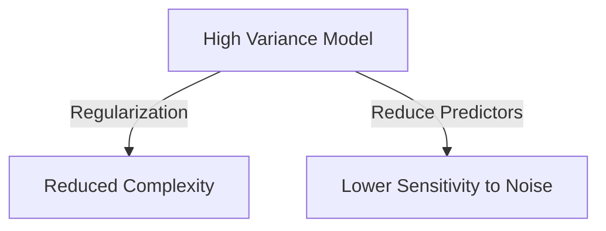
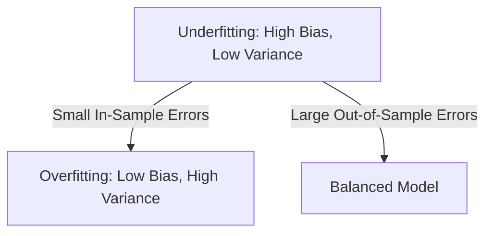
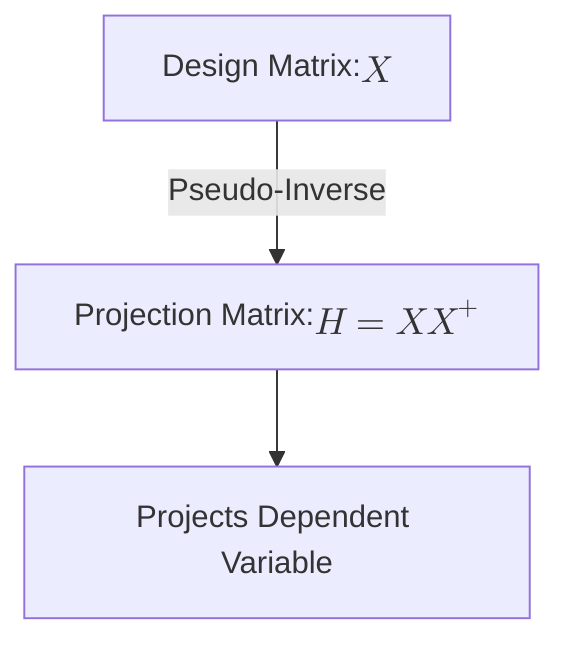
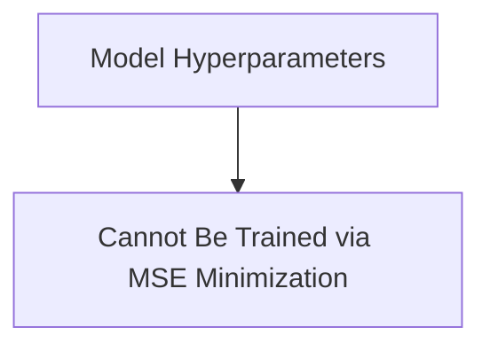

## Introduction

In machine learning, achieving the right balance between model complexity and predictive performance is crucial. A key concept in understanding this balance is the **Bias-Variance Tradeoff**, which defines how well a model generalizes to unseen data. Along with this, the **No Free Lunch Theorem** provides an essential principle that explains the limitations of machine learning models. Together, these concepts form the foundation of understanding how machine learning models perform across various domains.

This article will explore the Bias-Variance Tradeoff, the implications of the No Free Lunch theorem, and how to address issues like underfitting, overfitting, and regularization in machine learning models.

<!-- truncate -->

## The No Free Lunch Theorem

The **No Free Lunch Theorem** is a fundamental principle in machine learning, which states that no single machine learning algorithm can consistently outperform all others across every possible domain of data. When averaged over all possible datasets, all classification algorithms have the **same out-of-sample error rate**. This means that:

- Some algorithms may excel in certain tasks but perform poorly in others.
- There is no **universally superior model** that works best for every type of problem or dataset.

### Implications of the No Free Lunch Theorem

In practice, this means that when selecting a machine learning model, it’s important to experiment with different algorithms and choose the one that fits your specific data and problem domain. In finance, for example, neural networks might excel at tasks like stock prediction, while simpler models like linear regression may work better for straightforward portfolio analysis.

## Bias-Variance Tradeoff

The **Bias-Variance Tradeoff** refers to the challenge of finding a balance between two types of errors that affect model performance:

- **Bias**: The error introduced by approximating a real-world problem with a simpler model. High bias leads to **underfitting**, where the model cannot capture the underlying patterns in the data.
- **Variance**: The error introduced by sensitivity to small fluctuations in the training set. High variance leads to **overfitting**, where the model captures noise instead of the actual signal.

### Reducing Variance in Complex Models

In models with **low bias** but **high variance**, such as deep neural networks, reducing variance can improve generalization. One common approach to reduce variance is **regularization**, where we restrict the model's complexity by penalizing large parameter values. Another approach is **reducing the number of predictors** or features in the model.

The most effective way to reduce variance in a complex model is to **bound the values of model parameters**. By doing this, the model outputs will vary less with changes in the input data, reducing the model's sensitivity to noise. This process is called **regularization**.



````

## Underfitting vs. Overfitting

### Underfitting

Underfitting occurs when the model is too simple to capture the underlying structure of the data. It is characterized by **high bias** and **low variance**. Models that underfit tend to perform poorly on both the training set and test set, as they cannot learn the relationships between features and the target variable effectively. Underfitting also results in **high in-sample errors** but **small out-of-sample errors**, as the model fails to capture both the training data and generalize well.

### Overfitting

Overfitting occurs when the model is too complex and captures not only the signal but also the noise in the data. It leads to **low bias** but **high variance**, resulting in **small in-sample errors** but **large out-of-sample errors**. This means that while the model may perform extremely well on the training data, it will struggle to generalize to new, unseen data.

Achieving the right balance between underfitting and overfitting is critical for good model performance. The goal is to find a model that captures the true patterns in the training data without fitting the noise. This balance is not obtained by perfectly fitting all training data, but by finding a model that generalizes well across both training and test sets.



## Projection Matrix in Linear Regression

In linear regression, the **projection matrix**, often called the "hat matrix," plays a key role in projecting the dependent variable (the observed values) onto the predicted variable. The projection matrix $H$ has several important properties, such as:

- The **square of the projection matrix is equal to the matrix itself**. A projection matrix is **idempotent**, meaning that $P^2 = P$, where $P$ is the projection matrix.
- The projection matrix $H$ in regression projects the observed values onto the fitted (predicted) values. This matrix is called the **hat matrix** because it puts a "hat" on the observed values, representing the predicted values.



However, it is important to note that:

- The correct form for the projection matrix in linear regression is not $H = X X^+$ but $H = X(X'X)^{-1}X'$, where $X'$ is the transpose of $X$, not the pseudo-inverse $X^+$.
- A projection matrix is not necessarily **orthogonal**. While it is idempotent, an orthogonal matrix has the property that its transpose is equal to its inverse, which does not necessarily hold for projection matrices.

## Hyperparameters in Machine Learning

Hyperparameters, unlike model parameters, are not learned directly from the data. Instead, they are set before the training process and control aspects of the model like complexity or regularization strength. In linear regression, for example, the **intercept** is a simple example of a hyperparameter because it does not depend on the input data $X$, and therefore, it cannot be optimized through minimization of the training error.



Hyperparameters are critical to model performance, especially in more complex machine learning algorithms, as they govern how well the model generalizes to new data.

## Conclusion

Understanding the **Bias-Variance Tradeoff**, **No Free Lunch Theorem**, and key concepts like **underfitting**, **overfitting**, and **hyperparameters** is essential for building robust machine learning models. The goal is to achieve a balance where the model captures the true patterns in the data without overfitting or underfitting. By doing so, we can create models that generalize well across various datasets and tasks.

For more in-depth discussions on these topics and how they apply to specific financial applications, stay tuned for our upcoming articles.

````
