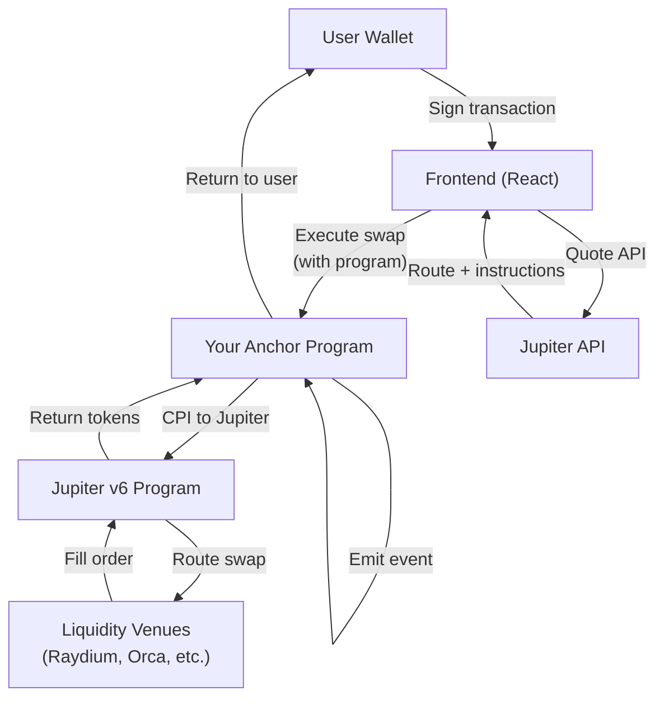
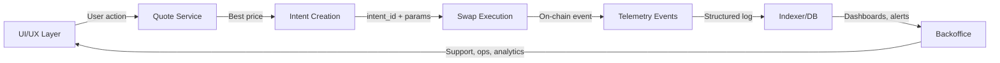

**TL;DR**: Production swap execution engine with **guardrails**, **operational controls**, and **analytics-ready telemetry**.

- Jupiter routes across 20+ venues for best execution
- On-chain **policy layer**: fee collection, slippage caps, admin pause, auditability
- **Attributable, debuggable, measurable** via structured event telemetry
- Built for **product teams**: reliable execution, operational visibility, supportability

---

## Why integrate Jupiter programmatically?

Jupiter aggregates liquidity from **20+ venues** (CPAMM, CLMM, DLMM, PMM, order books) providing best execution, reduced slippage, and MEV protection through automatic routing and order splitting.

### Why wrap Jupiter in your own program?

Direct Jupiter API usage is simple, but wrapping it in an Anchor program enables:

| Feature | Direct API | Anchor program wrapper |
|---|---:|---|
| **Fee collection** | manual logic | on-chain enforcement |
| **Platform branding** | client-side only | program-owned config |
| **Access control** | none | admin-gated pause/update |
| **Composability** | limited | CPI-friendly for other protocols |
| **Audit trail** | off-chain | on-chain events |
| **Slippage protection** | client-side | program-enforced |

### Policy layer: what is enforced where

Understanding **enforcement boundaries** is critical for security and UX:

| Concern | Enforced on-chain | Enforced in client | Notes |
|---|:---:|:---:|---|
| **Slippage ceiling** | Yes | Yes | On-chain cap prevents hostile clients from bypassing limits |
| **Fee collection** | Yes | No | Must be deterministic; client cannot skip or reduce fees |
| **Quote freshness** | No | Yes | Client refreshes quotes; include quote timestamp in intent |
| **Route allowlist/denylist** | Optional | Optional | Useful for risk control (e.g., block suspicious pools) |
| **Pause / emergency stop** | Yes | No | Admin can halt swaps immediately for incidents |
| **Compute budget** | No | Yes | Client requests higher compute units for complex routes |
| **Intent deduplication** | No | Off-chain | Backend checks `intent_id` before indexing |

**Key principle**: On-chain enforces **non-bypassable invariants** (fees, caps, pauses). Client enforces **UX optimizations** (quote refresh, compute). Off-chain systems handle **analytics and deduplication**.



---

## Where this fits in a product

This swap integration is a **component in an operating system**, not a standalone feature. Understanding the full lifecycle is critical for product reliability:



**Workflow**: UI → Quote → Intent (idempotency key) → Execute (policy enforcement) → Telemetry (event emission) → Indexer (DB write) → Backoffice (dashboards, support)

**Benefits**: Idempotency prevents double-swaps, attribution tracks user sessions, debuggability via intent IDs, operability through conversion dashboards.

---

## Intent model: idempotency + attribution

In production systems, you need **reliable execution** and **clean analytics**. The intent model provides both.

### What is a swap intent?

A **SwapIntent** captures user action before execution:

```typescript
interface SwapIntent {
  intent_id: string;           // UUIDv4 or client-generated unique ID
  wallet: PublicKey;           // User wallet address
  input_mint: PublicKey;       // Source token
  output_mint: PublicKey;      // Destination token
  amount_in: u64;              // Input amount (lamports)
  max_slippage_bps: u16;       // Max acceptable slippage
  created_at: i64;             // Client timestamp
  client_version: string;      // App version (e.g., "web-v2.1.3")
  metadata?: Record<string, string>; // Campaign ID, referrer, etc.
}
```

### Client-side intent creation

```typescript
import { v4 as uuidv4 } from 'uuid';

function createSwapIntent(params: {
  wallet: PublicKey;
  inputMint: PublicKey;
  outputMint: PublicKey;
  amountIn: number;
  slippageBps: number;
}): SwapIntent {
  return {
    intent_id: uuidv4(),
    wallet: params.wallet,
    input_mint: params.inputMint,
    output_mint: params.outputMint,
    amount_in: params.amountIn,
    max_slippage_bps: params.slippageBps,
    created_at: Date.now(),
    client_version: process.env.NEXT_PUBLIC_APP_VERSION || 'unknown',
    metadata: {
      campaign_id: getCampaignId(),
      referrer: document.referrer,
    },
  };
}
```

### Benefits of the intent model

**1. Idempotency (no double-swaps)**:

```typescript
// User clicks "Swap" → creates intent
const intent = createSwapIntent(params);

// Network error on first attempt
try {
  await executeSwap(intent); // Fails
} catch (error) {
  // User retries with SAME intent_id
  await executeSwap(intent); // Succeeds
}

// Backend deduplicates by intent_id
// Only ONE swap executed, even with multiple transactions
```

**2. Consistent analytics**: Every event has `intent_id` enabling quote-to-swap conversion tracking and funnel analysis.

**3. Clean support**: Intent IDs allow instant lookup of swap context (stale quote, slippage, route issues).

**Storage**: Store intents client-side (localStorage), off-chain DB (on initiation), and in events (correlation).

---

## Architecture overview

### Program structure (Anchor 0.32.1)

```
programs/token-swap/src/
├── state.rs                    # Account structures
│   └── JupiterConfig          # 78 bytes: admin, fees, slippage, pause
├── constants.rs               # Program IDs and seeds
│   ├── JUPITER_V6_PROGRAM_ID  # JUP6LkbZbjS1jKKwapdHNy74zcZ3tLUZoi5QNyVTaV4
│   └── JUPITER_CONFIG_SEED    # "jupiter_config"
├── errors.rs                  # 8 custom error types
│   ├── InvalidAmount
│   ├── JupiterPaused
│   └── MinimumOutputNotMet
└── instructions/
    ├── init_jupiter_config.rs     # Initialize config PDA
    ├── update_jupiter_config.rs   # Admin updates
    ├── jupiter_swap.rs            # Main swap execution
    └── jupiter_route_swap.rs      # Legacy route support
```

### Account layout: JupiterConfig PDA

```rust
#[account]
pub struct JupiterConfig {
    pub admin: Pubkey,              // 32 bytes
    pub fee_account: Pubkey,        // 32 bytes
    pub platform_fee_bps: u16,      // 2 bytes (0-10000)
    pub max_slippage_bps: u16,      // 2 bytes (0-10000)
    pub paused: bool,               // 1 byte
    pub bump: u8,                   // 1 byte
}  // Total: 70 bytes (+ 8 discriminator = 78)
```

**Design decisions**:

- `u16` for BPS values (supports full 0-10000 range, 100% = 10000 BPS)
- Platform fee ≤ 1000 BPS (10%) enforced at init/update
- Max slippage ≤ 10000 BPS configurable per use case
- Admin-controlled pause for emergency stops

---

## Implementation deep-dive

### 1. Initialize configuration

```rust
#[derive(Accounts)]
pub struct InitJupiterConfig<'info> {
    #[account(
        init,
        payer = admin,
        space = 8 + 70,
        seeds = [b"jupiter_config"],
        bump
    )]
    pub config: Account<'info, JupiterConfig>,
    
    #[account(mut)]
    pub admin: Signer<'info>,
    
    pub system_program: Program<'info, System>,
}

pub fn init_jupiter_config(
    ctx: Context<InitJupiterConfig>,
    fee_account: Pubkey,
    platform_fee_bps: u16,
    max_slippage_bps: u16,
) -> Result<()> {
    require!(
        platform_fee_bps <= 1000,
        JupiterSwapError::InvalidPlatformFee
    );
    require!(
        max_slippage_bps <= 10000,
        JupiterSwapError::InvalidMaxSlippage
    );
    
    let config = &mut ctx.accounts.config;
    config.admin = ctx.accounts.admin.key();
    config.fee_account = fee_account;
    config.platform_fee_bps = platform_fee_bps;
    config.max_slippage_bps = max_slippage_bps;
    config.paused = false;
    config.bump = ctx.bumps.config;
    
    Ok(())
}
```

**Key validations**:

- Platform fee capped at 10% to prevent abuse
- Max slippage configurable (typically 50-500 BPS for production)
- PDA derivation ensures single config per program deployment

---

### 2. Execute Jupiter swap (CPI pattern)

```rust
#[derive(Accounts)]
pub struct JupiterSwap<'info> {
    #[account(
        seeds = [b"jupiter_config"],
        bump = config.bump
    )]
    pub config: Account<'info, JupiterConfig>,
    
    #[account(mut)]
    pub user: Signer<'info>,
    
    /// CHECK: Jupiter v6 program ID verified in instruction
    pub jupiter_program: UncheckedAccount<'info>,
    
    // Token accounts + remaining accounts for Jupiter routing
}

pub fn jupiter_swap<'info>(
    ctx: Context<'_, '_, 'info, 'info, JupiterSwap<'info>>,
    amount_in: u64,
    minimum_amount_out: u64,
) -> Result<()> {
    let config = &ctx.accounts.config;
    
    // 1. Validate state
    require!(!config.paused, JupiterSwapError::JupiterPaused);
    require!(amount_in > 0, JupiterSwapError::InvalidAmount);
    
    // 2. Verify Jupiter program ID
    require_keys_eq!(
        ctx.accounts.jupiter_program.key(),
        JUPITER_V6_PROGRAM_ID.parse::<Pubkey>().unwrap(),
        JupiterSwapError::InvalidJupiterProgram
    );
    
    // 3. Build CPI accounts (dynamically from remaining_accounts)
    let mut accounts = Vec::new();
    for account in ctx.remaining_accounts.iter() {
        accounts.push(AccountMeta {
            pubkey: *account.key,
            is_signer: account.is_signer,
            is_writable: account.is_writable,
        });
    }
    
    // 4. Execute CPI to Jupiter
    let swap_ix = Instruction {
        program_id: ctx.accounts.jupiter_program.key(),
        accounts,
        data: swap_data, // Jupiter swap instruction data
    };
    
    invoke_signed(&swap_ix, ctx.remaining_accounts, &[])?;
    
    // 5. Verify output amount (Token-2022 safe)
    let output_amount = observe_vault_delta(); // observe vault delta
    require!(
        output_amount >= minimum_amount_out,
        JupiterSwapError::MinimumOutputNotMet
    );
    
    // 6. Collect platform fee
    if config.platform_fee_bps > 0 {
        let fee = (output_amount as u128)
            .checked_mul(config.platform_fee_bps as u128)
            .unwrap()
            .checked_div(10000)
            .unwrap() as u64;
        
        // Transfer fee to platform account
    }
    
    // 7. Emit event for analytics
    emit!(JupiterSwapEvent {
        user: ctx.accounts.user.key(),
        amount_in,
        amount_out: output_amount,
        platform_fee: fee,
    });
    
    Ok(())
}
```

**Critical implementation details**:

#### Token-2022 compatibility

```rust
// WRONG: Trusting instruction amount
let output_amount = minimum_amount_out;

// CORRECT: Observe vault delta
let vault_before = user_output_token.amount;
// ... execute swap ...
user_output_token.reload()?;
let output_amount = user_output_token.amount
    .saturating_sub(vault_before);
```

Transfer fees and hooks mean you **cannot trust amounts in instruction data**.

#### Remaining accounts pattern

Jupiter requires dynamic account lists (routes vary by liquidity):

```rust
// Frontend passes all necessary accounts
const remainingAccounts = [
  { pubkey: userSourceToken, isSigner: false, isWritable: true },
  { pubkey: userDestToken, isSigner: false, isWritable: true },
  // ... all intermediary pool accounts from Jupiter API
];
```

Program must accept `remaining_accounts` via:

```rust
pub fn jupiter_swap<'info>(
    ctx: Context<'_, '_, 'info, 'info, JupiterSwap<'info>>,
    // ^^^ lifetime annotation required for remaining_accounts
```

---

### 3. Update configuration (admin-only)

```rust
pub fn update_jupiter_config(
    ctx: Context<UpdateJupiterConfig>,
    new_admin: Option<Pubkey>,
    new_fee_account: Option<Pubkey>,
    new_platform_fee_bps: Option<u16>,
    new_max_slippage_bps: Option<u16>,
    new_paused: Option<bool>,
) -> Result<()> {
    let config = &mut ctx.accounts.config;
    
    // Validate admin
    require_keys_eq!(
        ctx.accounts.admin.key(),
        config.admin,
        JupiterSwapError::Unauthorized
    );
    
    // Optional updates (partial update pattern)
    if let Some(admin) = new_admin {
        config.admin = admin;
    }
    if let Some(fee_bps) = new_platform_fee_bps {
        require!(fee_bps <= 1000, JupiterSwapError::InvalidPlatformFee);
        config.platform_fee_bps = fee_bps;
    }
    // ... other optional fields
    
    Ok(())
}
```

**Partial update pattern**: All fields optional → supports single-field updates without re-specifying everything.

---

## Frontend integration

### React hook: useJupiter

```typescript
import { useConnection, useWallet } from '@solana/wallet-adapter-react';
import { PublicKey, VersionedTransaction } from '@solana/web3.js';
import { useProgram } from './useSwapProgram';

export function useJupiter() {
  const { connection } = useConnection();
  const wallet = useWallet();
  const program = useProgram();

  async function getQuote(params: {
    inputMint: string;
    outputMint: string;
    amount: number;
    slippageBps?: number;
  }) {
    const response = await fetch(
      `https://quote-api.jup.ag/v6/quote?` +
      new URLSearchParams({
        inputMint: params.inputMint,
        outputMint: params.outputMint,
        amount: params.amount.toString(),
        slippageBps: (params.slippageBps || 50).toString(),
      })
    );
    return response.json();
  }

  async function getSwapInstructions(quote: any) {
    const response = await fetch('https://quote-api.jup.ag/v6/swap-instructions', {
      method: 'POST',
      headers: { 'Content-Type': 'application/json' },
      body: JSON.stringify({
        quoteResponse: quote,
        userPublicKey: wallet.publicKey!.toBase58(),
        wrapAndUnwrapSol: true,
        // Use versioned transactions for ALT support
        useVersionedTransaction: true,
      }),
    });
    return response.json();
  }

  async function executeSwapWithProgram(quote: any) {
    if (!wallet.publicKey || !program) return;

    const { swapInstruction } = await getSwapInstructions(quote);
    
    // Get config PDA
    const [configPda] = PublicKey.findProgramAddressSync(
      [Buffer.from('jupiter_config')],
      program.programId
    );

    // Build transaction via Anchor
    const tx = await program.methods
      .jupiterSwap(
        new BN(quote.inAmount),
        new BN(quote.outAmount)
      )
      .accounts({
        config: configPda,
        user: wallet.publicKey,
        jupiterProgram: new PublicKey('JUP6LkbZbjS1jKKwapdHNy74zcZ3tLUZoi5QNyVTaV4'),
      })
      .remainingAccounts(swapInstruction.accounts) // Dynamic routing accounts
      .transaction();

    // Handle Address Lookup Tables if present
    if (swapInstruction.addressLookupTableAccounts?.length > 0) {
      const lookupTables = await Promise.all(
        swapInstruction.addressLookupTableAccounts.map((key: string) =>
          connection.getAddressLookupTable(new PublicKey(key))
        )
      );
      
      // Build versioned transaction
      const message = new TransactionMessage({
        payerKey: wallet.publicKey,
        recentBlockhash: (await connection.getLatestBlockhash()).blockhash,
        instructions: tx.instructions,
      }).compileToV0Message(lookupTables.map(lt => lt.value!));
      
      const versionedTx = new VersionedTransaction(message);
      await wallet.sendTransaction(versionedTx, connection);
    } else {
      await wallet.sendTransaction(tx, connection);
    }
  }

  return { getQuote, executeSwapWithProgram };
}
```

**Key frontend considerations**:

#### Address Lookup Tables (ALTs)

Complex Jupiter routes exceed the 1232-byte transaction limit. ALTs compress account lists:

```typescript
// Without ALT: 32 bytes per account × 40 accounts = 1280 bytes (fails)
// With ALT: table reference + indices = ~50 bytes (works)
```

Use **versioned transactions** (v0) to support ALTs.

#### Quote freshness

Jupiter quotes expire quickly (10-30 seconds):

```typescript
const quote = await getQuote(params);
// Wait too long...
await sleep(60000); // Quote now stale
await executeSwap(quote); // Likely fails with slippage error
```

Best practice: **poll quotes** every 5-10 seconds during user review.

---

### UI component: JupiterSwap

```tsx
'use client';

import { useState, useEffect } from 'react';
import { useJupiter } from '@/hooks/useJupiter';

const TOKENS = {
  SOL: 'So11111111111111111111111111111111111111112',
  USDC: 'EPjFWdd5AufqSSqeM2qN1xzybapC8G4wEGGkZwyTDt1v',
  USDT: 'Es9vMFrzaCERmJfrF4H2FYD4KCoNkY11McCe8BenwNYB',
  JUP: 'JUPyiwrYJFskUPiHa7hkeR8VUtAeFoSYbKedZNsDvCN',
};

export function JupiterSwap() {
  const { getQuote, executeSwapWithProgram } = useJupiter();
  const [inputMint, setInputMint] = useState(TOKENS.SOL);
  const [outputMint, setOutputMint] = useState(TOKENS.USDC);
  const [amount, setAmount] = useState('1.0');
  const [quote, setQuote] = useState<any>(null);
  const [loading, setLoading] = useState(false);

  // Auto-refresh quote every 10 seconds
  useEffect(() => {
    const interval = setInterval(async () => {
      if (amount && parseFloat(amount) > 0) {
        const q = await getQuote({
          inputMint,
          outputMint,
          amount: parseFloat(amount) * 1e9, // Convert to lamports
          slippageBps: 50,
        });
        setQuote(q);
      }
    }, 10000);
    return () => clearInterval(interval);
  }, [inputMint, outputMint, amount]);

  const handleSwap = async () => {
    setLoading(true);
    try {
      await executeSwapWithProgram(quote);
      // Success notification
    } catch (error) {
      console.error('Swap failed:', error);
    } finally {
      setLoading(false);
    }
  };

  return (
    <div className="swap-card">
      <div className="input-section">
        <input
          type="number"
          value={amount}
          onChange={(e) => setAmount(e.target.value)}
          placeholder="Amount"
        />
        <select value={inputMint} onChange={(e) => setInputMint(e.target.value)}>
          <option value={TOKENS.SOL}>SOL</option>
          <option value={TOKENS.USDC}>USDC</option>
          <option value={TOKENS.USDT}>USDT</option>
          <option value={TOKENS.JUP}>JUP</option>
        </select>
      </div>

      <div className="output-section">
        <div className="estimated-output">
          {quote ? (
            <>
              <span className="amount">{(quote.outAmount / 1e6).toFixed(6)}</span>
              <span className="price-impact">
                Price impact: {(quote.priceImpactPct * 100).toFixed(2)}%
              </span>
            </>
          ) : (
            <span className="loading">Fetching quote...</span>
          )}
        </div>
        <select value={outputMint} onChange={(e) => setOutputMint(e.target.value)}>
          <option value={TOKENS.USDC}>USDC</option>
          <option value={TOKENS.USDT}>USDT</option>
          <option value={TOKENS.SOL}>SOL</option>
          <option value={TOKENS.JUP}>JUP</option>
        </select>
      </div>

      <button
        onClick={handleSwap}
        disabled={loading || !quote}
        className="swap-button"
      >
        {loading ? 'Swapping...' : 'Swap'}
      </button>

      {quote && (
        <div className="route-info">
          <div>Route: {quote.routePlan?.map((r: any) => r.swapInfo.label).join(' → ')}</div>
          <div>Min output: {((quote.outAmount * 0.995) / 1e6).toFixed(6)} (0.5% slippage)</div>
        </div>
      )}
    </div>
  );
}
```

**UX enhancements**:

- Real-time quote updates (auto-refresh)
- Price impact warnings (greater than 5% highlighted)
- Route visualization (which venues are used)
- Minimum output calculation (slippage tolerance display)

---

## Production deployment checklist

### Pre-deployment validation

| Check | Why it matters | How to verify |
|---|---|---|
| **Program ID fixed** | Reproducible builds | `anchor build --verifiable` |
| **Upgrade authority** | Immutability post-audit | `solana program set-upgrade-authority <program_id> --final` |
| **Config admin** | Emergency controls | Multisig or DAO-controlled |
| **Platform fee ≤ 1%** | Competitive with alternatives | Review `platform_fee_bps` |
| **Max slippage reasonable** | Protect users | Typically 50-500 BPS |
| **Pause mechanism tested** | Kill-switch works | Integration test coverage |
| **Token-2022 tested** | Fee-on-transfer handling | Test with USDT (transfer fees) |

### Deployment steps

```bash
# 1. Build verifiable program
anchor build --verifiable

# 2. Deploy to devnet
anchor deploy --provider.cluster devnet

# 3. Initialize config (via multisig in production)
anchor run initialize-config --provider.cluster devnet

# 4. Verify deployment
solana program show <program_id>

# 5. Audit & security review
# (Use Sec3, OtterSec, or similar)

# 6. Deploy to mainnet
anchor deploy --provider.cluster mainnet-beta

# 7. Initialize mainnet config
anchor run initialize-config --provider.cluster mainnet-beta

# 8. Set upgrade authority to final
solana program set-upgrade-authority <program_id> --final
```

---

## Operational runbook: support & incident handling

When swaps fail or users contact support, you need **immediate answers**. This runbook maps symptoms to root causes.

### Required debug information

Every support ticket needs:

- **Transaction signature** (if swap was attempted)
- **Intent ID** (from client logs or user session)
- **Wallet address**
- **Input/output mints**
- **Timestamp** (when issue occurred)

### Failure classification matrix

| Symptom | Root cause | Diagnosis | Immediate mitigation |
|---|---|---|---|
| "Slippage tolerance exceeded" | Quote stale OR low liquidity | Check `quote_age_seconds` in event | Shorten quote refresh interval to 5-10s |
| "Transaction simulation failed" | Compute budget exceeded | Check route complexity (hops >3) | Bump compute units to 400k for complex routes |
| "Account not found" | ALT missing or not loaded | Check `addressLookupTableAccounts` in txn | Ensure ALTs created and extended with pool accounts |
| "Insufficient funds" | User balance < amount + fees | Check wallet balance vs `amount_in` | Show clear error: "Need X SOL for fees" |
| "Custom program error: 0x1770" | Token-2022 transfer fee | Check if token has transfer fee extension | Use vault delta verification (not instruction data) |
| "Transaction timeout" | Network congestion | Check priority fee paid | Increase priority fee dynamically (use Helius API) |
| "Invalid instruction data" | Jupiter program upgraded | Check program version mismatch | Update Jupiter program ID constant |
| Swap succeeds but user didn't receive full amount | Token-2022 fee-on-transfer | Compare quote vs actual received | Document this in UI ("Receives ~X after fees") |

### Incident response playbook

#### Scenario 1: Sudden spike in failures (greater than 10% failure rate)

**Immediate actions**:

1. Check Solana network status (<https://status.solana.com>)
2. Verify Jupiter API health (<https://status.jup.ag>)
3. Query last 100 failures by `error_code`:

   ```sql
   SELECT error_code, COUNT(*) as count
   FROM swap_failed_events
   WHERE timestamp > NOW() - INTERVAL '1 hour'
   GROUP BY error_code
   ORDER BY count DESC;
   ```

4. If `error_code=1005` (compute exceeded): Bump compute budget globally
5. If `error_code=1002` (stale quote): Reduce quote refresh interval
6. If widespread network issue: Enable **pause toggle** via admin

#### Scenario 2: User reports "missing tokens"

**Debug flow**:

1. Get transaction signature → check on Solscan/Explorer
2. Verify transaction succeeded (success or failure)
3. If succeeded:
   - Check `JupiterSwapEvent.amount_out`
   - Compare to user's token account balance
   - Check for Token-2022 transfer fees (some tokens deduct on transfer)
4. If failed:
   - Check `JupiterSwapFailedEvent.error_code`
   - Map to human-readable explanation
   - Guide user on fix (refresh quote, increase slippage, etc.)

#### Scenario 3: Revenue suddenly drops

**Diagnostic queries**:

```sql
-- Check if swap volume dropped or fee collection failed
SELECT
  DATE_TRUNC('hour', timestamp) as hour,
  COUNT(*) as swap_count,
  SUM(amount_in) as total_volume,
  SUM(platform_fee) as revenue
FROM swap_events
WHERE timestamp > NOW() - INTERVAL '24 hours'
GROUP BY hour
ORDER BY hour DESC;
```

Possible causes:

- Fee collection logic broken (check program logs)
- Users bypassing your wrapper (check if they're using Jupiter directly)
- Platform fee set to 0 accidentally (check config PDA)

### Proactive monitoring alerts

Set up alerts for:

- **Failure rate greater than 5%** for 10 minutes
- **Quote-to-swap conversion less than 70%** (indicates UX friction)
- **Median execution latency greater than 30 seconds** (quote staleness)
- **Zero swaps for 15 minutes** (system down or paused)
- **Platform fee revenue drops greater than 50%** hour-over-hour

---

## Common pitfalls and solutions (reference)

### 1. Transaction size limits (exceeded max accounts)

**Problem**: Complex Jupiter routes require 30-50 accounts, exceeding transaction limits.

**Solution**: Use Address Lookup Tables (ALTs)

```typescript
// Create ALT during program initialization
const [lookupTable, _] = AddressLookupTableProgram.createLookupTable({
  authority: admin,
  payer: admin,
  recentSlot: await connection.getSlot(),
});

// Add frequently-used accounts
await connection.sendTransaction(
  AddressLookupTableProgram.extendLookupTable({
    lookupTable,
    authority: admin,
    payer: admin,
    addresses: [USDC_MINT, USDT_MINT, /* common pools */],
  })
);
```

### 2. Slippage errors on mainnet (works on devnet)

**Problem**: Mainnet has higher volatility and MEV, causing more slippage failures.

**Solution**: Dynamic slippage based on liquidity

```typescript
function calculateSlippage(quote: JupiterQuote) {
  const priceImpact = quote.priceImpactPct;
  
  if (priceImpact < 0.01) return 50;  // 0.5% for deep liquidity
  if (priceImpact < 0.05) return 100; // 1% for medium liquidity
  return 500; // 5% for low liquidity
}
```

### 3. Token-2022 fee-on-transfer not accounted

**Problem**: USDT (SPL Token-2022 with transfer fees) results in less than expected amounts.

**Solution**: Always observe vault deltas

```rust
let before = token_account.amount;
// ... execute transfer ...
token_account.reload()?;
let actual_received = token_account.amount.saturating_sub(before);
```

### 4. Quote expiration (stale routes)

**Problem**: User reviews swap for 60 seconds, quote becomes stale, transaction fails.

**Solution**: Auto-refresh quotes

```typescript
useEffect(() => {
  const interval = setInterval(refreshQuote, 10000); // Every 10s
  return () => clearInterval(interval);
}, [inputMint, outputMint, amount]);
```

### 5. Insufficient compute budget

**Problem**: Complex routes run out of compute units (200k default).

**Solution**: Request higher compute budget

```rust
use solana_program::compute_budget::ComputeBudgetInstruction;

// Add as first instruction in transaction
let compute_ix = ComputeBudgetInstruction::set_compute_unit_limit(400_000);
```

---

## Performance optimization

### Account lookup optimization

```rust
// Inefficient: Multiple account lookups
for account in ctx.remaining_accounts.iter() {
    let data = account.try_borrow_data()?;
    // Process...
}

// Efficient: Single borrow per account
let accounts: Vec<_> = ctx.remaining_accounts
    .iter()
    .map(|a| (a.key(), a.try_borrow_data()))
    .collect();
```

### Fee calculation (avoid division)

```rust
// Slower: Division
let fee = (amount * fee_bps) / 10000;

// Faster: Shift (if fee_bps is power of 2)
// For 0.5% (50 bps): multiply by 1/200 = right shift by ~8
// Not always applicable, but pattern to consider
```

### Frontend quote batching

```typescript
// Sequential quotes (slower)
const quote1 = await getQuote({ inputMint: SOL, outputMint: USDC, amount: 1e9 });
const quote2 = await getQuote({ inputMint: SOL, outputMint: USDT, amount: 1e9 });

// Parallel quotes (faster)
const [quote1, quote2] = await Promise.all([
  getQuote({ inputMint: SOL, outputMint: USDC, amount: 1e9 }),
  getQuote({ inputMint: SOL, outputMint: USDT, amount: 1e9 }),
]);
```

---

## Monitoring and analytics

### On-chain events (CRM/ops-grade telemetry)

Your event schema defines **what you can measure and debug**. Make it comprehensive:

```rust
#[event]
pub struct JupiterSwapEvent {
    // Attribution
    pub intent_id: [u8; 16],         // UUID bytes for client-side correlation
    pub user: Pubkey,                 // Wallet address
    pub client_version: [u8; 32],     // App version (e.g., "web-v2.1.3\0\0...")
    
    // Swap details
    pub input_mint: Pubkey,
    pub output_mint: Pubkey,
    pub amount_in: u64,
    pub amount_out: u64,
    pub platform_fee: u64,
    
    // Execution context
    pub quote_timestamp: i64,         // When quote was generated (detect staleness)
    pub execution_timestamp: i64,     // When swap executed
    pub route_hash: u64,              // Hash of route plan (fingerprint venues used)
    pub slippage_bps_requested: u16,  // User-requested slippage
    pub slippage_bps_effective: u16,  // Actual slippage observed
    
    // Operational data
    pub compute_units_consumed: u64,  // For performance tuning
    pub priority_fee_paid: u64,       // MEV/congestion analysis
}

#[event]
pub struct JupiterSwapFailedEvent {
    // Attribution (same as success event)
    pub intent_id: [u8; 16],
    pub user: Pubkey,
    pub client_version: [u8; 32],
    
    // Failure context
    pub input_mint: Pubkey,
    pub output_mint: Pubkey,
    pub amount_in: u64,
    pub minimum_amount_out: u64,
    
    // Diagnostic data
    pub error_code: u32,              // Mapped to human-readable reasons
    pub program_error: Option<String>, // Anchor error details
    pub quote_age_seconds: i64,       // How old was the quote?
    pub timestamp: i64,
}
```

**Why these fields matter**:

- **`intent_id`**: Join client logs, backend DB, and on-chain events for full trace
- **`client_version`**: Identify bugs introduced in specific releases
- **`quote_timestamp` vs `execution_timestamp`**: Measure latency, detect stale quotes
- **`route_hash`**: Identify which venue combinations succeed/fail most
- **`slippage_bps_effective`**: Measure if users are over-allocating slippage tolerance
- **`compute_units_consumed`**: Optimize compute budgets dynamically
- **`error_code`**: Build dashboards showing top failure reasons

### Failure telemetry (first-class error logging)

Most teams only emit success events. **Failures are more valuable for ops**:

```rust
pub fn jupiter_swap<'info>(
    ctx: Context<'_, '_, 'info, 'info, JupiterSwap<'info>>,
    intent_id: [u8; 16],
    amount_in: u64,
    minimum_amount_out: u64,
) -> Result<()> {
    // ... validation and swap execution ...
    
    // If swap fails, emit failure event BEFORE returning error
    if let Err(e) = execute_jupiter_cpi(&ctx, amount_in) {
        emit!(JupiterSwapFailedEvent {
            intent_id,
            user: ctx.accounts.user.key(),
            client_version: get_client_version(),
            input_mint: ctx.accounts.input_mint.key(),
            output_mint: ctx.accounts.output_mint.key(),
            amount_in,
            minimum_amount_out,
            error_code: map_error_to_code(&e),
            program_error: Some(e.to_string()),
            quote_age_seconds: calculate_quote_age(),
            timestamp: Clock::get()?.unix_timestamp,
        });
        return Err(e);
    }
    
    // Success: emit success event
    emit!(JupiterSwapEvent { /* ... */ });
    Ok(())
}
```

**Error code mapping** (for structured dashboards):

```rust
fn map_error_to_code(error: &anchor_lang::error::Error) -> u32 {
    match error {
        JupiterSwapError::MinimumOutputNotMet => 1001,
        JupiterSwapError::StaleQuote => 1002,
        JupiterSwapError::JupiterPaused => 1003,
        JupiterSwapError::InsufficientLiquidity => 1004,
        JupiterSwapError::ComputeBudgetExceeded => 1005,
        JupiterSwapError::ALTMissing => 1006,
        JupiterSwapError::Token2022TransferFee => 1007,
        _ => 9999, // Unknown error
    }
}
```

### Dashboard-ready KPI definitions

These metrics map directly to SQL queries and BI dashboards:

| KPI | Formula | Query example | Target |
|---|---|---|---|
| **Quote → Swap conversion** | `completed_swaps / quote_requests` | `SELECT COUNT(DISTINCT intent_id) FROM swaps / COUNT(*) FROM quotes` | greater than 80% |
| **Intent completion rate** | `completed_intents / created_intents` | `SELECT successful / total FROM intent_summary` | greater than 90% |
| **Failure rate by reason** | `failures(reason=X) / total_attempts` | `SELECT error_code, COUNT(*) / total FROM failures GROUP BY error_code` | less than 5% overall |
| **Median execution latency** | `median(event_time - intent_creation_time)` | `SELECT PERCENTILE_CONT(0.5) WITHIN GROUP (ORDER BY latency) FROM swaps` | less than 15s |
| **Revenue (USD)** | `SUM(platform_fee * token_price_usd)` | `SELECT SUM(f.amount * p.price) FROM fees f JOIN prices p ON f.mint = p.mint` | Track growth |
| **Route health score** | `success_rate_per_route_fingerprint` | `SELECT route_hash, COUNT(*) successes / total FROM swaps GROUP BY route_hash` | greater than 95% per route |
| **Effective slippage** | `AVG((quote_out - actual_out) / quote_out * 10000)` | `SELECT AVG((quoted - actual) / quoted * 10000) FROM swaps` | less than 50 BPS |
| **Repeat user rate** | `users_with_2plus_swaps / total_users` | `SELECT COUNT(DISTINCT user) FROM (SELECT user, COUNT(*) c FROM swaps GROUP BY user HAVING c >= 2)` | greater than 40% |

**Sample dashboard SQL** (Postgres):

```sql
-- Real-time conversion funnel
WITH funnel AS (
  SELECT
    COUNT(DISTINCT q.intent_id) as quotes,
    COUNT(DISTINCT s.intent_id) as swaps,
    COUNT(DISTINCT CASE WHEN s.success = true THEN s.intent_id END) as successful
  FROM quote_requests q
  LEFT JOIN swap_events s ON q.intent_id = s.intent_id
  WHERE q.created_at > NOW() - INTERVAL '1 hour'
)
SELECT
  quotes,
  swaps,
  successful,
  ROUND(100.0 * swaps / NULLIF(quotes, 0), 2) as quote_to_swap_pct,
  ROUND(100.0 * successful / NULLIF(swaps, 0), 2) as success_rate
FROM funnel;

-- Top failure reasons (last 24 hours)
SELECT
  CASE error_code
    WHEN 1001 THEN 'Slippage exceeded'
    WHEN 1002 THEN 'Stale quote'
    WHEN 1005 THEN 'Compute budget exceeded'
    WHEN 1006 THEN 'ALT missing'
    WHEN 1007 THEN 'Token-2022 transfer fee'
    ELSE 'Unknown'
  END as failure_reason,
  COUNT(*) as occurrences,
  ROUND(100.0 * COUNT(*) / SUM(COUNT(*)) OVER (), 2) as percentage
FROM swap_failed_events
WHERE timestamp > NOW() - INTERVAL '24 hours'
GROUP BY error_code
ORDER BY occurrences DESC;

-- Revenue by token pair (last 7 days)
SELECT
  s.input_mint,
  s.output_mint,
  COUNT(*) as swap_count,
  SUM(s.platform_fee) as total_fee_tokens,
  SUM(s.platform_fee * p.price_usd) as revenue_usd
FROM swap_events s
JOIN token_prices p ON s.output_mint = p.mint
WHERE s.timestamp > NOW() - INTERVAL '7 days'
GROUP BY s.input_mint, s.output_mint
ORDER BY revenue_usd DESC
LIMIT 10;
```

**Grafana/Metabase integration**:

- Create alerts on conversion rate drop (greater than 10% decrease)
- Dashboard panels: conversion funnel, failure reasons pie chart, revenue time series
- User cohort analysis: new vs returning users by swap count

### Indexing with Helius/Hellomoon

```typescript
// Subscribe to program logs
const connection = new Connection(HELIUS_RPC_URL);

connection.onLogs(
  programId,
  (logs) => {
    if (logs.logs.some(log => log.includes('JupiterSwapEvent'))) {
      // Parse event and store in database
      const event = parseJupiterSwapEvent(logs);
      await db.swaps.insert(event);
    }
  },
  'confirmed'
);
```

---

## Cost analysis

### Transaction costs (mainnet, Dec 2024)

| Operation | Compute units | Typical cost (SOL) | Notes |
|---|---:|---:|---|
| Init config | ~5,000 | 0.000005 | One-time |
| Simple swap (1 hop) | ~50,000 | 0.00005 | Direct pool |
| Complex swap (3+ hops) | ~200,000 | 0.0002 | Multi-route |
| Update config | ~3,000 | 0.000003 | Admin only |

**Priority fees**: Add 0.00001-0.0001 SOL during congestion for faster inclusion.

### Platform revenue model

Example with 0.3% platform fee:

- User swaps 100 SOL → USDC
- Jupiter finds route yielding 9,500 USDC
- Platform collects: 9,500 × 0.003 = **28.5 USDC**
- User receives: 9,471.5 USDC

At 1M SOL monthly volume (current mid-tier DEX):

- Revenue: **$30,000/month** (assuming 0.3% fee, $100 SOL)
- Competitive with 0.01-0.1% range most aggregators use

---

## Future enhancements

### 1. Limit orders via DCA (Dollar-Cost Averaging)

Jupiter DCA allows scheduled swaps:

```typescript
// Create DCA order
const dcaOrder = await program.methods
  .createDcaOrder({
    inputMint: SOL,
    outputMint: USDC,
    amountPerSwap: 10 * 1e9, // 10 SOL
    interval: 3600, // 1 hour
    totalAmount: 1000 * 1e9, // 1000 SOL total
  })
  .rpc();
```

### 2. MEV protection via private routing

Integrate Jupiter's private RPC:

```typescript
const quote = await getQuote({
  inputMint,
  outputMint,
  amount,
  // Use private RPC to avoid frontrunning
  rpcUrl: 'https://private.jup.ag/rpc',
});
```

### 3. Cross-chain swaps (via Wormhole)

Jupiter integrates Wormhole for cross-chain swaps:

```rust
pub fn cross_chain_swap(
    ctx: Context<CrossChainSwap>,
    destination_chain: u16, // e.g., 1 = Ethereum
    amount: u64,
) -> Result<()> {
    // Swap SOL → USDC on Solana
    // Bridge USDC to Ethereum via Wormhole
    // Swap USDC → ETH on Ethereum
    Ok(())
}
```

### 4. Liquidity aggregation metrics

Show users why Jupiter found better price:

```typescript
interface RouteBreakdown {
  venue: string;
  percentage: number; // % of trade routed through this venue
  priceImpact: number;
}

const breakdown: RouteBreakdown[] = [
  { venue: 'Raydium CLMM', percentage: 60, priceImpact: 0.12 },
  { venue: 'Orca Whirlpool', percentage: 30, priceImpact: 0.08 },
  { venue: 'Meteora DLMM', percentage: 10, priceImpact: 0.05 },
];
```

---

## Comparison: direct Jupiter API vs program wrapper

| Aspect | Direct API | Program wrapper (this guide) |
|---|---:|---|
| **Implementation time** | 2 hours | 1 week (with tests) |
| **Fee collection** | manual off-chain | automatic on-chain |
| **Composability** | limited | full CPI support |
| **Audit surface** | none | program code |
| **Branding** | client-side only | on-chain enforcement |
| **Access control** | none | admin-gated |
| **Event logs** | none | on-chain events |
| **Upgrade path** | N/A | versioned program |

**When to use direct API**:

- Quick prototypes
- Personal tools
- No fee collection needed

**When to use program wrapper**:

- Platform/product launch
- Need fee revenue
- Want composability with other protocols
- Require audit for institutional users

---

## Resources

### Official documentation

- **Jupiter docs**: [https://station.jup.ag/docs/apis/swap-api](https://station.jup.ag/docs/apis/swap-api)
- **Jupiter v6 program**: [https://solscan.io/account/JUP6LkbZbjS1jKKwapdHNy74zcZ3tLUZoi5QNyVTaV4](https://solscan.io/account/JUP6LkbZbjS1jKKwapdHNy74zcZ3tLUZoi5QNyVTaV4)
- **Anchor framework**: [https://www.anchor-lang.com/](https://www.anchor-lang.com/)
- **Token-2022 extensions**: [https://solana.com/docs/tokens/extensions](https://solana.com/docs/tokens/extensions)

### Code examples

- **This implementation**: [GitHub link to your repo]
- **Jupiter SDK**: [https://github.com/jup-ag/jupiter-quote-api-node](https://github.com/jup-ag/jupiter-quote-api-node)
- **Anchor CPI patterns**: [https://book.anchor-lang.com/anchor_in_depth/CPIs.html](https://book.anchor-lang.com/anchor_in_depth/CPIs.html)

### Community

- **Jupiter Discord**: [https://discord.gg/jup](https://discord.gg/jup)
- **Solana Stack Exchange**: [https://solana.stackexchange.com/](https://solana.stackexchange.com/)
- **Anchor Discord**: [https://discord.gg/anchor](https://discord.gg/anchor)

---

## Production integration checklist

Use this checklist before deploying to mainnet:

### Pre-deployment

- [ ] **Intent ID propagated end-to-end**: Client generates UUID → passed to program → included in events
- [ ] **Client version tracking**: App version captured in all events for release correlation
- [ ] **Quote refresh mechanism**: Auto-refresh every 10s; warn user if quote >30s old
- [ ] **Slippage calculation**: Dynamic slippage based on liquidity depth (not hardcoded)
- [ ] **Quote staleness guard**: Validate `quote_timestamp` on backend before execution

### Smart contract

- [ ] **CPI remaining accounts tested**: Verified with 2-hop, 3-hop, and 5-hop routes
- [ ] **Token-2022 vault delta validation**: Output amount observed from token account change, not instruction data
- [ ] **ALT/v0 transaction support**: Complex routes (>20 accounts) tested with Address Lookup Tables
- [ ] **Platform fee collection**: Verified fees transfer to correct account on every swap
- [ ] **Slippage enforcement**: On-chain max slippage cap cannot be bypassed by client
- [ ] **Pause toggle works**: Admin can halt swaps; verified in integration tests
- [ ] **Overflow protection**: All fee calculations use `checked_mul` / `checked_div`

### Telemetry & observability

- [ ] **Success events comprehensive**: Include intent_id, route_hash, slippage_effective, compute_units
- [ ] **Failure events captured**: Emit `SwapFailedEvent` with error_code before returning errors
- [ ] **Error code mapping**: All program errors map to documented reason codes (1001-1007+)
- [ ] **Event indexer running**: Helius/Hellomoon/custom indexer writes events to database
- [ ] **Dashboard metrics live**: Conversion rate, failure breakdown, revenue tracking operational

### Operational readiness

- [ ] **Support runbook documented**: Team knows how to classify failures by error code
- [ ] **Admin key security**: Stored in hardware wallet or multisig (not hot wallet)
- [ ] **Monitoring alerts configured**: Failure rate greater than 5%, conversion less than 70%, revenue drops
- [ ] **Incident response plan**: Who to contact for Jupiter API issues, network outages
- [ ] **User-facing error messages**: Map error codes to helpful guidance (e.g., "Quote expired. Refresh and retry.")

### Testing

- [ ] **Mainnet-like environment**: Tested on devnet with realistic routes and tokens
- [ ] **Token-2022 tokens tested**: USDT (transfer fee), BONK (token extensions)
- [ ] **High-compute routes tested**: 5+ hop routes with compute budget adjustments
- [ ] **Failure scenarios tested**: Stale quote, slippage exceeded, insufficient balance
- [ ] **End-to-end user flow**: Quote → Intent → Execute → Event → Dashboard (full trace)

### Deployment

- [ ] **Verifiable build**: `anchor build --verifiable` succeeds; hash matches deployed program
- [ ] **Config PDA initialized**: Admin, fee account, platform fee, max slippage set correctly
- [ ] **Frontend pointing to correct program**: Program ID hardcoded matches deployed address
- [ ] **Upgrade authority finalized**: Set to multisig or `--final` after audit

---

## Conclusion

Building a Jupiter integration on Solana requires:

1. **Solid Anchor fundamentals** (PDAs, CPIs, account validation)
2. **Token-2022 awareness** (vault deltas, not instruction amounts)
3. **Transaction size management** (ALTs for complex routes)
4. **Comprehensive testing** (unit + integration + E2E)
5. **Production-grade monitoring** (events, metrics, alerts)

The result is a **composable, fee-collecting swap infrastructure** that leverages Jupiter's best-in-class routing while maintaining control over user experience and revenue.

---

**Key takeaways**:

- Jupiter abstracts away liquidity fragmentation (20+ venues)
- Program wrappers enable fee collection and composability
- Token-2022 compatibility is non-negotiable in 2024+
- Address Lookup Tables are essential for complex routes
- Testing prevents costly mainnet bugs (each fix costs 0.5-1 SOL)

Ship safe.
