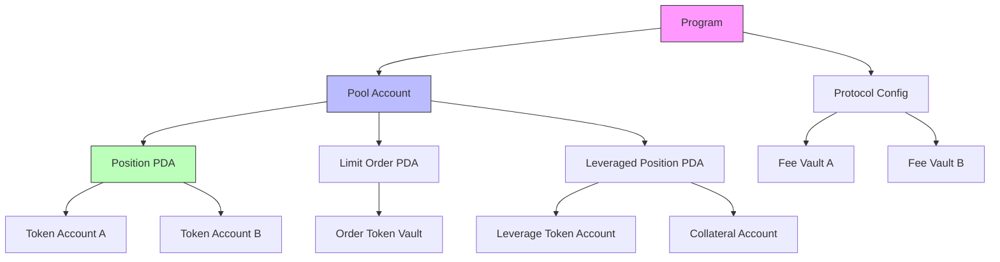
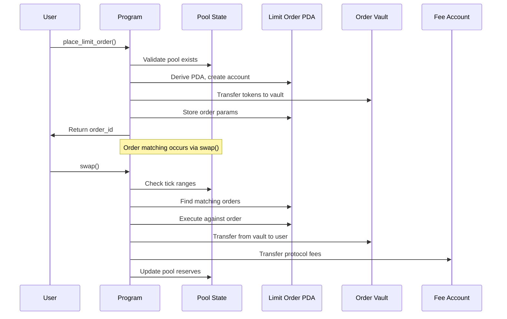

## TL;DR

**DefiTuna AMM** combines concentrated liquidity, on-chain limit orders, and leveraged liquidity provision in a unique AMM design. This article focuses on the **Anchor smart contract** that implements this protocol, specifically examining:

- **Program Architecture**: A hybrid AMM with integrated limit order book, implemented as a multi-instruction Anchor program
- **Key Instructions**: `initialize_pool`, `create_position`, `place_limit_order`, `swap`, `leverage_position`
- **Account Structure**: Complex PDA hierarchies for pools, positions, orders, and leveraged positions with proper rent management
- **Mathematical Core**: Concentrated liquidity calculations with leverage multipliers
- **Security Patterns**: Comprehensive validation, owner controls, and reentrancy protection through Solana's native constraints

## Introduction

DefiTuna AMM represents an innovative approach to decentralized exchanges by integrating traditional AMM mechanics with orderbook-style limit orders and leverage capabilities. This Anchor smart contract implements the core on-chain logic that makes this possible, providing developers with a practical example of advanced Solana DeFi programming patterns.

The program follows a modular architecture with separate handlers for pool management, position creation, order placement, and swap execution. All state is managed through PDAs to ensure secure ownership and access control.

## Architecture Diagrams

### Account Relationships



### Instruction Flow for Limit Order Execution



## Account Structure

| Account | Type | PDA Seeds | Purpose |
|---------|------|-----------|---------|
| `Pool` | State | `["pool", base_mint, quote_mint]` | Stores pool configuration and global state |
| `Position` | State | `["position", pool, owner, position_id]` | Tracks user's concentrated liquidity position |
| `LimitOrder` | State | `["order", pool, owner, order_id]` | Stores limit order parameters and status |
| `LeveragedPosition` | State | `["leverage", pool, owner, leverage_id]` | Manages leveraged liquidity positions |
| `ProtocolConfig` | State | `["config"]` | Global protocol parameters and fee accounts |
| `Tick` | State | `["tick", pool, tick_index]` | Stores liquidity data for specific price ticks |

### PDA Derivation Example

```rust
#[account]
#[derive(InitSpace)]
pub struct Pool {
    pub base_mint: Pubkey,
    pub quote_mint: Pubkey,
    pub fee_rate: u16, // basis points
    pub protocol_fee_rate: u16,
    pub tick_spacing: i32,
    pub current_tick_index: i32,
    pub liquidity: u128,
    pub sqrt_price: u128,
    pub fee_growth_global_0: u128,
    pub fee_growth_global_1: u128,
    pub protocol_fees_0: u64,
    pub protocol_fees_1: u64,
    pub bump: u8,
}

// PDA derivation for pool
let (pool_pda, pool_bump) = Pubkey::find_program_address(
    &[
        b"pool",
        base_mint.as_ref(),
        quote_mint.as_ref(),
    ],
    program_id
);

## Instruction Handlers Deep Dive

### 1. `initialize_pool` - Pool Creation

This instruction creates a new liquidity pool with specified parameters:

```rust
#[derive(Accounts)]
pub struct InitializePool<'info> {
    #[account(mut)]
    pub payer: Signer<'info>,
    
    #[account(
        init,
        payer = payer,
        space = 8 + Pool::INIT_SPACE,
        seeds = [
            b"pool",
            base_mint.key().as_ref(),
            quote_mint.key().as_ref()
        ],
        bump
    )]
    pub pool: Account<'info, Pool>,
    
    pub base_mint: Account<'info, Mint>,
    pub quote_mint: Account<'info, Mint>,
    
    pub system_program: Program<'info, System>,
}

pub fn initialize_pool(
    ctx: Context<InitializePool>,
    fee_rate: u16,
    tick_spacing: i32,
    initial_sqrt_price: u128,
) -> Result<()> {
    let pool = &mut ctx.accounts.pool;
    
    // Validate parameters
    require!(fee_rate <= MAX_FEE_RATE, ErrorCode::InvalidFeeRate);
    require!(tick_spacing > 0, ErrorCode::InvalidTickSpacing);
    
    // Initialize pool state
    pool.base_mint = ctx.accounts.base_mint.key();
    pool.quote_mint = ctx.accounts.quote_mint.key();
    pool.fee_rate = fee_rate;
    pool.tick_spacing = tick_spacing;
    pool.sqrt_price = initial_sqrt_price;
    pool.current_tick_index = calculate_tick_from_sqrt_price(initial_sqrt_price);
    pool.bump = ctx.bumps.pool;
    
    Ok(())
}

### 2. `create_position` - Concentrated Liquidity Position

Creates a position with liquidity concentrated between specified ticks:

```rust
#[derive(Accounts)]
#[instruction(position_id: u64)]
pub struct CreatePosition<'info> {
    #[account(mut)]
    pub owner: Signer<'info>,
    
    #[account(
        seeds = [
            b"pool",
            pool.base_mint.as_ref(),
            pool.quote_mint.as_ref()
        ],
        bump = pool.bump
    )]
    pub pool: Account<'info, Pool>,
    
    #[account(
        init,
        payer = owner,
        space = 8 + Position::INIT_SPACE,
        seeds = [
            b"position",
            pool.key().as_ref(),
            owner.key().as_ref(),
            &position_id.to_le_bytes()
        ],
        bump
    )]
    pub position: Account<'info, Position>,
    
    #[account(mut)]
    pub token_account_a: Account<'info, TokenAccount>,
    #[account(mut)]
    pub token_account_b: Account<'info, TokenAccount>,
    
    pub token_program: Program<'info, Token>,
    pub system_program: Program<'info, System>,
}

#[account]
#[derive(InitSpace)]
pub struct Position {
    pub pool: Pubkey,
    pub owner: Pubkey,
    pub liquidity: u128,
    pub tick_lower: i32,
    pub tick_upper: i32,
    pub fee_growth_inside_0_last: u128,
    pub fee_growth_inside_1_last: u128,
    pub tokens_owed_0: u64,
    pub tokens_owed_1: u64,
    pub bump: u8,
}

pub fn create_position(
    ctx: Context<CreatePosition>,
    position_id: u64,
    tick_lower: i32,
    tick_upper: i32,
    liquidity_delta: u128,
) -> Result<()> {
    let pool = &mut ctx.accounts.pool;
    let position = &mut ctx.accounts.position;
    
    // Validate tick bounds
    require!(tick_lower < tick_upper, ErrorCode::InvalidTickRange);
    require!(tick_lower % pool.tick_spacing == 0, ErrorCode::TickNotSpaced);
    require!(tick_upper % pool.tick_spacing == 0, ErrorCode::TickNotSpaced);
    
    // Calculate required token amounts
    let (amount_a, amount_b) = calculate_liquidity_amounts(
        pool.sqrt_price,
        tick_lower,
        tick_upper,
        liquidity_delta
    );
    
    // Transfer tokens from user
    transfer_tokens_in(
        &ctx.accounts.token_account_a,
        &ctx.accounts.token_account_b,
        amount_a,
        amount_b,
        &ctx.accounts.token_program,
        &ctx.accounts.owner
    )?;
    
    // Update position state
    position.pool = ctx.accounts.pool.key();
    position.owner = ctx.accounts.owner.key();
    position.liquidity = liquidity_delta;
    position.tick_lower = tick_lower;
    position.tick_upper = tick_upper;
    position.bump = ctx.bumps.position;
    
    // Update pool liquidity
    update_ticks_liquidity(pool, tick_lower, tick_upper, liquidity_delta, true)?;
    
    Ok(())
}

### 3. `place_limit_order` - Orderbook Integration

Creates a limit order that sits on the order book until matched:

```rust
#[derive(Accounts)]
#[instruction(order_id: u64)]
pub struct PlaceLimitOrder<'info> {
    #[account(mut)]
    pub owner: Signer<'info>,
    
    #[account(
        seeds = [
            b"pool",
            pool.base_mint.as_ref(),
            pool.quote_mint.as_ref()
        ],
        bump = pool.bump
    )]
    pub pool: Account<'info, Pool>,
    
    #[account(
        init,
        payer = owner,
        space = 8 + LimitOrder::INIT_SPACE,
        seeds = [
            b"order",
            pool.key().as_ref(),
            owner.key().as_ref(),
            &order_id.to_le_bytes()
        ],
        bump
    )]
    pub order: Account<'info, LimitOrder>,
    
    #[account(
        mut,
        token::mint = pool.base_mint,
        token::authority = owner
    )]
    pub user_token_account: Account<'info, TokenAccount>,
    
    #[account(
        init,
        payer = owner,
        token::mint = pool.base_mint,
        token::authority = order,
        seeds = [
            b"order_vault",
            order.key().as_ref()
        ],
        bump
    )]
    pub order_vault: Account<'info, TokenAccount>,
    
    pub token_program: Program<'info, Token>,
    pub system_program: Program<'info, System>,
}

#[account]
#[derive(InitSpace)]
pub struct LimitOrder {
    pub pool: Pubkey,
    pub owner: Pubkey,
    pub order_id: u64,
    pub tick: i32,
    pub amount: u64,
    pub is_bid: bool,
    pub filled_amount: u64,
    pub status: OrderStatus,
    pub bump: u8,
}

pub fn place_limit_order(
    ctx: Context<PlaceLimitOrder>,
    order_id: u64,
    tick: i32,
    amount: u64,
    is_bid: bool,
) -> Result<()> {
    let order = &mut ctx.accounts.order;
    
    // Validate tick alignment
    let pool = &ctx.accounts.pool;
    require!(tick % pool.tick_spacing == 0, ErrorCode::TickNotSpaced);
    
    // Transfer tokens to order vault
    let transfer_ctx = CpiContext::new(
        ctx.accounts.token_program.to_account_info(),
        Transfer {
            from: ctx.accounts.user_token_account.to_account_info(),
            to: ctx.accounts.order_vault.to_account_info(),
            authority: ctx.accounts.owner.to_account_info(),
        }
    );
    
    transfer(transfer_ctx, amount)?;
    
    // Initialize order
    order.pool = ctx.accounts.pool.key();
    order.owner = ctx.accounts.owner.key();
    order.order_id = order_id;
    order.tick = tick;
    order.amount = amount;
    order.is_bid = is_bid;
    order.filled_amount = 0;
    order.status = OrderStatus::Open;
    order.bump = ctx.bumps.order;
    
    // Emit order placed event
    emit!(OrderPlaced {
        pool: ctx.accounts.pool.key(),
        owner: ctx.accounts.owner.key(),
        order_id,
        tick,
        amount,
        is_bid,
        timestamp: Clock::get()?.unix_timestamp,
    });
    
    Ok(())
}

### 4. `swap` - Execution with Order Matching

Executes a swap, potentially matching against limit orders:

```rust
pub fn swap(
    ctx: Context<Swap>,
    amount: u64,
    sqrt_price_limit: u128,
    is_exact_input: bool,
) -> Result<()> {
    let pool = &mut ctx.accounts.pool;
    
    // Calculate swap amounts
    let (amount_in, amount_out, sqrt_price_new, liquidity) =
        compute_swap_step(
            pool.sqrt_price,
            sqrt_price_limit,
            pool.liquidity,
            amount,
            pool.fee_rate,
            is_exact_input
        )?;
    
    // Check against limit orders in this tick range
    let matched_orders = find_matching_orders(
        pool,
        pool.current_tick_index,
        get_tick_from_sqrt_price(sqrt_price_new),
        !is_exact_input // opposite side of trade
    );
    
    let mut total_matched = 0;
    for order_info in matched_orders {
        let order_account = &ctx.remaining_accounts[order_info.index];
        let mut order = Account::<LimitOrder>::try_from(order_account)?;
        
        let match_amount = min(order.amount - order.filled_amount, amount_out - total_matched);
        
        // Execute against limit order
        execute_against_limit_order(
            &mut order,
            match_amount,
            &ctx.accounts.token_program,
            &ctx.accounts.user_token_account,
            &ctx.accounts.order_vaults[order_info.vault_index]
        )?;
        
        total_matched += match_amount;
        if total_matched >= amount_out {
            break;
        }
    }
    
    // Update pool state
    pool.sqrt_price = sqrt_price_new;
    pool.liquidity = liquidity;
    
    // Apply fees
    let protocol_fee = amount_in
        .checked_mul(pool.protocol_fee_rate as u64)
        .unwrap()
        .checked_div(10_000)
        .unwrap();
    
    if is_exact_input {
        pool.protocol_fees_0 = pool.protocol_fees_0
            .checked_add(protocol_fee)
            .unwrap();
    } else {
        pool.protocol_fees_1 = pool.protocol_fees_1
            .checked_add(protocol_fee)
            .unwrap();
    }
    
    Ok(())
}

### 5. `leverage_position` - Leveraged Liquidity

Enables leveraged liquidity provision with up to 5x multiplier:

```rust
pub fn leverage_position(
    ctx: Context<LeveragePosition>,
    leverage_id: u64,
    position_key: Pubkey,
    leverage_multiplier: u8,
    collateral_amount: u64,
) -> Result<()> {
    require!(leverage_multiplier >= 1, ErrorCode::InvalidLeverage);
    require!(leverage_multiplier <= MAX_LEVERAGE, ErrorCode::ExceedsMaxLeverage);
    
    let position = &ctx.accounts.position;
    let leveraged_position = &mut ctx.accounts.leveraged_position;
    
    // Calculate borrowed amounts
    let total_liquidity_value = calculate_position_value(position, ctx.accounts.pool.sqrt_price);
    let collateral_value = calculate_token_value(collateral_amount, ctx.accounts.pool.sqrt_price);
    
    let max_borrow_value = collateral_value
        .checked_mul(leverage_multiplier as u64)
        .unwrap()
        .checked_sub(collateral_value)
        .unwrap();
    
    // Create leveraged position
    leveraged_position.position = position_key;
    leveraged_position.owner = ctx.accounts.owner.key();
    leveraged_position.leverage_multiplier = leverage_multiplier;
    leveraged_position.collateral_amount = collateral_amount;
    leveraged_position.borrowed_amount_0 = calculate_borrow_amount_0(total_liquidity_value, max_borrow_value);
    leveraged_position.borrowed_amount_1 = calculate_borrow_amount_1(total_liquidity_value, max_borrow_value);
    leveraged_position.bump = ctx.bumps.leveraged_position;
    
    // Health check: ensure position remains safe
    let health_ratio = calculate_health_ratio(leveraged_position, ctx.accounts.pool.sqrt_price);
    require!(health_ratio > MIN_HEALTH_RATIO, ErrorCode::InsufficientCollateral);
    
    Ok(())
}

## Mathematical Formulas

### Concentrated Liquidity Calculations

The amount of token X and Y required for a liquidity position between ticks $t_L$ and $t_U$ is given by:

$$
\Delta x = \Delta L \cdot \left( \frac{1}{\sqrt{P}} - \frac{1}{\sqrt{P_U}} \right)
$$

$$
\Delta y = \Delta L \cdot \left( \sqrt{P} - \sqrt{P_L} \right)
$$

Where:
- $\Delta L$ is the liquidity delta
- $\sqrt{P}$ is the current square root price
- $\sqrt{P_L}, \sqrt{P_U}$ are square root prices at lower and upper ticks

### Swap Computation

For a swap with fee $f$ (in basis points):

Effective amount in after fees:

$$
\Delta x_{eff} = \Delta x \cdot \left(1 - \frac{f}{10^4}\right)
$$

Output amount:

$$
\Delta y = \frac{y \cdot \Delta x_{eff}}{x + \Delta x_{eff}}
$$

### Leverage Health Ratio

$$
\text{Health Ratio} = \frac{\text{Position Value}}{\text{Borrowed Value} \cdot \text{Liquidation Threshold}}
$$

Positions are liquidated when:

$$
\text{Health Ratio} < 1
$$

## Solana & Anchor Best Practices

### 1. Account Validation Patterns

Always validate accounts using Anchor's type system:

```rust
#[account(
    constraint = token_account.mint == pool.base_mint,
    constraint = token_account.owner == owner.key()
)]
pub token_account: Account<'info, TokenAccount>,

### 2. Compute Unit Optimization

Use iteration limits and batch processing for order matching:

```rust
const MAX_ORDERS_PER_SWAP: usize = 10;

for i in 0..min(remaining_orders.len(), MAX_ORDERS_PER_SWAP) {
    // Process order
    if compute_units_remaining() < SAFE_COMPUTE_LIMIT {
        break;
    }
}

### 3. Token-2022 Compatibility

Handle transfer fees by checking received amounts:

```rust
let balance_before = token_account.amount;
transfer(transfer_ctx, amount)?;
let balance_after = token_account.reload()?.amount;
let received_amount = balance_after.checked_sub(balance_before).unwrap();

### 4. Event Emission for Indexers

Emit structured events for easy off-chain processing:

```rust
#[event]
pub struct SwapEvent {
    pub pool: Pubkey,
    pub trader: Pubkey,
    pub amount_in: u64,
    pub amount_out: u64,
    pub sqrt_price_before: u128,
    pub sqrt_price_after: u128,
    pub liquidity: u128,
    pub timestamp: i64,
}

## Security Considerations

### 1. Access Control

All critical operations use PDA-based authority:

```rust
#[account(
    seeds = [b"config"],
    bump = config.bump,
    constraint = config.admin == admin.key()
)]
pub config: Account<'info, ProtocolConfig>,

### 2. Input Validation

Validate all user inputs with appropriate bounds:

```rust
require!(tick_lower < tick_upper, ErrorCode::InvalidTickRange);
require!(fee_rate <= MAX_FEE_RATE, ErrorCode::InvalidFeeRate);
require!(amount > 0, ErrorCode::ZeroAmount);

### 3. Arithmetic Safety

Use checked arithmetic to prevent overflows:

```rust
let total = amount_a
    .checked_add(amount_b)
    .ok_or(ErrorCode::ArithmeticOverflow)?;

### 4. Reentrancy Protection

Solana's transaction model prevents reentrancy, but validate cross-program interactions:

```rust
// Ensure token accounts belong to the expected mints
require!(
    token_account_a.mint == pool.base_mint &&
    token_account_b.mint == pool.quote_mint,
    ErrorCode::InvalidTokenAccount
);

### 5. Oracle Manipulation Protection

Use time-weighted prices for sensitive operations:

```rust
let price = calculate_time_weighted_price(
    pool.sqrt_price_history,
    Clock::get()?.unix_timestamp
);

## How to Use This Contract

### Building and Deploying

```bash
# Build the program
anchor build

# Deploy to devnet
anchor deploy --provider.cluster devnet

# Verify deployment
solana program show --programs

### Example TypeScript Client

```typescript
import * as anchor from "@coral-xyz/anchor";
import { Program } from "@coral-xyz/anchor";
import { DefiTunaAmm } from "../target/types/defi_tuna_amm";

async function createPosition() {
  const provider = anchor.AnchorProvider.env();
  anchor.setProvider(provider);
  
  const program = anchor.workspace.DefiTunaAmm as Program<DefiTunaAmm>;
  
  const [poolPda] = anchor.web3.PublicKey.findProgramAddressSync(
    [
      Buffer.from("pool"),
      baseMint.toBuffer(),
      quoteMint.toBuffer()
    ],
    program.programId
  );
  
  const positionId = new anchor.BN(Date.now());
  const [positionPda] = anchor.web3.PublicKey.findProgramAddressSync(
    [
      Buffer.from("position"),
      poolPda.toBuffer(),
      provider.wallet.publicKey.toBuffer(),
      positionId.toArrayLike(Buffer, "le", 8)
    ],
    program.programId
  );
  
  const tx = await program.methods
    .createPosition(
      positionId,
      -6000, // tick_lower
      6000,  // tick_upper
      new anchor.BN(1000000) // liquidity
    )
    .accounts({
      pool: poolPda,
      position: positionPda,
      owner: provider.wallet.publicKey,
      tokenAccountA: tokenAccountA,
      tokenAccountB: tokenAccountB,
    })
    .rpc();
    
  console.log("Transaction signature:", tx);
}

### Required Pre-Instructions

For complex operations like leveraged positions, you may need to:

1. Create associated token accounts
2. Approve token transfers
3. Initialize required PDAs
4. Fund accounts with minimum rent

## Extending the Contract

### Adding New Instructions

1. Define new account structs in `#[derive(Accounts)]`
2. Implement handler function with proper validation
3. Add to the `lib.rs` module exports
4. Update IDL generation

### Customization Points

- **Fee Models**: Modify `compute_swap_step` for dynamic fees
- **Order Types**: Extend `LimitOrder` for different order types (FOK, IOC)
- **Leverage Models**: Add new collateral types or liquidation mechanisms
- **Oracle Integration**: Incorporate Pyth or Switchboard for price feeds

### Testing Strategies

```rust
#[tokio::test]
async fn test_swap_with_limit_order_match() {
    let mut test = ProgramTest::new(
        "defi_tuna_amm",
        id(),
        processor!(processor::Processor::process)
    );
    
    // Add accounts and mints
    test.add_account(mint_pubkey, mint_account);
    
    let (mut banks_client, payer, recent_blockhash) = test.start().await;
    
    // Create and place limit order
    let place_order_ix = Instruction {
        program_id: id(),
        accounts: place_order_accounts,
        data: place_order_data,
    };
    
    // Execute swap that should match
    let swap_ix = Instruction {
        program_id: id(),
        accounts: swap_accounts,
        data: swap_data,
    };
    
    let transaction = Transaction::new_signed_with_payer(
        &[place_order_ix, swap_ix],
        Some(&payer.pubkey()),
        &[&payer],
        recent_blockhash
    );
    
    banks_client.process_transaction(transaction).await.unwrap();
}

## Conclusion

The DefiTuna AMM smart contract demonstrates advanced Anchor patterns for building sophisticated DeFi protocols on Solana. By combining concentrated liquidity, limit orders, and leverage in a single program, it showcases how to manage complex state relationships while maintaining security and efficiency.

Key takeaways for developers:
1. Use PDA hierarchies for secure ownership and access control
2. Implement mathematical operations with overflow protection
3. Design for composability with other Solana programs
4. Emit comprehensive events for off-chain indexing
5. Optimize for compute units in iteration-heavy operations

This contract serves as a foundation for building next-generation AMMs that bridge the gap between traditional order books and automated market makers.
