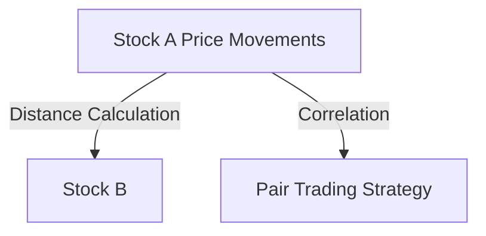
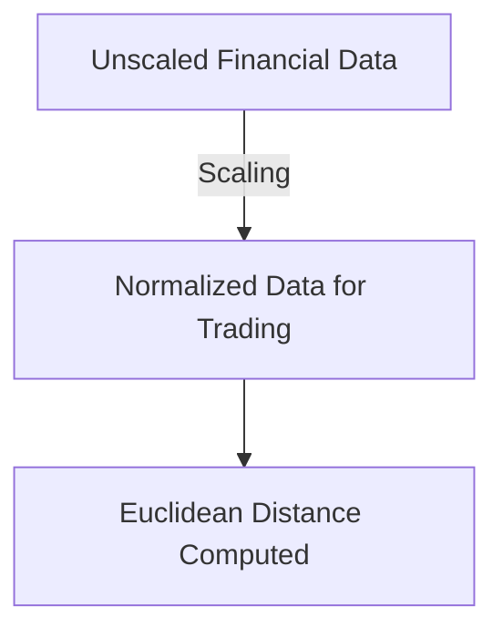

## Introduction

Euclidean distance is a fundamental metric used not only in machine learning but also in quantitative finance and trading. In trading, Euclidean distance can be applied to analyze correlations between stocks, identify market patterns, or develop algorithmic strategies. This metric measures the straight-line distance between two points in Euclidean space, making it a powerful tool for comparing historical price data, financial indicators, and other market variables.

In this article, we will explore Euclidean distance, how it's calculated in various dimensional spaces, and its practical applications in algorithmic trading.

<!-- truncate -->

## Euclidean Distance Formula

In an \( n \)-dimensional space \( \mathbb{R}^n \), the Euclidean distance between two points \( x = (x_1, x_2, \dots, x_n) \) and \( y = (y_1, y_2, \dots, y_n) \) is defined as:

\[
d_E(x, y) = \sqrt{(x_1 - y_1)^2 + (x_2 - y_2)^2 + \dots + (x_n - y_n)^2}
\]

This formula calculates the shortest path between two points and can be generalized as:

\[
d*E(x, y) = \sqrt{\sum*{i=1}^{n}(x_i - y_i)^2}
\]

### Example in Trading

Consider two stocks, A and B, with historical daily closing prices over three days. If stock A has prices \( (100, 102, 105) \) and stock B has prices \( (98, 103, 104) \), the Euclidean distance between their price movements would be:

\[
d_E(A, B) = \sqrt{(100 - 98)^2 + (102 - 103)^2 + (105 - 104)^2} = \sqrt{4 + 1 + 1} = \sqrt{6} \approx 2.45
\]

This shows that stock A and stock B have a Euclidean distance of approximately 2.45, which can be interpreted as the "distance" between their price trajectories. This distance helps in understanding how similar or dissimilar their price movements have been over time.

## Applications in Algorithmic Trading

### Correlation Between Stocks

Euclidean distance is often used to calculate the similarity between multiple stocks or financial instruments. By measuring the distance between different stock price movements or other financial indicators, traders can identify correlations, form pairs for arbitrage strategies, or diversify portfolios by selecting assets with low similarity.

### Pattern Recognition

In algorithmic trading, recognizing patterns such as price trends, volatility clusters, or technical indicator patterns is critical. Euclidean distance allows the algorithm to compare these patterns between different stocks or across different time periods.

For instance, if you are trying to identify price patterns similar to historical bull markets, Euclidean distance can quantify the similarity between current and past market conditions.

### Time Series Analysis

For time series data, such as stock prices or trading volume over time, Euclidean distance is useful for comparing the evolution of two or more time series. Traders can use it to identify divergence or convergence between two assets, which is often an indicator for potential trading signals.

### Nearest Neighbor Algorithms in Trading

In trading, the **K-Nearest Neighbors (KNN)** algorithm is used to find similar historical price movements to predict future market behavior. Euclidean distance serves as the metric to identify the closest "neighbors" or similar historical periods based on price, volume, volatility, or other factors.

For example, using KNN with Euclidean distance, you can predict the next day's price movement by finding the most similar historical patterns in past data.

## Euclidean Distance in Higher Dimensions

In trading, Euclidean distance can also be applied in high-dimensional spaces where each dimension represents a financial feature, such as price, volatility, momentum, or other indicators. The Euclidean distance between two multidimensional points represents the overall similarity between these financial feature sets.

For example, consider a trading strategy that takes into account several indicators: price, moving average, volume, and volatility. Each of these factors is a dimension, and the Euclidean distance between two time periods can help measure how similar they are based on these combined factors.

## Euclidean Distance vs. Other Distance Metrics in Trading

While Euclidean distance is widely used, there are other distance metrics that may be more suitable depending on the specific context:

### Manhattan Distance

**Manhattan Distance** (or L1 norm) measures the sum of the absolute differences between the coordinates. In a financial context, this metric is often used to compare the absolute differences in price movements, making it ideal for strategies where relative movement matters more than the exact value.

\[
d*M(x, y) = \sum*{i=1}^{n} |x_i - y_i|
\]

### Cosine Similarity

Cosine similarity measures the angle between two vectors and is often used in **trading signals** when directionality of price movements matters more than magnitude. This is particularly useful in **momentum trading**, where the angle between the price vectors (indicating the direction of movement) is of greater importance than the actual distance.

\[
\text{Cosine Similarity}(x, y) = \frac{x \cdot y}{\|x\| \|y\|}
\]

## Feature Scaling in Trading

Before applying Euclidean distance in trading algorithms, it is important to scale or normalize financial features. This is critical because different financial indicators often operate on different scales. For example, price might range from $10 to $500$, while volatility is between $0.01 and $0.05$. Without normalization, higher magnitude features like price will dominate the distance calculation, leading to incorrect conclusions.

**Min-max normalization** is a common technique in trading, where data is scaled to a range [0, 1], ensuring that all features contribute equally to the distance metric.

## Use of Euclidean Distance in Risk Management

Euclidean distance can also be useful in risk management. By measuring the similarity between historical market conditions and current ones, risk managers can determine how much portfolio exposure should be adjusted based on previous market events.

For instance, in periods where the Euclidean distance between current market volatility and historical crash volatility is small, it might signal a time to reduce risk.

## Conclusion

Euclidean distance plays a pivotal role in various trading applications, from pair trading and correlation analysis to time series comparison and risk management. While it is a simple and intuitive metric, it should be applied with caution, particularly when dealing with high-dimensional data or features of different scales.

By leveraging Euclidean distance, traders and quants can gain deeper insights into asset correlations, historical pattern recognition, and optimal trading strategy development. However, it is important to consider the context and the specific goals of the trading strategy when deciding whether Euclidean distance is the right metric to use.
