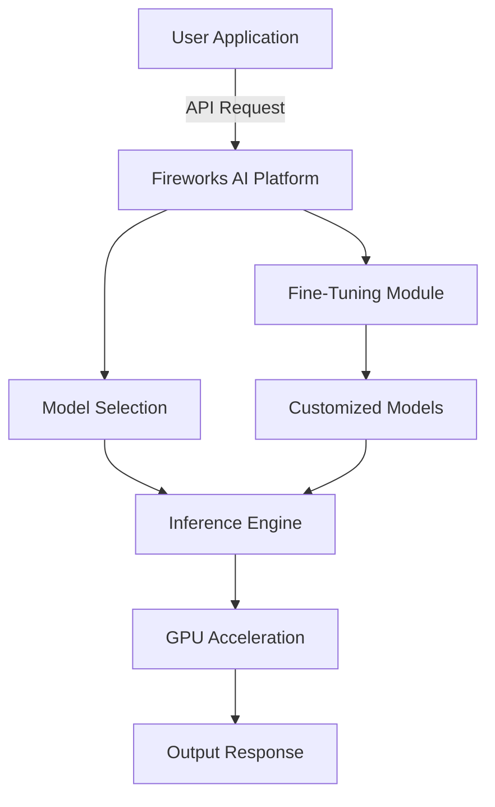
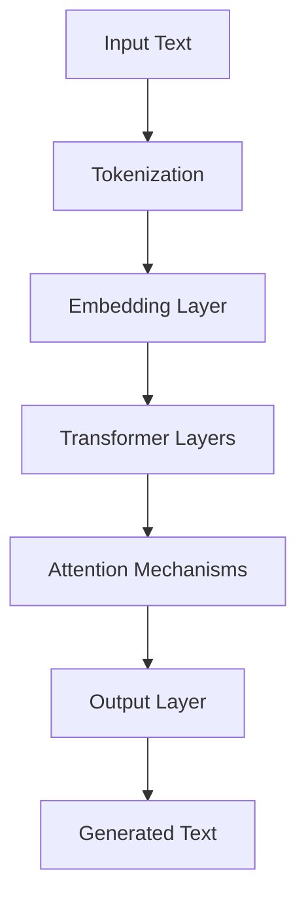
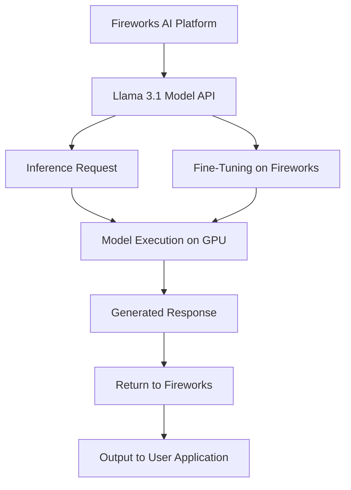
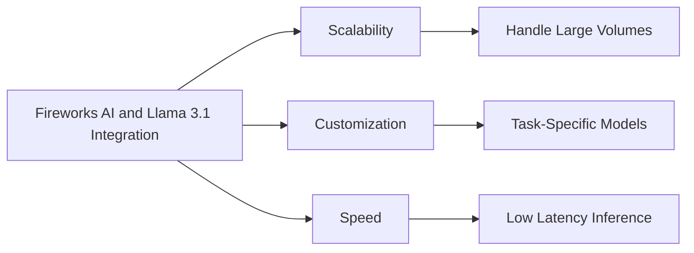

## Introduction

The integration of Fireworks AI with Meta's Llama 3.1 models presents a powerful combination for deploying state-of-the-art AI models in enterprise applications. This collaboration offers developers and businesses the ability to leverage Llama's advanced language models with the high-performance infrastructure of Fireworks AI. In this article, we explore the architecture of both systems, their integration workflow, and the benefits of using this combined solution for AI-driven applications.

<!-- truncate -->

## Understanding Fireworks AI

Fireworks AI is a robust platform that enables the deployment and scaling of AI models with minimal latency. It provides a range of features, including high-performance inference, fine-tuning capabilities, and seamless integration with various AI models, making it ideal for demanding enterprise applications.

### Fireworks AI Infrastructure Overview

In this diagram:

- **User Application**: The client application sending requests to Fireworks AI.
- **Fireworks AI Platform**: Manages model selection, inference, and fine-tuning.
- **Inference Engine**: Runs selected models and generates predictions.
- **GPU Acceleration**: Enhances performance using GPU resources.
- **Fine-Tuning Module**: Customizes models to fit specific tasks.

## Understanding Llama 3.1

Llama 3.1 is Meta's latest open-source large language model, offering capabilities in natural language understanding, generation, and multilingual support. With sizes ranging from 8B to 405B parameters, Llama 3.1 is designed to tackle a variety of tasks with high efficiency.

### Llama 3.1 Architecture Overview

In this diagram:

- **Input Text**: The initial text input to the Llama model.
- **Tokenization**: Converts text into tokens for processing.
- **Embedding Layer**: Transforms tokens into dense vectors.
- **Transformer Layers**: Core layers that process input using attention mechanisms.
- **Attention Mechanisms**: Focuses on relevant parts of the input.
- **Output Layer**: Generates the final output text.

## Integration of Fireworks AI with Llama 3.1

The integration of Llama 3.1 with Fireworks AI enables developers to deploy these powerful models at scale with minimal latency, making them ideal for real-time processing, large-scale batch inference, or custom fine-tuning.

### Fireworks AI and Llama 3.1 Integration Workflow

In this diagram:

- **Fireworks AI Platform**: Manages integration with Llama 3.1 and handles requests.
- **Llama 3.1 Model API**: Interface for interacting with Llama 3.1 models.
- **Inference Request**: Process of sending data to the model.
- **Model Execution on GPU**: Running the model on GPU for fast inference.
- **Generated Response**: The text output generated by Llama.
- **Fine-Tuning on Fireworks**: Customizes Llama 3.1 models for specific tasks.

## Benefits of the Integration

The integration of Fireworks AI with Llama 3.1 offers several key advantages for enterprises:

### Benefits Overview

- **Scalability**: Handle large volumes of data and requests.
- **Customization**: Fine-tune models for specific tasks.
- **Speed**: Ensure low-latency inference for real-time applications.

## Conclusion

The integration of Fireworks AI with Llama 3.1 offers a powerful toolset for enterprises looking to deploy advanced AI solutions. By combining Fireworks AI's high-performance infrastructure with Llama 3.1's state-of-the-art capabilities, businesses can unlock new possibilities in AI-driven innovation, paving the way for the next generation of intelligent applications.

For more information on how to get started, visit Fireworks AI and explore the full potential of Llama 3.1 models.
