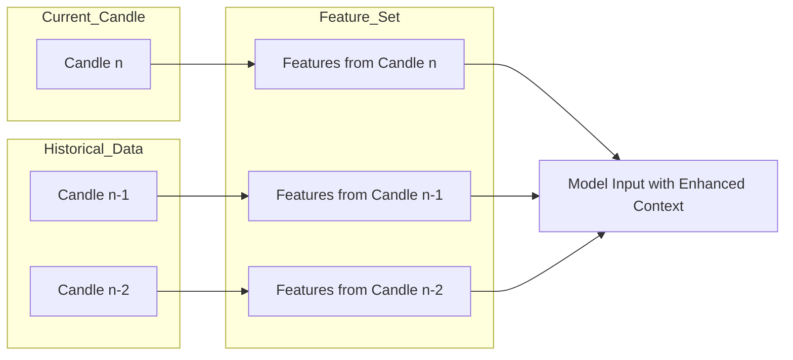
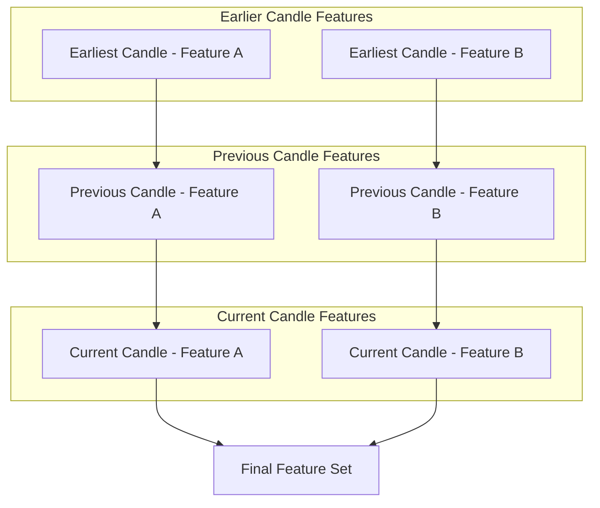
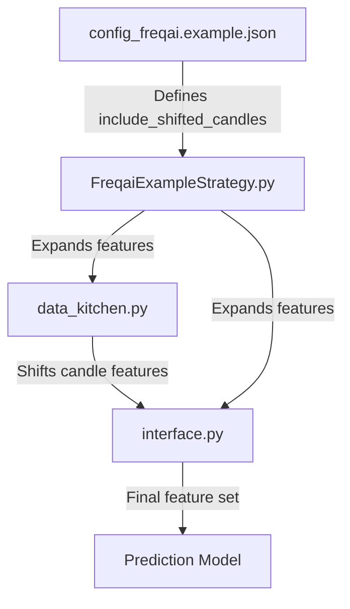

## Introduction

In the world of trading algorithms, particularly those driven by machine learning models like FreqAI, feature engineering plays a critical role in determining the success of your strategy. One such powerful feature engineering technique available in FreqAI is `include_shifted_candles`. This feature allows for the inclusion of previous candles' data in the feature set of the current candle, providing the model with historical context that can significantly enhance predictive accuracy.



<!-- truncate -->

## Understanding include_shifted_candles

The `include_shifted_candles` parameter in FreqAI is designed to add features from previous candles to subsequent candles, effectively allowing the model to "remember" past market conditions when making predictions for the current candle. By including a certain number of past candles, traders can provide the model with a richer dataset that captures the temporal dependencies in market data.

<!-- truncate -->

### How It Works

When `include_shifted_candles` is set, FreqAI will duplicate the features from the specified number of previous candles and shift them to the current candle's row in the dataset. This creates additional columns in the dataset, each representing a feature from a previous candle.

For example, if `include_shifted_candles` is set to 2, the dataset will include the original features for the current candle, plus the features from the previous two candles, shifted accordingly.

### Configuration Example

```json
"freqai": {
    "feature_parameters": {
        "include_timeframes": ["5m","15m","4h"],
        "include_corr_pairlist": [
            "ETH/USD",
            "LINK/USD",
            "BNB/USD"
        ],
        "label_period_candles": 24,
        "include_shifted_candles": 2,
        "indicator_periods_candles": [10, 20]
    }
}
```

In this configuration, the model will include features from the last two candles for each of the timeframes specified (5m, 15m, 4h), across the selected pairs (ETH/USD, LINK/USD, BNB/USD).

## Why Use include_shifted_candles?

The primary advantage of using `include_shifted_candles` is that it allows your model to capture temporal patterns and trends that are not immediately apparent in the data from a single candle. By providing the model with information about the recent past, you give it the tools to make more informed predictions about future market movements.

### Benefits

- **Enhanced Predictive Power**: Including historical data allows the model to better understand market momentum and trends, leading to more accurate predictions.
- **Richer Feature Set**: With more data points from previous candles, the feature set becomes richer, providing the model with more information to work with.
- **Improved Temporal Awareness**: Models that incorporate shifted candles can better capture temporal dependencies in the data, such as trends or recurring patterns.

## Visual Representation with Mermaid Diagram

Here's a mermaid diagram to illustrate how `include_shifted_candles` works:



In this diagram:

- **Original Candle Features** represent the standard features derived from the current candle.
- **Shifted Candle Features (n-1)** and **Shifted Candle Features (n-2)** represent the features derived from the previous two candles, shifted to align with the current candle.
- **Final Feature Set for Current Candle** includes both the original features and the shifted features, providing a more comprehensive dataset for the model.

## Code Flow and References

To better understand how `include_shifted_candles` is used in FreqAI, here's a diagram showing the flow of code and the filenames where this parameter is referenced:



### Explanation:

1. **config_freqai.example.json**: This is where `include_shifted_candles` is defined.
2. **FreqaiExampleStrategy.py**: The strategy file where features are expanded based on the configuration.
3. **data_kitchen.py**: Handles the merging and shifting of candle features according to the defined number of `include_shifted_candles`.
4. **interface.py**: Further processes the expanded features, preparing the final feature set for the prediction model.

## Conclusion

The `include_shifted_candles` parameter is a powerful tool in the FreqAI arsenal, enabling traders to enhance their models by incorporating historical market data into their predictions. By leveraging this feature, you can improve the temporal awareness of your model, leading to more accurate and reliable trading strategies.

For more detailed information on how to configure and use `include_shifted_candles`, refer to the [FreqAI documentation](https://www.freqtrade.io/en/stable/freqai/).
