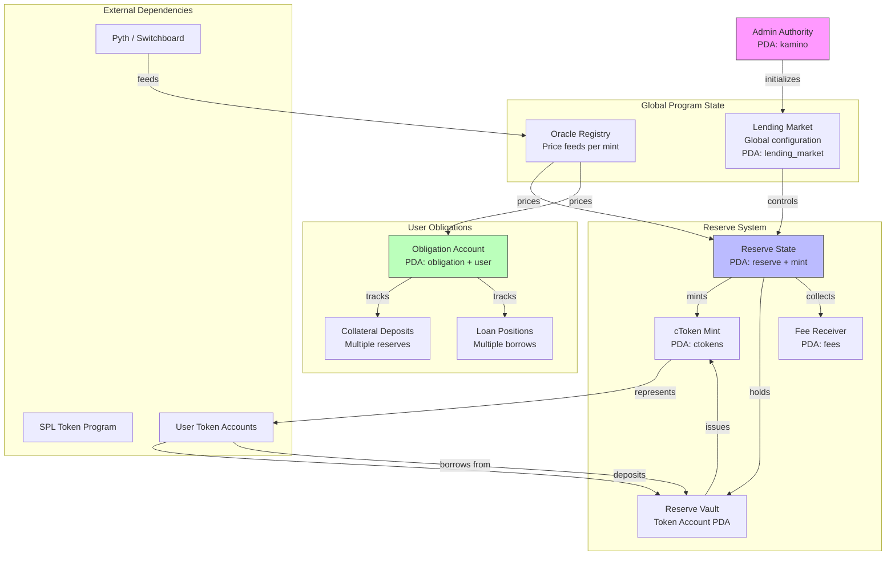
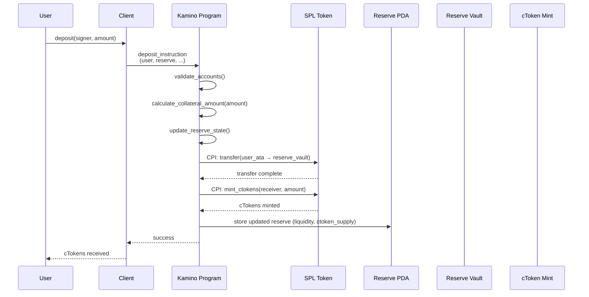

## TL;DR

- **Kamino Lend** is a high-performance lending protocol on Solana with over $2.68B TVL, using a peer-to-pool model for capital efficiency
- **This Anchor smart contract** implements core lending functionality: reserve management, borrowing, collateralization, and liquidations via CPI integration
- **Key Instructions**: `init_reserve`, `deposit`, `withdraw`, `borrow`, `repay`, `liquidate` with Anchor CPI to SPL token program
- **Account Architecture**: Extensive use of PDAs for reserve state, obligation tracking, and interest rate calculations with proper rent management
- **Anchor Patterns**: Comprehensive use of `#[account]` macros, `#[derive(Accounts)]` structs, and `init_if_needed` for gas-efficient deployments
- **Mathematical Core**: Utilization-based interest rates with compound interest accrual using exponential formulas and health factor calculations

## Introduction

Kamino Lend represents the cutting edge of Solana lending infrastructure, implementing a sophisticated peer-to-pool model that balances capital efficiency with risk management. With over $2.68B in Total Value Locked, the protocol's architecture has proven its robustness at scale, making it an essential case study for understanding production-grade DeFi systems on Solana.

### Architectural Philosophy

The protocol's design is built on three foundational principles:

1. **Capital Efficiency Through Pooling**: Unlike peer-to-peer lending models, Kamino aggregates liquidity into shared pools, maximizing utilization and providing instant liquidity for borrowers and lenders.

2. **Risk Isolation via Reserve Architecture**: Each asset operates as an independent reserve with its own risk parameters, interest rate models, and collateralization ratios, preventing contagion across markets.

3. **Composability First**: The contract is designed as a building block for higher-order DeFi primitives, enabling strategies like leveraged yield farming, delta-neutral positions, and automated portfolio management.

This guide examines the architectural patterns and design decisions that enable Kamino Lend to operate at scale, focusing on account structures, state management, mathematical models, and system invariants rather than implementation details.

## Architecture Diagrams

### Account Relationships and PDA Hierarchy



### Deposit Instruction Flow



## Account Structure Table

| Account Name | Type | PDA Seeds | Purpose | Fields (Simplified) |
|-------------|------|-----------|---------|---------------------|
| `LendingMarket` | Program State | `[b"lending-market", market_id]` | Global configuration | `owner`, `quote_currency`, `bump`, `reserves_list` |
| `Reserve` | Program State | `[b"reserve", lending_market, mint]` | Per-asset liquidity pool | `liquidity`, `collateral`, `config`, `last_update`, `cumulative_borrow_rate` |
| `Obligation` | User State | `[b"obligation", lending_market, user]` | User's borrowing position | `deposits[]`, `borrows[]`, `repayments[]`, `health_factor` |
| `ReserveLiquidity` | PDA | `[b"liquidity", reserve]` | Token vault for deposits | SPL token account (owned by program) |
| `ReserveCollateral` | PDA | `[b"collateral", reserve]` | cToken mint for the reserve | SPL mint (cToken representation) |
| `FeeReceiver` | PDA | `[b"fees", reserve]` | Protocol fee accumulation | SPL token account for fees |

| `OracleAccount` | External | N/A | Price feed for asset | Pyth/Switchboard account |

## Core Lending Primitives

### 1. Reserve Initialization Architecture

Reserve initialization establishes the fundamental infrastructure for a lending market. Each reserve represents an isolated pool for a single asset type, with its own economic parameters and risk profile.

**Account Hierarchy**:
- **Reserve PDA**: Central state account storing liquidity metrics, interest rates, and configuration
- **Liquidity Vault**: Token account holding deposited assets, controlled by the reserve PDA
- **Collateral Token Mint**: Represents depositor shares (similar to LP tokens in AMMs)
- **Fee Receiver**: Accumulates protocol revenue from interest spread
- **Oracle Account**: External price feed for collateral valuation

**Design Decisions**:

1. **PDA-Based Authority**: The reserve PDA acts as the authority for all token operations, eliminating the need for separate signer management and ensuring atomic operations.

2. **Idempotent Initialization**: Using `init_if_needed` patterns allows for graceful handling of concurrent initialization attempts, critical for permissionless market creation.

3. **Parametric Risk Models**: Each reserve stores its own loan-to-value ratio, liquidation threshold, and interest rate curve, enabling fine-tuned risk management per asset.

**Economic Configuration**:
- Optimal utilization target (typically 80%)
- Base and slope interest rate parameters
- Liquidation bonus and close factor
- Reserve factor for protocol revenue

### 2. Deposit Mechanism: Share-Based Accounting

The deposit system implements a share-based accounting model where depositors receive collateral tokens (cTokens) representing their proportional ownership of the reserve's assets.

**Mechanism Flow**:

1. **Interest Accrual**: Before any operation, the reserve accrues accumulated interest, ensuring all depositors benefit proportionally from lending activity.

2. **Exchange Rate Calculation**: The system calculates how many cTokens to mint based on the current ratio of total deposits to outstanding cTokens. This rate increases over time as interest accrues.

3. **Atomic Token Operations**: User assets transfer to the reserve vault and cTokens mint to the user in a single transaction, preventing partial execution.

4. **State Updates**: Reserve metrics update atomically, maintaining invariants around total supply and collateral.

**Mathematical Core**:
The exchange rate between underlying tokens and cTokens uses compound interest:

$$
\text{exchangeRate} = \frac{\text{collateralMintSupply}}{\text{liquidityTotalSupply}}
$$

Where both numerator and denominator grow with interest accrual. For deposit amount $A$:

$$
\text{cTokens} = A \times \frac{\text{collateralMintSupply}}{\text{liquidityTotalSupply}}
$$

### 3. Borrowing Architecture: Multi-Collateral Risk Management

The borrowing system enables users to take loans against deposited collateral while maintaining solvency through a health factor mechanism.

**Obligation Structure**:

Each user has a single Obligation account per lending market that tracks:
- **Deposits**: Array of collateral positions across multiple reserves
- **Borrows**: Array of loan positions with accrued interest
- **Health Factor**: Real-time solvency metric
- **Last Update**: Timestamp for interest calculation

**Risk Management Layers**:

1. **Per-Asset LTV Ratios**: Each collateral type has a maximum loan-to-value ratio (e.g., SOL at 80%, meme coins at 50%), determining borrowing power.

2. **Cross-Collateral Aggregation**: Users can borrow against multiple collateral types simultaneously, with total borrowing power calculated across all deposits.

3. **Utilization Caps**: Each reserve has maximum utilization limits to ensure liquidity for withdrawals.

4. **Dynamic Health Checks**: Before and after each borrow, the system validates that the user's health factor remains above the minimum threshold.

**Borrow Operation Flow**:
- Accrue interest on both reserve (to update rates) and obligation (to account for existing debt growth)
- Validate borrowing power exceeds requested amount
- Check reserve hasn't exceeded utilization limits
- Execute token transfer from reserve to user
- Update obligation's debt tracking with current cumulative borrow rate
- Recalculate and validate health factor post-operation

**Health Factor Calculation**:
The health factor determines liquidation risk:

$$
\text{healthFactor} = \frac{\text{collateralValue} \times \text{ltvRatio}}{\text{borrowedValue}}
$$

Where:
- $\text{collateralValue} = \sum (\text{collateralAmount}_i \times \text{price}_i)$
- $\text{borrowedValue} = \sum (\text{borrowedAmount}_j \times \text{price}_j)$
- $\text{ltvRatio} = \text{loan-to-value ratio per asset (0-1)}$

### 4. Liquidation System: Incentive-Driven Solvency

Liquidation is the protocol's self-healing mechanism, allowing third-party actors to restore under-collateralized positions to health by repaying debt in exchange for discounted collateral.

**Trigger Conditions**:
- Health factor falls below 1.0 (typically triggered by collateral price drops or borrow rate increases)
- Position becomes mathematically insolvent when debt value exceeds collateral value adjusted for LTV

**Economic Incentive Structure**:

1. **Liquidation Bonus**: Liquidators receive a percentage bonus (e.g., 5-10%) on the collateral value they seize, compensating for gas costs, price execution risk, and market making.

2. **Partial Liquidations**: Most protocols limit single liquidation amounts (close factor of 50%) to prevent excessive slippage and give borrowers a chance to add collateral.

3. **Dutch Auction Potential**: Some implementations use declining bonuses over time to optimize protocol value capture.

**System Protection Mechanisms**:

- **Oracle Validation**: Multiple price sources prevent manipulation-based fake liquidations
- **Slippage Bounds**: Maximum collateral withdrawal per transaction prevents reserve depletion
- **Reserve Insurance**: Protocol retains a portion of liquidation proceeds as bad debt insurance

**Liquidation Flow**:
1. External actor identifies under-collateralized position
2. Liquidator repays portion of user's debt to the reserve
3. System calculates collateral owed based on repayment amount, asset prices, and liquidation bonus
4. Collateral transfers to liquidator at discount
5. Obligation updates with reduced debt and collateral
6. If health factor restored above threshold, position remains open; otherwise, additional liquidations possible

## Interest Rate Architecture

### Utilization-Based Rate Model

Kamino implements a kinked interest rate curve that dynamically adjusts based on capital utilization, balancing supply and demand while preventing excessive leverage.

**Rate Curve Design**:

```
Borrow Rate |
            |              /
   Max      |            /
            |          /  (Steep slope)
            |        /
   Optimal  |------/
            |    /  (Gradual slope)
   Min      |  /
            |/________________
            0%    80%    100%  Utilization
```

**Economic Rationale**:

1. **Below Optimal Utilization (0-80%)**:
   - Gradual rate increase encourages borrowing
   - Low rates attract borrowers when liquidity is abundant
   - Prevents capital from sitting idle

2. **Above Optimal Utilization (80-100%)**:
   - Steep rate increase protects lender liquidity
   - High rates incentivize debt repayment
   - Discourages excessive leverage during high utilization

**Compound Interest Accrual**:

The protocol uses continuous compound interest with per-slot precision:

$$
C_t = C_0 \times (1 + r)^{\Delta t}
$$

Where:
- $C_t$ = cumulative borrow rate at time $t$
- $C_0$ = cumulative borrow rate at time $0$ 
- $r$ = periodic rate (borrow rate per slot)
- $\Delta t$ = slots elapsed

Each user's debt grows proportionally to the cumulative rate, ensuring fair interest distribution across all borrowers regardless of when they entered positions.

## State Management Architecture

### Obligation Account Design

The Obligation account represents a user's complete position across the lending protocol, aggregating all collateral deposits and outstanding loans.

**Account Structure Philosophy**:

- **Single Account Per User**: One obligation account per lending market simplifies account management and enables atomic cross-collateral operations
- **Dynamic Arrays**: Variable-length vectors for deposits and borrows allow users to interact with multiple reserves without account reallocation
- **Cached Computations**: Health factor and market values cached with timestamps to avoid redundant oracle reads

**State Transitions**:

```
┌─────────────────────┐
│  Obligation Created │
│  (Empty)            │
└──────────┬──────────┘
           │
           ▼
   ┌───────────────┐
   │  Add Deposit  │ ──────┐
   └───────┬───────┘       │
           │               │
           ▼               │
   ┌───────────────┐       │
   │  Borrow Asset │       │
   └───────┬───────┘       │
           │               │
     ┌─────▼────────┐      │
     │  Monitoring  │◄─────┘
     │  (Active)    │
     └──┬───────┬───┘
        │       │
        │       └──────────┐
        │                  ▼
        │         ┌────────────────┐
        │         │  Liquidation   │
        │         │  (if HF < 1.0) │
        │         └────────┬───────┘
        │                  │
        ▼                  ▼
 ┌──────────────┐   ┌─────────────┐
 │ Repay + Exit │   │  Restored   │
 └──────────────┘   └─────────────┘
```

**Health Factor Calculation Architecture**:

The health factor aggregates risk across all positions:

1. **Collateral Valuation**: Each deposit multiplied by its asset price and LTV ratio
2. **Debt Valuation**: Each borrow multiplied by its asset price and accrued interest
3. **Risk-Adjusted Ratio**: Total weighted collateral divided by total debt

$$
\text{healthFactor} = \frac{\sum (\text{collateral}_i \times \text{price}_i \times \text{ltv}_i)}{\sum (\text{debt}_j \times \text{price}_j)}
$$

A health factor below 1.0 indicates technical insolvency and triggers liquidation eligibility.

## Solana-Specific Design Patterns

### Account Model Optimization

**Fixed-Size Account Design**:

Kamino optimizes for Solana's account-based model by using predictable account sizes:

- **Reserve Accounts**: ~400 bytes with fixed-size configuration structs
- **Obligation Accounts**: Dynamic sizing with capacity limits (max 10 deposits, 5 borrows)
- **Market Accounts**: Global configuration with reserve registry

**Benefits**:
- Predictable rent costs
- Efficient reallocation patterns
- Reduced compute units for account validation

### Compute Unit Management

The protocol implements several strategies to minimize compute consumption:

1. **Early Returns**: Simple validation checks before expensive operations
2. **Batched Operations**: Combine multiple token transfers in single CPI calls
3. **Lazy Interest Accrual**: Only update rates when users interact, not globally
4. **Cached Oracle Reads**: Store price data with timestamps to avoid redundant oracle calls within the same slot

### Cross-Program Invocation Architecture

**Token Program Abstraction**:

Supports both SPL Token and Token-2022 programs through a unified interface:

- **Dynamic Program Detection**: Checks token mint's owner to determine program version
- **Fee Handling**: Token-2022 transfer fees automatically calculated and accounted
- **Extension Support**: Compatible with interest-bearing tokens and other Token-2022 features

**Authority Patterns**:

- **PDA Signers**: All token operations use PDAs as signers, eliminating private key management
- **Seed Derivation**: Deterministic PDA generation enables permissionless interactions
- **Authority Hierarchy**: Multi-tier access control with admin, operator, and user roles

## Security Architecture

### Multi-Layer Access Control

The protocol implements defense-in-depth with hierarchical permissions:

**Authority Tiers**:

1. **Protocol Owner**: Can update global parameters, add new reserves, emergency pause
2. **Market Authority**: Manages individual market configurations and risk parameters  
3. **Reserve Manager**: Adjusts interest rate models and asset-specific settings
4. **Emergency Guardian**: Limited to circuit breaker activation only

**Time-Locked Operations**:

Critical parameter changes require a multi-step process:

- **Proposal Creation**: Admin proposes parameter change
- **Timelock Period**: Mandatory waiting period (e.g., 24-48 hours)
- **Execution Window**: Limited window after timelock to execute
- **Cancellation Rights**: Separate guardian can veto dangerous changes

This prevents malicious or accidental instant changes to critical parameters like liquidation thresholds or interest rate curves.

### Oracle Security Framework

**Multi-Oracle Support**:

The architecture supports multiple oracle providers (Pyth, Switchboard, Chainlink) with:

- **Primary/Secondary Validation**: Cross-check prices between two independent sources
- **Deviation Thresholds**: Reject prices that differ by more than acceptable bounds
- **Staleness Checks**: Enforce maximum age for price data
- **Confidence Intervals**: Validate oracle-reported confidence levels

**Price Manipulation Protection**:

- **TWAP Integration**: Time-weighted average prices smooth out flash crashes
- **Circuit Breakers**: Halt operations if price volatility exceeds thresholds
- **Reserve-Level Config**: Each asset has its own oracle security parameters

### Economic Security Mechanisms

**Circuit Breakers**:

Automatic safeguards trigger during extreme conditions:

- **High Volatility**: Restrict borrowing when asset prices fluctuate rapidly
- **Critical Utilization**: Limit withdrawals when reserves approach depletion
- **Oracle Failure**: Gracefully degrade to safe state if price feeds unavailable
- **Bad Debt Accumulation**: Emergency shutdown if protocol becomes insolvent

**Gradual Limits**:

Rather than hard cutoffs, the protocol implements smooth degradation:

- Borrowing limits decrease proportionally as utilization approaches maximum
- Liquidation bonuses increase as health factors deteriorate
- Interest rates accelerate non-linearly at extreme utilization

This prevents sudden state changes and gaming around threshold boundaries.

## Integration Architecture

### Client-Side Design Patterns

**PDA Derivation Strategy**:

Clients must derive the same PDAs as the on-chain program to construct transactions:

- **Deterministic Address Generation**: Seeds must match exactly (lending market ID, mint address, user wallet)
- **Bump Seed Caching**: Store bump seeds after first derivation to avoid recomputation
- **Account Validation**: Always verify derived PDAs match expected program-owned accounts

**Transaction Construction**:

Typical interaction flow:

1. **Fetch On-Chain State**: Read current reserve and obligation data
2. **Compute Off-Chain**: Calculate expected outcomes (cTokens minted, health factor after borrow)
3. **Derive Accounts**: Generate all required PDAs
4. **Build Instruction**: Construct transaction with correct account order
5. **Simulate First**: Always simulate before sending to detect issues
6. **Send and Confirm**: Submit transaction and wait for confirmation

### Health Factor Monitoring

**Continuous Position Monitoring**:

Applications should implement:

- **WebSocket Subscriptions**: Listen for obligation account changes
- **Oracle Price Tracking**: Monitor collateral price movements
- **Alert Thresholds**: Warn users when health factor approaches liquidation
- **Auto-Rebalancing**: Optionally implement automated deleveraging

**Risk Management Integration**:

- Display health factor prominently in UI
- Show liquidation price for each collateral asset
- Provide safety margins (e.g., recommend 150%+ health factor)
- Enable one-click position closing during volatility

## Extensibility and Composability

### Extension Points

The architecture provides several extension mechanisms:

**1. New Collateral Types**

Adding support for new assets requires:
- Initializing a new reserve with appropriate risk parameters
- Configuring oracle integration for price feeds
- Setting LTV ratios, liquidation thresholds, and interest models
- Optional: Custom logic for exotic token types (rebase tokens, yield-bearing assets)

**2. Advanced Financial Primitives**

**Flash Loans**:
Atomically borrow without collateral within a single transaction:
- Borrow assets from reserve
- Execute arbitrary logic (arbitrage, collateral swaps, etc.)
- Repay loan + fee before transaction completes
- If repayment fails, entire transaction reverts

**Key Design**:
- Callback mechanism allows user-defined operations
- Fee structure incentivizes liquidity provision
- Atomicity guarantees protocol safety

**Isolated Markets**:
Create separate lending markets with different risk profiles:
- Blue-chip assets with conservative parameters
- Experimental tokens with higher collateral requirements
- Stablecoin-only markets for capital efficiency

**3. Strategy Integrations**

Higher-order protocols can build on lending primitives:

- **Leveraged Yield Farming**: Loop deposits and borrows for amplified yields
- **Delta-Neutral Strategies**: Short via borrowing while holding spot positions
- **Automated Vaults**: Manage user positions with algorithmic rebalancing
- **Portfolio Optimization**: Automatically adjust allocations based on rates

### System Validation Strategies

**Testing Dimensions**:

**1. Economic Correctness**:
- Interest accrual over extended periods
- Exchange rate calculations under various utilization levels
- Health factor updates with multiple collateral/borrow positions
- Liquidation math verification

**2. State Invariants**:
- Total cTokens supply equals sum of user balances
- Reserve liquidity matches vault balance minus borrowed amount
- Sum of all health factors remains non-negative
- Interest never decreases over time

**3. Edge Cases**:
- Maximum utilization scenarios
- Oracle price extremes (sudden crashes, stale data)
- Concurrent operations on same obligation
- Token account edge cases (zero balance, closed accounts)

**4. Security Scenarios**:
- Unauthorized access attempts
- Manipulation via price oracle gaming
- Flash loan attack vectors
- Reentrancy patterns

**Simulation-Based Testing**:

- Monte Carlo simulations with random market conditions
- Stress testing with historical volatility data
- Fuzz testing with random input combinations
- Long-running scenarios (millions of slots)

## Conclusion

The Kamino Lend architecture exemplifies production-grade DeFi protocol design on Solana, demonstrating how to build secure, scalable, and composable financial infrastructure. Its success managing over $2.68B in TVL validates the architectural decisions across multiple dimensions.

### Key Architectural Principles

1. **Risk Isolation Through Reserve Design**: Each asset operates independently with its own parameters, preventing systemic contagion while enabling tailored risk management.

2. **Share-Based Accounting**: The cToken model elegantly handles proportional interest distribution and enables composability with other DeFi protocols.

3. **Health Factor as Central Invariant**: A single, continuously monitored metric ensures system solvency while providing users with clear risk visibility.

4. **Incentive Alignment**: Liquidators, lenders, and borrowers all have economic incentives that maintain protocol stability without relying on centralized actors.

5. **Defensive Design**: Multiple layers of validation, circuit breakers, time-locks, and oracle security create resilience against edge cases and attacks.

### Architectural Lessons for Builders

**For Protocol Developers**:
- Design account structures for predictable costs and efficient operations
- Build mathematical models with fixed-point arithmetic precision
- Implement gradual degradation rather than hard cutoffs
- Create extension points for future features without compromising core security

**For Integrators**:
- Understand PDA derivation patterns for reliable transaction construction
- Monitor on-chain state continuously for position management
- Implement robust error handling for network instability
- Design UIs that make risk transparent to end users

**For Auditors**:
- Verify mathematical correctness of interest and health calculations
- Test state invariants under extreme market conditions
- Validate oracle security and manipulation resistance
- Check access control at every privilege boundary

### Future Evolution

The architecture is designed to evolve:
- Support for new collateral types (LSTs, yield-bearing assets, RWAs)
- Cross-chain integration via bridges and messaging protocols  
- Advanced rate models incorporating external market signals
- Governance-driven parameter optimization based on empirical data

Kamino Lend demonstrates that Solana's account model, when properly architected, can support complex financial logic at scale. The protocol serves as both a critical infrastructure piece for Solana DeFi and a reference implementation for builders creating the next generation of on-chain financial systems.

---

*This architectural analysis focuses on design patterns and system structure. For implementation details and deployment instructions, consult the official Kamino documentation and audited source code.*
