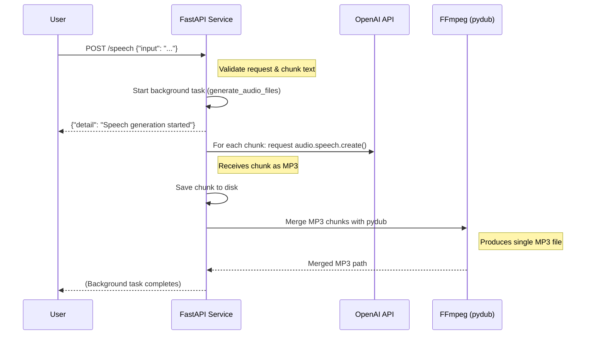

## Introduction

**OpenAI** offers powerful text-to-speech capabilities, enabling developers to generate spoken audio from raw text. Meanwhile, **FFmpeg** is the de facto standard tool for audio/video processing—used heavily for tasks like merging audio files, converting formats, and applying filters. Combining these two in a **FastAPI** application can produce a scalable, production-ready text-to-speech (TTS) workflow that merges and manipulates audio via FFmpeg under the hood.

This article demonstrates how to:

1. Accept text input through a **FastAPI** endpoint
2. Chunk text and use **OpenAI** to generate MP3 segments
3. Merge generated segments with **FFmpeg** (through the [pydub](https://github.com/jiaaro/pydub) interface)
4. Return or store a final MP3 file, ideal for streamlined TTS pipelines

By the end, you’ll understand how to build a simple but effective text-to-speech microservice that leverages the power of **OpenAI** and **FFmpeg**.

---

## 1. Why Combine OpenAI and FFmpeg

- **Chunked Processing**: Long text might exceed certain API limits or timeouts. Splitting into smaller parts ensures each piece is handled reliably.
- **Post-processing**: Merging segments, adding intros or outros, or applying custom filters (such as volume adjustments) becomes trivial with FFmpeg.
- **Scalability**: A background task system (like FastAPI’s `BackgroundTasks`) can handle requests without blocking the main thread.
- **Automation**: Minimizes manual involvement—one endpoint can receive text and produce a final merged MP3.

---

## 2. FastAPI Endpoint and Background Tasks

Below is the **FastAPI** code that implements a TTS service using the OpenAI API and pydub (which uses FFmpeg internally). It splits the input text into manageable chunks, generates MP3 files per chunk, then merges them:

```python
import os
import time
import logging
from pathlib import Path

from dotenv import load_dotenv
from fastapi import APIRouter, HTTPException, Request, BackgroundTasks
from fastapi.responses import JSONResponse
from pydantic import BaseModel
from openai import OpenAI
from pydub import AudioSegment

load_dotenv(".env.local")

OPENAI_API_KEY = os.environ.get("OPENAI_API_KEY")
client = OpenAI(api_key=OPENAI_API_KEY)

router = APIRouter()

logging.basicConfig(
    level=logging.DEBUG,  # Set root logger to debug level
    format='%(levelname)s | %(name)s | %(message)s'
)
logger = logging.getLogger(__name__)
logger.setLevel(logging.DEBUG)

class AudioRequest(BaseModel):
    input: str

def chunk_text(text: str, chunk_size: int = 4096):
    """
    Generator that yields `text` in chunks of `chunk_size`.
    """
    for i in range(0, len(text), chunk_size):
        yield text[i:i + chunk_size]

@router.post("/speech")
async def generate_speech(request: Request, body: AudioRequest, background_tasks: BackgroundTasks):
    """
    Fires off the TTS request in the background (fire-and-forget).
    Logs are added to track progress. No zip file is created.
    """
    model = "tts-1"
    voice = "onyx"

    if not body.input:
        raise HTTPException(
            status_code=400,
            detail="Missing required field: input"
        )

    # Current time for folder naming or logging
    timestamp = int(time.time() * 1000)

    # Create a folder for storing output
    output_folder = Path(".") / f"speech_{timestamp}"
    output_folder.mkdir(exist_ok=True)

    # Split the input into chunks
    chunks = list(chunk_text(body.input, 4096))

    # Schedule the actual speech generation in the background
    background_tasks.add_task(
        generate_audio_files,
        chunks=chunks,
        output_folder=output_folder,
        model=model,
        voice=voice,
        timestamp=timestamp
    )

    # Log and return immediately
    logger.info(f"Speech generation task started at {timestamp} with {len(chunks)} chunks.")
    return JSONResponse({"detail": f"Speech generation started. Timestamp: {timestamp}"})

def generate_audio_files(chunks, output_folder, model, voice, timestamp):
    """
    Generates audio files for each chunk. Runs in the background.
    After all chunks are created, merges them into a single MP3 file.
    """
    try:
        # Generate individual chunk MP3s
        for index, chunk in enumerate(chunks):
            speech_filename = f"speech-chunk-{index + 1}.mp3"
            speech_file_path = output_folder / speech_filename

            logger.info(f"Generating audio for chunk {index + 1}/{len(chunks)}...")

            response = client.audio.speech.create(
                model=model,
                voice=voice,
                input=chunk,
                response_format="mp3",
            )

            response.stream_to_file(speech_file_path)
            logger.info(f"Chunk {index + 1} audio saved to {speech_file_path}")

        # Merge all generated MP3 files into a single file
        logger.info("Merging all audio chunks into one file...")
        merged_audio = AudioSegment.empty()

        def file_index(file_path: Path):
            # Expects file names like 'speech-chunk-1.mp3'
            return int(file_path.stem.split('-')[-1])

        sorted_audio_files = sorted(output_folder.glob("speech-chunk-*.mp3"), key=file_index)
        for audio_file in sorted_audio_files:
            chunk_audio = AudioSegment.from_file(audio_file, format="mp3")
            merged_audio += chunk_audio

        merged_output_file = output_folder / f"speech-merged-{timestamp}.mp3"
        merged_audio.export(merged_output_file, format="mp3")
        logger.info(f"Merged audio saved to {merged_output_file}")

        logger.info(f"All speech chunks generated and merged for timestamp {timestamp}.")
    except Exception as e:
        logger.error(f"OpenAI error (timestamp {timestamp}): {e}")
```

### Key Takeaways

- **`AudioRequest`** model enforces the presence of an `input` field.
- **`chunk_text`** ensures no chunk exceeds 4096 characters (you can adjust this size).
- **BackgroundTasks** offloads the TTS generation so the API can respond promptly.
- **pydub** merges MP3 files (which in turn calls FFmpeg).

---

## 3. Using FFmpeg Under the Hood

Installing **[pydub](https://github.com/jiaaro/pydub)** requires **FFmpeg** on your system. Ensure FFmpeg is in your PATH—otherwise you’ll get errors when merging or saving MP3 files. For Linux (Ubuntu/Debian):

```bash
sudo apt-get update
sudo apt-get install ffmpeg
```

For macOS (using Homebrew):

```bash
brew install ffmpeg
```

If you’re on Windows, install FFmpeg from [FFmpeg’s official site](https://ffmpeg.org/) or use a package manager like [chocolatey](https://chocolatey.org/) or [scoop](https://scoop.sh/).

---

## 4. Mermaid JS Diagram

Below is a **Mermaid** sequence diagram illustrating the workflow:



**Explanation**:

1. **User** sends a POST request with text data.
2. **FastAPI** quickly acknowledges the request, then spawns a background task.
3. Chunks of text are processed via **OpenAI** TTS, saving individual MP3 files.
4. **pydub** merges them (calling **FFmpeg** behind the scenes).
5. Final merged file is ready in your output directory.

---

## 5. Conclusion

Integrating **OpenAI** text-to-speech with **FFmpeg** via **pydub** in a **FastAPI** application provides a robust, scalable way to automate TTS pipelines:

- **Reliability**: Chunk-based processing handles large inputs without overloading the API.
- **Versatility**: FFmpeg’s audio manipulation potential is nearly limitless.
- **Speed**: Background tasks ensure the main API remains responsive.

With the sample code above, you can adapt chunk sizes, add authentication, or expand the pipeline to include more sophisticated post-processing (like watermarking, crossfading, or mixing in music). Enjoy building richer audio capabilities into your apps—**OpenAI** and **FFmpeg** make a powerful duo.
