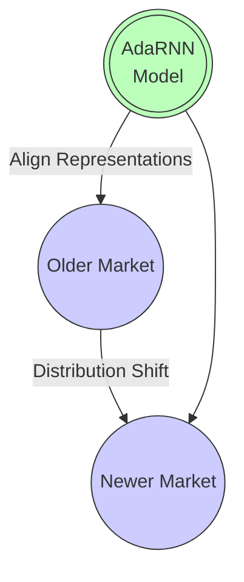
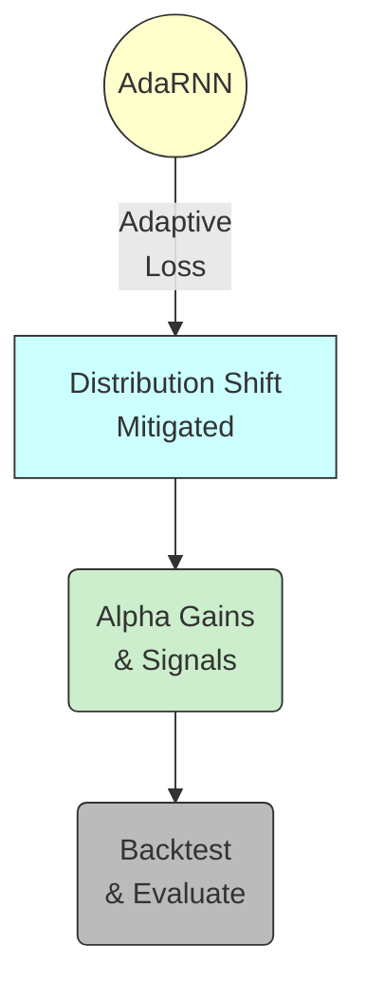

## Introduction

[**AdaRNN**](https://github.com/jindongwang/transferlearning/tree/master/code/deep/adarnn) is a specialized **PyTorch** model designed to adaptively learn from **non-stationary** financial time series—where market distributions evolve over time. Originally proposed in the paper _AdaRNN: Adaptive Learning and Forecasting for Time Series_ ([Du et al., CIKM 2021][1]), it leverages both **GRU layers** and **transfer-loss** techniques to mitigate the effects of distributional shift. This article demonstrates how AdaRNN can be applied within Microsoft’s **Qlib**—an open-source, AI-oriented platform for quantitative finance.

<!-- truncate -->

```mermaid
flowchart LR
    A((Data Flow)) --> B[Non-stationary <br> Financial Time Series]
    B --> C[Temporal Covariate Shift (TCS)]
    C --> D(AdaRNN)
    D --> E[Adaptive <br> Forecasts]
    style A fill:#bbf,stroke:#333,stroke-width:1px
    style B fill:#ddf,stroke:#333,stroke-width:1px
    style C fill:#f9f,stroke:#333,stroke-width:1px
    style D fill:#bfb,stroke:#333,stroke-width:1px
    style E fill:#cfc,stroke:#333,stroke-width:1px
```

---

## Background: AdaRNN Methodology

- **Temporal Covariate Shift (TCS)**  
  Market factors may differ drastically from historical data. AdaRNN addresses TCS by adaptively aligning representations over time.

- **Two-Phase Design**

  1. **Temporal Distribution Characterization**:  
     Better captures distribution information in time-series data.

  2. **Temporal Distribution Matching**:  
     Bridges the gap between older and newer data via advanced distribution alignment (e.g., MMD, CORAL, COSINE).

- **Paper & Code References**:
  - [CIKM 2021 Paper](https://arxiv.org/abs/2108.08515)
  - [Official Repo](https://github.com/jindongwang/transferlearning/tree/master/code/deep/adarnn)



AdaRNN’s adaptability makes it relevant for **financial forecasting**, **air-quality prediction**, and **activity recognition**—any scenario where non-stationary data complicates model training.

---

## Qlib Integration

Below is an excerpt from a Qlib-friendly YAML configuration. By running one command, Qlib will:

1. **Initialize** a US market environment (`^GSPC` as benchmark).
2. **Load & transform** data (e.g. `Alpha360`) with specialized normalization and label dropping.
3. **Train** a custom or placeholder PyTorch “AdaRNN” model.
4. **Evaluate** predictions via correlation metrics and backtesting.
5. **Generate** logs for advanced debugging and iteration.

```mermaid
flowchart LR
    A(Qlib Init) --> B[Data Load & Transform]
    B --> C[[AdaRNN or PyTorch Model]]
    C --> D[Metrics (IC, MSE, etc.)]
    D --> E(Backtest with <br> transaction costs)
    style A fill:#ddf,stroke:#333,stroke-width:1px
    style B fill:#ddf,stroke:#333,stroke-width:1px
    style C fill:#bfb,stroke:#333,stroke-width:1px
    style D fill:#bbf,stroke:#333,stroke-width:1px
    style E fill:#ddd,stroke:#333,stroke-width:1px
```

### Command

```bash
qrun workflow_config_adarnn_Alpha360.yaml
```

### YAML Snippet

```yaml
qlib_init:
  provider_uri: "/Users/vadimnicolai/Public/work/qlib-cookbook/.data/us_data"
  region: us
  kernels: 1

market: &market sp500
benchmark: &benchmark ^GSPC

data_handler_config: &data_handler_config
  start_time: 2008-01-01
  end_time: 2020-08-01
  fit_start_time: 2008-01-01
  fit_end_time: 2014-12-31
  instruments: *market
  infer_processors:
    - class: RobustZScoreNorm
      kwargs:
        fields_group: feature
        clip_outlier: true
    - class: Fillna
      kwargs:
        fields_group: feature
  learn_processors:
    - class: DropnaLabel
    - class: CSRankNorm
      kwargs:
        fields_group: label
  label: ["Ref($close, -2) / Ref($close, -1) - 1"]

port_analysis_config: &port_analysis_config
  strategy:
    class: TopkDropoutStrategy
    module_path: qlib.contrib.strategy
    kwargs:
      signal: <PRED>
      topk: 50
      n_drop: 5
  backtest:
    start_time: 2017-01-01
    end_time: 2020-08-01
    account: 100000000
    benchmark: *benchmark
    exchange_kwargs:
      limit_threshold: 0.095
      deal_price: close
      open_cost: 0.0005
      close_cost: 0.0015
      min_cost: 5

task:
  model:
    # Demonstration of AdaRNN or a placeholder PyTorch model
    class: DNNModelPytorch
    module_path: qlib.contrib.model.pytorch_nn
    kwargs:
      batch_size: 1024
      max_steps: 4000
      loss: mse
      lr: 0.002
      optimizer: adam
      GPU: 0
      pt_model_kwargs:
        input_dim: 360

  dataset:
    class: DatasetH
    module_path: qlib.data.dataset
    kwargs:
      handler:
        class: Alpha360
        module_path: qlib.contrib.data.handler
        kwargs: *data_handler_config
      segments:
        train: [2008-01-01, 2014-12-31]
        valid: [2015-01-01, 2016-12-31]
        test: [2017-01-01, 2020-08-01]

  record:
    - class: SignalRecord
      module_path: qlib.workflow.record_temp
      kwargs:
        model: <MODEL>
        dataset: <DATASET>
    - class: SigAnaRecord
      module_path: qlib.workflow.record_temp
      kwargs:
        ana_long_short: False
        ann_scaler: 252
    - class: PortAnaRecord
      module_path: qlib.workflow.record_temp
      kwargs:
        config: *port_analysis_config
```

---

## Example Logs & Observations

When you run:

```bash
qrun workflow_config_adarnn_Alpha360.yaml
```

You may see logs akin to:

```
[50515:MainThread](2024-12-23 19:23:40,640) INFO - qlib.qrun - [cli.py:78] - Render the template with the context: {}
[50515:MainThread](2024-12-23 19:23:44,889) INFO - qlib.ADARNN - ADARNN pytorch version...
[50515:MainThread](2024-12-23 19:23:44,889) INFO - qlib.ADARNN - ADARNN parameters setting:
d_feat : 6
hidden_size : 64
num_layers : 2
dropout : 0.0
n_epochs : 200
lr : 0.001
metric : loss
batch_size : 800
early_stop : 20
optimizer : adam
loss_type : mse
...
Time cost: 106.287s | Init data Done

Epoch0:
training...
ic/train: 0.016603, icir/train: 0.097398, mse/train: 0.010481, ...
ic/valid: 0.007023, icir/valid: 0.046692, mse/valid: 0.013398, ...
Epoch1:
training...
ic/train: 0.017488, ...
ic/valid: 0.007711, ...
```

```mermaid
flowchart LR
    L[Load Data<br>(Alpha360)] --> P[Process Data<br>(RobustZScore,Fillna)]
    P --> M((AdaRNN Training))
    M --> M2[Metrics: IC / MSE]
    M2 --> B((Backtest <br> PortAnaRecord))
    style L fill:#ddd,stroke:#333,stroke-width:1px
    style P fill:#ccf,stroke:#333,stroke-width:1px
    style M fill:#fdf,stroke:#333,stroke-width:1px
    style M2 fill:#bbf,stroke:#333,stroke-width:1px
    style B fill:#ddd,stroke:#333,stroke-width:1px
```

**Key Points**:

- **d_feat=6**: The model uses 6 features per time step.
- AdaRNN runs for up to `n_epochs = 200` with an early-stop around `metric : loss`.
- Early logs show moderate IC values (~0.01), suggesting potential room for feature or parameter refinement.

### Practical Notes

- Setting `GPU: 0` uses CPU-only mode—suitable for debugging or if CUDA is unavailable.
- Increase `batch_size` or `max_steps` carefully; large settings might cause longer training or memory issues.
- For heavier distribution shift, consider `'cosine'`, `'adv'`, or `'mmd_rbf'` loss types in AdaRNN.

---

## Data & Requirements

Per **AdaRNN**’s official repo:

- **Python >= 3.7**, pinned **PyTorch ~1.6.0** for best compatibility.
- GPU acceleration recommended, though you can run CPU mode via `GPU: 0`.

In **Qlib**, you can seamlessly adapt these with a Conda environment, ensuring consistent versions across both AdaRNN and Qlib.

---

## Conclusion

AdaRNN’s **adaptive** architecture offers an effective toolset for **non-stationary** financial data, bridging older regimes to modern contexts via distribution matching. Within Qlib:

1. **Single-Command Workflow**: from data load, factor engineering, model training, and advanced metric logging.
2. **Flexibility**: Tweak gating, hidden units, or distribution distances (MMD, CORAL, COSINE, etc.) for improved alpha.
3. **Transparent Logs**: IC, MSE, or custom metrics allow rapid iteration on factor sets or hyperparameters.



**Next Steps**:

- Explore advanced “transfer-loss” modes (`'adv'`, `'mmd_rbf'`) to mitigate drastic market regime changes.
- Merge fundamental, sentiment, or alternative data for richer “temporal distribution characterization.”
- Evaluate backtest performance using multiple cost models or large-scale rolling updates.

---

## References

1. Du, Yuntao, et al. “AdaRNN: Adaptive Learning and Forecasting for Time Series.” _Proceedings of the 30th ACM International Conference on Information & Knowledge Management (CIKM)_, 2021.  
   [Paper Video](https://www.youtube.com/watch?v=...) | [Zhihu (Chinese)](https://zhuanlan.zhihu.com/...)
2. [AdaRNN GitHub Repo](https://github.com/jindongwang/transferlearning/tree/master/code/deep/adarnn)
3. [Qlib on GitHub](https://github.com/microsoft/qlib)

_Pro Tip_: For heavily shifting data, try an adapted **Transformer** or rolling updates. Fine-tune AdaRNN hyperparameters (`dw`, `pre_epoch`, `hidden_size`) to unlock better distribution alignment in a volatile market.
