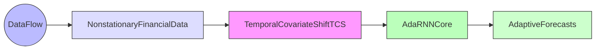
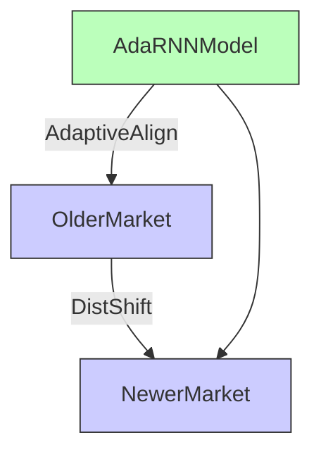
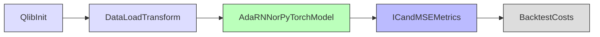
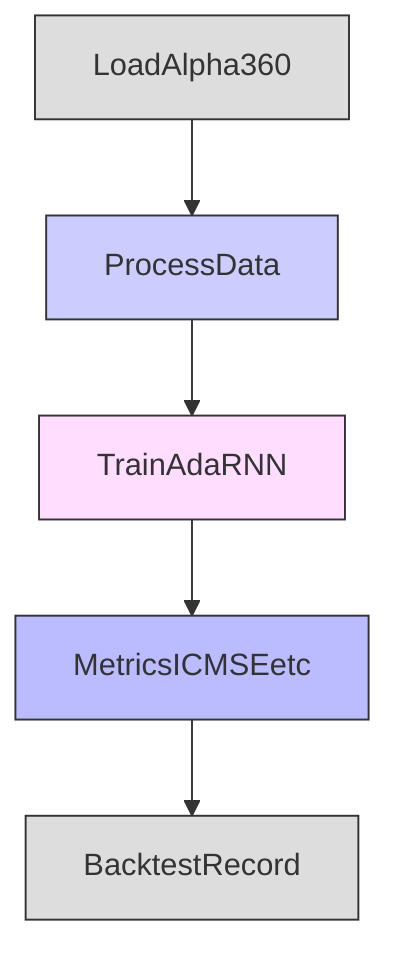
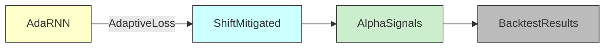

## Introduction

[**AdaRNN**](https://github.com/jindongwang/transferlearning/tree/master/code/deep/adarnn) is a specialized **PyTorch** model designed to adaptively learn from **non-stationary** financial time series—where market distributions evolve over time. Originally proposed in the paper _AdaRNN: Adaptive Learning and Forecasting for Time Series_, it leverages both **GRU layers** and **transfer-loss** techniques to mitigate the effects of distributional shift. This article demonstrates how AdaRNN can be applied within Microsoft’s **Qlib**—an open-source, AI-oriented platform for quantitative finance.

<!-- truncate -->



---

## Background: AdaRNN Methodology

- **Temporal Covariate Shift (TCS)**  
  Market factors may differ drastically from historical data. AdaRNN addresses TCS by adaptively aligning representations over time.

- **Two-Phase Design**

  1. **Temporal Distribution Characterization**:  
     Better captures distribution information in time-series data.
  2. **Temporal Distribution Matching**:  
     Bridges the gap between older and newer data via advanced distribution alignment (e.g., MMD, CORAL, COSINE).

- **Paper & Code References**:
  - [CIKM 2021 Paper](https://arxiv.org/abs/2108.08515)
  - [Official Repo](https://github.com/jindongwang/transferlearning/tree/master/code/deep/adarnn)



AdaRNN’s adaptability makes it relevant for **financial forecasting**, **air-quality prediction**, and **activity recognition**—any scenario where non-stationary data complicates model training.

---

## Qlib Integration

Below is an excerpt from a Qlib-friendly YAML configuration. By running one command, Qlib will:

1. **Initialize** a US market environment (`^GSPC` as benchmark).
2. **Load & transform** data (e.g. `Alpha360`) with specialized normalization and label dropping.
3. **Train** a custom or placeholder PyTorch “AdaRNN” model.
4. **Evaluate** predictions via correlation metrics and backtesting.
5. **Generate** logs for advanced debugging and iteration.



### Command

```bash
qrun workflow_config_adarnn_Alpha360.yaml
```

### YAML Snippet

```yaml
qlib_init:
  provider_uri: "/Users/vadimnicolai/Public/work/qlib-cookbook/.data/us_data"
  region: us
  kernels: 1

market: &market sp500
benchmark: &benchmark ^GSPC

data_handler_config: &data_handler_config
  start_time: 2008-01-01
  end_time: 2020-08-01
  fit_start_time: 2008-01-01
  fit_end_time: 2014-12-31
  instruments: *market
  infer_processors:
    - class: RobustZScoreNorm
      kwargs:
        fields_group: feature
        clip_outlier: true
    - class: Fillna
      kwargs:
        fields_group: feature
  learn_processors:
    - class: DropnaLabel
    - class: CSRankNorm
      kwargs:
        fields_group: label
  label: ["Ref($close, -2) / Ref($close, -1) - 1"]

port_analysis_config: &port_analysis_config
  strategy:
    class: TopkDropoutStrategy
    module_path: qlib.contrib.strategy
    kwargs:
      signal: <PRED>
      topk: 50
      n_drop: 5
  backtest:
    start_time: 2017-01-01
    end_time: 2020-08-01
    account: 100000000
    benchmark: *benchmark
    exchange_kwargs:
      limit_threshold: 0.095
      deal_price: close
      open_cost: 0.0005
      close_cost: 0.0015
      min_cost: 5

task:
  model:
    # Demonstration of AdaRNN or a placeholder PyTorch model
    class: DNNModelPytorch
    module_path: qlib.contrib.model.pytorch_nn
    kwargs:
      batch_size: 1024
      max_steps: 4000
      loss: mse
      lr: 0.002
      optimizer: adam
      GPU: 0
      pt_model_kwargs:
        input_dim: 360

  dataset:
    class: DatasetH
    module_path: qlib.data.dataset
    kwargs:
      handler:
        class: Alpha360
        module_path: qlib.contrib.data.handler
        kwargs: *data_handler_config
      segments:
        train: [2008-01-01, 2014-12-31]
        valid: [2015-01-01, 2016-12-31]
        test: [2017-01-01, 2020-08-01]

  record:
    - class: SignalRecord
      module_path: qlib.workflow.record_temp
      kwargs:
        model: <MODEL>
        dataset: <DATASET>
    - class: SigAnaRecord
      module_path: qlib.workflow.record_temp
      kwargs:
        ana_long_short: False
        ann_scaler: 252
    - class: PortAnaRecord
      module_path: qlib.workflow.record_temp
      kwargs:
        config: *port_analysis_config
```

---

## Example Logs & Observations

When you run:

```bash
qrun workflow_config_adarnn_Alpha360.yaml
```

You may see logs such as:

```
[50515:MainThread](2024-12-23 19:23:44,889) INFO - qlib.ADARNN - ADARNN pytorch version...
d_feat : 6
hidden_size : 64
num_layers : 2
dropout : 0.0
n_epochs : 200
lr : 0.001
metric : loss
batch_size : 800
early_stop : 20
optimizer : adam
loss_type : mse
...
Epoch0: training...
ic/train: 0.016603, mse/train: 0.010481, ...
ic/valid: 0.007023, mse/valid: 0.013398, ...
Epoch1: training...
ic/train: 0.017488, ...
ic/valid: 0.007711, ...
```



**Key Points**:

- `d_feat=6` indicates the model uses 6 features per time step (Alpha360 can have ~360; some examples show 6 for a simpler demonstration).
- AdaRNN attempts to adapt to distribution shifts with a specialized gating mechanism, plus distance-based alignment (e.g., MMD, cosine).
- Low or moderate `ic` (information coefficient) values in early epochs typically mean you might tune your features or hyperparams further.

### Practical Notes

- Setting `GPU: 0` uses CPU-only mode—suitable for debugging or if CUDA is unavailable.
- If distribution shift is severe, consider `'adv'`, `'mmd_rbf'`, or `'cosine'` in the AdaRNN code base to better handle changing market regimes.
- Check memory usage and concurrency settings (`kernels: 1`) if you encounter long training times or segmentation faults.

---

## Data & Requirements

In **AdaRNN**’s original repository, they discuss:

- **Air-quality dataset** but the technique extends well to **finance**.
- **Python >= 3.7**, **PyTorch ~1.6** for best results.
- Ensure your Qlib environment has matching dependencies (e.g. `requirements.txt` pinned versions) to avoid conflicts.

---

## Conclusion

AdaRNN’s **adaptive** architecture is particularly suited to **non-stationary** financial data, bridging older regimes to modern ones via distribution matching. Within Qlib:

1. You unify data ingestion, factor engineering, neural training, and evaluation into **one YAML**.
2. You easily measure correlation (IC, Rank IC) and simulate real trading costs via **PortAnaRecord**.
3. You can adapt AdaRNN’s gating, hidden-layers, or distribution distances for maximum alpha discovery in shifting markets.



**Next Steps**:

- Try different distribution-losses (MMD, CORAL, `'adv'`) in AdaRNN to see which best handles your market regime changes.
- Combine fundamental, sentiment, or alt data to strengthen “temporal distribution characterization.”
- Evaluate the final portfolio PnL and IR thoroughly in Qlib’s logs, adjusting hyperparameters (`dw`, `pre_epoch`, `hidden_size`) for improved adaptation.

---

## References

1. Du, Yuntao, et al. “AdaRNN: Adaptive Learning and Forecasting for Time Series.” _Proceedings of the 30th ACM International Conference on Information & Knowledge Management (CIKM)_, 2021.  
   [Paper Video](https://www.youtube.com/watch?v=...) | [Zhihu (Chinese)](https://zhuanlan.zhihu.com/...)
2. [AdaRNN GitHub Repo](https://github.com/jindongwang/transferlearning/tree/master/code/deep/adarnn)
3. [Qlib on GitHub](https://github.com/microsoft/qlib)

_Pro Tip_: If you see low IC or negative alpha, consider rolling or incremental re-training. Fine-tuning AdaRNN’s distribution alignment parameters can be crucial for dealing with abrupt financial market changes.
