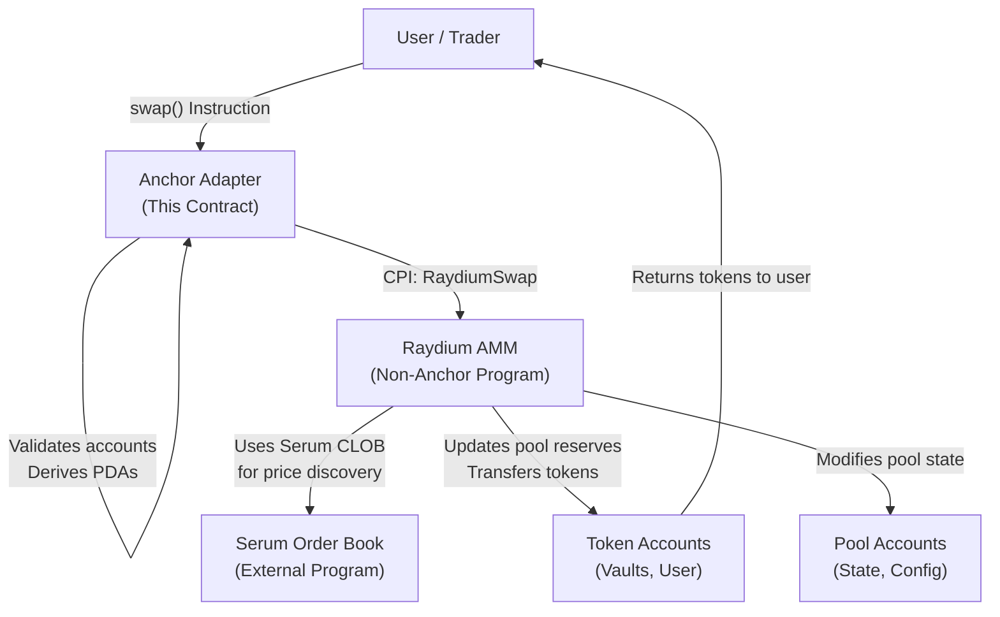
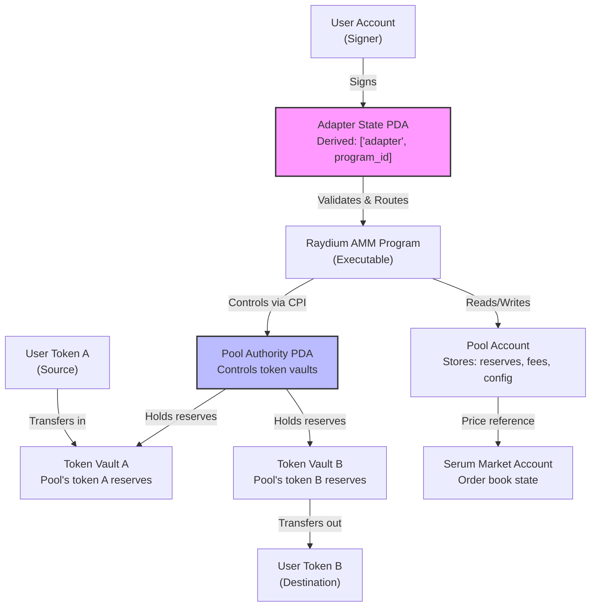
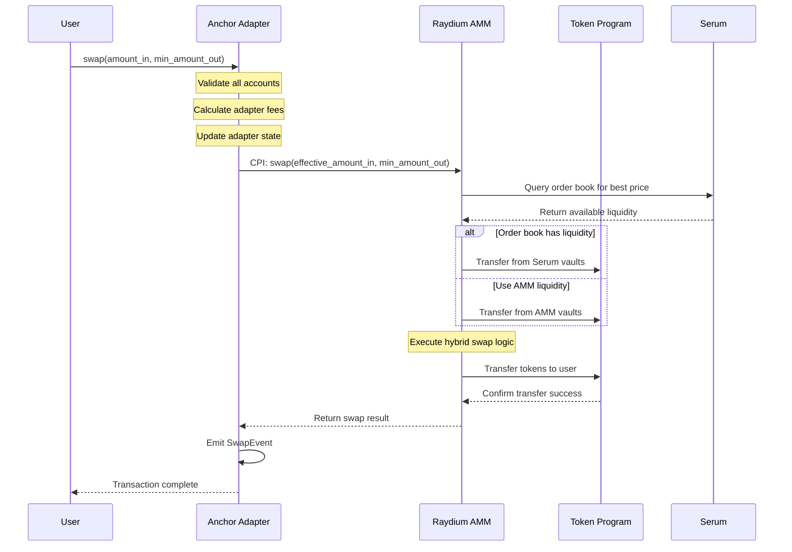

## TL;DR

- **Raydium AMM** is a hybrid decentralized exchange combining AMM liquidity pools with Serum's central limit order book (CLOB) for deeper liquidity and tighter spreads
- This **Anchor-based adapter smart contract** enables seamless interaction with Raydium's non-Anchor programs using Cross-Program Invocations (CPI)
- **Core implementation** focuses on swap functionality through CPI to Raydium's main AMM program, handling complex account validation and state transitions
- **Account architecture** utilizes PDAs for routing, token vault management, and fee collection with deterministic address derivation
- **Key Anchor patterns** demonstrated include: CPI with non-Anchor programs, complex account validation, PDA-based routing, and token account management

## Introduction

Raydium AMM represents a sophisticated evolution of decentralized exchange design on Solana, merging traditional automated market maker (AMM) liquidity pools with Serum's central limit order book. This hybrid model enables both passive liquidity provision and active market making strategies, creating deeper liquidity and tighter spreads than pure AMM designs.

This article focuses on an **Anchor-based adapter smart contract** that interfaces with Raydium's native (non-Anchor) programs. The adapter implements essential DeFi primitives—primarily swap operations—through cross-program invocations (CPI), managing complex account relationships and state validation. While Raydium's core programs are written in raw Rust, this adapter demonstrates how to build maintainable, secure interfaces using Anchor's framework.



## Architecture Overview

Raydium's architecture follows a modular design where the Anchor adapter serves as an entry point, delegating core logic to Raydium's optimized non-Anchor programs. This separation allows:

1. **Adapter Layer**: User-friendly Anchor interface with simplified account management
2. **Core AMM Logic**: High-performance swap execution in Raydium's native program
3. **Order Book Integration**: Real-time price discovery through Serum DEX

### Account Structure Diagram



## Account Structure

The adapter manages complex account relationships, validating each account's constraints before delegating to Raydium's core program.

### Primary Accounts Table

| Account | Type | Purpose | Validation |

|---------|------|---------|------------|

| `user` | Signer | Transaction signer, pays fees | `mut, signer` |

| `adapter_state` | PDA | Adapter configuration and fee tracking | `mut, seeds = [b"adapter", program_id]` |

| `raydium_program` | Executable | Raydium's main AMM program ID | `address = RAYDIUM_AMM_ID` |

| `pool` | State | Raydium pool account (reserves, fees) | `mut` |

| `pool_authority` | PDA | Controls pool's token vaults | `seeds = [pool.key().as_ref(), b"authority"]` |

| `token_vault_a` | Token Account | Pool's reserve for token A | `mut` |

| `token_vault_b` | Token Account | Pool's reserve for token B | `mut` |

| `user_token_a` | Token Account | User's source token account | `mut` |

| `user_token_b` | Token Account | User's destination token account | `mut` |

| `token_program` | Executable | SPL Token program | `address = TOKEN_PROGRAM_ID` |

| `system_program` | Executable | System program | `address = SYSTEM_PROGRAM_ID` |

| `serum_market` | State | Serum order book market | `mut` |

### Adapter State PDA Structure

```rust
#[account]
#[derive(Default)]
pub struct AdapterState {
    /// Bump seed for PDA derivation
    pub bump: u8,
    /// Total swap volume processed through adapter
    pub total_volume: u64,
    /// Fee basis points collected by adapter (0-10000)
    pub fee_bps: u16,
    /// Total fees collected
    pub fees_collected: u64,
    /// Owner with upgrade privileges
    pub owner: Pubkey,
    /// Whether adapter is paused
    pub is_paused: bool,
}

impl AdapterState {
    pub const LEN: usize = 8 + // discriminator
        1 + // bump
        8 + // total_volume
        2 + // fee_bps
        8 + // fees_collected
        32 + // owner
        1; // is_paused
}

## Instruction Handlers Deep Dive

### Core Swap Instruction

The swap instruction implements the primary trading functionality, validating all accounts and delegating to Raydium via CPI.

```rust
#[derive(Accounts)]
pub struct Swap<'info> {
    #[account(mut)]
    pub user: Signer<'info>,
    
    #[account(
        mut,
        seeds = [b"adapter", program_id.as_ref()],
        bump = adapter_state.bump,
        constraint = !adapter_state.is_paused @ AdapterError::AdapterPaused
    )]
    pub adapter_state: Account<'info, AdapterState>,
    
    /// CHECK: Validated by constraint against known Raydium program ID
    #[account(address = RAYDIUM_AMM_ID)]
    pub raydium_program: AccountInfo<'info>,
    
    #[account(mut)]
    /// CHECK: Raydium validates this account
    pub pool: AccountInfo<'info>,
    
    #[account(
        seeds = [pool.key().as_ref(), b"authority"],
        bump
    )]
    /// CHECK: PDA authority for pool vaults
    pub pool_authority: AccountInfo<'info>,
    
    #[account(mut)]
    /// CHECK: Validated by Raydium program
    pub token_vault_a: AccountInfo<'info>,
    
    #[account(mut)]
    /// CHECK: Validated by Raydium program
    pub token_vault_b: AccountInfo<'info>,
    
    #[account(
        mut,
        constraint = user_token_a.owner == user.key() @ AdapterError::InvalidTokenOwner
    )]
    pub user_token_a: Account<'info, TokenAccount>,
    
    #[account(mut)]
    pub user_token_b: Account<'info, TokenAccount>,
    
    pub token_program: Program<'info, Token>,
    pub system_program: Program<'info, System>,
    
    /// CHECK: Serum market account for price reference
    #[account(mut)]
    pub serum_market: AccountInfo<'info>,
}

#[derive(AnchorSerialize, AnchorDeserialize)]
pub struct SwapArgs {
    /// Amount of token A to swap (max to spend)
    pub amount_in: u64,
    /// Minimum amount of token B to receive (slippage protection)
    pub min_amount_out: u64,
    /// Referral fee destination (optional)
    pub referral_account: Option<Pubkey>,
}

The swap execution involves several key mathematical operations for fee calculation and slippage protection:

**Effective Input Amount Calculation** (after adapter fees):
```latex
$$dx_{eff} = dx \cdot (1 - f_{adapter})$$

Where $dx$ is the input amount and $f_{adapter}$ is the adapter fee in basis points.

**Raydium's Swap Formula** (simplified constant product with order book integration):
```latex
$$dy = \begin{cases} 
\frac{y \cdot dx_{eff}}{x + dx_{eff}} & \text{if AMM only} \\
\text{CLOB\_FILL} + \text{AMM\_FILL} & \text{hybrid execution}
\end{cases}$$

**Slippage Validation**:
```latex
$$dy_{actual} \ge dy_{min}$$

Where $dy_{min}$ is the user-specified minimum output.

### Implementation Details

```rust
pub fn swap(ctx: Context<Swap>, args: SwapArgs) -> Result<()> {
    let adapter_state = &mut ctx.accounts.adapter_state;
    
    // Calculate adapter fee (if any)
    let fee_amount = if adapter_state.fee_bps > 0 {
        args.amount_in
            .checked_mul(adapter_state.fee_bps as u64)
            .ok_or(AdapterError::MathOverflow)?
            .checked_div(10000)
            .ok_or(AdapterError::MathOverflow)?
    } else {
        0
    };
    
    let effective_amount_in = args.amount_in
        .checked_sub(fee_amount)
        .ok_or(AdapterError::InvalidFeeCalculation)?;
    
    // Update adapter statistics
    adapter_state.total_volume = adapter_state.total_volume
        .checked_add(args.amount_in)
        .ok_or(AdapterError::MathOverflow)?;
    
    adapter_state.fees_collected = adapter_state.fees_collected
        .checked_add(fee_amount)
        .ok_or(AdapterError::MathOverflow)?;
    
    // Prepare CPI to Raydium
    let raydium_program = ctx.accounts.raydium_program.to_account_info();
    let cpi_accounts = raydium::cpi::accounts::Swap {
        pool: ctx.accounts.pool.clone(),
        pool_authority: ctx.accounts.pool_authority.clone(),
        token_vault_a: ctx.accounts.token_vault_a.clone(),
        token_vault_b: ctx.accounts.token_vault_b.clone(),
        user_token_a: ctx.accounts.user_token_a.to_account_info(),
        user_token_b: ctx.accounts.user_token_b.to_account_info(),
        serum_market: ctx.accounts.serum_market.clone(),
        token_program: ctx.accounts.token_program.to_account_info(),
    };
    
    let cpi_args = raydium::instruction::Swap {
        amount_in: effective_amount_in,
        min_amount_out: args.min_amount_out,
    };
    
    // Execute CPI to Raydium
    let cpi_ctx = CpiContext::new(raydium_program, cpi_accounts);
    raydium::cpi::swap(cpi_ctx, cpi_args)?;
    
    emit!(SwapEvent {
        user: ctx.accounts.user.key(),
        amount_in: args.amount_in,
        fee_amount,
        timestamp: Clock::get()?.unix_timestamp,
    });
    
    Ok(())
}

### Instruction Flow Diagram



## Code Walkthrough

### Raydium CPI Module Definition

To interface with Raydium's non-Anchor program, we define a CPI module with the exact instruction and account structures:

```rust
pub mod raydium {
    use anchor_lang::prelude::*;
    use anchor_lang::solana_program::instruction::Instruction;
    
    pub const RAYDIUM_AMM_ID: Pubkey = pubkey!("675kPX9MHTjS2zt1qfr1NYHuzeLXfQM9H24wFSUt1Mp8");
    
    #[derive(Accounts)]
    pub struct Swap<'info> {
        // Account definitions matching Raydium's expectations
        #[account(mut)]
        pub pool: AccountInfo<'info>,
        pub pool_authority: AccountInfo<'info>,
        #[account(mut)]
        pub token_vault_a: AccountInfo<'info>,
        #[account(mut)]
        pub token_vault_b: AccountInfo<'info>,
        #[account(mut)]
        pub user_token_a: AccountInfo<'info>,
        #[account(mut)]
        pub user_token_b: AccountInfo<'info>,
        #[account(mut)]
        pub serum_market: AccountInfo<'info>,
        pub token_program: AccountInfo<'info>,
    }
    
    #[derive(AnchorSerialize, AnchorDeserialize)]
    pub struct SwapArgs {
        pub amount_in: u64,
        pub min_amount_out: u64,
    }
    
    pub fn swap<'info>(
        ctx: CpiContext<'_, '_, '_, 'info, Swap<'info>>,
        args: SwapArgs,
    ) -> Result<()> {
        let ix = Instruction {
            program_id: RAYDIUM_AMM_ID,
            accounts: vec![
                AccountMeta::new(ctx.accounts.pool.key(), false),
                AccountMeta::new_readonly(ctx.accounts.pool_authority.key(), false),
                AccountMeta::new(ctx.accounts.token_vault_a.key(), false),
                AccountMeta::new(ctx.accounts.token_vault_b.key(), false),
                AccountMeta::new(ctx.accounts.user_token_a.key(), false),
                AccountMeta::new(ctx.accounts.user_token_b.key(), false),
                AccountMeta::new(ctx.accounts.serum_market.key(), false),
                AccountMeta::new_readonly(ctx.accounts.token_program.key(), false),
            ],
            data: encode_swap_instruction(args),
        };
        
        anchor_lang::solana_program::program::invoke(
            &ix,
            &[
                ctx.accounts.pool.clone(),
                ctx.accounts.pool_authority.clone(),
                ctx.accounts.token_vault_a.clone(),
                ctx.accounts.token_vault_b.clone(),
                ctx.accounts.user_token_a.clone(),
                ctx.accounts.user_token_b.clone(),
                ctx.accounts.serum_market.clone(),
                ctx.accounts.token_program.clone(),
            ],
        )?;
        
        Ok(())
    }
    
    fn encode_swap_instruction(args: SwapArgs) -> Vec<u8> {
        // Raydium uses a specific instruction discriminator for swap
        let mut data = vec![0x07]; // Swap instruction discriminator
        data.extend_from_slice(&args.amount_in.to_le_bytes());
        data.extend_from_slice(&args.min_amount_out.to_le_bytes());
        data
    }
}

### Event Emission Structure

Proper event emission is crucial for indexers and frontends:

```rust
#[event]
pub struct SwapEvent {
    #[index]
    pub user: Pubkey,
    pub amount_in: u64,
    pub fee_amount: u64,
    pub timestamp: i64,
}

#[event]
pub struct PoolCreatedEvent {
    pub pool: Pubkey,
    pub token_a: Pubkey,
    pub token_b: Pubkey,
    pub creator: Pubkey,
    pub timestamp: i64,
}

## Solana & Anchor Best Practices

### 1. Account Model Optimization

**Hot Account Mitigation**: Raydium's design minimizes account contention by separating:
- **Read-only accounts**: Pool configuration, token metadata
- **Mutable accounts**: Token vaults (high contention)
- **PDA authorities**: Derived addresses for access control

```rust
// Good: Separating read-only from mutable accounts
#[derive(Accounts)]
pub struct OptimizedSwap<'info> {
    // Read-only accounts (no write locks)
    pub pool_config: Account<'info, PoolConfig>,
    
    // Mutable accounts (write locks, potential contention)
    #[account(mut)]
    pub token_vault_a: Account<'info, TokenAccount>,
    #[account(mut)]
    pub token_vault_b: Account<'info, TokenAccount>,
}

### 2. Compute Unit Management

Raydium operations can be compute-intensive. Implement proper budgeting:

```rust
// Set appropriate compute budget for complex swaps
#[instruction]
pub fn complex_swap(ctx: Context<ComplexSwap>, args: SwapArgs) -> Result<()> {
    // Request additional compute units for order book integration
    let compute_budget = ComputeBudgetInstruction::set_compute_unit_limit(200_000);
    let compute_price = ComputeBudgetInstruction::set_compute_unit_price(10_000);
    
    // These would be added to transaction elsewhere
    Ok(())
}

### 3. Token-2022 Compatibility

Handle token extensions correctly:

```rust
pub fn transfer_tokens_2022_compatible(
    source: &AccountInfo,
    destination: &AccountInfo,
    authority: &AccountInfo,
    amount: u64,
    token_program: &AccountInfo,
) -> Result<()> {
    // Check if it's Token-2022
    if token_program.key() == token_2022::ID {
        // Handle transfer fees and hooks
        let transfer_args = token_2022::instruction::transfer_checked(
            token_program.key,
            source.key,
            destination.key,
            authority.key,
            &[],
            amount,
            9, // decimals
        )?;
        // ... invoke
    } else {
        // Standard SPL Token transfer
        let transfer_args = spl_token::instruction::transfer(
            token_program.key,
            source.key,
            destination.key,
            authority.key,
            &[],
            amount,
        )?;
        // ... invoke
    }
    Ok(())
}

## Security Considerations

### 1. Access Control Patterns

Implement multi-level access control:

```rust
pub fn admin_only(ctx: &Context<AdminAction>) -> Result<()> {
    // PDA-based admin verification
    let (expected_admin_pda, bump) = Pubkey::find_program_address(
        &[b"admin", ctx.accounts.adapter_state.key().as_ref()],
        ctx.program_id
    );
    
    require!(
        ctx.accounts.admin.key() == expected_admin_pda,
        AdapterError::Unauthorized
    );
    
    Ok(())
}

pub fn timelock_emergency_pause(ctx: &Context<EmergencyPause>) -> Result<()> {
    // Require multisig or timelock for critical actions
    let clock = Clock::get()?;
    let last_pause = ctx.accounts.adapter_state.last_pause_timestamp;
    
    require!(
        clock.unix_timestamp - last_pause > 86400, // 24-hour cooldown
        AdapterError::PauseCooldownActive
    );
    
    Ok(())
}

### 2. Input Validation

Comprehensive input validation prevents exploitation:

```rust
pub fn validate_swap_args(args: &SwapArgs) -> Result<()> {
    // Prevent zero-value swaps
    require!(args.amount_in > 0, AdapterError::ZeroAmount);
    
    // Prevent dust attacks
    require!(args.amount_in >= 1000, AdapterError::AmountTooSmall);
    
    // Validate slippage tolerance (max 50%)
    let max_slippage = args.min_amount_out
        .checked_mul(2)
        .ok_or(AdapterError::MathOverflow)?;
    
    require!(
        args.min_amount_out > 0 && max_slippage > args.amount_in,
        AdapterError::InvalidSlippage
    );
    
    Ok(())
}

### 3. Reentrancy Protection

While Solana's parallel execution model reduces reentrancy risk, implement protection for CPI calls:

```rust
pub struct Swap<'info> {
    #[account(
        mut,
        constraint = !swap_in_progress @ AdapterError::ReentrancyDetected
    )]
    pub adapter_state: Account<'info, AdapterState>,
    // ...
}

// Set flag before CPI, clear after
adapter_state.swap_in_progress = true;
// ... CPI to Raydium
adapter_state.swap_in_progress = false;

### 4. Audit Checklist for AMM Adapters

1. **✓** Validate all program IDs against known addresses
2. **✓** Check token account ownership matches expected users
3. **✓** Implement slippage protection with reasonable bounds
4. **✓** Use PDAs for authority where possible
5. **✓** Handle arithmetic overflow with checked math
6. **✓** Emit events for all state changes
7. **✓** Implement emergency pause functionality
8. **✓** Test with Token-2022 extensions
9. **✓** Validate pool authority PDAs match pool accounts
10. **✓** Implement proper fee accounting and distribution

## How to Use This Contract

### Building and Deployment

```bash
# Clone and build
git clone <repository>
cd raydium-adapter
anchor build

# Deploy to mainnet
anchor deploy --provider.cluster mainnet \
  --program-name raydium_adapter \
  --program-id <YOUR_PROGRAM_ID>

### TypeScript Client Example

```typescript
import * as anchor from "@coral-xyz/anchor";
import { Program } from "@coral-xyz/anchor";
import { RaydiumAdapter } from "./target/types/raydium_adapter";

const provider = anchor.AnchorProvider.env();
anchor.setProvider(provider);

const program = anchor.workspace.RaydiumAdapter as Program<RaydiumAdapter>;

async function swapTokens(
  poolAddress: anchor.web3.PublicKey,
  amountIn: anchor.BN,
  minAmountOut: anchor.BN
) {
  // Derive adapter state PDA
  const [adapterState] = anchor.web3.PublicKey.findProgramAddressSync(
    [Buffer.from("adapter"), program.programId.toBuffer()],
    program.programId
  );

  // Fetch pool data to get vault addresses
  const poolData = await program.account.pool.fetch(poolAddress);
  
  const tx = await program.methods
    .swap({
      amountIn,
      minAmountOut,
      referralAccount: null,
    })
    .accounts({
      user: provider.wallet.publicKey,
      adapterState,
      pool: poolAddress,
      tokenVaultA: poolData.tokenVaultA,
      tokenVaultB: poolData.tokenVaultB,
      userTokenA: userTokenAAccount,
      userTokenB: userTokenBAccount,
      serumMarket: poolData.serumMarket,
    })
    .rpc();

  console.log("Swap transaction:", tx);
}

### Required Pre-flight Checks

```typescript
async function validateSwap(
  program: Program<RaydiumAdapter>,
  accounts: any
): Promise<boolean> {
  // 1. Verify pool is active
  const pool = await program.account.pool.fetch(accounts.pool);
  if (pool.isPaused) throw new Error("Pool paused");
  
  // 2. Check adapter status
  const adapterState = await program.account.adapterState
    .fetch(accounts.adapterState);
  if (adapterState.isPaused) throw new Error("Adapter paused");
  
  // 3. Verify token accounts
  const tokenAccountA = await getTokenAccount(accounts.userTokenA);
  if (tokenAccountA.amount < amountIn) {
    throw new Error("Insufficient balance");
  }
  
  // 4. Simulate swap for slippage
  const simulatedOut = await simulateRaydiumSwap(
    poolAddress,
    amountIn,
    serumMarket
  );
  
  if (simulatedOut.lt(minAmountOut)) {
    throw new Error(`Insufficient output: ${simulatedOut} < ${minAmountOut}`);
  }
  
  return true;
}

## Extending the Contract

### Adding New Instructions

To add liquidity provision functionality:

```rust
#[derive(Accounts)]
pub struct AddLiquidity<'info> {
    // Reuse existing accounts
    #[account(mut)]
    pub user: Signer<'info>,
    pub pool: AccountInfo<'info>,
    
    // Add liquidity-specific accounts
    #[account(mut)]
    pub lp_token_mint: Account<'info, Mint>,
    #[account(mut)]
    pub user_lp_token_account: Account<'info, TokenAccount>,
    
    // ... other accounts
}

pub fn add_liquidity(
    ctx: Context<AddLiquidity>,
    amount_a: u64,
    amount_b: u64,
) -> Result<()> {
    // Validate ratio matches pool reserves
    let pool_data = deserialize_pool_data(&ctx.accounts.pool.data.borrow())?;
    
    let ratio_a = amount_a
        .checked_mul(pool_data.reserve_b)
        .ok_or(AdapterError::MathOverflow)?;
    
    let ratio_b = amount_b
        .checked_mul(pool_data.reserve_a)
        .ok_or(AdapterError::MathOverflow)?;
    
    // Allow 1% deviation for pool deposits
    let deviation = ratio_a.abs_diff(ratio_b)
        .checked_mul(100)
        .ok_or(AdapterError::MathOverflow)?
        .checked_div(ratio_a.min(ratio_b))
        .ok_or(AdapterError::MathOverflow)?;
    
    require!(deviation <= 1, AdapterError::InvalidRatio);
    
    // CPI to Raydium's add_liquidity instruction
    // ...
    
    Ok(())
}

### Customization Points

1. **Fee Structure Modification**:
```rust
pub struct DynamicFeeConfig {
    pub base_fee_bps: u16,
    pub volume_tiers: Vec<(u64, u16)>, // (volume_threshold, fee_bps)
    pub time_based_discounts: Vec<(i64, u16)>, // (timestamp, discount_bps)
}

impl DynamicFeeConfig {
    pub fn calculate_fee(&self, volume: u64, timestamp: i64) -> u16 {
        // Implement tiered fee logic
        // ...
    }
}

2. **Cross-Chain Integration**:
```rust
pub struct CrossChainSwap<'info> {
    // Add Wormhole or LayerZero accounts
    pub wormhole_bridge: AccountInfo<'info>,
    pub foreign_chain_token: AccountInfo<'info>,
    // ...
}

### Testing Strategies

```rust
#[cfg(test)]
mod tests {
    use super::*;
    use anchor_lang::solana_program_test::*;
    use anchor_lang::InstructionData;
    
    #[tokio::test]
    async fn test_swap_with_slippage() {
        // Setup test environment
        let mut program_test = ProgramTest::new(
            "raydium_adapter",
            program_id(),
            processor!(processor),
        );
        
        // Add Raydium mock program
        program_test.add_program(
            "raydium_mock",
            raydium_mock::id(),
            processor!(raydium_mock::processor),
        );
        
        // Test slippage protection
        let (mut banks_client, payer, recent_blockhash) = 
            program_test.start().await;
        
        // Execute swap with high slippage
        let tx = Transaction::new_signed_with_payer(
            &[Instruction {
                program_id: program_id(),
                accounts: vec![/* ... */],
                data: SwapArgs {
                    amount_in: 1_000_000,
                    min_amount_out: 999_999, // Unrealistic expectation
                }.data(),
            }],
            Some(&payer.pubkey()),
            &[&payer],
            recent_blockhash,
        );
        
        // Should fail due to slippage
        let result = banks_client.process_transaction(tx).await;
        assert!(result.is_err());
    }
}

## Conclusion

This Raydium AMM adapter demonstrates sophisticated Anchor patterns for interacting with non-Anchor programs on Solana. Key takeaways for developers:

1. **CPI Architecture**: Properly structured CPI calls enable seamless integration with optimized native programs
2. **Account Validation**: Comprehensive account constraints prevent common exploits
3. **PDA Management**: Deterministic address derivation simplifies account relationships
4. **Hybrid Execution**: Supporting both AMM and order book liquidity requires careful state management
5. **Extensibility**: The adapter pattern allows adding new features without modifying core protocols

The contract exemplifies production-ready DeFi development on Solana, balancing security, performance, and maintainability through Anchor's framework while leveraging the raw performance of native Solana programs for core operations.

---

*Note: This implementation is a simplified educational example. Production Raydium integration requires thorough testing, security audits, and consideration of protocol-specific nuances. Always refer to official Raydium documentation for the most up-to-date integration patterns.*
